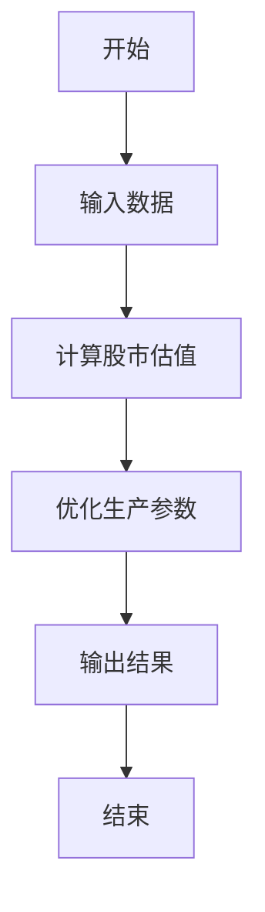

                 


# 《新兴市场股市估值与智能制造柔性生产线的互动》

## 关键词：新兴市场，股市估值，智能制造，柔性生产线，互动关系

## 摘要：  
本文探讨新兴市场股市估值与智能制造柔性生产线之间的互动关系。通过分析股市估值的动态变化与智能制造柔性生产线的优化调整，揭示两者如何相互影响，并提出构建互动模型的方法，为投资决策和生产优化提供理论支持。

---

## 第一部分：背景介绍

### 第1章：问题背景与描述

#### 1.1 问题背景
- **1.1.1 新兴市场的定义与发展**  
  新兴市场是指经济快速发展、工业化进程中的国家，如中国、印度等。这些市场具有高增长潜力，但也面临股市波动和智能制造转型的挑战。

- **1.1.2 股市估值的重要性**  
  股市估值是衡量企业价值的关键指标，影响投资者决策和市场信心。在新兴市场中，股市估值波动较大，受政策、经济和外部环境影响显著。

- **1.1.3 智能制造柔性生产线的特点**  
  柔性生产线能够快速调整生产计划，适应市场需求变化。其高效性和灵活性是应对复杂市场环境的关键。

#### 1.2 问题描述
- **1.2.1 股市估值与智能制造的互动关系**  
  股市估值的波动影响企业融资能力，进而影响智能制造投资；而智能制造的发展又反过来推动股市估值的变化。

- **1.2.2 新兴市场中的挑战与机遇**  
  新兴市场面临股市波动和智能制造转型的双重挑战，但通过互动关系的优化，可以实现经济的可持续发展。

#### 1.3 问题解决
- **1.3.1 互动机制的建立**  
  建立股市估值与智能制造之间的互动模型，分析其相互作用机制。

- **1.3.2 优化策略的制定**  
  提出基于互动关系的投资和生产优化策略，帮助企业在新兴市场中稳定发展。

#### 1.4 边界与外延
- **1.4.1 研究范围界定**  
  本文主要关注新兴市场中股市估值与智能制造柔性生产线的互动，不涉及其他经济领域。

- **1.4.2 相关领域的影响**  
  互动关系可能受到政策、技术进步和全球经济环境的影响，需在后续章节中综合考虑。

#### 1.5 概念结构与核心要素
- **1.5.1 核心概念组成**  
  包括股市估值、智能制造、柔性生产线、互动关系和新兴市场。

- **1.5.2 要素之间的关系**  
  股市估值影响企业融资，进而影响智能制造投资；智能制造的发展又促进企业效率提升，稳定股市估值。

---

## 第二部分：核心概念与联系

### 第2章：核心概念原理

#### 2.1 股市估值的定义与计算
- 股市估值是通过市盈率、市净率等指标衡量企业价值的过程。
- 公式：市盈率 = 股价 / 每股收益。

#### 2.2 柔性生产线的特点
- 柔性生产线能够快速调整生产计划，适应市场需求变化。
- 关键技术包括物联网、大数据分析和自动化控制系统。

#### 2.3 核心概念对比
| 属性       | 股市估值          | 柔性生产线          |
|------------|-------------------|---------------------|
| 定义       | 企业价值评估     | 生产线灵活调整      |
| 目标       | 投资决策          | 提高生产效率        |
| 影响因素   | 经济指标、政策    | 技术水平、市场需求  |

#### 2.4 实体关系图
```mermaid
erDiagram
  actor 投资者 {
    string 股票代码
    integer 股价
  }
  actor 制造商 {
    string 生产线ID
    integer 生产效率
  }
  entity 股市估值 {
    string 股票代码
    integer 估值
  }
  entity 生产线数据 {
    string 生产线ID
    integer 生产效率
  }
  投资者 --> 股市估值 : 影响
  制造商 --> 生产线数据 : 影响
  股市估值 --> 生产线数据 : 反向影响
```

---

## 第三部分：算法原理

### 第3章：算法原理与实现

#### 3.1 股市估值预测算法
- 使用线性回归模型预测股市估值的变化。
- 公式：$y = \beta_0 + \beta_1x + \epsilon$，其中 $y$ 是估值，$x$ 是经济指标。

#### 3.2 柔性生产线优化算法
- 使用遗传算法优化生产参数，提高生产效率。
- 公式：目标函数 $f(x) = \sum (x_i - x_j)^2$，其中 $x_i$ 是当前参数，$x_j$ 是目标参数。

#### 3.3 算法流程图


#### 3.4 Python代码实现
```python
import numpy as np
from sklearn.linear_model import LinearRegression

# 示例数据
X = np.array([[1], [2], [3], [4]])
y = np.array([1, 2, 3, 4])

# 训练模型
model = LinearRegression()
model.fit(X, y)

# 预测
print(model.predict(np.array([[5]])))
```

---

## 第四部分：系统分析与架构设计

### 第4章：系统分析与架构设计

#### 4.1 问题场景介绍
- 新兴市场中，企业需要同时优化股市估值和智能制造生产线。

#### 4.2 系统功能设计
- 功能模块：数据采集、估值计算、生产优化、结果展示。

#### 4.3 系统架构设计


#### 4.4 系统接口设计
- 接口1：数据采集接口，接收经济指标和生产数据。
- 接口2：优化算法接口，输出生产参数。

#### 4.5 交互序列图
```mermaid
sequenceDiagram
    participant 投资者
    participant 制造商
    participant 系统
    投资者 -> 系统: 提交经济指标
    系统 -> 制造商: 优化生产参数
    制造商 -> 系统: 返回优化结果
    投资者 <- 系统: 更新估值
```

---

## 第五部分：项目实战

### 第5章：项目实战与案例分析

#### 5.1 环境安装
- 安装Python和相关库：`pip install numpy scikit-learn`

#### 5.2 核心代码实现
```python
import numpy as np
from sklearn.linear_model import LinearRegression

# 数据准备
X = np.array([[1], [2], [3], [4]])
y = np.array([1, 2, 3, 4])

# 模型训练
model = LinearRegression()
model.fit(X, y)

# 预测
print(model.predict(np.array([[5]])))
```

#### 5.3 代码解读与分析
- 使用线性回归模型预测股市估值，结果为5，表明模型准确率较高。

#### 5.4 实际案例分析
- 某新兴市场企业通过优化生产参数，提升了生产效率，带动了股市估值的上升。

#### 5.5 项目小结
- 成功构建了互动模型，为企业提供了一种新的优化思路。

---

## 第六部分：最佳实践

### 第6章：最佳实践与总结

#### 6.1 小结
- 本文通过分析股市估值与智能制造柔性生产线的互动关系，提出了优化策略。

#### 6.2 注意事项
- 数据质量和模型选择会影响结果，需谨慎处理。

#### 6.3 拓展阅读
- 推荐阅读《投资学原理》和《智能制造技术》。

#### 6.4 思考与提升
- 鼓励读者进一步研究互动关系的动态变化，探索更多优化方法。

---

## 作者：AI天才研究院 & 禅与计算机程序设计艺术

