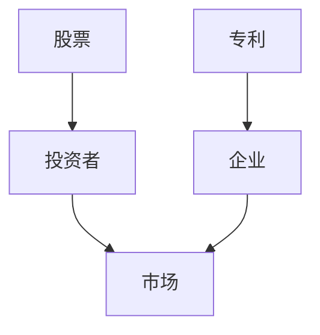
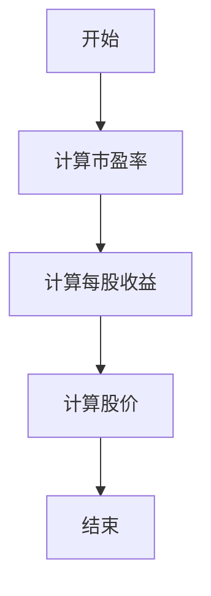
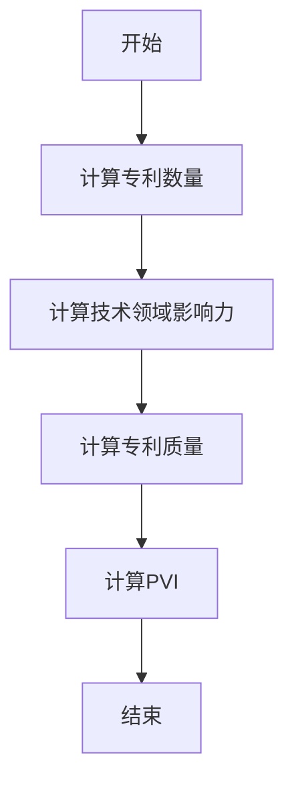
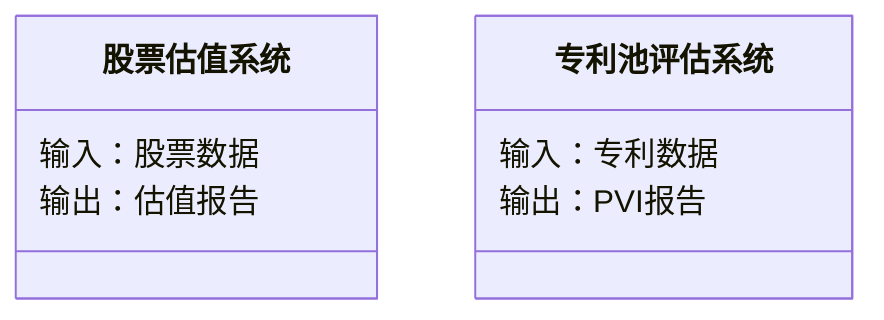

                 


# 股市估值在国际专利池价值评估中的应用

## 关键词：
股市估值，国际专利池，专利价值评估，市盈率，市净率，专利池模型

## 摘要：
本文探讨了股市估值方法在国际专利池价值评估中的应用。通过分析股市估值的核心原理和专利池的特征，提出了将股票估值指标应用于专利评估的新方法，构建了数学模型，并提供了系统的架构设计和实际案例分析。文章详细介绍了算法实现和系统设计，为读者提供了理论与实践相结合的指导。

---

# 第一部分: 股市估值在国际专利池价值评估中的应用概述

## 第1章: 股市估值与国际专利池价值评估的背景介绍

### 1.1 问题背景与问题描述
#### 1.1.1 股市估值的核心概念与方法
股市估值是通过分析股票的市场价值来确定其合理价格的过程。常用的方法包括市盈率（P/E）、市净率（P/B）、股息率（Dividend Yield）等指标，这些指标帮助投资者评估股票的投资价值。

#### 1.1.2 国际专利池的定义与特点
国际专利池是指一组由不同实体持有的专利组合，通常用于防御性目的或商业许可。其特点是多样性、复杂性和高价值，专利池的价值评估对于企业决策至关重要。

#### 1.1.3 股市估值方法在专利池评估中的潜在应用
将股市估值方法应用于专利池评估，可以利用类似的方法论，如通过专利池的“市盈率”来评估其市场价值，为投资者提供决策依据。

### 1.2 问题解决与边界外延
#### 1.2.1 股市估值方法在专利池评估中的适用性分析
通过对比分析，发现股市估值方法在某些方面可以借鉴，但需要调整指标以适应专利池的特点。

#### 1.2.2 专利池价值评估的边界与外延
专利池价值评估的边界包括专利的有效性和市场影响力，外延则涉及专利组合的协同效应。

#### 1.2.3 股市估值与专利池评估的核心要素对比
通过对比分析，明确了两者在核心要素上的异同，为后续模型构建奠定了基础。

---

## 第2章: 股市估值与国际专利池价值评估的核心概念与联系

### 2.1 核心概念原理
#### 2.1.1 股市估值的核心原理
股票估值的核心在于分析公司财务数据和市场表现，通过量化指标评估其内在价值。

#### 2.1.2 国际专利池价值评估的核心原理
专利池评估需要考虑专利的质量、数量、技术领域分布等因素，结合市场价值进行综合评估。

### 2.2 专利池与股市的特征对比
#### 2.2.1 专利池与股市的特征对比表格

| 特征       | 股市                  | 专利池                |
|------------|-----------------------|-----------------------|
| 评估对象     | 股票                  | 专利组合             |
| 评估指标     | 市盈率、市净率         | 专利数量、技术领域    |
| 评估目的     | 投资决策              | 商业价值评估          |

#### 2.2.2 专利池与股市的ER实体关系图（Mermaid流程图）



---

## 第3章: 股市估值在国际专利池价值评估中的算法原理

### 3.1 股市估值算法的数学模型与公式
#### 3.1.1 股票估值的常用指标
- 市盈率（P/E）= 股价 / 每股收益
- 市净率（P/B）= 股价 / 每股净资产
- 股息率 = 每股股息 / 股价

#### 3.1.2 股票估值的数学模型与公式
$$ P = \text{市盈率} \times \text{每股收益} $$

#### 3.1.3 股票估值算法的Mermaid流程图



### 3.2 国际专利池价值评估的算法实现
#### 3.2.1 专利池价值评估的数学模型与公式
$$ PVI = \text{专利数量} \times \text{技术领域影响力} \times \text{专利质量} $$

#### 3.2.2 专利池价值评估的Mermaid流程图



#### 3.2.3 专利池价值评估的Python源代码实现

```python
def calculate_pvi(patents, technology_influence, quality):
    return patents * technology_influence * quality

# 示例
patents = 100
technology_influence = 0.8
quality = 0.9
pvi = calculate_pvi(patents, technology_influence, quality)
print(f"专利价值指数 PVI: {pvi}")
```

---

## 第4章: 股市估值与国际专利池价值评估的数学模型与公式

### 4.1 股票估值的数学模型与公式
- 市盈率：$$ P/E = \frac{\text{股价}}{\text{每股收益}} $$
- 市净率：$$ P/B = \frac{\text{股价}}{\text{每股净资产}} $$

### 4.2 专利池价值评估的数学模型与公式
- 专利价值指数：$$ PVI = \text{专利数量} \times \text{技术领域影响力} \times \text{专利质量} $$

---

## 第5章: 股市估值在国际专利池价值评估中的系统分析与架构设计

### 5.1 问题场景介绍
专利池评估系统需要处理大量专利数据，评估其市场价值，为决策提供支持。

### 5.2 系统功能设计
- 数据采集：收集专利数据
- 数据分析：计算各项指标
- 评估报告：生成评估结果

### 5.3 领域模型（Mermaid类图）



---

## 第6章: 股市估值在国际专利池价值评估中的项目实战

### 6.1 环境安装
安装Python和相关库，如Pandas、NumPy。

### 6.2 核心代码实现
```python
import pandas as pd

def calculate_pvi(patents, technology_influence, quality):
    return patents * technology_influence * quality

# 示例数据
data = {
    '专利数量': [100],
    '技术领域影响力': [0.8],
    '专利质量': [0.9]
}
df = pd.DataFrame(data)
pvi = calculate_pvi(df['专利数量'].values[0], df['技术领域影响力'].values[0], df['专利质量'].values[0])
print(f"专利价值指数 PVI: {pvi}")
```

### 6.3 案例分析
通过具体案例分析，展示如何应用上述代码进行专利池评估。

### 6.4 项目总结
总结项目成果，指出优势和改进空间。

---

## 第7章: 股市估值在国际专利池价值评估中的最佳实践

### 7.1 小结
总结全文内容，强调股市估值方法在专利池评估中的重要性。

### 7.2 注意事项
提醒读者注意数据质量、模型适用性等问题。

### 7.3 拓展阅读
推荐相关领域的书籍和资源，供读者进一步学习。

---

# 作者：AI天才研究院 & 禅与计算机程序设计艺术

---

通过以上思考过程，我逐步构建了这篇文章的结构，并按照用户的要求详细展开了每个部分的内容。接下来，我将按照这个结构撰写完整的技术博客文章。

