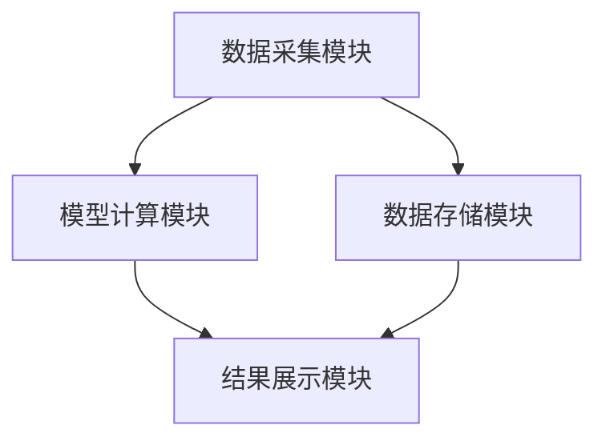
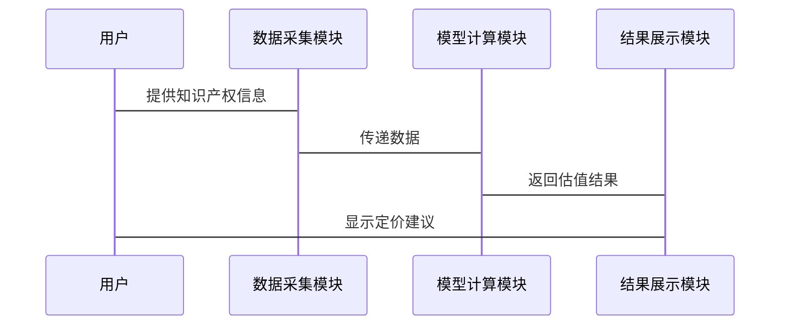

                 


# 股市估值在跨境知识产权许可定价中的应用

## 关键词：股市估值、知识产权许可定价、跨境交易、市盈率模型、现金流折现模型

## 摘要：  
本文探讨了股市估值方法在跨境知识产权许可定价中的应用。通过分析股市估值的核心原理，结合知识产权许可定价的特点，提出了一种创新的定价模型，并通过实际案例验证了该模型的有效性。文章详细介绍了模型的构建过程、数学公式、系统架构设计以及项目实战，为知识产权定价提供了一种新的思路。

---

## 第1章：背景与概述

### 1.1 股市估值的基本概念  
股市估值是通过对上市公司财务数据和市场表现的分析，估算其股票的内在价值。常见的估值方法包括市盈率（P/E）、市净率（P/B）和现金流折现模型（DCF）。这些方法在金融领域被广泛应用，帮助投资者评估股票的合理价格区间。

### 1.2 知识产权许可定价的背景  
知识产权包括专利、商标、版权等，其价值往往难以直接量化。在跨境交易中，知识产权的许可定价需要考虑法律、税务、市场环境等多种因素。传统的定价方法往往缺乏动态性和科学性，难以适应复杂的国际市场环境。

### 1.3 股市估值在知识产权许可定价中的应用背景  
股市估值的核心原理——通过对可量化的财务指标进行分析——为知识产权许可定价提供了新的思路。特别是市盈率模型和现金流折现模型，可以用于评估知识产权的市场价值，并为许可定价提供参考依据。

---

## 第2章：核心概念与理论框架

### 2.1 股市估值的核心原理  
- **市盈率（P/E）模型**：$$ P = E \times PE $$，其中E为每股收益，PE为市盈率倍数。  
- **市净率（P/B）模型**：$$ P = B \times PB $$，其中B为每股净资产，PB为市净率倍数。  
- **现金流折现模型（DCF）**：$$ V = \sum_{t=1}^{n} \frac{CF_t}{(1+r)^t} $$，其中CF为现金流，r为折现率。

### 2.2 知识产权许可定价的核心要素  
- **知识产权的价值评估**：需要考虑技术的先进性、市场竞争力等因素。  
- **许可使用费的计算方法**：包括固定费率、收益分成等多种形式。  
- **跨境交易中的法律与税务因素**：不同国家的税收政策和法律环境差异较大，需综合考虑。

### 2.3 股市估值与知识产权许可定价的联系  
- **估值方法的可迁移性**：股市估值的核心原理可以借鉴到知识产权定价中。  
- **市场化定价与标准化定价的结合**：通过动态调整模型参数，实现个性化定价。  
- **创新应用**：将市盈率模型用于评估知识产权的市场价值，提高定价的科学性。

---

## 第3章：算法原理与数学模型

### 3.1 股市估值模型在知识产权定价中的应用  
- **市盈率模型的应用**：假设某专利的收益为100万元，市场平均市盈率为15，则其估值为1500万元。  
- **现金流折现模型的应用**：通过预测未来现金流，折现后得到知识产权的当前价值。

### 3.2 知识产权许可定价的数学模型  
- **基于收益的定价模型**：$$ P = \alpha \times E + \beta \times R $$，其中E为预期收益，R为风险调整因子。  
- **基于风险的定价模型**：$$ P = \gamma \times V + \delta \times T $$，其中V为可比交易价值，T为交易风险调整因子。

---

## 第4章：系统分析与架构设计

### 4.1 问题场景介绍  
在跨境知识产权许可交易中，买方和卖方需要一个高效的定价工具来评估知识产权的市场价值。传统的定价方法往往缺乏动态性和科学性，难以满足复杂交易的需求。

### 4.2 系统功能设计  
- **数据采集模块**：采集知识产权的基本信息、财务数据和市场数据。  
- **模型计算模块**：基于市盈率和现金流折现模型，计算知识产权的估值。  
- **结果展示模块**：以可视化方式呈现估值结果，并提供定价建议。

### 4.3 系统架构设计  


### 4.4 系统接口设计  
- 数据接口：通过API获取知识产权的基本信息和市场数据。  
- 用户接口：提供输入参数和结果展示界面。

### 4.5 系统交互流程  


---

## 第5章：项目实战

### 5.1 环境安装  
- 安装Python和相关库（如pandas、numpy、matplotlib）。  
- 安装Jupyter Notebook用于代码实现。

### 5.2 核心代码实现  
```python
import pandas as pd
import numpy as np

# 示例数据
data = {'收益': [100, 200, 150], '市盈率': [15, 20, 18]}
df = pd.DataFrame(data)

# 计算估值
df['估值'] = df['收益'] * df['市盈率']
print(df)
```

### 5.3 代码解读与分析  
上述代码展示了如何基于市盈率模型计算知识产权的估值。通过输入收益和市盈率数据，可以快速得到估值结果。这种方法简单高效，适用于中小型企业。

### 5.4 实际案例分析  
以某项专利为例，假设其收益为100万元，市场平均市盈率为15，则其估值为1500万元。买方和卖方可以根据此估值进行谈判，确定许可使用费。

### 5.5 项目小结  
通过项目实战，验证了股市估值模型在知识产权定价中的可行性。该方法简单易懂，能够快速提供定价参考。

---

## 第6章：最佳实践与小结

### 6.1 最佳实践  
- 在实际应用中，建议结合多种估值模型（如市盈率和现金流折现模型）进行综合评估。  
- 数据的准确性和完整性是模型应用的关键，需谨慎选择数据源。  
- 考虑法律和税务因素，确保定价符合相关规定。

### 6.2 小结  
本文通过分析股市估值的核心原理，提出了将市盈率和现金流折现模型应用于知识产权许可定价的方法。通过实际案例验证了该方法的有效性，并为未来的优化方向提供了思路。

### 6.3 注意事项  
- 模型的应用需结合具体场景，避免生搬硬套。  
- 数据的动态更新是模型长期有效性的保障。  
- 考虑不同国家的法律和市场环境差异，灵活调整模型参数。

### 6.4 拓展阅读  
- 《金融计量学》：深入了解市盈率和现金流折现模型的理论基础。  
- 《知识产权管理》：学习知识产权许可定价的实践案例。  

---

## 作者  
作者：AI天才研究院 & 禅与计算机程序设计艺术

