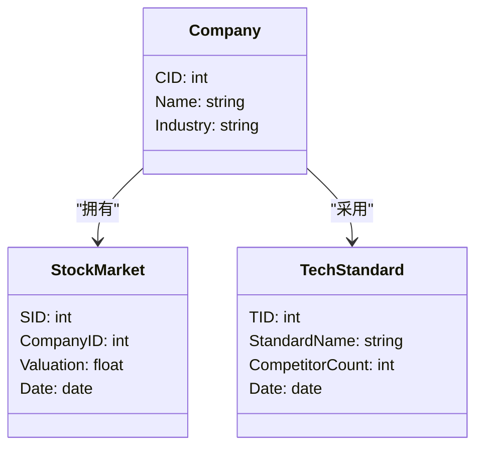

                 


# 股市估值差异对国际技术标准竞争的影响

> **关键词**：股市估值差异、国际技术标准、竞争影响、数学模型、博弈论、算法分析  
> **摘要**：本文探讨股市估值差异如何影响国际技术标准的竞争。通过分析股市估值差异的形成原因和技术标准竞争的驱动因素，结合数学模型和算法，揭示两者之间的相互作用。文章从背景介绍、核心概念、算法原理、数学模型、系统分析、项目实战和最佳实践等多个维度展开，为读者提供全面的分析和见解。

---

## 第1章: 股市估值差异与国际技术标准竞争的背景

### 1.1 股市估值差异的定义与影响

#### 1.1.1 股市估值的基本概念  
股市估值是投资者对一家公司未来盈利能力的预期，通常通过市盈率（P/E）、市净率（P/B）等指标衡量。估值差异指的是同一行业中不同公司股票的估值水平存在显著差异。

#### 1.1.2 估值差异的形成原因  
估值差异的形成与市场情绪、公司基本面、行业竞争格局等因素密切相关。例如，市场对某行业的乐观情绪可能导致该行业公司估值普遍偏高，而行业内的龙头公司由于更强的盈利能力，估值可能远高于竞争对手。

#### 1.1.3 估值差异对市场的影响  
估值差异可能导致资源向高估值公司倾斜，进一步加剧市场竞争。同时，估值过低的公司可能被市场忽视，影响其技术标准的推广和应用。

### 1.2 国际技术标准竞争的现状

#### 1.2.1 技术标准的定义与分类  
技术标准是行业内统一的技术规范，通常由行业协会或国际组织制定。技术标准的竞争主要体现在技术方案的优劣、市场接受度和推广能力等方面。

#### 1.2.2 国际技术标准竞争的典型案例  
以5G技术为例，中国主导的通信技术标准（如华为的5G技术）与西方企业的竞争（如高通的技术）形成了激烈的行业竞争格局。

#### 1.2.3 技术标准竞争的驱动因素  
技术标准竞争的驱动因素包括技术优势、市场占有率、政策支持和资本投入等。

### 1.3 股市估值差异与技术标准竞争的关系

#### 1.3.1 问题背景与研究意义  
股市估值差异和技术标准竞争是两个看似独立的领域，但它们在企业竞争力、市场地位和资本分配等方面存在密切联系。

#### 1.3.2 问题描述与研究目标  
本文旨在探讨股市估值差异如何影响技术标准的竞争格局，揭示两者之间的内在联系。

#### 1.3.3 问题解决的路径与方法  
通过构建数学模型和算法分析，结合实际案例，探索股市估值差异对技术标准竞争的具体影响。

---

## 第2章: 核心概念与联系

### 2.1 核心概念原理

#### 2.1.1 股市估值差异的数学模型  
股市估值差异可以用以下公式表示：  
$$\Delta V = V_{\text{max}} - V_{\text{min}}$$  
其中，$V_{\text{max}}$和$V_{\text{min}}$分别表示同一行业中最高和最低的估值水平。

#### 2.1.2 技术标准竞争的博弈论分析  
技术标准竞争可以看作一个博弈过程，企业通过技术创新、市场推广等方式争夺技术标准的主导权。

### 2.2 核心概念对比分析

#### 2.2.1 股市估值差异与技术标准竞争的属性特征对比  
| 属性 | 股市估值差异 | 技术标准竞争 |
|------|-------------|---------------|
| 影响因素 | 市场情绪、公司基本面 | 技术优势、市场占有率 |
| 表现形式 | 估值水平差异 | 标准化进程差异 |
| 影响范围 | 资本分配 | 行业技术发展 |

#### 2.2.2 影响因素对比分析  
股市估值差异主要受市场情绪和公司基本面影响，而技术标准竞争则取决于技术优劣和市场策略。

### 2.3 ER实体关系图

```mermaid
erDiagram
    company(CID, Name, Industry) {
        CID: int
        Name: string
        Industry: string
    }
    stock_market(SID, CompanyID, Valuation, Date) {
        SID: int
        CompanyID: int
        Valuation: float
        Date: date
    }
    tech_standard(TID, StandardName, CompetitorCount, Date) {
        TID: int
        StandardName: string
        CompetitorCount: int
        Date: date
    }
    company ~<o- stock_market: "拥有"
    company ~<o- tech_standard: "采用"
```

---

## 第3章: 股市估值差异分析算法

### 3.1 算法原理

#### 3.1.1 数据预处理流程  
1. 数据清洗：去除缺失值和异常值。  
2. 标准化处理：将不同单位的估值指标统一化。  
3. 时间序列分析：分析估值差异的时间变化趋势。

#### 3.1.2 估值差异计算方法  
基于历史数据计算同行业公司的平均估值，然后计算单个公司的估值差异：  
$$\Delta V_i = V_i - \bar{V}$$  
其中，$V_i$为第$i$家公司的估值，$\bar{V}$为行业平均估值。

#### 3.1.3 基于时间序列的差异分析  
使用ARIMA模型预测未来估值差异的变化趋势。

### 3.2 技术标准竞争分析算法

#### 3.2.1 竞争力评估指标  
竞争力指标包括市场占有率、技术专利数、行业认可度等。

#### 3.2.2 基于博弈论的竞争力模型  
构建一个博弈模型，模拟技术标准竞争中的企业行为：  
$$C_i = \alpha \cdot T_i + \beta \cdot S_i$$  
其中，$C_i$为第$i$家公司的竞争力，$T_i$为技术优势，$S_i$为市场策略。

#### 3.2.3 竞争态势预测算法  
使用Logit模型预测技术标准的竞争结果。

---

## 第4章: 算法实现与案例分析

### 4.1 算法实现

#### 4.1.1 数据获取与清洗  
使用Python的pandas库清洗数据：  
```python
import pandas as pd
data = pd.read_csv('stock_data.csv')
data.dropna(inplace=True)
```

#### 4.1.2 估值差异计算代码  
```python
import numpy as np
industry_avg = data['Valuation'].mean()
valuation_diff = np.abs(data['Valuation'] - industry_avg)
```

#### 4.1.3 技术标准竞争预测代码  
```python
from sklearn.linear_model import LogisticRegression
model = LogisticRegression()
model.fit(X, y)
predictions = model.predict(X_test)
```

### 4.2 案例分析

#### 4.2.1 某行业技术标准竞争案例  
以半导体行业为例，分析某公司的估值差异和技术标准竞争情况。

#### 4.2.2 估值差异对竞争结果的影响分析  
通过模型预测，验证估值差异对技术标准竞争结果的影响。

---

## 第5章: 股市估值差异的数学模型

### 5.1 估值差异的计算公式  
$$\Delta V = V_{\text{max}} - V_{\text{min}}$$  

### 5.2 竞争力模型  
$$C_i = \alpha \cdot \Delta V_i + \beta \cdot F_i$$  
其中，$F_i$为公司的市场策略得分。

---

## 第6章: 系统分析与架构设计

### 6.1 系统功能设计

#### 6.1.1 领域模型  


### 6.2 系统架构设计

```mermaid
container 技术标准竞争分析系统 {
    component 数据获取模块
    component 数据处理模块
    component 模型计算模块
    component 结果展示模块
}
```

### 6.3 接口设计  
定义RESTful API接口，用于数据获取和模型调用。

---

## 第7章: 项目实战

### 7.1 环境安装  
安装Python、pandas、numpy、scikit-learn等工具。

### 7.2 核心代码实现

#### 7.2.1 数据预处理  
```python
import pandas as pd
data = pd.read_csv('stock_data.csv')
data.dropna(inplace=True)
```

#### 7.2.2 估值差异计算  
```python
valuation_diff = np.abs(data['Valuation'] - data['Valuation'].mean())
```

#### 7.2.3 技术标准竞争预测  
```python
from sklearn.linear_model import LogisticRegression
model = LogisticRegression()
model.fit(X, y)
predictions = model.predict(X_test)
```

### 7.3 案例分析与结果展示  
通过实际案例分析，验证模型的准确性，并展示结果。

### 7.4 项目小结  
总结项目实现的关键步骤和成果，为后续研究提供参考。

---

## 第8章: 最佳实践

### 8.1 小结  
本文通过数学模型和算法分析，揭示了股市估值差异对国际技术标准竞争的影响。

### 8.2 注意事项  
在实际操作中，需注意数据的准确性和模型的适用性。

### 8.3 拓展阅读  
推荐阅读相关领域的书籍和论文，深入理解技术标准竞争和股市估值的复杂关系。

---

## 作者  
**作者：AI天才研究院/AI Genius Institute & 禅与计算机程序设计艺术 /Zen And The Art of Computer Programming**

