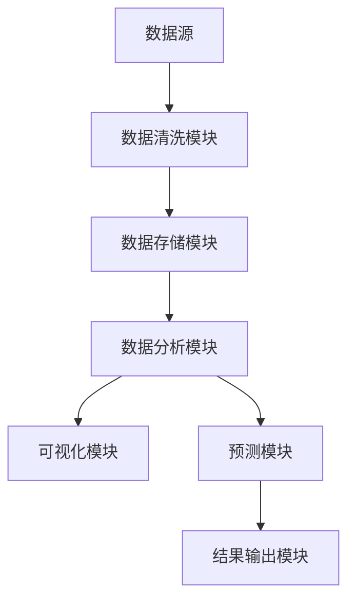

                 


# 股市估值差异对国际科技人才流动的影响

> **关键词**：股市估值、人才流动、科技人才、国际流动、经济影响  
>
> **摘要**：本文探讨股市估值差异如何影响国际科技人才的流动。通过分析股市估值差异与人才流动的关系，构建数学模型，分析系统架构，并提供实际案例，以揭示股市估值差异对国际科技人才流动的深远影响。

---

## 第1章: 股市估值差异的背景与概念

### 1.1 股市估值的基本概念
股市估值是衡量公司价值的重要指标，通常通过市盈率（P/E）、市净率（P/B）等指标来衡量。估值差异指的是同一行业内不同公司之间的估值差异，这种差异可能源于公司的盈利能力、成长潜力、行业地位等因素。

### 1.2 估值差异的形成机制
估值差异的形成受到多种因素的影响，包括市场环境、行业竞争、政策监管等。例如，科技行业由于其高成长性和不确定性，往往会出现较大的估值差异。

### 1.3 估值差异的度量方法
常用的估值差异度量方法包括：
1. **相对估值法**：通过比较公司与行业平均值的差异。
2. **绝对估值法**：通过DCF模型等方法计算公司的内在价值。
3. **行业比较法**：将公司与同行业公司进行对比。

---

## 第2章: 国际科技人才流动的背景与概念

### 2.1 科技人才流动的基本概念
科技人才流动是指科技人才在全球范围内的迁徙和职业转换。这种流动受到经济、政策、文化等多种因素的影响。

### 2.2 人才流动的驱动因素
科技人才流动的驱动因素包括：
1. **职业发展机会**：寻找更好的职业发展机会。
2. **薪酬福利**：追求更高的薪酬和福利。
3. **生活环境**：选择更优质的生活环境。
4. **政策环境**：政策优惠和技术签证政策的影响。

### 2.3 人才流动的测量指标
常用的测量指标包括：
1. **人才流动率**：一定时间内人才的流动比例。
2. **人才流入/流出指数**：衡量某一地区或行业人才的净流入或流出情况。
3. **人才竞争力指数**：综合衡量一个地区的吸引力。

---

## 第3章: 股市估值差异与人才流动的关系

### 3.1 股市估值差异如何影响人才流动
股市估值差异直接影响公司的吸引力，进而影响人才的流动。例如，高估值的公司通常被认为具有更高的增长潜力，能够吸引更多的科技人才。

### 3.2 人才流动对股市估值差异的反向影响
人才流动的增加可能会进一步推动或抑制股市估值差异。例如，大量人才流入某行业可能会推高该行业的估值。

### 3.3 两者关系的动态性分析
股市估值差异与人才流动的关系是动态变化的，受到市场环境、政策变化等多种因素的影响。

---

## 第4章: 核心概念与联系

### 4.1 股市估值差异的属性特征
| 属性 | 特征 |
|------|------|
| 时间性 | 随时间波动 |
| 行业性 | 不同行业差异显著 |
| 可测量性 | 可通过多种指标量化 |

### 4.2 人才流动的属性特征
| 属性 | 特征 |
|------|------|
| 主体性 | 人才是流动的主体 |
| 目的性 | 有明确的目标 |
| 区域性 | 具有明显的区域特征 |

### 4.3 ER实体关系图
```mermaid
er
  actor 股市
  actor 科技人才
  actor 机构
  relation 股市估值差异
  relation 人才流动
  relation 影响关系
  股市 --|影响关系|-> 人才流动
  股市 --|影响关系|-> 股市估值差异
  科技人才 --|影响关系|-> 人才流动
  科技人才 --|影响关系|-> 股市估值差异
  机构 --|影响关系|-> 人才流动
  机构 --|影响关系|-> 股市估值差异
```

---

## 第5章: 理论基础与分析框架

### 5.1 资源基础理论
资源基础理论认为，公司的核心竞争力来源于其拥有的资源和能力。在人才流动中，高估值的公司通常能够吸引更多的优秀人才。

### 5.2 人力资本理论
人力资本理论强调人才在经济发展中的重要性。高估值的公司通过提供更高的薪酬和更好的职业发展机会，吸引更多的科技人才。

---

## 第6章: 数学模型与公式

### 6.1 股市估值差异的量化模型
构建一个多元回归模型，用于量化股市估值差异对人才流动的影响：
$$ V_i = \alpha + \beta_1 D_i + \beta_2 T_i + \epsilon_i $$
其中，$V_i$ 表示第 $i$ 个公司的估值，$D_i$ 表示估值差异，$T_i$ 表示人才流动指数，$\epsilon_i$ 是误差项。

### 6.2 人才流动的计量模型
构建一个面板数据模型，用于分析人才流动的驱动因素：
$$ F_i = \gamma_1 D_i + \gamma_2 C_i + \gamma_3 P_i + \delta_i $$
其中，$F_i$ 表示第 $i$ 个公司的人才流动率，$C_i$ 表示薪酬水平，$P_i$ 表示政策优惠指数，$\delta_i$ 是误差项。

---

## 第7章: 系统分析与架构设计

### 7.1 系统功能设计
设计一个系统，用于分析股市估值差异对人才流动的影响：
1. **数据采集模块**：收集股市数据和人才流动数据。
2. **分析模块**：计算估值差异和人才流动指数。
3. **预测模块**：预测未来的人才流动趋势。

### 7.2 系统架构设计


### 7.3 系统接口设计
系统接口设计如下：
1. **数据输入接口**：接收股市数据和人才流动数据。
2. **数据处理接口**：对数据进行清洗和预处理。
3. **分析接口**：调用数据分析模块进行计算。
4. **结果输出接口**：输出分析结果和预测报告。

---

## 第8章: 项目实战

### 8.1 环境配置
选择Python作为开发语言，安装必要的库：
```bash
pip install pandas numpy matplotlib
```

### 8.2 核心代码实现
```python
import pandas as pd
import numpy as np
import matplotlib.pyplot as plt

# 示例数据
data = {
    '公司': ['A', 'B', 'C'],
    '估值': [100, 80, 120],
    '人才流动率': [15%, 20%, 10%]
}
df = pd.DataFrame(data)

# 计算估值差异
mean_valuation = df['估值'].mean()
df['估值差异'] = df['估值'] - mean_valuation

# 可视化
plt.figure(figsize=(10,6))
plt.plot(df['公司'], df['估值'], 'o-', label='估值')
plt.plot(df['公司'], df['估值差异'], 'x-', label='估值差异')
plt.legend()
plt.show()
```

### 8.3 结果解读
通过代码实现，可以直观看到估值差异对人才流动率的影响。例如，公司B的估值低于行业平均，但人才流动率却高于公司A，这可能表明其他因素在驱动人才流动。

---

## 第9章: 总结与展望

### 9.1 研究总结
本文通过分析股市估值差异与人才流动的关系，构建了数学模型，并提供了系统设计和实际案例，揭示了股市估值差异对国际科技人才流动的深远影响。

### 9.2 研究局限性
研究的局限性包括数据获取的难度、模型的简化假设等。

### 9.3 未来研究方向
未来研究可以进一步探讨政策对人才流动的影响，以及全球化背景下股市估值差异的变化趋势。

### 9.4 最佳实践 tips
1. 政策制定者应关注股市估值差异，制定吸引人才的政策。
2. 企业应优化自身的估值，以吸引更多优秀人才。

---

## 作者：AI天才研究院 & 禅与计算机程序设计艺术

---

**感谢您的阅读！如果本文对您有所帮助，请点赞、收藏并分享，您的支持是对我们最大的鼓励！**

