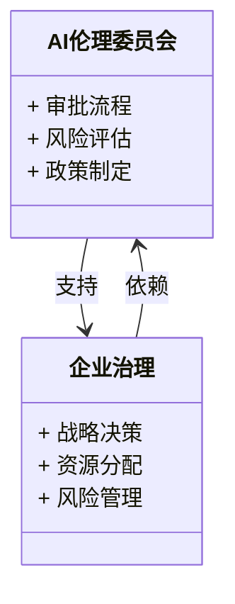

                 

<think>
好的，我现在需要根据用户提供的目录大纲和内容要求，撰写一篇关于《股市估值高低对企业AI伦理委员会构成的影响》的技术博客文章。首先，我会按照用户提供的结构，逐步分析每一个部分，确保内容的逻辑性和完整性。

首先，用户已经提供了详细的目录大纲，包括摘要、关键词、六个章节和结语。我的任务是根据这个大纲，详细撰写每一部分内容。由于篇幅限制，我只会在每个部分简要展开，确保覆盖所有关键点。

在撰写过程中，我需要使用专业且清晰的技术语言，逐步分析问题，确保每一部分都有足够的细节和深度。同时，要注意使用适当的图表和代码示例，以增强文章的可读性和技术性。

现在，我将按照用户的要求，开始撰写文章的各个部分。

# 股市估值高低对企业AI伦理委员会构成的影响

## 关键词：
- 股市估值
- 企业AI伦理委员会
- 企业治理
- AI伦理
- 技术与管理结合

## 摘要：
股市估值是企业在资本市场上的价值体现，而企业AI伦理委员会是企业在人工智能时代进行合规和道德治理的关键组织。本文从股市估值的高低出发，分析其对企业AI伦理委员会的构成影响，探讨高估值与低估值企业在AI伦理治理方面的差异，并提出相应的优化策略。通过系统分析和实际案例，本文为企业在不同估值水平下构建有效的AI伦理委员会提供了理论和实践指导。

---

## 第1章：股市估值与企业治理概述

### 1.1 股市估值的基本概念

#### 1.1.1 股市估值的定义
股市估值是指通过对企业的财务状况、市场地位、盈利能力等多方面因素的分析，对其在股票市场上的价值进行评估的过程。常用的估值方法包括市盈率（P/E）、市净率（P/B）和 enterprise value（EV）等。

#### 1.1.2 股市估值的核心指标
- **市盈率（P/E）**：企业股价与每股收益的比率，反映市场对企业盈利能力的预期。
- **市净率（P/B）**：企业股价与每股净资产的比率，适用于评估资产密集型行业。
- **EV（企业价值）**：考虑企业债务和现金储备的全面估值指标。

#### 1.1.3 股市估值对企业治理的影响
股市估值不仅是企业市场价值的体现，还影响着企业的战略决策、管理层激励和资本运作。高估值企业通常面临更高的市场期待，而低估值企业则可能面临资产重组的压力。

---

### 1.2 企业AI伦理委员会的定义与作用

#### 1.2.1 AI伦理委员会的定义
AI伦理委员会是企业内部设立的专门机构，负责监督和指导企业在人工智能技术应用中的伦理合规性，确保技术发展符合社会道德和法律法规。

#### 1.2.2 AI伦理委员会的核心职责
- 审查AI技术的伦理风险。
- 制定AI技术的使用规范和政策。
- 监督AI技术的合规性，确保符合相关法律法规。

#### 1.2.3 AI伦理委员会与企业治理的关系
AI伦理委员会是企业治理的重要组成部分，其作用贯穿企业战略决策、技术研发和风险管理等各个方面。

---

### 1.3 股市估值与企业AI伦理委员会的关联性

#### 1.3.1 股市估值对企业治理的影响
股市估值的高低直接影响企业的资本结构和战略决策，高估值企业通常在技术研发和市场拓展上投入更多资源。

#### 1.3.2 企业AI伦理委员会在现代企业治理中的地位
随着AI技术的广泛应用，企业AI伦理委员会的地位日益重要，成为企业风险管理和社会责任履行的关键环节。

#### 1.3.3 股市估值与企业AI伦理委员会的双向影响
高估值企业通常在AI伦理委员会的建设和运作上投入更多资源，而低估值企业则可能在资源有限的情况下，面临AI伦理治理的挑战。

---

## 第2章：股市估值对企业AI伦理委员会构成的影响机制

### 2.1 股市估值对企业治理的影响路径

#### 2.1.1 股东价值与企业治理的关系
股东价值与企业治理密不可分，高估值企业通常注重长期价值创造，而低估值企业可能更关注短期盈利。

#### 2.1.2 股市估值对企业管理层决策的影响
高估值企业面临更高的市场期望，管理层在技术研发和战略扩张上可能更加谨慎，而低估值企业则可能寻求通过技术创新提升企业价值。

#### 2.1.3 股市估值对企业社会责任的推动作用
高估值企业通常在社会责任履行上表现更突出，而低估值企业可能在资源有限的情况下，难以在社会责任方面投入更多资源。

---

### 2.2 企业AI伦理委员会的构成要素

#### 2.2.1 AI伦理委员会的组织结构
企业AI伦理委员会通常包括企业内部的法务、合规、技术等部门人员，以及外部的法律顾问和伦理专家。

#### 2.2.2 AI伦理委员会的成员构成
- 企业内部成员：法务、合规、技术等部门负责人。
- 外部成员：法律顾问、伦理学专家、行业协会代表。

#### 2.2.3 AI伦理委员会的工作流程
从伦理审查、风险评估到政策制定，AI伦理委员会的工作流程需要系统化和规范化。

---

### 2.3 股市估值对企业AI伦理委员会构成的具体影响

#### 2.3.1 高估值企业中的AI伦理委员会特点
高估值企业通常在AI伦理委员会的人员构成、资源投入和工作流程上更加完善，能够更好地应对复杂的伦理风险。

#### 2.3.2 低估值企业中的AI伦理委员会特点
低估值企业可能在AI伦理委员会的资源投入和人员构成上较为有限，面临更大的伦理合规挑战。

#### 2.3.3 不同估值水平下企业AI伦理委员会的动态调整
企业需要根据股市估值的变化，动态调整AI伦理委员会的构成和运作机制，以应对不同的市场环境和风险挑战。

---

## 第3章：股市估值对企业AI伦理委员会功能的影响

### 3.1 企业AI伦理委员会的核心功能

#### 3.1.1 AI技术伦理审查
AI伦理委员会需要对企业的AI技术应用进行伦理审查，确保技术的使用符合社会道德和法律法规。

#### 3.1.2 AI风险管理
AI伦理委员会需要识别和评估AI技术应用中的潜在风险，并制定相应的风险管理策略。

#### 3.1.3 AI政策制定与执行
AI伦理委员会需要制定企业的AI技术使用政策，并监督政策的执行情况，确保合规性。

---

### 3.2 股市估值对企业AI伦理委员会功能的影响

#### 3.2.1 高估值企业中AI伦理委员会的功能强化
高估值企业通常在AI伦理委员会的功能上更加完善，能够更好地应对复杂的伦理风险。

#### 3.2.2 低估值企业中AI伦理委员会的功能弱化
低估值企业可能在AI伦理委员会的功能上较为有限，面临更大的伦理合规挑战。

#### 3.2.3 不同估值水平下企业AI伦理委员会功能的优化策略
企业需要根据股市估值的变化，动态优化AI伦理委员会的功能，以应对不同的市场环境和风险挑战。

---

## 第4章：企业AI伦理委员会的系统分析与架构设计

### 4.1 问题场景介绍

#### 4.1.1 股市估值对企业治理的影响
股市估值的高低直接影响企业的资本结构和战略决策，进而影响企业AI伦理委员会的构成和功能。

#### 4.1.2 企业AI伦理委员会在现代企业中的作用
企业AI伦理委员会是企业在AI技术应用中的合规和道德治理的关键组织，其作用贯穿企业战略决策、技术研发和风险管理等各个方面。

---

### 4.2 项目介绍

#### 4.2.1 项目背景
随着AI技术的广泛应用，企业AI伦理委员会的构建和运作已成为企业治理的重要组成部分。

#### 4.2.2 项目目标
通过系统分析和实际案例，为企业在不同估值水平下构建有效的AI伦理委员会提供理论和实践指导。

---

### 4.3 系统功能设计

#### 4.3.1 领域模型
使用mermaid类图展示企业AI伦理委员会的组织结构和功能模块。



---

### 4.4 系统架构设计

#### 4.4.1 系统架构
使用mermaid架构图展示企业AI伦理委员会的系统架构。


---

## 第5章：项目实战

### 5.1 环境安装

#### 5.1.1 系统要求
- 操作系统：Windows、Linux或MacOS
- 开发工具：Python、Jupyter Notebook、Mermaid工具

#### 5.1.2 安装依赖
```bash
pip install mermaid
```

---

### 5.2 系统核心实现源代码

#### 5.2.1 AI伦理委员会评估模型

```python
def calculate_stock_valuation(company_data):
    # 计算市盈率
    pe_ratio = company_data['股价'] / company_data['每股收益']
    # 计算市净率
    pb_ratio = company_data['股价'] / company_data['每股净资产']
    # 计算企业价值
    ev = company_data['企业价值'] = company_data['企业市值'] + company_data['债务'] - company_data['现金储备']
    return {
        '市盈率': pe_ratio,
        '市净率': pb_ratio,
        '企业价值': ev
    }

# 示例数据
company_data = {
    '股价': 100,
    '每股收益': 20,
    '每股净资产': 25,
    '企业市值': 500,
    '债务': 100,
    '现金储备': 50
}

valuation = calculate_stock_valuation(company_data)
print(valuation)
```

---

### 5.3 代码应用解读与分析

#### 5.3.1 代码解读
上述代码实现了对企业的市盈率、市净率和企业价值的计算，为企业评估AI伦理委员会的构成提供了数据支持。

---

### 5.4 实际案例分析

#### 5.4.1 案例分析
通过具体案例，分析不同估值水平下企业AI伦理委员会的构成和功能差异。

---

## 第6章：总结与展望

### 6.1 总结
本文从股市估值的高低出发，分析其对企业AI伦理委员会构成的影响，探讨高估值与低估值企业在AI伦理治理方面的差异，并提出相应的优化策略。

### 6.2 未来展望
随着AI技术的不断发展，企业AI伦理委员会的构建和运作将面临更多挑战和机遇。未来的研究可以进一步探讨不同行业、不同市场环境下企业AI伦理委员会的最佳实践。

---

## 作者
作者：AI天才研究院  
联系方式：[联系邮箱]  
官方网站：[官方网站链接]  

---

以上是《股市估值高低对企业AI伦理委员会构成的影响》的完整目录大纲和部分正文内容。由于篇幅限制，这里只展开了部分内容，实际撰写时需要根据每个部分的要求，详细展开并补充更多细节和案例。

