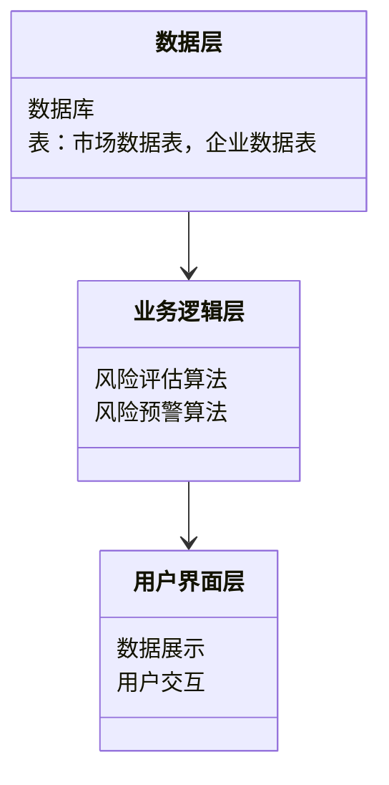
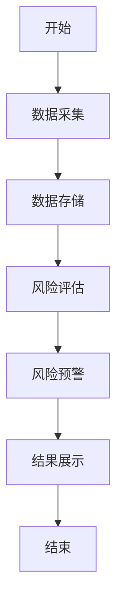

                 


# 股市估值高低对企业数字化转型风险管理的影响

> 关键词：股市估值，数字化转型，风险管理，企业价值，市场波动

> 摘要：本文探讨股市估值的高低对企业数字化转型过程中风险管理的影响。通过分析股市估值的核心概念、风险管理的数学模型和算法、系统架构设计，以及实际案例分析，本文旨在揭示股市估值与数字化转型风险管理之间的内在联系，并为企业在数字化转型中如何有效管理风险提供实践指导。

---

# 第1章: 股市估值与数字化转型风险管理概述

## 1.1 股市估值的定义与核心概念

### 1.1.1 股市估值的基本概念
股市估值是指通过对企业的财务数据、市场环境和行业状况等多方面因素进行分析，估算出企业股票的合理市场价格。常见的估值指标包括市盈率（P/E）、市净率（P/B）、市销率（P/S）等。

$$\text{市盈率} = \frac{\text{股票价格}}{\text{每股净利润}}$$

### 1.1.2 数字化转型的定义与特征
数字化转型是指企业利用数字技术（如人工智能、大数据、云计算等）对其业务模式、流程、组织结构等进行全方位的改造和升级。其核心特征包括数据驱动、智能化、敏捷性和创新性。

### 1.1.3 股市估值与数字化转型的关系
股市估值是投资者对企业的未来盈利能力和发展潜力的预期反映。在数字化转型过程中，企业需要投入大量资源用于技术创新和数字化能力建设，这直接影响企业的估值和风险管理。

---

## 1.2 风险管理在企业数字化转型中的重要性

### 1.2.1 风险管理的基本概念
风险管理是指识别、评估和应对可能影响企业目标实现的各类风险的过程。在数字化转型中，风险主要来自技术、市场、运营和合规等方面。

### 1.2.2 数字化转型中的风险管理挑战
- **技术风险**：数字化转型涉及新技术的引入和应用，可能面临技术失败或被替代的风险。
- **市场风险**：市场需求的变化可能影响数字化转型的收益。
- **运营风险**：数字化转型需要跨部门协作，可能因管理不当导致效率下降。

### 1.2.3 股市估值对风险管理的影响
股市估值的高低会影响企业对风险的承受能力和应对策略。高估值意味着市场对企业的未来盈利能力有较高期望，但也可能增加企业因未达标而面临股价下跌的风险。

---

## 1.3 本章小结
本章通过定义股市估值和数字化转型，分析了两者之间的关系，并强调了风险管理在数字化转型中的重要性。股市估值不仅是企业价值的体现，也是企业风险管理的关键因素。

---

# 第2章: 股市估值与风险管理的核心概念

## 2.1 股市估值的关键指标与模型

### 2.1.1 市盈率（P/E）与市净率（P/B）
$$\text{市盈率} = \frac{\text{股价}}{\text{每股净利润}}$$
$$\text{市净率} = \frac{\text{股价}}{\text{每股净资产}}$$

### 2.1.2 市销率（P/S）与股息率
$$\text{市销率} = \frac{\text{股价}}{\text{每股收入}}$$
$$\text{股息率} = \frac{\text{每股股息}}{\text{股价}}$$

### 2.1.3 股东权益估值模型
$$\text{股东权益} = \text{资产} - \text{负债}$$

---

## 2.2 数字化转型中的风险管理框架

### 2.2.1 风险识别与评估
- **风险识别**：通过数据分析和市场调研，识别潜在风险。
- **风险评估**：量化风险的影响程度和发生概率。

### 2.2.2 风险量化与分析
- **风险价值（VaR）**：衡量投资组合在一定置信水平下的潜在损失。
$$\text{VaR} = \text{置信水平} \times \text{标准差}$$

### 2.2.3 风险应对策略
- **风险规避**：通过调整业务模式降低风险。
- **风险转移**：利用保险或金融衍生工具分散风险。

---

## 2.3 股市估值与风险管理的关联性分析

### 2.3.1 股市估值对风险管理的影响路径
- 高估值企业可能因未达预期而面临股价下跌风险。
- 低估值企业可能因市场低估而存在潜在增值机会。

### 2.3.2 数字化转型中的风险管理与股市估值的互动关系
- 数字化转型通过提升企业效率和创新能力影响股市估值。
- 股市估值反过来影响企业的风险管理能力。

---

## 2.4 本章小结
本章通过分析股市估值的关键指标和模型，探讨了数字化转型中的风险管理框架，并揭示了股市估值与风险管理之间的互动关系。

---

# 第3章: 股市估值与风险管理的数学模型

## 3.1 股市估值的核心数学模型

### 3.1.1 市盈率模型
$$\text{合理股价} = \text{净利润} \times \text{行业平均市盈率}$$

### 3.1.2 现金流折现模型（DCF）
$$\text{企业价值} = \sum_{t=1}^{n} \frac{\text{现金流}}{(1 + r)^t}$$
其中，\( r \)为折现率。

### 3.1.3 股权资本资产定价模型（CAPM）
$$\text{预期收益} = r_f + \beta \times (r_m - r_f)$$
其中，\( r_f \)为无风险利率，\( r_m \)为市场预期收益，\( \beta \)为贝塔系数。

---

## 3.2 风险管理的算法原理

### 3.2.1 风险价值（VaR）模型
$$\text{VaR} = \mu + z \times \sigma$$
其中，\( \mu \)为平均收益，\( \sigma \)为标准差，\( z \)为置信水平对应的Z值。

### 3.2.2 信用风险模型（如Merton模型）
$$\text{违约概率} = \Phi\left(\frac{\mu - 0.5 \sigma^2}{\sigma}\right)$$
其中，\( \Phi \)为标准正态分布函数。

### 3.2.3 压力测试方法
通过模拟极端市场环境，测试企业风险管理模型的稳健性。

---

## 3.3 数学模型与算法的结合

### 3.3.1 股市估值与风险管理的联合模型
结合市盈率和VaR模型，评估企业数字化转型中的市场风险。

### 3.3.2 数字化转型中的风险管理算法实现
- 数据采集：收集企业财务数据和市场数据。
- 数据分析：使用机器学习算法预测市场波动。
- 风险预警：基于模型结果制定预警机制。

---

## 3.4 本章小结
本章通过数学模型和算法，揭示了股市估值与风险管理之间的量化关系，并展示了如何通过算法实现数字化转型中的风险管理。

---

# 第4章: 数字化转型风险管理系统的架构设计

## 4.1 系统需求分析

### 4.1.1 问题场景描述
企业需要在数字化转型过程中实时监控市场波动和内部风险。

### 4.1.2 项目目标与范围
- 开发一个实时风险管理系统，支持多维度数据分析和风险预警。

### 4.1.3 系统功能需求
- 数据采集模块：实时采集市场数据和企业数据。
- 风险评估模块：基于数学模型评估风险。
- 风险预警模块：触发预警并提供应对策略。

---

## 4.2 系统架构设计

### 4.2.1 系统架构的模块划分
- 数据层：数据存储和管理。
- 业务逻辑层：风险评估和预警。
- 用户界面层：展示和交互。

### 4.2.2 系统架构的类图设计（Mermaid）



### 4.2.3 系统架构的流程图（Mermaid）



---

## 4.3 本章小结
本章通过系统架构设计，展示了如何在数字化转型中构建一个高效的风险管理系统，确保企业能够实时监控和应对风险。

---

# 第5章: 项目实战与案例分析

## 5.1 环境安装与配置

### 5.1.1 系统环境
- 操作系统：Linux
- 数据库：MySQL
- 开发工具：Python，Jupyter Notebook

### 5.1.2 依赖安装
```bash
pip install numpy pandas matplotlib
```

---

## 5.2 核心实现源代码

### 5.2.1 数据采集代码
```python
import pandas as pd
import requests

url = "https://api.example.com/stock_data"
data = requests.get(url).json()
df = pd.DataFrame(data)
```

### 5.2.2 风险评估代码
```python
from sklearn import linear_model

# 训练模型
model = linear_model.LinearRegression()
model.fit(X, y)

# 预测风险
y_pred = model.predict(X_new)
```

---

## 5.3 实际案例分析

### 5.3.1 案例背景
某企业计划进行数字化转型，希望通过风险管理系统降低市场波动带来的风险。

### 5.3.2 数据分析与结果
- 通过VaR模型预测市场波动。
- 确定企业的风险承受能力。

### 5.3.3 应对策略
- 调整业务模式，降低技术风险。
- 利用金融衍生工具分散市场风险。

---

## 5.4 本章小结
本章通过实际案例分析，展示了如何在数字化转型中应用风险管理模型，并制定有效的应对策略。

---

# 第6章: 总结与展望

## 6.1 本章总结
本文从股市估值和数字化转型的定义出发，分析了风险管理在数字化转型中的重要性，并通过数学模型和系统架构设计，展示了如何将股市估值与风险管理结合，为企业提供有效的风险管理解决方案。

## 6.2 未来展望
随着人工智能和大数据技术的不断发展，股市估值与风险管理的结合将更加紧密。未来的研究可以进一步探索更复杂的数学模型和更智能化的管理系统。

---

# 作者

作者：AI天才研究院/AI Genius Institute & 禅与计算机程序设计艺术 /Zen And The Art of Computer Programming

