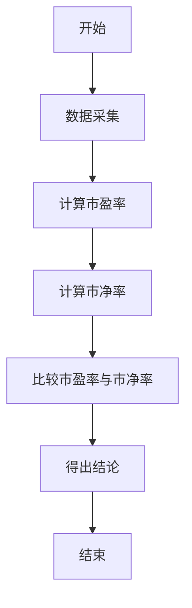
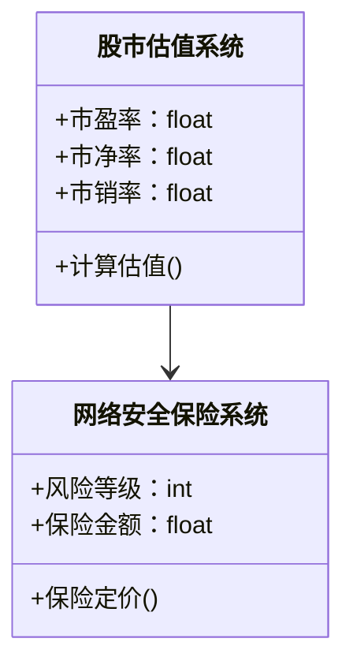

                 


# 股市估值高低对企业网络安全保险策略的影响

> 关键词：股市估值，网络安全保险，企业风险管理，数学模型，算法原理，系统架构

> 摘要：本文探讨股市估值高低对企业网络安全保险策略的影响，分析股市估值与网络安全保险的核心概念、数学模型、算法原理、系统架构，通过实际案例分析，提出最佳实践策略。文章内容丰富，逻辑清晰，适合企业高管、IT架构师、风险管理专家和算法工程师阅读。

---

## 第一章：背景介绍

### 1.1 股市估值的基本概念

1.1.1 股市估值的定义与作用  
1.1.2 股市估值的核心指标（市盈率、市净率、市销率）  
1.1.3 股市估值与企业价值的关系  

### 1.2 网络安全保险的基本概念

1.2.1 网络安全保险的定义与特点  
1.2.2 网络安全保险的覆盖范围  
1.2.3 网络安全保险与企业风险管理的关系  

### 1.3 股市估值与网络安全保险的关系

1.3.1 股市估值对企业网络安全保险的影响  
1.3.2 网络安全保险对股市估值的作用  
1.3.3 两者的相互作用与协同效应  

---

## 第二章：核心概念与联系

### 2.1 股市估值的核心概念

2.1.1 市盈率（P/E Ratio）  
2.1.2 市净率（P/B Ratio）  
2.1.3 市盈率与市净率的比较  

### 2.2 网络安全保险的核心概念

2.2.1 网络安全风险评估  
2.2.2 网络安全保险的定价模型  
2.2.3 网络安全保险的理赔流程  

### 2.3 股市估值与网络安全保险的核心联系

2.3.1 股市估值影响企业网络安全投入  
2.3.2 网络安全保险影响企业的财务风险  
2.3.3 股市估值与网络安全保险的协同优化  

---

## 第三章：核心概念的数学模型与公式

### 3.1 股市估值的数学模型

3.1.1 常见的股市估值指标  
- 市盈率公式：$$ P/E = \frac{Price}{Earnings} $$  
- 市净率公式：$$ P/B = \frac{Price}{Book\ Value} $$  
- 市销率公式：$$ P/S = \frac{Price}{Sales} $$  

3.1.2 股市估值模型  
- 现金流量贴现模型（DCF）：$$ V = \sum_{t=1}^{n} \frac{CF_t}{(1+r)^t} + \frac{TV}{(1+r)^n} $$  
- 市盈率倍数模型：$$ Target\ Price = P/E \times Earnings $$  

### 3.2 网络安全保险的风险评估模型

3.2.1 网络安全风险评估指标  
3.2.2 网络安全保险定价模型  
3.2.3 网络安全保险理赔模型  

---

## 第四章：算法原理与流程图

### 4.1 股市估值的算法原理

4.1.1 市盈率与市净率的比较算法  
4.1.2 股市估值的多因子模型  

### 4.2 网络安全保险的风险评估算法

4.2.1 风险评估的步骤与流程  
4.2.2 网络安全保险的定价算法  

### 4.3 用mermaid绘制算法流程图



---

## 第五章：系统分析与架构设计

### 5.1 问题场景介绍

5.1.1 企业面临的网络安全风险  
5.1.2 股市估值对企业的影响  

### 5.2 系统功能设计

5.2.1 数据采集模块  
5.2.2 风险评估模块  
5.2.3 保险定价模块  

### 5.3 系统架构设计



---

## 第六章：项目实战

### 6.1 环境安装

6.1.1 安装Python环境  
6.1.2 安装相关库（numpy, pandas, matplotlib）  

### 6.2 核心代码实现

```python
import numpy as np
import pandas as pd

# 示例数据
data = {
    '公司名称': ['A', 'B', 'C'],
    '市盈率': [15, 20, 25],
    '市净率': [2, 3, 4]
}

df = pd.DataFrame(data)

# 计算网络安全风险等级
def calculate_risk_level(PE, PB):
    if PE > 20 and PB > 3:
        return 3  # 高风险
    elif PE > 15 and PB > 2:
        return 2  # 中风险
    else:
        return 1  # 低风险

# 应用计算
for index, row in df.iterrows():
    risk_level = calculate_risk_level(row['市盈率'], row['市净率'])
    print(f"{row['公司名称']}的风险等级为：{risk_level}")
```

---

## 第七章：最佳实践与小结

### 7.1 小结

7.1.1 股市估值与网络安全保险的相互影响  
7.1.2 算法原理与系统架构的应用  

### 7.2 注意事项

7.2.1 数据准确性的重要性  
7.2.2 算法的适用性与局限性  

### 7.3 拓展阅读

7.3.1 更复杂的估值模型  
7.3.2 网络安全保险的最新发展  

---

## 作者

作者：AI天才研究院/AI Genius Institute & 禅与计算机程序设计艺术/Zen And The Art of Computer Programming

