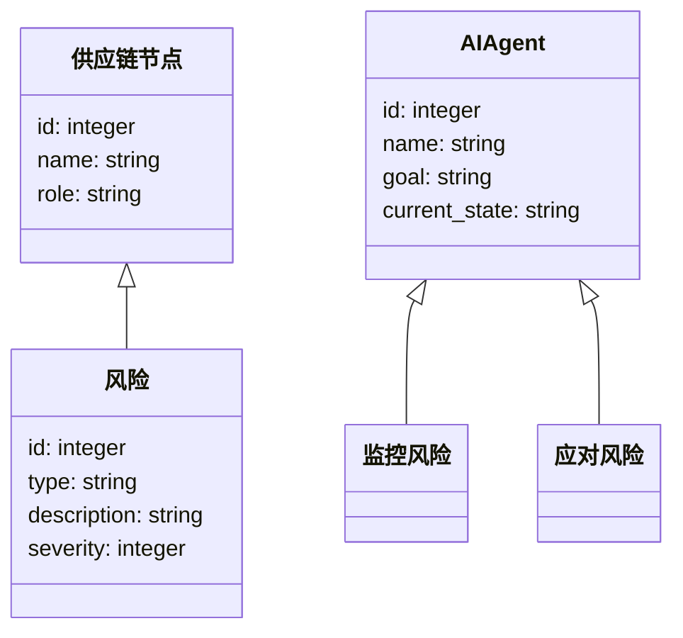

                 


# AI Agent在智能供应链风险管理中的应用

## 关键词：AI Agent，供应链风险管理，智能系统，风险管理，人工智能，机器学习

## 摘要：本文探讨了AI Agent在智能供应链风险管理中的应用，从供应链风险管理的重要性、AI Agent的核心原理，到其在风险识别、预测、监控和响应中的具体应用，详细阐述了AI Agent如何通过强化学习、监督学习等算法实现供应链的智能化管理。通过实际案例分析，展示了AI Agent在供应链风险管理中的优势和实际价值，为相关领域的研究和实践提供了参考。

---

## 第一部分：供应链风险管理与AI Agent概述

### 第1章：供应链风险管理的重要性

#### 1.1 供应链风险管理的核心概念

供应链风险管理是确保供应链稳定性和高效性的关键环节，涉及从原材料采购到最终产品交付的全过程。以下是供应链风险管理的核心概念：

- **供应链的基本构成**：供应商、制造商、分销商、零售商和消费者构成供应链的主要节点。
- **供应链风险管理的内涵**：识别、评估和应对可能影响供应链运作的风险，如自然灾害、疫情、原材料短缺等。
- **供应链风险管理的目标**：确保供应链的韧性、透明度和效率，降低潜在风险的影响。

#### 1.2 供应链风险管理的挑战与机遇

- **挑战**：
  - **复杂性**：供应链涉及多个环节和参与者，风险来源多样且复杂。
  - **实时性**：风险可能突然出现，需要快速响应。
  - **数据孤岛**：信息分散，难以整合和分析。
- **机遇**：
  - **数字化转型**：利用大数据、人工智能等技术提升风险管理能力。
  - **智能化**：通过AI Agent实现自动化监控和决策，提高应对效率。

#### 1.3 AI Agent在供应链风险管理中的作用

- **AI Agent的基本概念**：AI Agent是具有自主决策能力的智能体，能够感知环境并采取行动以实现目标。
- **AI Agent的优势**：
  - **实时监控**：持续监测供应链各环节的动态，快速识别风险。
  - **智能决策**：基于数据和模型，提供最优应对策略。
  - **协作能力**：与其他AI Agent或系统无缝协作，提升整体风险管理效率。

---

## 第二部分：AI Agent的核心原理与技术

### 第2章：AI Agent的基本原理

#### 2.1 AI Agent的定义与分类

- **定义**：AI Agent是能够感知环境、自主决策并采取行动的智能实体。
- **分类**：
  - **基于智能水平**：反应式、认知式、情感式。
  - **基于应用场景**：服务机器人、推荐系统、自动驾驶等。

#### 2.2 AI Agent的决策机制

- **基于规则的决策**：通过预设规则进行判断，适用于简单场景。
- **基于机器学习的决策**：利用数据训练模型，适用于复杂场景。
- **基于强化学习的决策**：通过试错学习，优化决策策略。

#### 2.3 AI Agent的通信与协作

- **多智能体系统（MAS）**：多个AI Agent协作完成任务。
- **通信机制**：通过消息传递实现信息共享和协同决策。
- **协作应用**：在供应链中，多个AI Agent协同监控不同环节的风险。

---

## 第三部分：AI Agent在供应链风险管理中的应用

### 第3章：AI Agent在供应链风险识别中的应用

#### 3.1 风险识别的基本原理

- **数据采集与特征提取**：收集供应链各环节的数据，提取关键特征。
- **基于AI的异常检测**：利用机器学习模型识别异常数据，发现潜在风险。
- **基于知识图谱的风险识别**：构建知识图谱，分析实体之间的关联，识别潜在风险。

#### 3.2 AI Agent在风险预测中的应用

- **时间序列分析与预测**：利用历史数据预测未来风险。
- **基于机器学习的预测模型**：训练分类模型，预测风险发生的概率。
- **基于强化学习的动态预测**：根据环境变化，动态调整预测模型。

---

## 第四部分：系统分析与架构设计

### 第4章：系统功能设计与实现

#### 4.1 领域模型设计

- **领域模型**：供应链风险管理系统的领域模型包括供应商、制造商、分销商、消费者等实体，以及订单、库存、物流等核心业务流程。
- **类图设计**：通过Mermaid类图展示领域模型的关系。



#### 4.2 系统架构设计

- **系统架构**：采用分层架构，包括数据层、应用层、用户层。
- **架构图设计**：通过Mermaid架构图展示系统架构。


---

## 第五部分：项目实战与案例分析

### 第5章：项目实战

#### 5.1 环境安装

- **Python环境**：安装Python 3.8及以上版本。
- **依赖库安装**：安装numpy、pandas、scikit-learn、tensorflow等库。

#### 5.2 核心代码实现

- **AI Agent的风险识别代码**：

```python
import numpy as np
from sklearn.ensemble import IsolationForest

# 示例数据：供应链各环节的特征向量
X = np.array([[1, 2], [3, 4], [5, 6], [7, 8], [9, 10], [1, 1], [2, 3]])

# 初始化异常检测模型
model = IsolationForest(n_estimators=100, random_state=42)

# 训练模型
model.fit(X)

# 预测异常点
y_pred = model.predict(X)
print(y_pred)
```

#### 5.3 案例分析

- **实际案例**：某电子产品供应链因疫情导致原材料短缺，AI Agent通过分析历史数据和实时数据，预测出潜在的风险，并提出调整供应商的建议，成功降低了供应链中断的风险。

---

## 第六部分：总结与展望

### 第6章：总结

- **AI Agent的优势**：通过智能化监控和决策，显著提升供应链风险管理的效率和准确性。
- **挑战与改进方向**：算法的复杂性、数据隐私、多智能体协作的优化等。

### 第7章：最佳实践与注意事项

- **最佳实践**：
  - 数据质量是关键，确保数据的准确性和完整性。
  - 持续优化模型，适应环境的变化。
  - 多部门协作，确保AI Agent的有效应用。
- **注意事项**：
  - 数据隐私和安全问题需要高度重视。
  - 确保AI Agent的决策透明可解释。
  - 定期进行系统演练和测试。

---

## 作者：AI天才研究院 & 禅与计算机程序设计艺术

---

**总结**：本文详细探讨了AI Agent在智能供应链风险管理中的应用，从理论到实践，结合实际案例，展示了AI Agent如何通过强化学习、监督学习等算法实现供应链的智能化管理。未来，随着技术的不断发展，AI Agent将在供应链风险管理中发挥更大的作用，为企业带来更高的效率和更强的竞争力。

