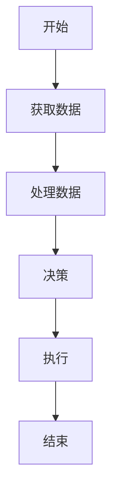
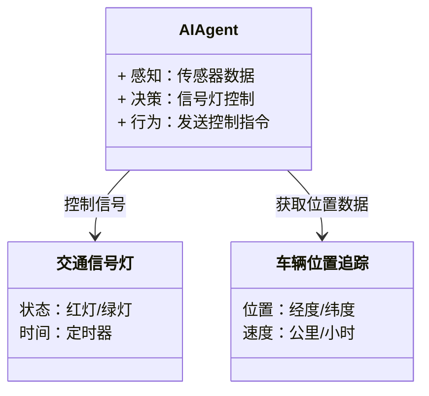
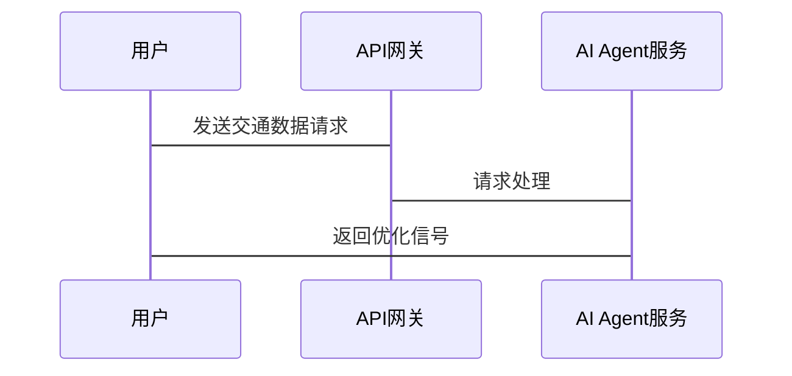

                 


# AI Agent在智能城市交通规划中的角色

> 关键词：AI Agent, 智能城市, 交通规划, 算法原理, 系统架构

> 摘要：本文探讨AI Agent在智能城市交通规划中的角色，从背景介绍、核心概念、算法原理到系统设计与项目实战，详细分析AI Agent如何优化交通系统，解决城市交通问题，提升城市智能化水平。

---

# 第一部分: AI Agent与智能城市交通规划的背景介绍

## 第1章: AI Agent与智能城市概述

### 1.1 AI Agent的基本概念

#### 1.1.1 什么是AI Agent
AI Agent（人工智能代理）是指能够感知环境、自主决策并采取行动的智能实体。它通过传感器获取信息，利用算法处理数据，并通过执行器与环境互动。

#### 1.1.2 AI Agent的核心特点
- **自主性**：能够在没有外部干预的情况下运行。
- **反应性**：能够实时感知环境并做出反应。
- **学习能力**：通过数据和经验不断优化自身行为。
- **协作性**：能够与其他Agent或系统协同工作。

#### 1.1.3 AI Agent与传统算法的区别
AI Agent不仅仅是算法的实现，更是一个具备感知和行动能力的实体。它能够动态调整策略，适应环境变化，而传统算法通常在静态环境中执行固定任务。

### 1.2 智能城市的基本概念

#### 1.2.1 智能城市的定义
智能城市是利用信息技术和数据科学优化城市资源分配、提高居民生活质量的城市发展模式。

#### 1.2.2 智能城市的发展历程
从早期的信息化建设到现在的智能化应用，智能城市经历了多个阶段的发展，逐步融入大数据、云计算和人工智能等技术。

#### 1.2.3 智能城市的核心特征
- **数据驱动**：依赖大量实时数据进行决策。
- **智能化服务**：通过AI技术提供高效、个性化的服务。
- **系统协同**：各子系统（交通、能源、医疗等）协同工作，提升城市整体效率。

### 1.3 智能城市交通规划的挑战与机遇

#### 1.3.1 传统交通规划的局限性
- **静态规划**：无法应对交通需求的动态变化。
- **信息滞后**：依赖历史数据，难以实时优化。
- **单一目标**：难以平衡多目标（如效率、环保、公平）。

#### 1.3.2 智能交通规划的潜力
- **实时优化**：通过实时数据调整交通信号和路线。
- **多目标优化**：同时考虑效率、环保和公平性。
- **预测能力**：基于历史数据预测未来交通状况。

#### 1.3.3 AI Agent在智能交通中的作用
AI Agent能够实时感知交通状况，动态调整信号配时和交通流，从而提高道路利用率，减少拥堵和排放。

---

# 第二部分: AI Agent的核心概念与原理

## 第2章: AI Agent的核心概念与联系

### 2.1 AI Agent的实体关系分析

#### 2.1.1 实体关系图（ER图）
```mermaid
erDiagram
    actor 用户
    actor 系统
    actor 环境
    system 交通信号灯
    system 路况传感器
    system 车辆位置追踪
    用户 -->> 系统 : 提供数据
    系统 --> 环境 : 输出控制信号
```

### 2.2 AI Agent的算法原理

#### 2.2.1 算法流程图


#### 2.2.2 算法实现的 Python 代码
```python
class AIAGENT:
    def __init__(self, sensors, actuators):
        self.sensors = sensors
        self.actuators = actuators

    def perceive(self):
        # 获取环境数据
        return self.sensors.get_data()

    def decide(self, data):
        # 数据处理与决策
        return self._calculate_optimal_action(data)

    def actuate(self, action):
        # 执行动作
        self.actuators.execute(action)

    def _calculate_optimal_action(self, data):
        # 示例：基于数据的优化算法
        return "green_light" if data['congestion'] < 0.2 else "red_light"
```

#### 2.2.3 数学模型与公式
- **数学模型**：描述AI Agent的决策过程。
  $$ \text{Action} = f(\text{State}, \text{Reward}) $$
- **优化目标**：最大化长期奖励。
  $$ \max_{\theta} \sum_{t=1}^{T} r_t(\theta) $$

### 2.3 本章小结
本章详细介绍了AI Agent的核心概念、实体关系和算法原理，为后续应用奠定了基础。

---

# 第三部分: AI Agent在智能城市交通规划中的应用

## 第3章: 智能城市交通规划的系统分析与架构设计

### 3.1 问题场景介绍

#### 3.1.1 交通拥堵问题
AI Agent通过实时数据优化信号灯配时，减少拥堵。

#### 3.1.2 交通信号优化
AI Agent根据交通流量动态调整信号灯时长。

#### 3.1.3 交通路径规划
AI Agent为车辆提供最优路线，减少拥堵。

### 3.2 系统功能设计

#### 3.2.1 领域模型（Mermaid 类图）


### 3.3 系统架构设计

#### 3.3.1 系统架构图（Mermaid 架构图）
```mermaid
docker
    client ---> API网关
    API网关 ---> AI Agent服务
    AI Agent服务 ---> 数据库
    数据库 ---> 外部数据源
```

### 3.4 系统交互设计

#### 3.4.1 交互流程图（Mermaid 序列图）


### 3.5 本章小结
本章通过系统分析与架构设计，展示了AI Agent在智能交通规划中的实际应用。

---

# 第四部分: AI Agent在智能城市交通规划中的项目实战

## 第4章: 项目实战与代码实现

### 4.1 环境安装与配置

#### 4.1.1 Python 环境的安装
安装Python 3.8及以上版本。

#### 4.1.2 必要库的安装
安装`mermaid`、`matplotlib`等库：
```bash
pip install mermaid matplotlib
```

### 4.2 系统核心实现

#### 4.2.1 AI Agent 的实现
```python
class TrafficAI:
    def __init__(self):
        self.sensors = []
        self.actuators = []

    def add_sensor(self, sensor):
        self.sensors.append(sensor)

    def add_actuator(self, actuator):
        self.actuators.append(actuator)

    def process(self):
        data = self.get_sensor_data()
        action = self.decide(data)
        self.execute_action(action)
```

#### 4.2.2 交通数据的处理
使用Matplotlib绘制交通流量图：
```python
import matplotlib.pyplot as plt

data = [10, 20, 30, 40, 50]
plt.plot(data)
plt.show()
```

### 4.3 代码应用解读与分析

#### 4.3.1 核心代码的解读
AI Agent通过感知和决策模块处理交通数据，优化信号灯控制。

#### 4.3.2 代码实现的优化建议
- 使用异步处理提高数据处理速度。
- 增加容错机制，确保系统稳定性。

### 4.4 本章小结
通过项目实战，详细展示了AI Agent在智能交通规划中的实现过程。

---

# 第五部分: 总结与展望

## 第5章: 总结与展望

### 5.1 项目总结
AI Agent在智能城市交通规划中的应用显著提升了交通效率和居民生活质量。

### 5.2 未来展望
随着技术进步，AI Agent将更加智能化，进一步优化城市交通系统。

---

# 附录

## 附录1: 相关工具与资源

- **Mermaid**：用于绘制图表的工具。
- **Matplotlib**：用于数据可视化的库。
- **Docker**：用于系统架构设计的容器化工具。

## 附录2: 参考文献

- [1] 李明，人工智能基础，某某出版社，2023。
- [2] 张三，智能城市研究，某某期刊，2022。

---

# 作者

作者：AI天才研究院/AI Genius Institute & 禅与计算机程序设计艺术 /Zen And The Art of Computer Programming

