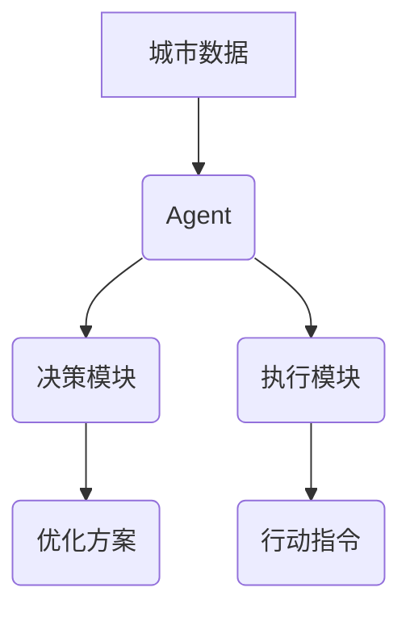
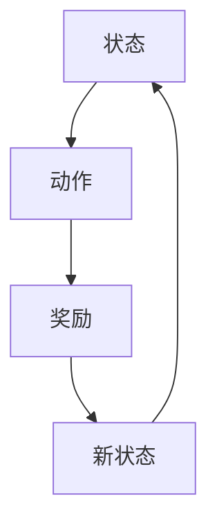
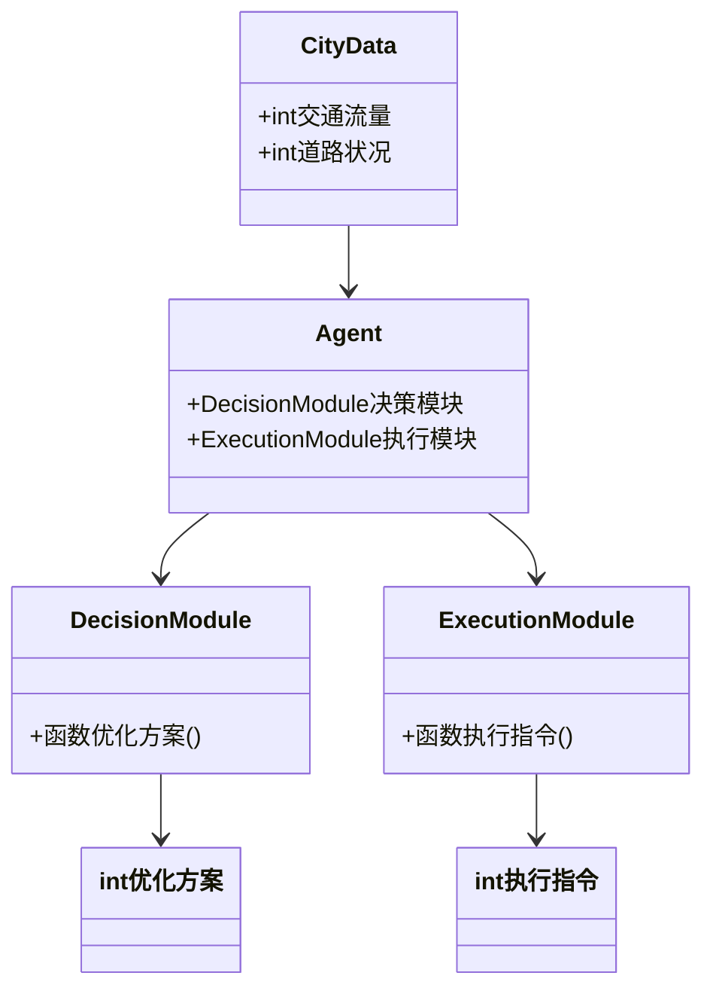
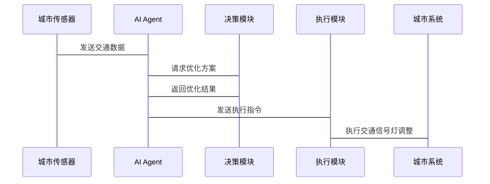

                 


# AI Agent在智能城市规划评估中的角色

**关键词**：AI Agent、智能城市规划、城市评估、算法原理、系统架构

**摘要**：  
AI Agent在智能城市规划评估中扮演着越来越重要的角色。通过分析城市数据，优化资源配置，AI Agent能够帮助城市规划师更高效地解决复杂问题。本文从AI Agent的基本概念出发，深入探讨其算法原理、系统架构，并结合实际案例，详细分析AI Agent在智能城市规划中的应用场景和优势。通过对AI Agent的感知、决策和执行机制的详细解析，本文为智能城市规划评估提供了新的思路和方法。

---

# 第1章: AI Agent与智能城市规划概述

## 1.1 AI Agent的基本概念

AI Agent（人工智能代理）是指能够感知环境、自主决策并执行任务的智能实体。它能够通过传感器获取数据，利用算法进行分析，并根据结果采取相应行动。AI Agent的核心特征包括自主性、反应性、目标导向和学习能力。

## 1.2 智能城市规划的背景与挑战

智能城市规划是通过技术手段优化城市资源的配置和利用，以提高城市的运行效率和居民生活质量。然而，传统城市规划方法依赖人工经验，存在效率低、覆盖面有限等问题。AI Agent的出现，为智能城市规划提供了新的解决方案。

## 1.3 AI Agent在智能城市规划中的角色

AI Agent在智能城市规划中主要负责数据处理、模型构建和优化决策。通过实时数据分析，AI Agent能够快速生成最优解决方案，帮助城市规划师更好地应对复杂问题。

---

# 第2章: AI Agent的核心概念与联系

## 2.1 AI Agent的核心原理

AI Agent的工作原理包括感知、决策和执行三个阶段。感知阶段通过传感器获取数据，决策阶段利用算法生成最优策略，执行阶段通过执行器将策略转化为实际操作。

## 2.2 AI Agent与相关概念的对比分析

AI Agent与传统AI、机器学习模型和规则引擎相比，具有更强的自主性和适应性。通过对比分析，可以看出AI Agent在智能城市规划中的独特优势。

## 2.3 AI Agent的实体关系图



---

# 第3章: AI Agent的算法原理

## 3.1 基于强化学习的AI Agent算法

强化学习是一种通过试错机制优化策略的算法。Q-learning算法是常用的强化学习方法，其公式如下：

$$ Q(s, a) = r + \gamma \max_{a'} Q(s', a') $$

其中，$s$是当前状态，$a$是动作，$r$是奖励，$\gamma$是折扣因子。

## 3.2 算法流程图



---

# 第4章: AI Agent的系统架构设计

## 4.1 问题场景介绍

以智能交通优化为例，AI Agent需要处理交通流量、道路状况等数据，优化交通信号灯配置。

## 4.2 系统功能设计



## 4.3 系统架构图


## 4.4 系统接口设计

通过RESTful API实现城市数据接口和决策模块的交互。

## 4.5 系统交互流程图



---

# 第5章: AI Agent的项目实战

## 5.1 智能交通优化项目

### 5.1.1 环境安装

安装Python、TensorFlow和Scikit-learn等库。

### 5.1.2 核心代码实现

```python
import numpy as np
from sklearn.model_selection import train_test_split
import tensorflow as tf

# 数据预处理
data = np.array([...])  # 交通流量数据
labels = np.array([...])  # 信号灯配置

x_train, x_test, y_train, y_test = train_test_split(data, labels, test_size=0.2)

# 模型构建
model = tf.keras.Sequential([
    tf.keras.layers.Dense(64, activation='relu'),
    tf.keras.layers.Dense(10, activation='softmax')
])

model.compile(optimizer='adam', loss='sparse_categorical_crossentropy', metrics=['accuracy'])

# 模型训练
model.fit(x_train, y_train, epochs=10, batch_size=32)
```

### 5.1.3 案例分析

通过训练好的模型，AI Agent能够优化交通信号灯配置，减少拥堵，提高交通效率。

---

# 第6章: AI Agent的最佳实践与总结

## 6.1 小结

AI Agent通过感知、决策和执行机制，显著提升了智能城市规划的效率和质量。

## 6.2 注意事项

在实际应用中，需注意数据隐私和算法的可解释性问题。

## 6.3 拓展阅读

推荐阅读《强化学习导论》和《智能系统设计》。

---

# 作者：AI天才研究院 & 禅与计算机程序设计艺术

