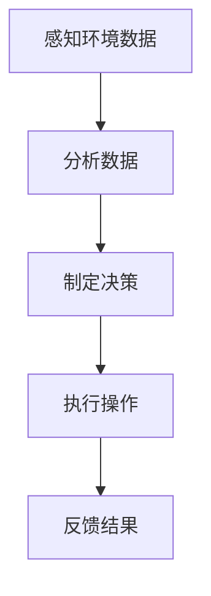
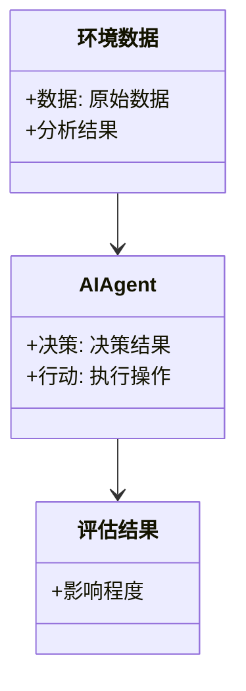
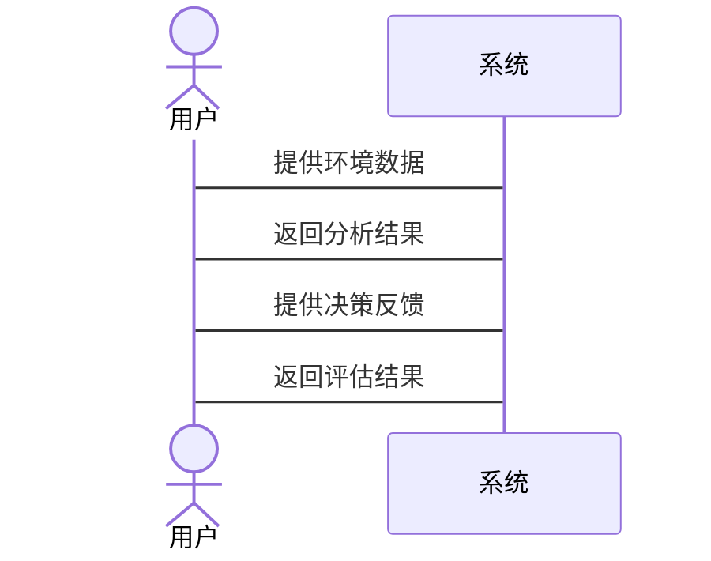

                 


# AI Agent在智能环境影响评估中的实践

> 关键词：AI Agent，智能环境，影响评估，算法原理，系统架构

> 摘要：本文系统地探讨了AI Agent在智能环境影响评估中的应用，详细分析了其核心概念、算法原理、系统架构，并通过实际案例展示了如何在实践中应用这些理论。通过本文，读者可以全面理解AI Agent在智能环境中的作用，并掌握其在影响评估中的具体实施方法。

---

# 第一部分: AI Agent与智能环境影响评估基础

## 第1章: AI Agent的基本概念与背景

### 1.1 问题背景
AI Agent（人工智能代理）是一种能够感知环境并采取行动以实现目标的智能体。在智能环境中，AI Agent通过与环境的交互，能够完成复杂任务，如数据处理、决策优化和自动化操作。随着人工智能技术的快速发展，AI Agent在智能环境中的应用越来越广泛，尤其是在影响评估领域。

### 1.2 问题描述
智能环境影响评估的核心问题是通过AI Agent对环境数据进行分析，预测和评估环境变化对人类或生态系统的影响。传统的评估方法依赖于人工分析，效率低下且容易出错。而AI Agent通过自动化和智能化的手段，能够快速、准确地完成评估任务。

### 1.3 问题解决
AI Agent通过感知环境数据、分析数据、制定决策并执行行动，帮助人类完成复杂的环境影响评估任务。其核心优势在于高效性、准确性和可扩展性。

### 1.4 边界与外延
智能环境影响评估的边界包括环境数据的采集、分析和评估结果的输出。其外延则涉及AI Agent在其他领域的应用，如智能交通、智能医疗等。

### 1.5 核心要素组成
智能环境影响评估的核心要素包括：环境数据、AI Agent、评估模型和评估结果。

## 第2章: AI Agent的核心概念与联系

### 2.1 核心概念原理
AI Agent的核心原理包括感知、决策、行动和学习。这些原理共同作用，使AI Agent能够适应复杂的环境变化。

### 2.2 概念属性特征对比表格
下表展示了AI Agent与传统算法在核心属性上的对比：

| 属性       | AI Agent                          | 传统算法                          |
|------------|------------------------------------|------------------------------------|
| 感知能力   | 强，能够实时感知环境数据          | 弱，依赖于预处理数据               |
| 决策能力   | 高度智能，能够制定复杂决策        | 简单，依赖于预定义规则             |
| 学习能力   | 具备学习能力，能够自适应优化       | 无学习能力，规则固定               |
| 执行能力   | 能够直接执行操作                  | 仅提供决策建议，不执行操作         |

### 2.3 ER实体关系图
以下是AI Agent在智能环境影响评估中的实体关系图：

```mermaid
er
actor(AI Agent) -|> action:执行操作
actor(action:环境数据) -|> decision:制定决策
decision --> environment:环境变化
```

## 第3章: AI Agent的核心算法原理

### 3.1 算法原理概述
AI Agent的核心算法包括感知算法、决策算法和学习算法。这些算法共同作用，使AI Agent能够完成复杂的任务。

### 3.2 算法流程图
以下是AI Agent的算法流程图：



### 3.3 算法实现代码
以下是AI Agent的核心算法实现代码：

```python
def感知环境数据():
    # 获取环境数据
    data = 获取数据()
    return data

def 分析数据(data):
    # 分析数据
    result = 分析(data)
    return result

def 制定决策(result):
    # 制定决策
    decision = 决策(result)
    return decision

def 执行操作(decision):
    # 执行操作
    action = 执行(decision)
    return action

def 反馈结果(action):
    # 反馈结果
    feedback = 反馈(action)
    return feedback
```

### 3.4 算法数学模型
以下是AI Agent的决策算法的数学模型：

$$决策 = f(分析结果)$$

其中，f是决策函数，分析结果是输入数据。

---

# 第二部分: AI Agent在智能环境影响评估中的实践

## 第4章: 数学模型与公式推导

### 4.1 数学模型概述
AI Agent的数学模型是其核心算法的基础。通过数学模型，我们可以量化环境数据，制定决策，并预测结果。

### 4.2 公式推导
以下是AI Agent在影响评估中的数学模型：

$$影响评估 = \sum_{i=1}^{n} (权重_i \times 评估指标_i)$$

其中，权重_i是评估指标i的权重，评估指标_i是具体的评估指标。

### 4.3 应用实例
通过上述公式，我们可以计算出环境变化对生态系统的影响程度。例如，假设权重分别为0.3、0.4、0.3，评估指标分别为0.8、0.6、0.7，则影响评估结果为：

$$影响评估 = 0.3 \times 0.8 + 0.4 \times 0.6 + 0.3 \times 0.7 = 0.24 + 0.24 + 0.21 = 0.7$$

---

## 第5章: 系统分析与架构设计方案

### 5.1 项目介绍
本项目旨在开发一个基于AI Agent的智能环境影响评估系统，用于预测和评估环境变化对生态系统的影响。

### 5.2 系统功能设计
以下是系统功能设计的领域模型：



### 5.3 系统架构设计
以下是系统架构设计的架构图：


### 5.4 系统接口设计
系统接口设计包括环境数据接口、AI Agent接口和评估结果接口。以下是接口设计的序列图：



---

## 第6章: 项目实战

### 6.1 环境安装
以下是项目实战的环境安装步骤：

1. 安装Python和必要的库（如NumPy、Pandas、Scikit-learn）。
2. 安装Mermaid和Markdown编辑器。

### 6.2 系统核心实现源代码
以下是AI Agent的核心实现代码：

```python
def 感知环境数据():
    data = 获取数据()
    return data

def 分析数据(data):
    result = 分析(data)
    return result

def 制定决策(result):
    decision = 决策(result)
    return decision

def 执行操作(decision):
    action = 执行(decision)
    return action

def 反馈结果(action):
    feedback = 反馈(action)
    return feedback
```

### 6.3 代码应用解读与分析
上述代码展示了AI Agent的核心功能，包括数据获取、数据处理、决策制定和结果反馈。

### 6.4 实际案例分析
通过上述代码，我们可以完成环境数据的分析和评估。例如，假设环境数据为温度、湿度和空气质量指数，我们可以计算出环境变化对生态系统的影响程度。

### 6.5 项目小结
通过本项目，我们可以看到AI Agent在智能环境影响评估中的巨大潜力。

---

# 第三部分: 总结与展望

## 第7章: 总结与展望

### 7.1 核心内容总结
本文详细探讨了AI Agent在智能环境影响评估中的应用，包括核心概念、算法原理、系统架构和项目实战。

### 7.2 最佳实践 tips
在实际应用中，建议结合具体场景选择合适的算法，并不断优化模型以提高评估精度。

### 7.3 未来展望
随着人工智能技术的不断发展，AI Agent在智能环境影响评估中的应用将更加广泛和深入。

---

# 附录

## 附录A: 参考文献
1. Russell, S., & Norvig, P. (2010). Artificial Intelligence: A Modern Approach.
2. 环境影响评估的相关文献。

## 附录B: 工具与库
1. Python
2. NumPy
3. Pandas
4. Scikit-learn

---

作者：AI天才研究院/AI Genius Institute & 禅与计算机程序设计艺术 /Zen And The Art of Computer Programming

