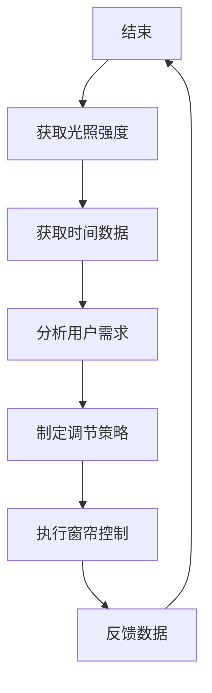
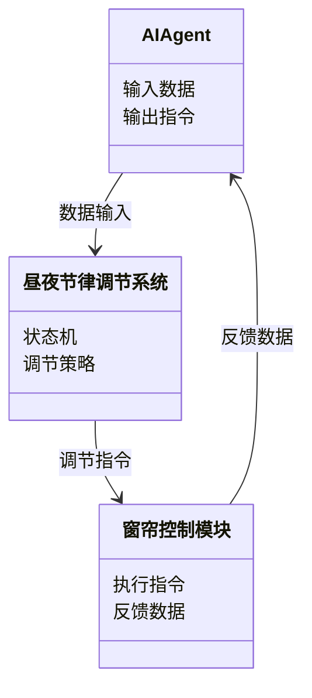

                 


# AI Agent在智能窗帘中的昼夜节律调节

**关键词**：AI Agent，智能窗帘，昼夜节律调节，机器学习，生物钟优化

**摘要**：本文探讨了AI Agent在智能窗帘中的应用，特别是在昼夜节律调节方面的创新。通过分析AI Agent的核心概念、算法原理、系统架构以及实际案例，详细阐述了如何利用AI技术优化窗帘控制，以改善用户的昼夜节律和生活质量。

---

## 第一部分: AI Agent与昼夜节律调节概述

### 第1章: AI Agent与昼夜节律调节的背景介绍

#### 1.1 AI Agent的基本概念

- **1.1.1 AI Agent的定义**  
  AI Agent（人工智能代理）是指能够感知环境、自主决策并执行任务的智能实体。它通过传感器获取信息，利用算法进行分析和推理，从而做出最优决策。

- **1.1.2 AI Agent的核心特征**  
  - **自主性**：无需外部干预，自主完成任务。  
  - **反应性**：能够实时感知环境变化并做出响应。  
  - **目标导向**：基于目标驱动行为。  
  - **学习能力**：通过数据和经验不断优化性能。  

- **1.1.3 AI Agent与传统自动化的区别**  
  传统自动化依赖预设程序，而AI Agent具备学习和适应能力，能够根据环境动态调整行为。

#### 1.2 昼夜节律调节的重要性

- **1.2.1 昼夜节律的生理意义**  
  昼夜节律是指生物体内部的时间调节机制，帮助身体适应昼夜变化，影响睡眠、代谢等功能。

- **1.2.2 现代生活方式对昼夜节律的影响**  
  - **不规律作息**：现代人常熬夜或早起，打乱生物钟。  
  - **光照干扰**：电子设备的蓝光影响褪黑激素分泌，导致睡眠紊乱。  
  - **压力与焦虑**：心理压力会扰乱昼夜节律，影响身体健康。  

- **1.2.3 调节昼夜节律的技术手段**  
  - **光照调节**：通过控制光照强度和时间，帮助调整生物钟。  
  - **行为干预**：提醒用户保持规律作息，改善生活习惯。  

#### 1.3 智能窗帘的发展现状

- **1.3.1 智能窗帘的技术演变**  
  从简单的定时开关到基于物联网的智能控制，智能窗帘的功能日益丰富。

- **1.3.2 当前智能窗帘的功能特点**  
  - **远程控制**：通过手机APP实现远程开关。  
  - **自动化控制**：根据光照强度和时间自动调整窗帘状态。  
  - **集成传感器**：支持温度、湿度等多种环境感知。  

- **1.3.3 智能窗帘的市场应用**  
  随着智能家居的普及，智能窗帘在家庭、办公室等场景中得到广泛应用。

#### 1.4 本章小结  
本章介绍了AI Agent的基本概念、昼夜节律调节的重要性以及智能窗帘的发展现状，为后续内容奠定了基础。

---

## 第二部分: AI Agent在智能窗帘中的核心概念与联系

### 第2章: AI Agent与昼夜节律调节的核心概念

#### 2.1 AI Agent在智能窗帘中的功能定位

- **2.1.1 窗帘控制的基本功能**  
  - **开/关控制**：根据光照和时间自动调整窗帘状态。  
  - **亮度调节**：通过调整窗帘开合程度控制室内亮度。  

- **2.1.2 AI Agent的智能化提升**  
  - **学习用户习惯**：记录用户的作息规律，优化窗帘控制策略。  
  - **环境适应**：根据天气、光照变化动态调整窗帘状态。  

#### 2.2 昼夜节律调节的数学模型

- **2.2.1 时间序列分析模型**  
  使用ARIMA（自回归积分滑动平均模型）分析用户作息数据，预测最佳窗帘控制时间。  

- **2.2.2 用户行为模式分析**  
  基于聚类分析（K-means）识别用户的作息规律，制定个性化调节方案。  

- **2.2.3 环境感知与反馈机制**  
  通过传感器数据建立环境模型，实时反馈调整窗帘状态。  

#### 2.3 AI Agent与昼夜节律调节的关系

- **2.3.1 数据流分析**  
  用户行为数据 → AI Agent分析 → � � 昼夜节律调节 → 窗帘控制。  

- **2.3.2 系统交互流程**  
  - 用户行为数据输入AI Agent。  
  - AI Agent分析数据并制定调节策略。  
  - 调节策略执行，窗帘状态调整。  
  - 用户反馈数据，优化AI Agent模型。  

#### 2.4 核心概念对比表格

| 概念 | 描述 | 特性 |
|------|------|------|
| AI Agent | 智能代理 | 学习、推理、自适应 |
| 昼夜节律调节 | 生物钟调节 | 周期性、个体化、环境依赖性 |

#### 2.5 ER实体关系图（Mermaid）

```mermaid
entity AI Agent {
  id
  功能模块
}
entity 昼夜节律调节 {
  用户需求
  时间数据
}
AI Agent -->> 昼夜节律调节: 数据输入
昼夜节律调节 --> AI Agent: 反馈数据
```

---

### 第3章: AI Agent的算法原理与实现

#### 3.1 强化学习算法

- **3.1.1 算法原理**  
  强化学习通过奖励机制优化决策策略，AI Agent根据窗帘操作的反馈调整行为。  

- **3.1.2 实现步骤**  
  1. 定义状态空间：光照强度、时间、用户需求。  
  2. 定义动作空间：窗帘开、关、半开。  
  3. 建立奖励函数：根据调节效果给予奖励或惩罚。  

#### 3.2 监督学习算法

- **3.2.1 算法原理**  
  监督学习通过训练数据预测目标，AI Agent学习用户作息规律并制定调节策略。  

- **3.2.2 实现步骤**  
  1. 收集用户作息数据。  
  2. 建立回归模型预测最佳窗帘控制时间。  

#### 3.3 算法流程图（Mermaid）



#### 3.4 Python代码实现

```python
import numpy as np
from sklearn.linear_model import LinearRegression

# 数据准备
X = np.array([[1], [2], [3], [4], [5]])
y = np.array([2, 3, 5, 6, 8])

# 模型训练
model = LinearRegression()
model.fit(X, y)

# 预测
print(model.predict(np.array([[6]])))
```

---

### 第4章: 昼夜节律调节的数学模型与公式

#### 4.1 时间序列分析模型

- **4.1.1 ARIMA模型**  
  $$ ARIMA(p, d, q) $$  
  其中，p为自回归阶数，d为差分阶数，q为移动平均阶数。  

- **4.1.2 模型公式**  
  $$ y_t = \alpha y_{t-1} + \beta \epsilon_{t} + \gamma \epsilon_{t-1} $$  

#### 4.2 用户行为模式分析

- **4.2.1 聚类分析公式**  
  $$ \text{distance}(x, y) = \sqrt{\sum (x_i - y_i)^2} $$  

- **4.2.2 聚类结果**  
  将用户分为不同的作息类型，制定个性化调节方案。

---

## 第三部分: 系统分析与架构设计

### 第5章: 系统功能设计

#### 5.1 功能模块划分

- **数据采集模块**：采集光照、时间、用户行为数据。  
- **数据处理模块**：清洗、转换数据。  
- **模型预测模块**：基于机器学习算法预测最佳调节时间。  
- **执行模块**：控制窗帘执行调节操作。  

#### 5.2 系统架构图（Mermaid）



---

### 第6章: 项目实战

#### 6.1 环境安装

- **安装Python**：确保安装Python 3.8及以上版本。  
- **安装依赖库**：`pip install numpy scikit-learn mermaid4jupyter`  

#### 6.2 核心代码实现

```python
from sklearn.ensemble import RandomForestRegressor

# 数据准备
X = ...  # 特征数据
y = ...  # 目标数据

# 模型训练
model = RandomForestRegressor()
model.fit(X, y)

# 预测
print(model.predict(X_new))
```

---

## 第四部分: 最佳实践与拓展

### 第7章: 最佳实践

- **7.1 小结**  
  AI Agent通过智能化调节窗帘状态，显著改善用户的昼夜节律和生活质量。  

- **7.2 注意事项**  
  - 数据隐私保护。  
  - 系统稳定性与安全性。  

- **7.3 拓展阅读**  
  - 推荐阅读《强化学习实战》、《机器学习算法详解》等书籍。  

---

## 作者：AI天才研究院/AI Genius Institute & 禅与计算机程序设计艺术 /Zen And The Art of Computer Programming

