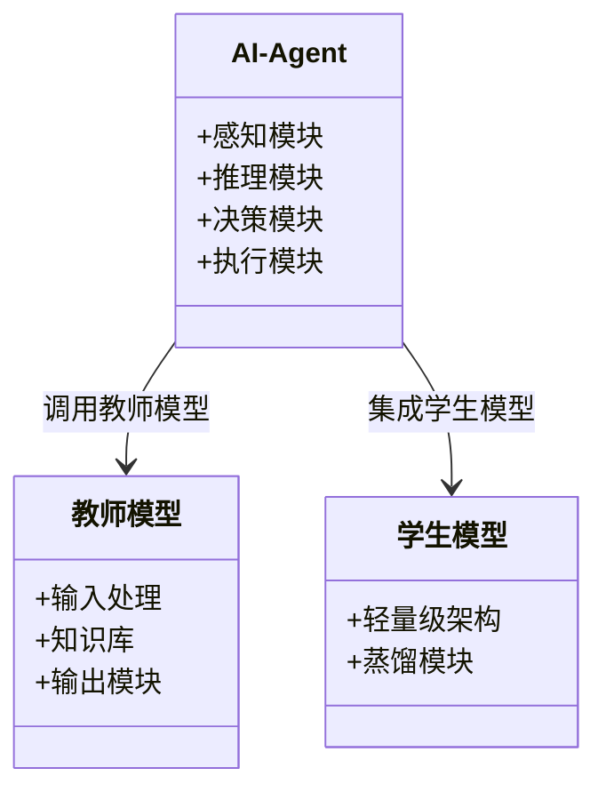
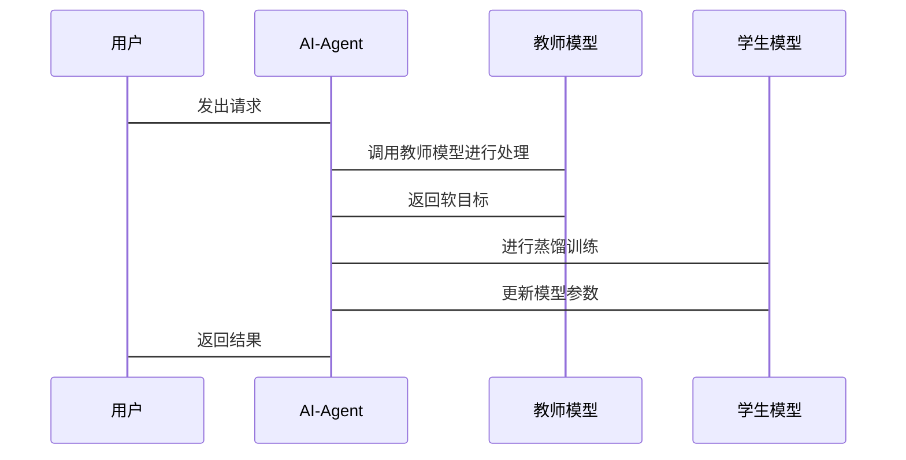

                 


# AI Agent的知识蒸馏：从大模型到轻量级应用

> 关键词：AI Agent、知识蒸馏、大模型、轻量级应用、模型压缩

> 摘要：本文详细探讨了AI Agent的知识蒸馏技术，从大模型的知识迁移到轻量级应用的实现过程。通过分析知识蒸馏的核心原理、算法实现、系统架构设计以及项目实战，本文为读者提供了一套完整的从理论到实践的解决方案，帮助读者理解并掌握如何将大模型的知识高效地蒸馏到轻量级AI Agent中。

---

## 第一部分：知识蒸馏的背景与核心概念

### 第1章：知识蒸馏的背景与问题描述

#### 1.1 知识蒸馏的背景

随着AI技术的飞速发展，大模型（如GPT、BERT等）在自然语言处理领域取得了巨大成功。然而，这些模型通常需要大量的计算资源和内存支持，难以在资源受限的环境中（如移动设备、边缘计算设备）直接部署。与此同时，轻量级应用的需求日益增长，特别是在实时响应、低延迟和高效率的场景下，如何将大模型的知识高效地迁移到轻量级模型中成为了一个重要的研究方向。

知识蒸馏作为一种模型压缩技术，旨在通过将大模型的知识迁移到小模型中，使得小模型在保持或接近大模型性能的同时，具备更小的模型规模和更快的推理速度。这种技术不仅能够降低计算成本，还能提高模型的部署灵活性，适用于各种应用场景。

---

#### 1.2 AI Agent的基本概念

AI Agent（人工智能代理）是一种能够感知环境、自主决策并执行任务的智能实体。它通常由感知模块、推理模块、决策模块和执行模块组成，能够根据环境输入做出相应的响应。AI Agent的应用场景广泛，包括智能助手、推荐系统、对话系统、自动驾驶等领域。

AI Agent的核心目标是通过智能化的方式为用户提供高效、精准的服务。然而，传统的大模型在实际应用中往往由于模型规模过大、计算资源消耗过高而难以直接部署到AI Agent中。因此，如何将大模型的知识压缩到轻量级模型中，成为实现高效AI Agent的关键问题。

---

#### 1.3 知识蒸馏的核心问题

知识蒸馏的核心问题可以归结为如何有效地将大模型的知识迁移到小模型中。具体来说，知识蒸馏需要解决以下问题：

1. **知识表示**：大模型的知识通常以复杂的参数形式存在，如何将其有效地表示为适合小模型学习的形式？
2. **知识提取**：如何从大模型中提取关键特征或决策规则，使得小模型能够快速掌握这些知识？
3. **知识融合**：如何将提取的知识与小模型的架构和任务需求相结合，确保知识的有效传递和应用？

知识蒸馏的目标是通过上述问题的解决，使得小模型在性能上接近或达到大模型的水平，同时具备轻量级的优势。

---

## 第二部分：知识蒸馏的核心概念与技术原理

### 第2章：知识蒸馏的核心原理

#### 2.1 知识蒸馏的原理

知识蒸馏的核心思想是通过教师模型（大模型）和学生模型（小模型）之间的交互，将教师模型的知识迁移到学生模型中。具体步骤如下：

1. **教师模型的输出**：教师模型对输入数据进行处理，生成软目标（Soft Labels），即概率分布形式的输出。
2. **学生模型的模仿**：学生模型通过学习教师模型的软目标，逐步掌握教师模型的知识。
3. **蒸馏损失的计算**：通过对比学生模型和教师模型的输出，计算蒸馏损失，并通过反向传播优化学生模型的参数。

知识蒸馏的关键在于如何设计有效的蒸馏策略，包括软目标的设计、蒸馏损失的计算方法以及教师模型和学生模型的协同优化。

---

#### 2.2 知识蒸馏与模型压缩的对比

知识蒸馏与模型压缩虽然都致力于降低模型规模，但两者在实现方式和目标上存在显著差异。以下是两者的对比分析：

| 对比维度       | 知识蒸馏                     | 模型压缩                     |
|----------------|------------------------------|------------------------------|
| **目标**       | 将大模型的知识迁移到小模型中 | 减小模型规模，降低计算成本   |
| **方法**       | 基于教师-学生框架，通过蒸馏损失优化学生模型 | 通过剪枝、量化等技术直接压缩模型参数 |
| **应用场景**   | 需要保持较高性能的轻量级应用   | 对计算资源要求严格的场景     |
| **优缺点**     | 优点：性能损失小；缺点：依赖教师模型 | 优点：计算效率高；缺点：性能可能显著下降 |

通过对比可以看出，知识蒸馏在保持性能的同时实现了模型的轻量化，而模型压缩则更注重直接减少模型规模，可能在性能上有所妥协。

---

## 第三部分：知识蒸馏的算法原理与实现

### 第3章：知识蒸馏的算法原理

#### 3.1 蒸馏损失函数

蒸馏损失函数是知识蒸馏的核心，用于衡量学生模型与教师模型之间的差距。常见的蒸馏损失函数包括：

1. **KL散度损失**：
   $$ L_{\text{KL}} = \text{KL}(P_{\text{teacher}} \parallel P_{\text{student}}) $$
   其中，$$P_{\text{teacher}}$$ 和 $$P_{\text{student}}$$ 分别表示教师模型和学生模型的输出概率分布。

2. **交叉熵损失**：
   $$ L_{\text{CE}} = -\sum_{i} P_{\text{teacher}}(i) \log P_{\text{student}}(i) $$

3. **加权蒸馏损失**：
   $$ L_{\text{distill}} = \alpha L_{\text{CE}} + (1-\alpha) L_{\text{KL}} $$
   其中，$$\alpha$$ 是权重系数，用于平衡交叉熵损失和KL散度损失。

#### 3.2 知识蒸馏的数学模型

知识蒸馏的数学模型通常基于教师-学生框架。假设教师模型为 $$f_T$$，学生模型为 $$f_S$$，输入数据为 $$x$$，真实标签为 $$y$$。蒸馏过程的目标是最小化蒸馏损失函数：
$$ \min_{\theta_S} \mathbb{E}_{x,y} [L_{\text{distill}}(f_T(x), f_S(x))] $$

其中，$$\theta_S$$ 是学生模型的参数。通过优化上述目标函数，学生模型能够逐步逼近教师模型的输出。

---

#### 3.3 知识蒸馏的实现步骤

1. **选择教师模型和学生模型**：教师模型通常是已经训练好的大模型，学生模型是一个轻量级的模型架构。
2. **定义蒸馏损失函数**：根据具体需求选择合适的蒸馏损失函数，并将其纳入优化目标。
3. **优化学生模型**：通过反向传播和优化算法（如Adam）更新学生模型的参数，以最小化蒸馏损失。
4. **训练与评估**：在训练数据上进行蒸馏训练，并在验证集或测试集上评估学生模型的性能。

---

## 第四部分：系统分析与架构设计方案

### 第4章：系统架构设计

#### 4.1 应用场景介绍

知识蒸馏在AI Agent中的应用场景包括：

1. **智能助手**：通过蒸馏，使得智能助手能够在移动设备上快速响应用户的查询。
2. **推荐系统**：将推荐模型蒸馏到轻量级模型中，提升推荐系统的实时性和响应速度。
3. **对话系统**：在对话系统中，蒸馏后的模型能够更高效地进行对话理解和生成。

#### 4.2 领域模型设计

以下是领域模型的类图：



---

#### 4.3 系统架构设计

以下是系统架构的Mermaid图：


---

#### 4.4 接口与交互设计

以下是系统交互的Mermaid序列图：



---

## 第五部分：项目实战

### 第5章：环境配置与核心代码实现

#### 5.1 环境配置

- Python版本：Python 3.8及以上
- 安装依赖：
  ```bash
  pip install numpy torch
  ```

---

#### 5.2 教师模型实现

```python
import torch
import torch.nn as nn
import torch.optim as optim

class TeacherModel(nn.Module):
    def __init__(self, input_size, hidden_size, output_size):
        super(TeacherModel, self).__init__()
        self.fc1 = nn.Linear(input_size, hidden_size)
        self.fc2 = nn.Linear(hidden_size, output_size)
    
    def forward(self, x):
        x = torch.relu(self.fc1(x))
        x = torch.softmax(self.fc2(x), dim=1)
        return x
```

---

#### 5.3 学生模型实现

```python
class StudentModel(nn.Module):
    def __init__(self, input_size, hidden_size, output_size):
        super(StudentModel, self).__init__()
        self.fc1 = nn.Linear(input_size, hidden_size)
        self.fc2 = nn.Linear(hidden_size, output_size)
    
    def forward(self, x):
        x = torch.relu(self.fc1(x))
        x = torch.softmax(self.fc2(x), dim=1)
        return x
```

---

#### 5.4 蒸馏过程实现

```python
def distillation_train(te

