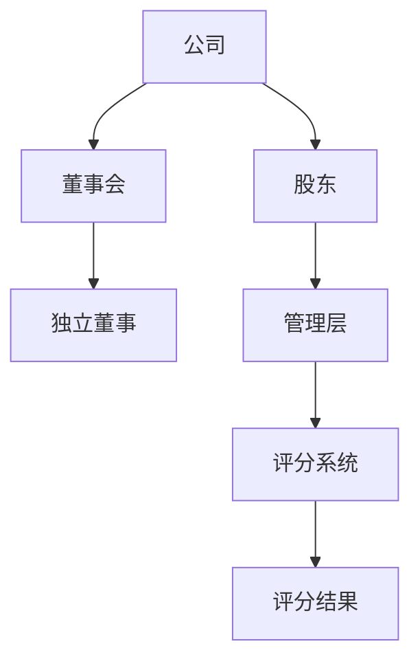
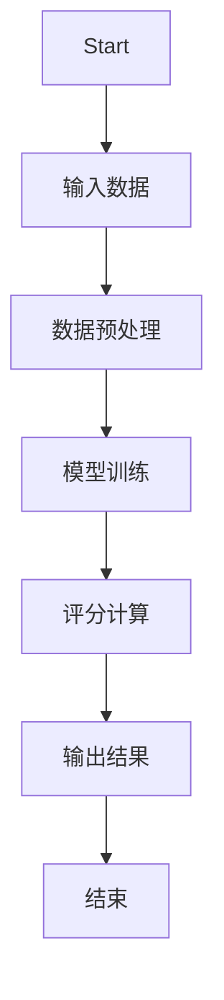

                 


# AI辅助的公司治理评分系统

## 关键词：公司治理，AI辅助，评分系统，机器学习，数据分析

## 摘要：本篇文章详细探讨了如何利用人工智能技术构建公司治理评分系统，分析了该系统的背景、核心概念、算法原理、系统架构及实际应用案例，最后总结了最佳实践。

---

# 第一部分: 公司治理评分系统背景介绍

## 第1章: 问题背景与描述

### 1.1 公司治理的核心问题

- 什么是公司治理？
  - 公司治理是通过公司章程和规则来管理公司及其利益相关者的过程。
  - 包括董事会结构、股东权利、管理层职责等方面。
- 传统公司治理评分的局限性：
  - 依赖人工评估，效率低且主观性强。
  - 数据来源单一，难以覆盖多维度信息。
  - 无法实时更新，难以应对动态变化。

### 1.2 引入AI辅助的必要性

- AI如何提升公司治理评分的准确性？
  - 利用大数据分析和机器学习模型，可以更客观地评估公司治理表现。
  - 自动化处理大量数据，提高评估效率。
  - 实时更新评分，及时反映公司治理动态。

### 1.3 系统的边界与外延

- 系统边界：
  - 输入：公司治理相关的数据（如董事会结构、股东权益、管理层行为等）。
  - 输出：公司治理评分和改进建议。
  - 输出形式：评分结果和具体的评分依据。
- 系统外延：
  - 可与其他系统（如企业风险管理、合规系统）集成，提供更全面的治理解决方案。

---

# 第二部分: 核心概念与联系

## 第2章: 公司治理评分系统的核心概念

### 2.1 评分模型原理

- 基于规则的评分模型：
  - 通过预定义的规则（如公司章程、监管要求）进行评分。
  - 优点：简单易懂，规则明确。
  - 缺点：灵活性差，难以应对复杂的治理问题。
- 基于机器学习的评分模型：
  - 利用历史数据训练模型，预测公司治理表现。
  - 优点：能够捕捉非线性关系，适应性强。
  - 缺点：需要大量数据支持，模型解释性较差。
- 混合模型：
  - 结合规则模型和机器学习模型的优点。
  - 适用于规则和数据驱动的混合场景。

### 2.2 概念属性对比表

| 概念         | 传统评分 | AI评分       |
|--------------|----------|--------------|
| 数据来源     | 文本报告 | 多维数据      |
| 处理方式     | 人工分析 | 自动化处理     |
| 评估频率     | 定期评估 | 实时评估       |
| 结果形式     | 分数 + 文本 | 分数 + 可视化解释 |

### 2.3 ER实体关系图



---

# 第三部分: 算法原理讲解

## 第3章: AI评分算法的数学模型

### 3.1 算法原理

- 基于规则的评分模型：
  - 通过预定义的规则，将每个治理要素进行打分。
  - 例如：董事会中有独立董事占比超过50%得满分，否则扣分。
- 基于机器学习的评分模型：
  - 使用逻辑回归或随机森林等算法，基于历史数据训练模型。
  - 输入特征：董事会结构、股东权益、管理层行为等。
  - 输出：公司治理评分（如0-10分）。
- 深度学习模型的应用：
  - 利用神经网络处理非结构化数据（如新闻报道、社交媒体数据）。
  - 输出：公司治理风险评分。

### 3.2 算法流程图



### 3.3 Python实现代码

```python
import pandas as pd
from sklearn.ensemble import RandomForestRegressor

# 数据预处理
data = pd.read_csv('governance_data.csv')
features = data[['board_size', 'independent_directors', 'executive_payments']]
target = data['governance_score']

# 模型训练
model = RandomForestRegressor()
model.fit(features, target)

# 评分计算
new_company = [[5, 3, 1]]
predicted_score = model.predict(new_company)
print(f"预测的治理评分为：{predicted_score[0]:.2f}")
```

---

# 第四部分: 系统分析与架构设计

## 第4章: 系统架构设计

### 4.1 系统功能设计

- 数据采集模块：
  - 从多个数据源（如公司年报、新闻媒体）获取数据。
- 数据处理模块：
  - 清洗、转换数据，提取特征。
- 评分计算模块：
  - 使用训练好的模型计算公司治理评分。
- 可视化模块：
  - 展示评分结果和改进建议。

### 4.2 系统架构图


### 4.3 系统接口设计

- API接口：
  - 输入：公司ID
  - 输出：治理评分和详细报告
  - 接口协议：RESTful API

---

# 第五部分: 项目实战

## 第5章: 项目实战

### 5.1 环境安装

```bash
pip install pandas scikit-learn
```

### 5.2 核心代码实现

```python
import pandas as pd
from sklearn.ensemble import RandomForestRegressor

# 数据加载
data = pd.read_csv('governance_data.csv')

# 特征与目标分离
X = data[['board_size', 'independent_directors', 'executive_payments']]
y = data['governance_score']

# 模型训练
model = RandomForestRegressor()
model.fit(X, y)

# 新公司的数据
new_company = [[5, 3, 1]]
score = model.predict(new_company)
print(f"预测的治理评分为：{score[0]:.2f}")
```

### 5.3 案例分析

- 案例：某科技公司
  - 数据输入：董事会规模5人，独立董事3人，高管薪酬100万。
  - 模型预测：治理评分为8.5分。
  - 分析：独立董事占比60%，高管薪酬合理，但董事会规模偏小。

---

# 第六部分: 最佳实践

## 第6章: 最佳实践

### 6.1 小结

- AI辅助的公司治理评分系统能够提高评估的效率和准确性。
- 通过结合规则和机器学习模型，可以更好地适应复杂的治理场景。

### 6.2 注意事项

- 数据质量至关重要，需确保数据来源可靠。
- 模型需定期更新，以适应新的监管要求和市场变化。
- 结果需结合具体情境解读，避免片面结论。

### 6.3 拓展阅读

- 《机器学习实战》
- 《企业风险管理》
- 《公司治理的理论与实践》

---

# 作者

作者：AI天才研究院/AI Genius Institute & 禅与计算机程序设计艺术 /Zen And The Art of Computer Programming

---

通过以上目录结构和内容安排，您可以根据需要进一步扩展每个章节的具体内容，添加更多细节和实际案例，以使文章更加丰富和实用。

