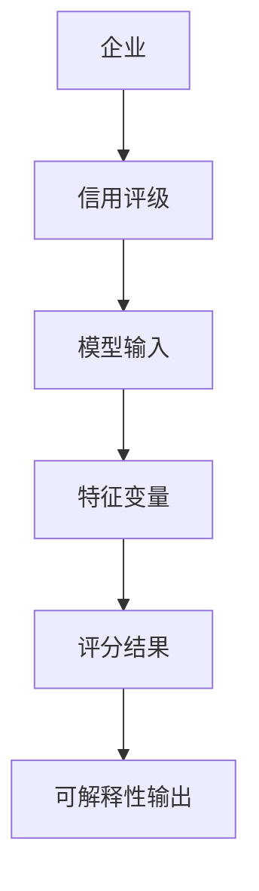
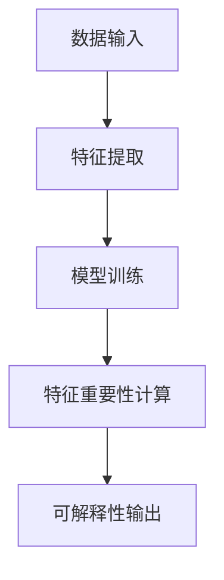
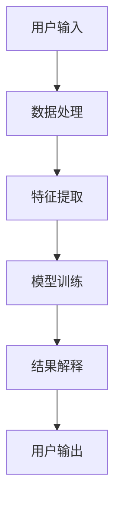

                 


# AI驱动的企业信用评级模型可解释性增强系统

## 关键词：企业信用评级、AI驱动、可解释性增强、XGBoost、SHAP值

## 摘要：本文探讨了如何利用人工智能技术增强企业信用评级模型的可解释性。通过分析传统信用评级方法的局限性，结合AI技术的优势，提出了基于XGBoost算法的信用评级模型，并详细讲解了如何通过SHAP值等方法提高模型的可解释性。本文旨在为信用评级领域提供一种高效、透明的解决方案，同时确保模型的准确性和可解释性。

---

# 第一部分：AI驱动的企业信用评级模型概述

## 第1章：企业信用评级与AI驱动的可解释性概述

### 1.1 企业信用评级的背景与意义

#### 1.1.1 传统企业信用评级的局限性
传统的信用评级方法依赖于人工分析和经验判断，存在主观性强、效率低、难以量化等问题。随着企业规模的扩大和金融市场的复杂化，传统方法难以满足现代信用评级的需求。

#### 1.1.2 AI技术在信用评级中的应用优势
人工智能技术（AI）通过大数据分析和机器学习算法，能够快速处理海量数据，发现传统方法难以察觉的模式和规律。AI技术的应用可以提高信用评级的准确性和效率，同时减少人为错误。

#### 1.1.3 可解释性增强的重要性
在信用评级中，可解释性是信任和合规的重要基础。用户需要了解模型是如何做出决策的，尤其是在金融领域，可解释性是监管合规和用户信任的关键因素。

### 1.2 问题背景与描述

#### 1.2.1 信用评级中的主要问题
- 数据的复杂性和多样性
- 模型的黑箱特性导致决策缺乏透明性
- 需要满足监管要求和用户信任

#### 1.2.2 可解释性不足的挑战
- 用户难以理解模型的决策过程
- 监管机构难以验证模型的合规性
- 可能导致决策的不公正性

#### 1.2.3 问题解决的目标与边界
目标：构建一个基于AI的信用评级模型，同时增强其可解释性。
边界：仅关注模型的可解释性增强，不涉及模型的部署和实际应用环境。

## 第2章：可解释性增强的核心概念与原理

### 2.1 核心概念与联系

#### 2.1.1 可解释性增强的定义与属性
可解释性增强是指通过技术手段，使模型的决策过程更加透明和易于理解。其关键属性包括：
- 透明性：用户能够理解模型的决策过程
- 可追溯性：能够追溯模型决策的依据
- 可验证性：能够验证模型决策的正确性

#### 2.1.2 实体关系图（ER图）的构建



### 2.2 算法原理与流程

#### 2.2.1 基于特征重要性的可解释性增强算法
特征重要性是衡量模型中各个特征对预测结果影响程度的一种方法。通过分析特征重要性，可以了解哪些特征对模型的决策起关键作用。

#### 2.2.2 SHAP值的计算与应用
SHAP（Shapley Additive exPlanations）是一种用于解释模型预测结果的工具。它通过分解模型的预测结果，展示每个特征对最终预测的贡献度。

---

# 第二部分：基于XGBoost的信用评级模型构建

## 第3章：算法原理与流程

### 3.1 算法原理与流程

#### 3.1.1 XGBoost算法的基本原理
XGBoost是一种基于树的集成算法，通过构建多个弱模型（如决策树）的组合，提高模型的准确性和鲁棒性。其核心思想是通过贪心算法逐步优化损失函数，从而找到最优的树结构。

#### 3.1.2 SHAP值的计算与应用
通过XGBoost模型，可以计算每个特征的SHAP值，从而了解每个特征对最终预测结果的贡献程度。

### 3.2 数学模型与公式

#### 3.2.1 XGBoost损失函数
$$\text{损失函数} = \sum_{i=1}^{n} \left( y_i - \hat{y}_i \right)^2$$

#### 3.2.2 SHAP值公式
$$\text{SHAP值} = \phi_i = \text{贡献度} = \text{预测值} - \text{基线值}$$

### 3.3 项目实战与案例分析

#### 3.3.1 环境安装与数据准备
首先安装必要的Python库，如XGBoost和Shap：
```bash
pip install xgboost shap
```

#### 3.3.2 模型实现与代码解读

```python
import xgboost as xgb
import shap

# 数据准备
X_train, y_train = load_data()

# 模型训练
model = xgb.XGBClassifier()
model.fit(X_train, y_train)

# SHAP值计算
shap_values = shap.explain_model(model, X_test)
```

#### 3.3.3 案例分析与结果解读
通过计算SHAP值，可以清晰地看到每个特征对信用评级结果的贡献程度。例如，某企业的销售收入和资产负债率对评级结果的影响较大，而行业因素影响较小。

---

# 第三部分：系统架构与设计方案

## 第4章：系统架构与设计方案

### 4.1 项目背景与目标

#### 4.1.1 项目背景
随着金融市场的复杂化，企业信用评级需要更加高效和透明的解决方案。通过AI技术，可以实现信用评级的自动化和智能化。

#### 4.1.2 项目目标
构建一个基于AI的信用评级模型，同时增强其可解释性，满足监管要求和用户信任。

### 4.2 系统架构设计

#### 4.2.1 系统功能设计
- 数据输入与处理
- 特征提取与选择
- 模型训练与优化
- 可解释性增强

#### 4.2.2 系统架构图



### 4.3 接口设计与交互

#### 4.3.1 系统接口设计
- 输入接口：企业数据输入
- 输出接口：信用评级结果及可解释性报告

#### 4.3.2 系统交互流程



---

# 第四部分：项目实战与案例分析

## 第5章：项目实战与案例分析

### 5.1 环境安装与数据准备
安装必要的Python库，如XGBoost和Shap，准备企业信用评级相关数据。

### 5.2 模型实现与代码解读
编写代码实现信用评级模型，并使用SHAP值解释模型的决策过程。

### 5.3 案例分析与结果解读
通过具体案例分析，展示模型的预测结果及其可解释性，验证模型的有效性和透明性。

---

# 第五部分：总结与展望

## 第6章：总结与展望

### 6.1 最佳实践与注意事项
- 数据质量是模型准确性的关键
- 模型调优是提高性能的重要步骤
- 持续监控和更新模型是保持其有效性的必要条件

### 6.2 项目小结
本文通过构建基于XGBoost的信用评级模型，并结合SHAP值等技术，成功实现了模型的可解释性增强，为信用评级领域提供了一种高效、透明的解决方案。

### 6.3 展望与扩展阅读
未来的研究方向可以包括：
- 更高级别的可解释性技术
- 多模态数据的融合应用
- 模型的实时更新与优化

---

作者：AI天才研究院 & 禅与计算机程序设计艺术

