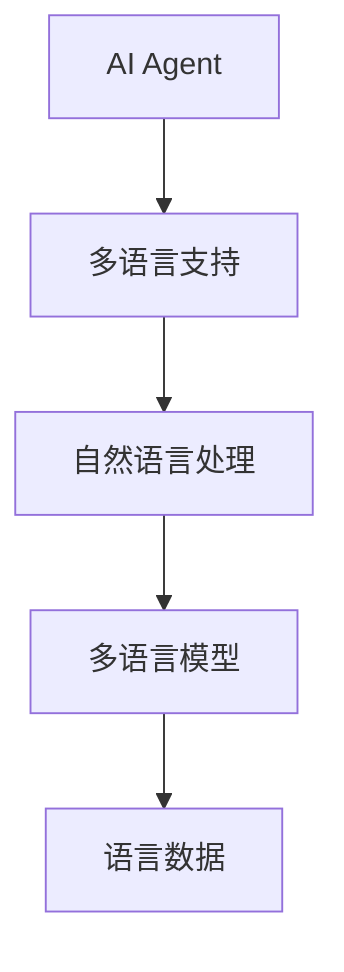
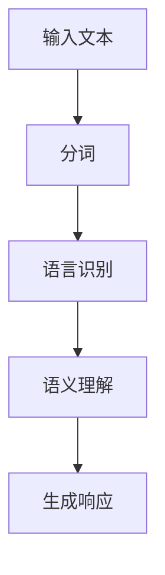
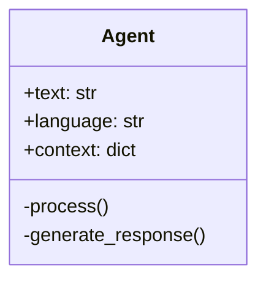
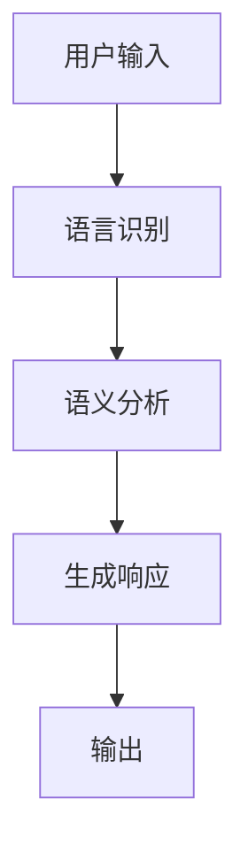
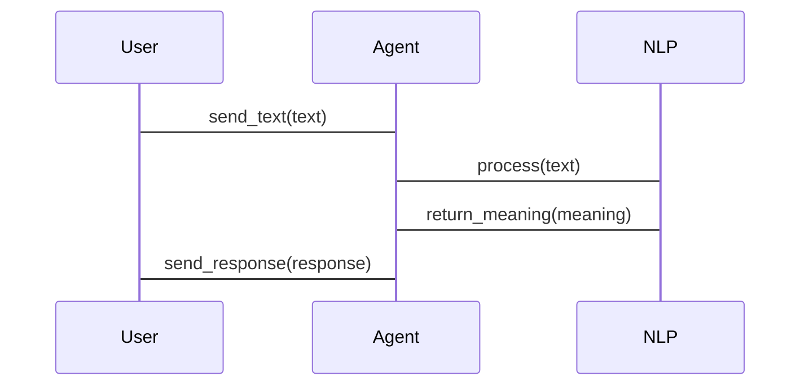

                 


# 实现AI Agent的多语言支持

> 关键词：AI Agent, 多语言支持, 自然语言处理, 多语言模型, 语言识别, 语义理解, 跨语言处理

> 摘要：本文详细探讨了实现AI Agent多语言支持的核心技术与实现方法。从多语言支持的重要性、核心概念、算法原理到系统架构设计，再到项目实战，系统地分析了AI Agent实现多语言支持的各个方面，最后给出了最佳实践和总结。

---

## 第一部分: AI Agent的多语言支持背景与概念

### 第1章: 多语言支持在AI Agent中的重要性

#### 1.1 问题背景与描述

- **AI Agent的基本概念**  
  AI Agent是一种智能代理，能够感知环境、理解用户需求并执行任务。在现代应用场景中，AI Agent需要支持多种语言交互，以满足全球用户的需求。

- **多语言支持的需求场景**  
  - 全球化服务：AI Agent需要服务于不同语言背景的用户。  
  - 多语言对话：支持用户使用不同语言进行交流。  
  - 多语言内容处理：处理多种语言的文本、语音和语义信息。

- **当前AI Agent多语言支持的挑战**  
  - 不同语言的语义差异大。  
  - 多语言模型的训练和推理复杂度高。  
  - 多语言支持需要兼顾性能和准确性。

#### 1.2 多语言支持的核心概念

- **多语言支持的定义与范围**  
  多语言支持是指AI Agent能够理解和生成多种语言的文本或语音内容，并在不同语言之间进行语义转换和交互。

- **多语言支持与NLP的关系**  
  多语言支持依赖于自然语言处理（NLP）技术，包括语言识别、分词、句法分析、语义理解等。

- **多语言支持的边界与外延**  
  - 边界：专注于语言处理的核心功能。  
  - 外延：扩展至跨语言推理、情感分析等高级功能。

### 第2章: 多语言支持的核心概念与联系

#### 2.1 多语言NLP模型的原理

- **多语言模型的原理**  
  多语言模型通过共享不同语言的特征和语义信息，同时保留每种语言的独特性，实现跨语言处理。

- **多语言支持的实现机制**  
  - 语言嵌入（Language Embedding）：将不同语言的文本映射到共享的嵌入空间。  
  - 跨语言注意力机制（Cross-Lingual Attention）：在多语言上下文中关注相关语言信息。  
  - 跨语言模型训练：使用多语言数据进行联合训练，提升模型的通用性。

#### 2.2 多语言支持的核心概念属性对比表

| 特性                | 单语言支持        | 多语言支持         |
|---------------------|-------------------|--------------------|
| 语言覆盖范围         | 仅支持一种语言     | 支持多种语言         |
| 语义理解能力         | 高                | 较低（依赖跨语言模型） |
| 性能优化难度         | 较低              | 较高               |
| 模型训练数据量       | 较小              | 较大               |
| 适用场景             | 本地化场景         | 全球化场景           |

#### 2.3 ER实体关系图



---

## 第二部分: 多语言支持的算法原理

### 第3章: 多语言NLP算法流程图



#### 3.2 算法实现代码

```python
def multi_language_process(text):
    language = detect_language(text)
    tokens = tokenize(text, language)
    meaning = semantic_analysis(tokens, language)
    return generate_response(meaning, language)
```

#### 3.3 数学模型与公式

- **语言模型的概率公式**  
  $$ P(w_i|w_{i-1},...,w_1) $$

- **多语言模型的联合概率**  
  $$ P(w_i|w_{i-1},...,w_1, lang) $$

---

## 第三部分: 系统分析与架构设计

### 第4章: 系统功能设计

#### 4.1 用户需求分析

- **用户需求**  
  - 支持多种语言的文本输入和输出。  
  - 实现跨语言对话和信息处理。  
  - 提供高精度的语义理解和生成能力。

#### 4.2 功能模块划分

- **功能模块**  
  - 语言识别模块：检测输入文本的语言。  
  - 分词模块：对文本进行分词处理。  
  - 语义理解模块：分析文本的语义信息。  
  - 响应生成模块：根据语义生成响应文本。

#### 4.3 领域模型类图



### 第5章: 系统架构设计

#### 5.1 系统架构图



#### 5.2 系统接口设计与交互



---

## 第四部分: 项目实战

### 第6章: 项目实战

#### 6.1 环境安装与配置

- **安装依赖**  
  ```bash
  pip install transformers sentencepiece langdetect
  ```

- **配置语言模型**  
  使用预训练的多语言模型，如BERT-MultiLang。

#### 6.2 系统核心实现源代码

```python
from transformers import AutoTokenizer, AutoModelForMaskedLM
import langdetect

def detect_language(text):
    return langdetect.detect_lang(text)

def tokenize(text, language):
    tokenizer = AutoTokenizer.from_pretrained("bert-base-multilingual-cased")
    return tokenizer(text, return_tensors="np")

def semantic_analysis(tokens, language):
    model = AutoModelForMaskedLM.from_pretrained("bert-base-multilingual-cased")
    # 实现语义分析逻辑
    return {"meaning": "示例语义输出"}

def generate_response(meaning, language):
    # 根据语义生成响应
    return f"您说的内容是：{meaning['meaning']}"
```

#### 6.3 案例分析与详细解读

- **案例分析**  
  用户输入：“Hello, how are you?”  
  - 语言识别：英语。  
  - 分词：["Hello", ", how are you?"]  
  - 语义理解：问候语。  
  - 响应生成：您好！我很好，谢谢。

---

## 第五部分: 总结与展望

### 第7章: 总结与展望

#### 7.1 总结

- **核心内容回顾**  
  本文详细探讨了AI Agent实现多语言支持的核心技术，包括多语言NLP模型、算法流程、系统架构设计和项目实战。

#### 7.2 当前挑战与未来展望

- **当前挑战**  
  - 多语言模型的训练数据量大且复杂。  
  - 跨语言推理能力有待提升。  
  - 性能优化与准确性之间存在权衡。

- **未来展望**  
  - 更多语言的支持与优化。  
  - 增强模型的跨语言推理能力。  
  - 提升多语言模型的实时性和响应速度。

### 7.3 最佳实践 tips

- **实践建议**  
  - 选择合适的多语言NLP模型。  
  - 充分利用预训练模型和开源工具。  
  - 定期优化模型和系统架构。  
  - 关注学术研究和技术发展。

---

## 作者：AI天才研究院/AI Genius Institute & 禅与计算机程序设计艺术 /Zen And The Art of Computer Programming

