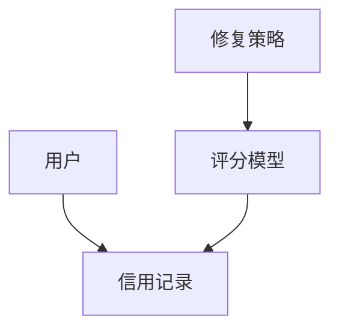
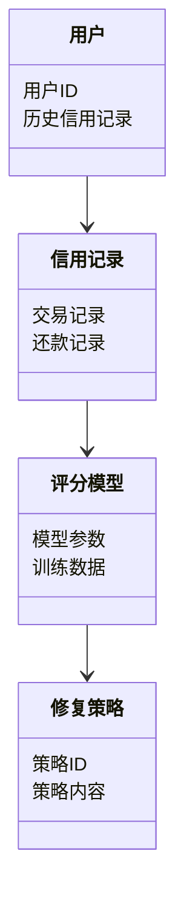
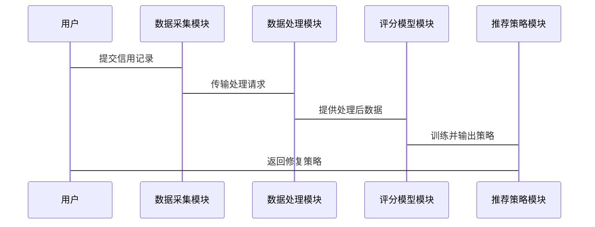

                 


```markdown
# 智能个人信用修复策略推荐系统

## 关键词：智能信用修复，推荐系统，信用评估，机器学习，个人信用管理

## 摘要：  
本文将探讨智能个人信用修复策略推荐系统的构建与实现。通过分析信用评估的核心概念、修复策略推荐机制以及相关算法原理，本文旨在为个人用户提供一种高效、个性化的信用修复方案。结合实际应用场景，本文将详细阐述系统设计、实现过程及案例分析，最终为读者提供一套可行的智能信用修复解决方案。

---

## 第一部分：智能个人信用修复策略推荐系统的背景与核心概念

### 第1章：信用评估与修复的背景介绍

#### 1.1 信用评估的基本概念
- 1.1.1 信用评估的定义与作用  
- 1.1.2 信用评分模型的演变  
- 1.1.3 个人信用修复的必要性  

#### 1.2 智能信用修复的背景与现状
- 1.2.1 传统信用修复方式的局限性  
- 1.2.2 智能技术在信用修复中的应用  
- 1.2.3 当前信用修复领域的痛点与挑战  

#### 1.3 智能个人信用修复系统的意义
- 1.3.1 提高信用修复效率  
- 1.3.2 降低信用修复成本  
- 1.3.3 促进个人信用健康发展的价值  

### 第2章：智能个人信用修复系统的核心概念

#### 2.1 信用评分模型的原理与特征
- 2.1.1 信用评分模型的原理  
- 2.1.2 不同评分模型的特征对比  
- 2.1.3 模型选择的关键因素  

#### 2.2 修复策略推荐机制
- 2.2.1 修复策略的定义与分类  
- 2.2.2 策略推荐的核心要素  
- 2.2.3 策略推荐的实现方式  

#### 2.3 智能推荐系统的构成
- 2.3.1 数据采集与处理  
- 2.3.2 算法选择与优化  
- 2.3.3 系统输出与反馈机制  

### 第3章：核心概念与联系

#### 3.1 核心概念的原理
- 3.1.1 信用评分模型的数学表达  
- 3.1.2 修复策略推荐的算法逻辑  

#### 3.2 概念属性特征对比表格
| 概念       | 特征1 | 特征2 | 特征3 |
|------------|-------|-------|-------|
| 评分模型A  | 特性A1| 特性A2| 特性A3|
| 评分模型B  | 特性B1| 特性B2| 特性B3|
| ...        | ...   | ...   | ...   |

#### 3.3 ER实体关系图架构


---

## 第二部分：算法原理讲解

### 第4章：推荐算法原理

#### 4.1 协同过滤算法
- 4.1.1 基于用户的协同过滤  
- 4.1.2 基于物品的协同过滤  

#### 4.2 基于内容的推荐算法
- 4.2.1 内容特征提取  
- 4.2.2 相似度计算  

#### 4.3 混合推荐模型
- 4.3.1 混合推荐的优势  
- 4.3.2 混合推荐的实现步骤  

#### 4.4 算法实现步骤
1. 数据预处理  
2. 特征提取  
3. 模型训练  
4. 推荐结果输出  

#### 4.5 数学公式与代码实现
- 4.5.1 协同过滤的相似度计算公式：
  $$ sim(i,j) = \frac{\sum_{k} (r_{i,k} - \bar{r_i})(r_{j,k} - \bar{r_j})}{\sqrt{\sum_{k} (r_{i,k} - \bar{r_i})^2} \cdot \sqrt{\sum_{k} (r_{j,k} - \bar{r_j})^2}} $$

- 4.5.2 Python代码示例：
```python
import numpy as np

def compute_similarity(user_items, user_avg):
    # 计算用户i和j的相似度
    numerator = np.sum((user_items[i] - user_avg[i]) * (user_items[j] - user_avg[j]))
    denominator = np.sqrt(np.sum((user_items[i] - user_avg[i])**2)) * np.sqrt(np.sum((user_items[j] - user_avg[j])**2))
    return numerator / denominator
```

---

## 第三部分：系统分析与架构设计方案

### 第5章：系统应用场景与功能设计

#### 5.1 系统应用场景
- 5.1.1 个人信用评估  
- 5.1.2 修复策略推荐  
- 5.1.3 系统反馈优化  

#### 5.2 系统功能设计
- 5.2.1 数据采集与处理  
- 5.2.2 模型训练与优化  
- 5.2.3 策略推荐与展示  

#### 5.3 领域模型类图


### 第6章：系统架构设计

#### 6.1 系统架构设计
- 6.1.1 分层架构设计  
- 6.1.2 模块划分与职责  

#### 6.2 系统接口设计
- 6.2.1 数据接口  
- 6.2.2 推荐接口  

#### 6.3 系统交互流程图


---

## 第四部分：项目实战

### 第7章：项目实战与案例分析

#### 7.1 环境搭建
- 7.1.1 安装Python与相关库  
- 7.1.2 数据集准备  

#### 7.2 核心代码实现
- 7.2.1 数据预处理代码  
- 7.2.2 模型训练代码  
- 7.2.3 推荐系统实现  

#### 7.3 实际案例分析
- 7.3.1 案例背景  
- 7.3.2 系统输出结果  
- 7.3.3 结果分析与解读  

---

## 第五部分：总结与展望

### 第8章：总结与展望

#### 8.1 系统总结
- 8.1.1 系统优势  
- 8.1.2 系统不足  

#### 8.2 未来展望
- 8.2.1 模型优化方向  
- 8.2.2 新功能扩展  

#### 8.3 最佳实践Tips
- 数据隐私保护建议  
- 模型调优技巧  
- 系统部署注意事项  

---

## 作者：AI天才研究院 & 禅与计算机程序设计艺术
```

