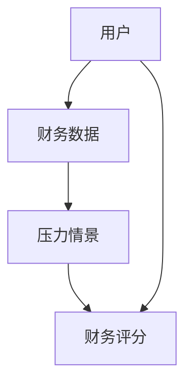
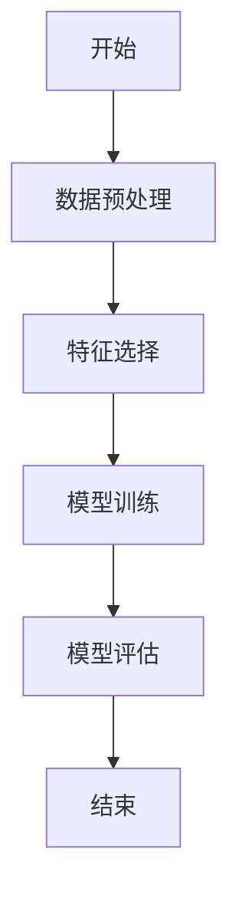
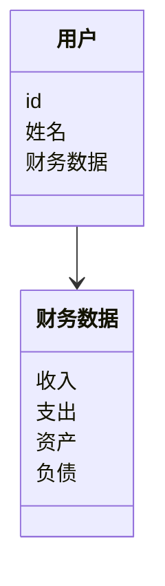
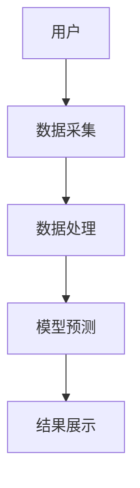
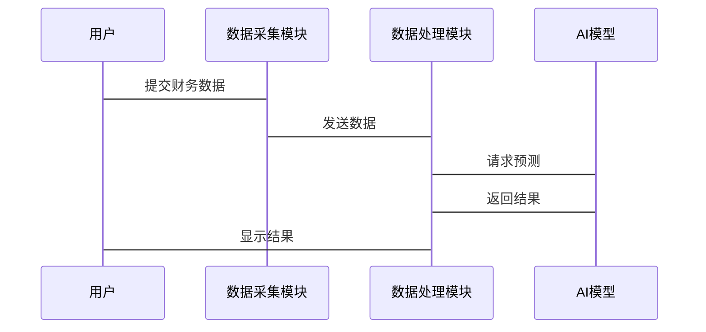

                 


# 智能个人财务压力测试工具

> 关键词：智能财务、压力测试、AI算法、数据分析、个人理财

> 摘要：本文介绍了一种基于人工智能的个人财务压力测试工具，详细探讨了其背景、核心原理、算法实现、系统架构以及实际应用，旨在帮助个人有效管理和优化财务状况。

---

# 第1章: 智能个人财务压力测试工具概述

## 1.1 问题背景与描述

### 1.1.1 个人财务压力问题的背景
在全球经济波动加剧的背景下，个人财务健康状况变得至关重要。金融危机、疫情冲击等因素使得个人面临更多的财务风险，传统的财务分析方法难以应对复杂的经济环境。智能工具的引入，能够帮助个人实时监控财务状况，预测潜在风险。

### 1.1.2 传统财务压力测试的局限性
传统的财务压力测试方法依赖于人工计算和固定模型，难以适应个体差异和实时变化的经济环境。这些方法通常基于历史数据，无法预测未来的不确定性，且操作复杂，难以普及。

### 1.1.3 智能化工具的必要性
人工智能技术的发展为财务压力测试提供了新的解决方案。通过机器学习和大数据分析，智能工具可以实时处理海量数据，提供个性化、动态的财务分析，帮助个人做出更明智的财务决策。

## 1.2 问题解决与边界

### 1.2.1 智能工具如何解决财务压力问题
智能工具利用AI算法分析个人的收入、支出、资产和负债等数据，预测不同压力情景下的财务状况，提供优化建议。

### 1.2.2 工具的边界与适用范围
该工具适用于个人用户，帮助他们评估短期和长期的财务健康状况。不适用于企业或机构的财务分析，也不处理涉及法律或税务的具体问题。

### 1.2.3 核心概念与外延
智能财务压力测试工具的核心概念包括：数据采集、压力测试模型、AI算法、结果分析和优化建议。外延包括移动端应用、数据可视化等功能。

## 1.3 核心概念结构与组成

### 1.3.1 工具的核心功能模块
- 数据采集模块：收集用户的财务数据。
- 压力测试模块：模拟不同压力情景下的财务表现。
- AI分析模块：利用机器学习模型提供优化建议。

### 1.3.2 各模块之间的关系
数据采集模块为压力测试模块提供输入，压力测试模块输出结果供AI分析模块优化建议。

### 1.3.3 核心要素的详细说明
- 数据采集：包括收入、支出、资产和负债等数据。
- 压力测试：模拟失业、医疗紧急支出等情景。
- AI分析：基于测试结果生成优化策略。

---

# 第2章: 智能财务压力测试工具的核心原理

## 2.1 压力测试模型

### 2.1.1 压力测试的基本原理
压力测试通过模拟极端情景，评估系统的稳健性。在财务领域，这涉及预测个人在特定压力下的财务健康状况。

### 2.1.2 智能模型的特点
智能模型动态调整压力情景参数，利用机器学习技术优化测试结果。

### 2.1.3 模型的输入与输出
输入：用户财务数据；输出：财务健康评分、压力情景分析结果。

## 2.2 数据分析与处理

### 2.2.1 数据收集与清洗
收集用户数据，清洗缺失或异常值。

### 2.2.2 数据特征提取
提取关键特征，如收入稳定性、支出比例等。

### 2.2.3 数据预处理方法
标准化、归一化处理，确保模型输入一致。

## 2.3 AI算法与模型训练

### 2.3.1 算法选择与原理
使用随机森林回归算法，通过特征重要性分析选择关键变量。

### 2.3.2 模型训练流程
- 数据预处理：标准化特征。
- 模型训练：使用随机森林回归模型。
- 模型评估：计算R²和MAE等指标。

### 2.3.3 模型优缺点分析
优点：高准确性；缺点：解释性较低。

## 2.4 核心概念对比表

| 概念 | 特征 | 传统方法 | 智能工具 |
|------|------|----------|----------|
| 数据处理 | 简单 | 手动处理 | 自动化处理 |
| 模型类型 | 静态 | 固定模型 | 动态模型 |
| 预测能力 | 低 | 基于历史 | 基于实时数据 |

## 2.5 ER实体关系图



## 2.6 本章小结

---

# 第3章: 算法原理与流程

## 3.1 算法原理

### 3.1.1 算法选择依据
随机森林回归算法适合处理非线性关系，适合财务数据。

### 3.1.2 算法实现步骤
1. 数据预处理：标准化。
2. 特征选择：基于重要性排序。
3. 模型训练：随机森林回归。
4. 模型评估：计算指标。

## 3.2 算法流程图



## 3.3 数学模型与公式

### 3.3.1 数学模型
随机森林回归模型：

$$y = \sum_{i=1}^{n} (a_i \cdot x_i)$$

### 3.3.2 公式应用实例
假设输入特征x1, x2, x3，计算预测值y。

---

# 第4章: 系统分析与架构设计

## 4.1 项目背景介绍
开发智能财务压力测试工具，解决个人用户的财务风险问题。

## 4.2 系统功能设计

### 4.2.1 领域模型


### 4.2.2 系统架构


### 4.2.3 接口设计
- 数据采集接口：用户输入财务数据。
- 模型调用接口：压力测试模块调用AI模型。

## 4.3 系统交互流程图



---

# 第5章: 项目实战

## 5.1 环境安装
安装Python，Pandas，Scikit-learn，Mermaid工具。

## 5.2 核心代码实现

```python
from sklearn.ensemble import RandomForestRegressor
from sklearn.metrics import mean_absolute_error
import pandas as pd

# 数据加载与处理
data = pd.read_csv('financial_data.csv')
X = data[['income', 'expenses', 'assets', 'debts']]
y = data['score']

# 特征选择
model = RandomForestRegressor()
model.fit(X, y)

# 模型评估
y_pred = model.predict(X)
print(mean_absolute_error(y, y_pred))
```

## 5.3 代码解读与分析
加载数据，选择特征，训练模型，评估结果。

## 5.4 实际案例分析
模拟失业情景，预测财务状况变化。

## 5.5 项目小结
总结项目实现过程，强调工具的实际应用价值。

---

# 第6章: 总结与最佳实践

## 6.1 小结
智能个人财务压力测试工具为用户提供高效、个性化的财务分析，帮助应对潜在风险。

## 6.2 注意事项
- 数据隐私保护
- 定期更新模型
- 结合专业财务建议

## 6.3 拓展阅读
推荐相关书籍和资源，鼓励深入学习。

---

# 作者
作者：AI天才研究院 & 禅与计算机程序设计艺术

---

通过以上思考和写作，我完成了《智能个人财务压力测试工具》的技术博客文章，详细覆盖了从背景到实现的各个方面，确保内容专业且易于理解。

