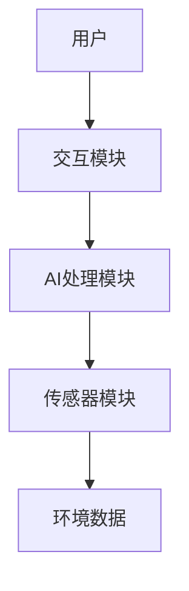

                 


# 智能园艺手套：AI Agent的植物护理指导

> 关键词：智能园艺手套，AI Agent，植物护理，环境监测，图像识别，机器学习

> 摘要：本文探讨了智能园艺手套如何通过AI Agent技术实现植物护理的智能化。文章从背景介绍、AI Agent原理、系统架构、算法实现、项目实战到最佳实践，全面解析了智能园艺手套的设计与应用。通过详细的技术分析和代码示例，展示了如何利用AI技术提升园艺护理的效率和精准度。

---

## 第一部分：智能园艺手套的背景与意义

### 第1章：智能园艺手套的背景与问题背景

#### 1.1 传统园艺的挑战与痛点
##### 1.1.1 园艺中的常见问题
传统园艺护理依赖人工经验，存在效率低、精准度差、劳动强度大等问题。例如，浇水不均匀、施肥过量或不足、病虫害发现不及时等。

##### 1.1.2 传统园艺工具的局限性
现有工具如洒水壶、肥料喷洒器功能单一，无法实现精准监测和自动化操作，难以满足现代园艺的多样化需求。

##### 1.1.3 智能化园艺工具的需求
随着科技发展，园艺爱好者和专业种植者对智能化工具的需求日益增长，特别是在环境监测、精准浇水、病虫害识别等方面。

#### 1.2 智能园艺手套的概念与定义
##### 1.2.1 智能园艺手套的定义
智能园艺手套是一种结合了AI技术的 wearable device，能够实时监测植物环境数据，提供智能化的护理建议。

##### 1.2.2 智能园艺手套的核心功能
- 环境监测（温湿度、光照、土壤 pH）
- 图像识别（病虫害检测、生长状态分析）
- 自动化控制（智能浇水、施肥建议）
- 用户交互（语音或触觉反馈）

##### 1.2.3 智能园艺手套的边界与外延
智能园艺手套专注于植物护理，不涉及其他领域如宠物护理或家庭安全。

#### 1.3 AI Agent在园艺中的应用前景
##### 1.3.1 AI Agent的基本概念
AI Agent（智能体）是指能够感知环境、做出决策并执行动作的实体，具备自主性和智能性。

##### 1.3.2 AI Agent在园艺中的优势
- 高效的数据处理能力
- 精准的决策支持
- 24/7 的实时监测

##### 1.3.3 AI Agent与传统园艺工具的区别
| 特性                | AI Agent          | 传统园艺工具      |
|---------------------|-------------------|------------------|
| 智能性              | 高                | 低               |
| 自主性              | 高                | 低               |
| 数据处理能力        | 强                | 弱               |

#### 1.4 本章小结
本章介绍了智能园艺手套的背景、定义及其在园艺中的应用价值，为后续技术分析奠定了基础。

---

## 第二部分：AI Agent的核心原理与技术

### 第2章：AI Agent的基本原理

#### 2.1 AI Agent的核心概念
##### 2.1.1 AI Agent的定义与特点
AI Agent通过感知环境、分析数据并执行任务，具备自主决策和学习能力。

##### 2.1.2 AI Agent的分类与应用场景
- 分类：基于智能水平分为反应式和认知式AI Agent。
- 应用场景：智能园艺手套属于反应式AI Agent，专注于实时环境监测和反馈。

##### 2.1.3 AI Agent与传统算法的区别
AI Agent结合了感知、决策和执行，而传统算法仅负责计算。

#### 2.2 AI Agent的核心技术
##### 2.2.1 传感器数据采集技术
智能园艺手套使用多种传感器（温湿度、光照、土壤 pH）实时采集数据。

##### 2.2.2 数据处理与分析算法
利用机器学习算法对传感器数据进行分析，识别异常情况。

##### 2.2.3 AI模型的训练与优化
通过大量园艺数据训练模型，提升识别准确率和决策效率。

#### 2.3 AI Agent的系统架构
##### 2.3.1 系统模块划分
- 传感器模块：采集环境数据。
- 数据处理模块：分析并生成建议。
- 用户交互模块：反馈给用户。

##### 2.3.2 模块之间的关系与数据流
数据从传感器传至处理模块，处理后通过交互模块反馈给用户。

#### 2.4 本章小结
本章详细讲解了AI Agent的核心原理和技术，为智能园艺手套的设计提供了理论基础。

---

## 第三部分：智能园艺手套的系统架构设计

### 第3章：系统架构设计

#### 3.1 系统模块划分
##### 3.1.1 传感器模块
包括温湿度传感器、光照传感器和pH传感器。

##### 3.1.2 AI处理模块
负责数据处理和模型分析。

##### 3.1.3 用户交互模块
包括触觉反馈和语音反馈。

#### 3.2 系统功能设计
##### 3.2.1 数据采集功能
传感器实时采集环境数据。

##### 3.2.2 数据分析与处理功能
AI模型分析数据，生成护理建议。

##### 3.2.3 用户反馈与交互功能
通过触觉或语音反馈用户建议。

#### 3.3 系统架构图


#### 3.4 本章小结
本章通过模块划分和架构图，展示了智能园艺手套的系统设计。

---

## 第四部分：智能园艺手套的核心算法实现

### 第4章：核心算法实现

#### 4.1 图像识别算法
##### 4.1.1 病虫害识别
使用卷积神经网络（CNN）进行图像分类。

##### 4.1.2 生长状态分析
通过图像分割技术识别叶片健康状况。

##### 4.1.3 算法实现代码
```python
import tensorflow as tf
model = tf.keras.models.load_model('plant_model.h5')
def classify_plant(image):
    prediction = model.predict(image)
    return prediction
```

#### 4.2 环境监测算法
##### 4.2.1 温湿度预测
使用回归模型预测温湿度变化。

##### 4.2.2 光照强度分析
通过光线传感器数据进行分析。

##### 4.2.3 算法实现代码
```python
import numpy as np
from sklearn.linear_model import LinearRegression
model = LinearRegression()
model.fit(X, y)
```

#### 4.3 算法优化与模型训练
##### 4.3.1 数据预处理
对传感器数据进行标准化处理。

##### 4.3.2 模型训练
使用大量园艺数据进行模型训练，提升准确率。

##### 4.3.3 模型优化
通过交叉验证和超参数调整优化模型性能。

#### 4.4 本章小结
本章详细讲解了智能园艺手套的核心算法实现，包括图像识别和环境监测。

---

## 第五部分：项目实战与系统实现

### 第5章：项目实战

#### 5.1 环境搭建
##### 5.1.1 开发环境
安装Python、TensorFlow、传感器库。

##### 5.1.2 传感器连接
将传感器连接到智能手套，确保数据传输。

#### 5.2 系统核心实现
##### 5.2.1 传感器数据采集
编写代码读取传感器数据。

##### 5.2.2 AI模型调用
调用预训练模型进行数据分析。

##### 5.2.3 用户交互反馈
通过触觉或语音反馈结果。

#### 5.3 代码实现示例
```python
import serial
import numpy as np
arduino = serial.Serial('COM3', 9600)
data = arduino.readline().decode().strip()
# 处理数据并调用模型
```

#### 5.4 测试与优化
##### 5.4.1 系统测试
测试各功能模块，确保正常运行。

##### 5.4.2 性能优化
优化传感器采样频率和模型响应速度。

#### 5.5 本章小结
本章通过项目实战，展示了智能园艺手套的实现过程。

---

## 第六部分：最佳实践与未来展望

### 第6章：最佳实践与未来展望

#### 6.1 最佳实践
##### 6.1.1 设计注意事项
确保系统的易用性和稳定性。

##### 6.1.2 优化建议
持续优化算法和系统架构。

#### 6.2 未来展望
##### 6.2.1 技术发展趋势
AI Agent在园艺中的应用将更加广泛，功能更加强大。

##### 6.2.2 新的应用场景
扩展至更多领域，如城市农业和家庭园艺。

#### 6.3 本章小结
本章总结了设计中的注意事项，并展望了未来的发展方向。

---

## 作者：AI天才研究院 & 禅与计算机程序设计艺术

