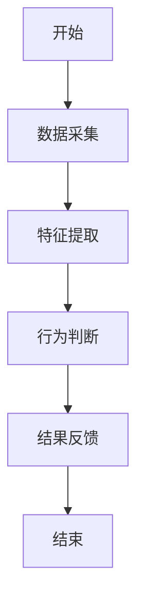
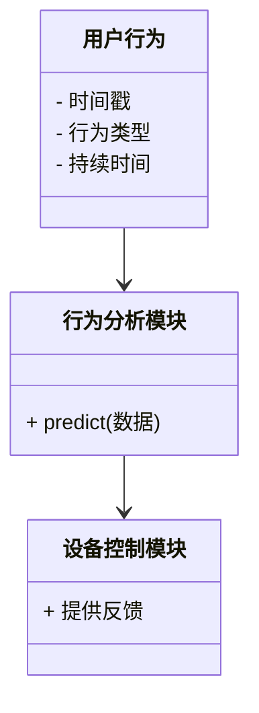
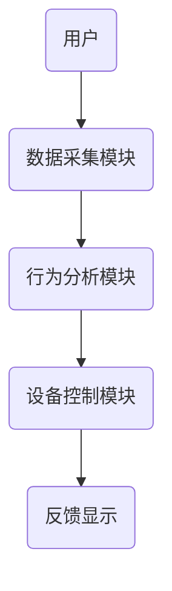
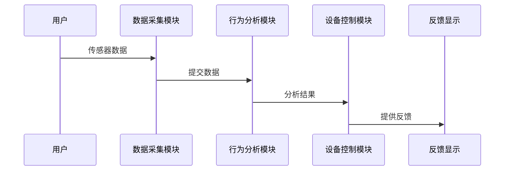

                 


# 智能浴室置物架：AI Agent的个人卫生习惯分析

> 关键词：AI Agent，个人卫生，智能硬件，数据分析，行为分析

> 摘要：本文探讨了智能浴室置物架在个人卫生习惯分析中的应用，通过AI Agent技术实现用户行为监测和改善。文章从背景、核心概念、算法原理、系统架构到项目实战，全面解析了智能浴室置物架的设计与实现。

---

## 第一部分: 背景介绍与核心概念

### 第1章: 问题背景与需求分析

#### 1.1 问题背景
现代生活中，个人卫生习惯的重要性不言而喻。良好的卫生习惯不仅能预防疾病，还能提升生活质量。然而，传统的方法依赖于用户的自觉性，缺乏科学性和系统性。随着人工智能技术的发展，智能设备能够帮助我们更有效地管理卫生习惯。

#### 1.2 问题描述
智能浴室置物架的目标是通过AI技术实时监测用户的卫生行为，如洗手频率、用品使用情况等，分析并提供建议。用户行为数据的采集与分析是关键，但如何设计高效的AI算法是核心挑战。

#### 1.3 问题解决
AI Agent通过传感器和摄像头采集数据，结合机器学习模型分析用户行为，提供个性化建议。这种智能化管理不仅提高了效率，还能帮助用户养成良好的卫生习惯。

#### 1.4 边界与外延
系统边界包括仅关注浴室环境，不涉及其他场所。外延方面，可与智能家居联动，扩展应用场景。

### 第2章: 核心概念与联系

#### 2.1 核心概念原理
AI Agent通过感知用户行为，利用规则和模型做出决策，并通过反馈机制指导用户改进卫生习惯。

#### 2.2 概念属性对比
| AI Agent | 传统算法 |
|-----------|-----------|
| 自适应     | 静态规则   |
| 主动性     | 被动响应   |
| 学习能力   | 无学习     |

#### 2.3 ER实体关系图
```mermaid
er
actor: 用户
agent: AI Agent
device: 智能浴室置物架
behavior: 用户行为数据
goal: 分析目标
rule: 判断规则
```

---

## 第二部分: 算法原理与数学模型

### 第3章: AI Agent的算法原理

#### 3.1 算法流程


#### 3.2 算法实现
```python
def analyze_behavior(data):
    features = extract_features(data)
    prediction = model.predict(features)
    return prediction
```

#### 3.3 数学模型
概率模型：
$$ P(A|B) = \frac{P(B|A)P(A)}{P(B)} $$

分类模型：
$$ y = f(x) $$

---

## 第三部分: 系统分析与架构设计

### 第4章: 系统分析

#### 4.1 系统设计目标
智能浴室置物架需实时监测用户行为，提供反馈，与其他设备联动。

#### 4.2 功能需求
- 数据采集：传感器和摄像头
- 行为分析：AI算法
- 反馈模块：LED和语音提示

#### 4.3 领域模型


#### 4.4 系统架构


#### 4.5 交互流程


---

## 第四部分: 项目实战

### 第5章: 项目实战

#### 5.1 环境安装
安装Python、TensorFlow、OpenCV等库。

#### 5.2 核心代码实现
```python
import numpy as np
from tensorflow import keras

class BehaviorAnalyzer:
    def __init__(self, model_path):
        self.model = keras.models.load_model(model_path)
    
    def extract_features(self, data):
        # 特征提取逻辑
        return features
    
    def predict_behavior(self, features):
        return self.model.predict(features)
```

#### 5.3 代码解读
- `extract_features`：从原始数据中提取有用特征。
- `predict_behavior`：使用预训练模型进行行为预测。

#### 5.4 实际案例分析
通过实际数据演示如何分析用户的洗手习惯，并提供改善建议。

#### 5.5 项目小结
项目实现了智能浴室置物架的核心功能，验证了AI技术在卫生习惯管理中的有效性。

---

## 第五部分: 最佳实践与小结

### 第6章: 最佳实践

#### 6.1 小结
智能浴室置物架通过AI技术有效改善了用户的卫生习惯，提升了生活质量。

#### 6.2 注意事项
数据隐私保护、系统稳定性、用户体验优化。

#### 6.3 拓展阅读
推荐相关书籍和论文，进一步学习AI在健康管理中的应用。

---

## 作者信息

作者：AI天才研究院/AI Genius Institute & 禅与计算机程序设计艺术/Zen And The Art of Computer Programming

---

**全文完**

