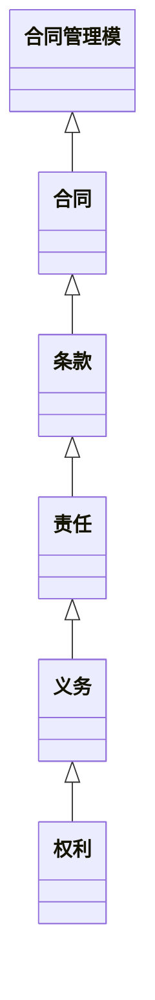
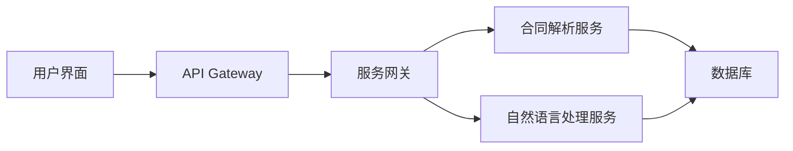
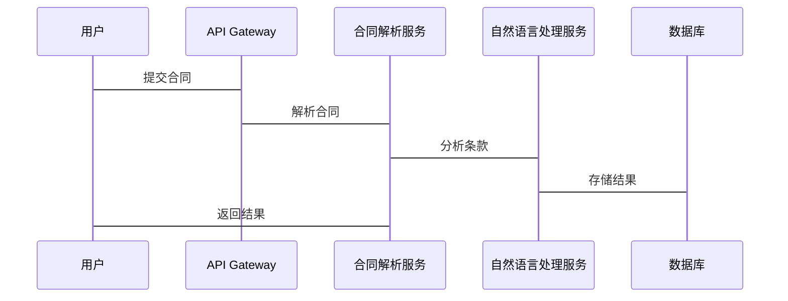

                 


# 构建基于NLP的金融合同自动化审核系统

## 关键词
- 自然语言处理
- 金融合同
- 自动化审核系统
- 深度学习
- 金融风险管理

## 摘要
本文详细探讨了构建基于自然语言处理（NLP）的金融合同自动化审核系统的各个方面。从问题背景和需求分析入手，深入分析了NLP技术在金融合同审核中的应用，详细阐述了系统的核心概念、算法原理和系统架构设计。通过具体的项目实战，展示了系统的实现过程，并讨论了性能优化和实际应用案例。最后，总结了项目的成果，并展望了未来的发展方向。

## 目录

# 第一部分: 背景介绍与核心概念

## 第1章: 问题背景与需求分析

### 1.1 问题背景
#### 1.1.1 金融合同审核的现状与挑战
#### 1.1.2 传统审核方式的局限性
#### 1.1.3 自动化审核的必要性

### 1.2 问题描述
#### 1.2.1 金融合同的主要类型与特点
#### 1.2.2 合同审核的关键环节与痛点
#### 1.2.3 自动化审核的目标与边界

## 第2章: 核心概念与联系

### 2.1 NLP技术在合同审核中的应用
#### 2.1.1 NLP的基本原理
#### 2.1.2 常见NLP模型及其特点
#### 2.1.3 NLP在合同审核中的具体应用

### 2.2 金融合同审核的实体关系图


### 2.3 系统核心概念对比
#### 2.3.1 模型类型对比
#### 2.3.2 数据预处理对比
#### 2.3.3 性能指标对比

# 第二部分: 算法原理与数学模型

## 第3章: NLP模型的算法原理

### 3.1 模型训练流程


### 3.2 模型训练的数学公式
#### 3.2.1 词嵌入公式
$$\text{嵌入向量} = W_{word} \cdot x$$
#### 3.2.2 注意力机制公式
$$\text{注意力权重} = \text{softmax}(QK^T/\sqrt{d})$$

## 第4章: 系统架构与设计

### 4.1 项目介绍
#### 4.1.1 项目目标
#### 4.1.2 项目范围
#### 4.1.3 项目团队与分工

### 4.2 系统功能设计
#### 4.2.1 领域模型类图


### 4.3 系统架构设计


### 4.4 系统接口设计
#### 4.4.1 接口描述
#### 4.4.2 接口实现
#### 4.4.3 接口测试

### 4.5 系统交互流程


# 第三部分: 项目实战与性能优化

## 第5章: 项目实战

### 5.1 环境安装
#### 5.1.1 安装Python
#### 5.1.2 安装必要的库
#### 5.1.3 安装开发工具

### 5.2 核心代码实现
#### 5.2.1 数据预处理代码
```python
import pandas as pd

def preprocess_data(data):
    # 数据清洗和预处理
    pass
```

#### 5.2.2 模型训练代码
```python
import tensorflow as tf
from tensorflow.keras import layers

model = tf.keras.Sequential([
    layers.Embedding(input_dim=10000, output_dim=16),
    layers.Bidirectional(layers.LSTM(64)),
    layers.Dense(2, activation='softmax')
])
```

### 5.3 代码解读与分析
#### 5.3.1 数据预处理解读
#### 5.3.2 模型结构解读
#### 5.3.3 模型训练解读

### 5.4 实际案例分析
#### 5.4.1 案例背景
#### 5.4.2 数据分析
#### 5.4.3 结果解读

## 第6章: 性能优化与实际应用

### 6.1 模型优化策略
#### 6.1.1 参数调整
#### 6.1.2 模型压缩
#### 6.1.3 集成学习

### 6.2 系统优化方案
#### 6.2.1 并行计算
#### 6.2.2 分布式部署
#### 6.2.3 自动化监控

### 6.3 实际应用案例
#### 6.3.1 应用场景
#### 6.3.2 应用效果
#### 6.3.3 应用反馈

# 第四部分: 总结与展望

## 第7章: 总结与展望

### 7.1 项目总结
#### 7.1.1 核心成果
#### 7.1.2 实践经验
#### 7.1.3 问题与不足

### 7.2 未来展望
#### 7.2.1 技术发展
#### 7.2.2 应用场景扩展
#### 7.2.3 挑战与机遇

## 作者
作者：AI天才研究院/AI Genius Institute  
作者：禅与计算机程序设计艺术/Zen And The Art of Computer Programming

