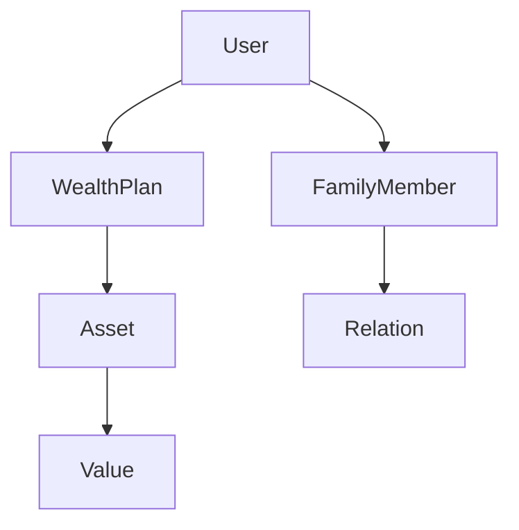
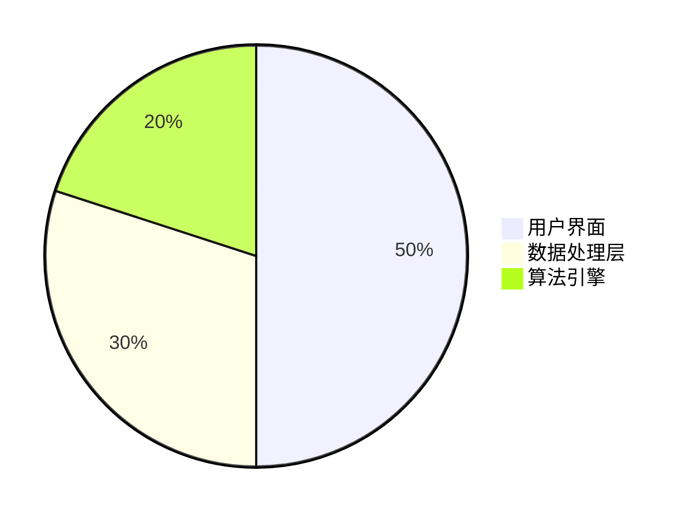
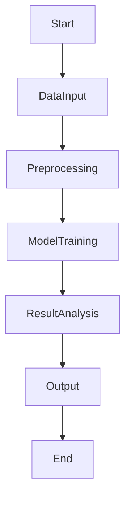
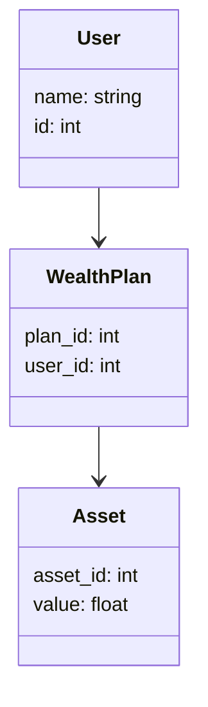
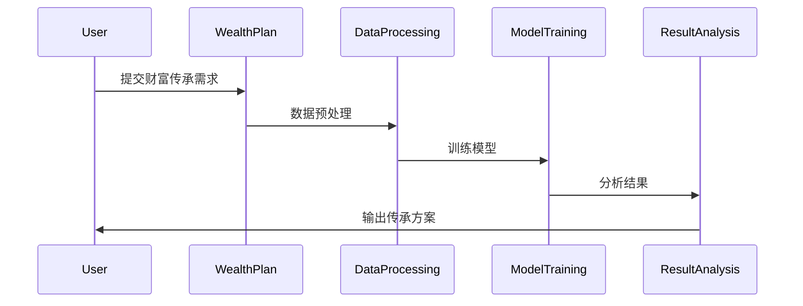

                 


# 构建智能化的个人财富传承规划助手

> 关键词：智能化财富传承规划、人工智能、大数据分析、机器学习、系统架构设计、算法实现

> 摘要：本文将详细探讨如何利用人工智能和大数据技术构建智能化的个人财富传承规划助手。通过分析财富传承规划的核心要素，结合机器学习算法和系统架构设计，提出一种创新的解决方案。文章内容涵盖背景介绍、核心概念、算法原理、系统实现、项目实战以及最佳实践，帮助读者全面理解并掌握智能化财富传承规划助手的构建方法。

---

## 第一章: 背景介绍

### 1.1 问题背景与挑战
#### 1.1.1 传统财富传承规划的局限性
传统的财富传承规划主要依赖人工分析和经验判断，存在效率低下、主观性强、难以覆盖复杂场景等问题。

#### 1.1.2 问题描述
财富传承规划涉及财产分配、税务优化、风险控制等多个复杂因素，传统方法难以实现个性化、动态化的规划。

#### 1.1.3 智能化规划的必要性与优势
通过引入人工智能和大数据技术，智能化财富传承规划助手能够实现数据驱动的精准分析、实时反馈和动态优化。

### 1.2 财富传承规划的核心要素
#### 1.2.1 财产评估与分配
根据资产种类、金额和持有时间，结合法律法规，制定合理的财产分配方案。

#### 1.2.2 家族传承结构
分析家族成员关系、财产分配偏好和风险管理需求，设计最优的传承路径。

#### 1.2.3 风险控制与税务优化
通过大数据分析和机器学习模型，优化税务负担，降低传承过程中的法律风险。

#### 1.2.4 长期目标与动态调整
根据市场变化、家庭状况和政策调整，动态优化财富传承规划。

---

## 第二章: 核心概念与系统架构

### 2.1 智能化财富传承规划助手的核心概念
#### 2.1.1 数据驱动的传承方案优化
通过收集和分析用户数据，利用大数据技术生成个性化传承方案。

#### 2.1.2 人工智能在财富传承中的应用
包括自然语言处理（NLP）用于用户需求分析、机器学习用于风险预测和资产分配优化。

#### 2.1.3 系统化传承规划流程
从数据采集到方案生成，再到反馈优化的完整流程。

### 2.2 实体关系图（ER图）


### 2.3 系统架构图


---

## 第三章: 算法原理与数学模型

### 3.1 线性回归模型
$$ y = \beta_0 + \beta_1x + \epsilon $$

### 3.2 支持向量机模型
$$ \text{最大化} \quad \frac{1}{2}||\mathbf{w}||^2 $$
$$ \text{约束} \quad y_i(\mathbf{w}\cdot x_i + b) \geq 1 $$

### 3.3 算法流程图


---

## 第四章: 系统实现与项目实战

### 4.1 环境安装与数据准备
安装Python、机器学习库（如scikit-learn、TensorFlow）和数据分析工具（如Pandas、NumPy）。

### 4.2 系统核心实现
#### 4.2.1 数据预处理
```python
import pandas as pd
data = pd.read_csv('wealth.csv')
```

#### 4.2.2 算法实现
```python
from sklearn.linear_model import LinearRegression
model = LinearRegression()
model.fit(X_train, y_train)
```

#### 4.2.3 系统测试与优化
通过交叉验证和网格搜索优化模型参数。

### 4.3 项目实战
以具体案例为例，展示如何从数据收集到模型部署完成智能化财富传承规划助手的开发。

---

## 第五章: 系统架构设计与优化

### 5.1 问题场景介绍
描述财富传承规划助手的实际应用场景和用户需求。

### 5.2 系统功能设计
#### 5.2.1 领域模型类图


#### 5.2.2 系统架构设计


### 5.3 系统接口设计
定义API接口，实现用户数据的输入、处理和结果输出。

### 5.4 系统交互设计


---

## 第六章: 案例分析与总结

### 6.1 实际案例分析
通过具体案例展示智能化财富传承规划助手的应用效果。

### 6.2 项目总结
总结项目实施过程中的经验和教训，提出改进建议。

---

## 第七章: 最佳实践与展望

### 7.1 小结
总结全文的主要内容和关键点。

### 7.2 注意事项
在实际应用中需要注意的事项和常见问题。

### 7.3 拓展阅读
推荐相关领域的书籍和资源，供读者进一步学习。

---

## 附录

### 附录A: 术语表
列出文章中出现的专业术语及其解释。

### 附录B: 工具安装与配置
详细说明开发环境的搭建步骤。

### 附录C: 源代码
提供系统实现的完整源代码和注释。

---

## 作者

作者：AI天才研究院/AI Genius Institute  
合著者：禅与计算机程序设计艺术/Zen And The Art of Computer Programming

---

通过以上目录大纲，我们可以看到，构建智能化的个人财富传承规划助手需要从背景分析、核心概念、算法实现、系统设计等多个方面进行详细探讨。

