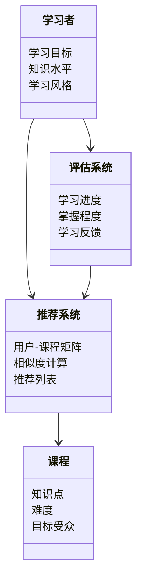
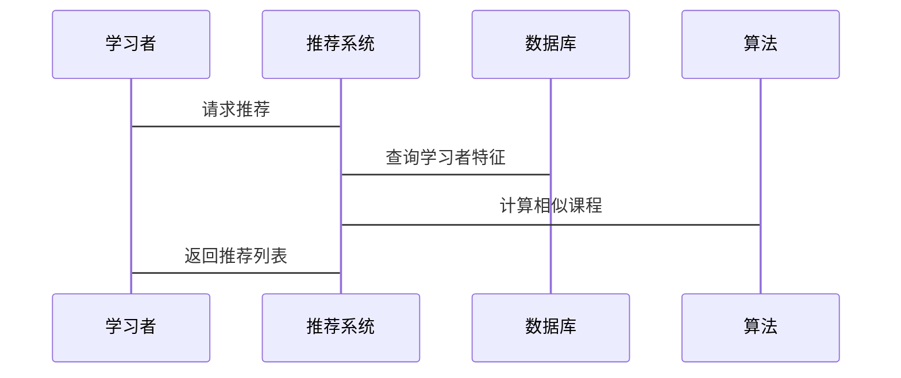

                 


---

# 设计AI Agent的自适应课程学习策略

> 关键词：AI Agent, 自适应学习策略, 强化学习, 教育技术, 算法实现

> 摘要：本文详细探讨了AI Agent在自适应课程学习策略中的设计与实现。通过分析学习者特征、课程内容和学习效果，结合强化学习、监督学习和协同过滤算法，提出了有效的自适应学习策略。文章还包括系统架构设计、项目实战和数学模型，为读者提供了全面的指导。

---

# 第一部分: AI Agent与自适应学习策略概述

## 第1章: AI Agent的基本概念与应用

### 1.1 AI Agent的定义与特点
- **1.1.1 AI Agent的定义**
  - AI Agent是一种智能体，能够感知环境并采取行动以实现目标。
- **1.1.2 AI Agent的核心特点**
  - 自主性、反应性、目标导向性、社交能力。
- **1.1.3 AI Agent与传统AI的区别**
  - 强调自主性和实时性，适用于动态环境。

### 1.2 自适应学习策略的背景与意义
- **1.2.1 个性化学习的需求**
  - 学习者个体差异，传统教学难以满足。
- **1.2.2 自适应学习策略的核心价值**
  - 提高学习效率，优化学习体验。
- **1.2.3 自适应学习在教育领域的应用前景**
  - 个性化推荐，实时反馈，动态调整学习路径。

### 1.3 AI Agent在教育中的应用
- **1.3.1 AI Agent在课程推荐中的作用**
  - 分析学习者特征，推荐适合的课程。
- **1.3.2 AI Agent在学习路径规划中的应用**
  - 根据学习效果调整学习计划。
- **1.3.3 AI Agent在学习效果评估中的价值**
  - 提供实时反馈，优化学习策略。

### 1.4 本章小结
- 总结AI Agent的基本概念及其在教育中的应用，为后续章节奠定基础。

---

## 第2章: 自适应课程学习策略的设计原理

### 2.1 自适应学习策略的核心要素
- **2.1.1 学习者特征分析**
  - 学习目标、知识水平、学习风格、学习动机。
- **2.1.2 课程内容分析**
  - 知识点、难度、相关性、目标受众。
- **2.1.3 学习效果评估**
  - 学习进度、掌握程度、学习反馈。

### 2.2 AI Agent的决策机制
- **2.2.1 基于规则的决策**
  - 预定义规则，简单但缺乏灵活性。
- **2.2.2 基于机器学习的决策**
  - 使用监督学习或无监督学习模型，提高准确性。
- **2.2.3 基于强化学习的决策**
  - 通过试错优化策略，适应动态环境。

### 2.3 自适应学习策略的实现步骤
- **2.3.1 数据收集与处理**
  - 收集学习者数据，预处理和特征提取。
- **2.3.2 策略制定与优化**
  - 建立数学模型，训练模型，优化参数。
- **2.3.3 策略实施与反馈**
  - 实施策略，收集反馈，动态调整。

### 2.4 本章小结
- 详细阐述了自适应学习策略的设计要素和实现步骤，为算法部分打下基础。

---

## 第3章: 自适应课程学习策略的数学模型与算法

### 3.1 基于强化学习的策略优化
- **3.1.1 强化学习的基本概念**
  - 状态、动作、奖励、策略。
- **3.1.2 策略函数的定义**
  - 策略函数表示从状态到动作的概率分布。
- **3.1.3 奖励函数的设计**
  - 设计合理的奖励机制以引导学习者。

#### 3.1.4 强化学习的数学模型
$$ V(s) = \max_{a} [ r(s,a) + \gamma V(s') ] $$

### 3.2 基于监督学习的策略调整
- **3.2.1 监督学习的基本原理**
  - 标签数据训练模型，预测目标。
- **3.2.2 数据标注与特征提取**
  - 数据清洗，特征工程。
- **3.2.3 模型训练与评估**
  - 使用回归或分类模型，评估准确率。

#### 3.2.4 监督学习的损失函数
$$ L = \frac{1}{2} \sum (y_i - \hat{y_i})^2 $$

### 3.3 基于协同过滤的课程推荐
- **3.3.1 协同过滤的基本原理**
  - 基于用户行为的相似性推荐。
- **3.3.2 用户-课程矩阵的构建**
  - 矩阵表示用户对课程的评分或偏好。
- **3.3.3 推荐算法的实现**
  - 基于相似度或基于模型的推荐。

#### 3.3.4 协同过滤的相似度计算
$$ \text{相似度} = \frac{\sum (x_i - \mu)(y_i - \mu)}{\sqrt{\sum (x_i - \mu)^2} \sqrt{\sum (y_i - \mu)^2}} $$

### 3.4 本章小结
- 介绍了强化学习、监督学习和协同过滤在自适应学习中的应用，并给出了数学模型。

---

## 第4章: AI Agent的系统架构与实现

### 4.1 系统架构设计
- **4.1.1 问题场景介绍**
  - 动态学习环境，个性化需求。
- **4.1.2 项目介绍**
  - 开发一个自适应学习系统。
- **4.1.3 系统功能设计**
  - 用户模块、课程模块、推荐模块、评估模块。

#### 4.1.4 领域模型Mermaid类图


### 4.2 系统架构设计Mermaid架构图


### 4.3 系统接口设计
- **4.3.1 接口设计**
  - API接口定义，如RESTful API。
- **4.3.2 接口交互流程**
  - 请求处理，返回推荐结果。

### 4.4 系统交互Mermaid序列图


### 4.5 本章小结
- 描述了系统的架构设计和接口设计，展示了各模块的交互流程。

---

## 第5章: 项目实战

### 5.1 环境安装与配置
- **5.1.1 开发环境**
  - 安装Python、TensorFlow、Scikit-learn。
- **5.1.2 数据集准备**
  - 收集学习者数据和课程数据。

### 5.2 核心代码实现
- **5.2.1 数据预处理**
  - 数据清洗、特征提取。
- **5.2.2 算法实现**
  - 强化学习、协同过滤。
- **5.2.3 模型训练**
  - 训练监督学习模型，优化参数。

#### 5.2.4 Python代码示例
```python
import numpy as np
from sklearn.metrics.pairwise import cosine_similarity

# 示例协同过滤算法
def calculate_similarity(matrix):
    return cosine_similarity(matrix)

# 示例强化学习策略
def reinforce_policy(state):
    # 简单策略，返回随机动作
    return np.random.choice(len(state))
```

### 5.3 案例分析与详细解读
- **5.3.1 案例背景**
  - 某学习平台的用户数据。
- **5.3.2 实施过程**
  - 数据分析，模型训练，系统部署。
- **5.3.3 结果分析**
  - 推荐准确率，学习效果提升。

### 5.4 项目小结
- 总结项目实施过程中的经验与教训，提出改进建议。

---

## 第6章: 总结与展望

### 6.1 本章总结
- 回顾全文，总结核心内容和主要结论。

### 6.2 未来展望
- 探讨AI Agent在教育中的未来发展方向，如结合元学习、多智能体协作等。

### 6.3 最佳实践Tips
- 提供实际应用中的注意事项和优化建议。

### 6.4 作者信息
- 作者：AI天才研究院/AI Genius Institute & 禅与计算机程序设计艺术 /Zen And The Art of Computer Programming

---

通过以上目录结构，文章内容将系统地介绍AI Agent的自适应课程学习策略的设计与实现，涵盖理论、算法、系统架构和项目实战，帮助读者全面理解和掌握相关知识。

