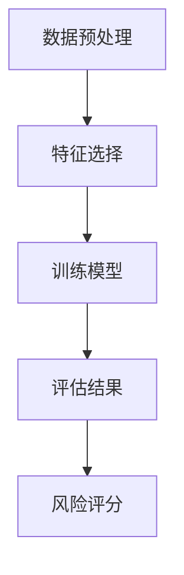
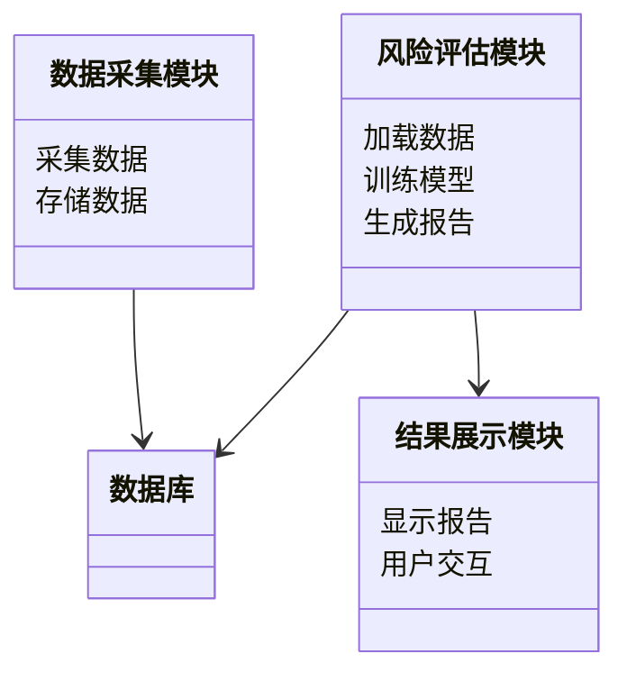
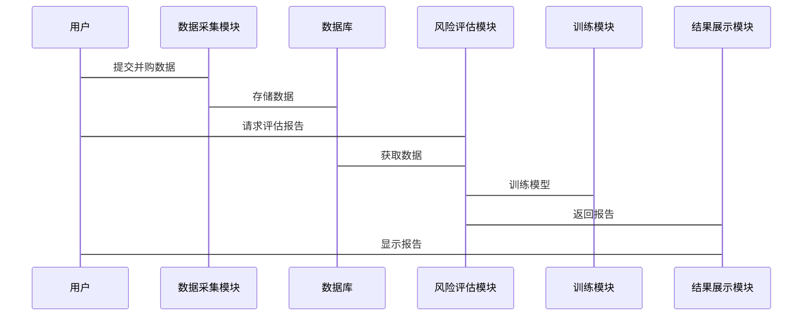

                 


# 设计智能化的企业并购整合风险评估模型

**关键词**：企业并购、风险评估、人工智能、机器学习、系统架构

**摘要**：本文旨在设计一个智能化的企业并购整合风险评估模型，通过分析企业并购过程中的各类风险因素，结合先进的机器学习算法和系统架构设计，构建一个高效、准确的风险评估系统。该系统能够帮助企业更好地识别和管理并购过程中的潜在风险，提高决策的科学性和有效性。

---

## 第一部分: 企业并购整合风险评估模型的背景与概述

### 第1章: 企业并购与整合概述

#### 1.1 企业并购的基本概念
企业并购是指一家企业通过购买另一家企业的股权或资产，以实现资本扩张或战略重组的过程。并购可以分为横向并购、纵向并购和混合并购三种类型。横向并购是同一行业内的企业合并，旨在扩大市场份额；纵向并购是上下游产业的企业合并，以优化供应链；混合并购则是跨行业的企业合并，以实现多元化经营。

企业并购的流程一般包括尽职调查、估值、谈判、交易结构设计和整合实施五个阶段。整合阶段包括组织结构整合、业务流程整合、文化整合和人力资源整合等，是并购成功的关键。

在实际操作中，企业并购面临诸多挑战，如协同效应不佳、文化冲突、管理不善等，导致并购失败。因此，科学的风险评估和有效的整合策略是确保并购成功的重要因素。

#### 1.2 企业并购整合中的风险
在企业并购过程中，风险主要来自以下几个方面：
1. **财务风险**：包括目标企业财务状况不佳、负债过高、估值偏差等。
2. **战略风险**：并购战略与企业整体战略不符，可能导致资源浪费和目标偏离。
3. **运营风险**：整合过程中可能出现的业务流程不畅、管理混乱等问题。
4. **法律风险**：包括反垄断审查、知识产权纠纷、合规性问题等。
5. **文化风险**：不同企业文化差异可能导致员工抵制和工作效率下降。
6. **人力资源风险**：关键员工流失、团队整合困难等。

这些风险相互关联，需要综合评估和管理。例如，财务风险可能影响企业的整合能力，进而影响运营风险；文化冲突可能影响团队稳定性，从而加剧人力资源风险。

#### 1.3 智能化风险评估的必要性
传统的风险评估方法主要依赖于经验判断和静态分析，存在以下局限性：
- 数据来源单一，难以全面捕捉风险因素。
- 评估结果缺乏动态性，无法及时反映市场变化。
- 分析深度不足，难以发现潜在风险。

智能化风险评估通过引入大数据分析和机器学习技术，能够从海量数据中提取有价值的信息，构建动态、全面的评估模型。其优势体现在：
- 数据驱动决策：利用历史数据和实时数据，提供科学依据。
- 高效性：自动化处理数据，提高评估效率。
- 精准性：通过算法优化，提升评估结果的准确性。

在数据驱动决策的时代，智能化风险评估成为企业并购成功的关键因素。通过智能化模型，企业能够更早识别风险，制定应对策略，提高并购成功率。

---

## 第2章: 企业并购整合风险评估模型的核心概念

### 2.1 风险评估模型的基本原理
风险评估模型是一个输入-处理-输出的过程。输入包括企业的财务数据、市场信息、管理数据等；处理阶段涉及数据清洗、特征提取、模型训练；输出为风险评分和应对建议。

模型构建需要考虑以下因素：
- **输入**：数据来源、数据类型、数据格式。
- **输出**：风险评分、风险类型、风险建议。
- **逻辑**：数据预处理、特征选择、模型训练、结果评估。
- **适用范围**：企业并购整合的各个阶段。

模型的设计需要覆盖企业并购的全生命周期，从尽职调查到整合实施，提供实时的风险评估和动态调整建议。

### 2.2 核心概念与联系
下表对比了主要风险类型及其影响因素：

| 风险类型 | 影响因素                 | 示例指标             |
|----------|--------------------------|--------------------|
| 财务风险 | 负债率、利润率、现金流   | 净资产收益率(ROE)    |
| 战略风险 | 行业竞争、战略匹配度   | 企业战略一致性评分   |
| 运营风险 | 业务流程、管理效率     | 供应链响应时间       |
| 法律风险 | 法律纠纷、合规性       | 法律风险指数         |
| 文化风险 | 企业文化差异、员工满意度 | 员工保留率           |
| 人力资源风险 | 关键员工流失率、团队稳定性 | 员工满意度调查结果     |

ER实体关系图展示了企业并购中的关键实体及其关系：

```mermaid
er
  actor1: 企业A
  actor2: 企业B
  actor3: 并购顾问
  actor4: 风险评估系统
  actor5: 数据源
  rela
    actor1 --> actor4: 提供数据
    actor2 --> actor4: 提供数据
    actor3 --> actor4: 提供咨询
    actor4 --> actor5: 获取数据
```

---

## 第3章: 企业并购整合风险评估模型的算法原理

### 3.1 算法原理
模型采用随机森林算法，适合处理多分类问题。其优势在于特征重要性分析和抗过拟合能力强。

算法流程如下：



代码示例：

```python
import pandas as pd
from sklearn.ensemble import RandomForestClassifier
from sklearn.metrics import accuracy_score

# 数据预处理
data = pd.read_csv('并购数据.csv')
X = data.drop('风险标签', axis=1)
y = data['风险标签']

# 特征选择
selected_features = ['负债率', '现金流', '利润率']
X = data[selected_features]

# 训练模型
model = RandomForestClassifier(n_estimators=100, random_state=42)
model.fit(X, y)

# 评估结果
预测 = model.predict(X)
准确率 = accuracy_score(y, 预测)
print(f'准确率: {准确率:.2f}')
```

### 3.2 数学模型与公式
风险评分模型如下：

$$
风险评分 = \sum_{i=1}^{n} w_i \cdot f_i
$$

其中，$w_i$ 是第i个特征的权重，$f_i$ 是第i个特征的评分。权重通过特征重要性分析确定。

---

## 第4章: 系统分析与架构设计方案

### 4.1 系统功能设计
系统功能模块包括数据采集、风险评估、结果展示和报告生成。

领域模型类图如下：



### 4.2 系统架构设计
采用微服务架构，分为数据层、服务层、业务逻辑层和用户界面层。

架构图如下：

```mermaid
container 微服务架构 {
    service 数据采集服务
    service 风险评估服务
    service 报告生成服务
    database 数据库
    interface 用户界面
}
```

### 4.3 系统接口与交互
序列图展示用户与系统交互：



---

## 第5章: 项目实战

### 5.1 环境安装
需要安装Python、scikit-learn、pandas、mermaid等工具。

### 5.2 核心实现
代码实现数据预处理、模型训练和评估。

### 5.3 案例分析
以某企业并购案例为例，展示数据处理、模型训练和结果分析的全过程。

### 5.4 项目小结
总结项目实现的关键点，讨论模型的优势和局限性，提出改进建议。

---

## 第6章: 总结与展望

### 6.1 总结
本文设计了一个智能化的企业并购整合风险评估模型，结合机器学习算法和系统架构设计，为企业提供科学的决策支持。

### 6.2 未来展望
未来可以在以下方面进行改进：
1. 引入实时数据，提升评估的动态性。
2. 优化模型结构，提高评估的准确性。
3. 结合其他技术，如图神经网络，提升模型的复杂性。

---

**作者：AI天才研究院/AI Genius Institute & 禅与计算机程序设计艺术 /Zen And The Art of Computer Programming**

