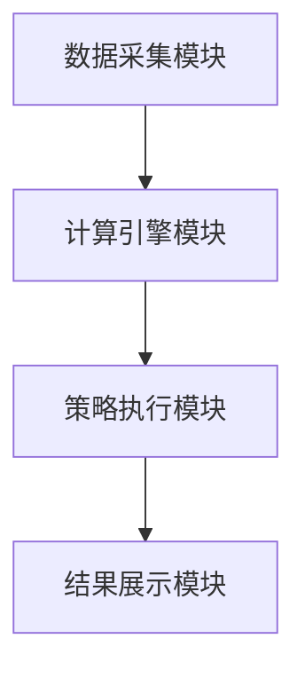

                 


# 乔尔·格林布拉特的价值投资量化方法

> 关键词：价值投资、量化方法、魔数公式、股票筛选、投资组合优化

> 摘要：本文深入分析了乔尔·格林布拉特的价值投资量化方法，详细讲解了魔数公式的原理与应用，结合实际案例，探讨了如何通过量化方法筛选优质股票并构建高效投资组合。文章从理论到实践，全面解析了价值投资的量化之路。

---

## 第一部分: 价值投资基础

### 第1章: 价值投资概述

#### 1.1 价值投资的核心理念

价值投资是一种以基本面分析为基础的投资方法，强调以低于公允价值的价格购买优质资产，长期持有，等待价格回归其内在价值。其核心理念包括：

- **安全边际**：买入价格低于内在价值，以降低投资风险。
- **长期视角**：关注企业的长期盈利能力，而非短期价格波动。
- **逆向思维**：在市场恐慌时寻找低估资产，在市场狂热时保持冷静。

#### 1.2 乔尔·格林布拉特的投资理念

乔尔·格林布拉特是价值投资领域的代表性人物，他的投资理念强调量化分析与安全边际。

- **量化分析**：格林布拉特认为，通过量化指标可以更客观地评估企业的内在价值。
- **安全边际**：他提出的“魔数公式”（Magic Formula）是一种量化筛选股票的方法，旨在找到低估的优质企业。

#### 1.3 价值投资的量化方法

价值投资与量化方法的结合，使投资更加科学化。格林布拉特的魔数公式将价值投资的理念转化为具体的数学模型，通过量化指标筛选股票，从而实现投资的系统化和可操作性。

---

### 第2章: 魔数公式的核心原理

#### 2.1 魔数公式的基本框架

魔数公式是一种简单而有效的量化选股方法，其核心公式为：

$$ \text{Magic Formula} = \frac{E}{V} $$

其中：
- \( E \) 表示企业质量指标（EVA Margin）。
- \( V \) 表示市场预期回报率（ERP）。

#### 2.2 企业质量指标（EVA Margin）

EVA Margin是衡量企业盈利能力的重要指标，公式为：

$$ \text{EVA Margin} = \frac{\text{净利润} - \text{加权平均资本成本}}{\text{企业价值}} $$

企业质量指标反映了企业的盈利能力和资本使用效率，是魔数公式的核心组成部分。

#### 2.3 市场预期回报率（ERP）

ERP是衡量市场风险的重要指标，公式为：

$$ \text{ERP} = \frac{\text{市场无风险利率} + \text{风险溢价}}{1} $$

市场预期回报率反映了市场的整体风险水平，用于调整企业价值的评估。

---

### 第3章: 魔数公式的核心算法

#### 3.1 魔数公式计算流程

魔数公式的计算流程如下：

1. **数据收集**：收集企业的财务数据和市场数据。
2. **计算企业质量指标（EVA Margin）**：评估企业的盈利能力。
3. **计算市场预期回报率（ERP）**：评估市场的整体风险。
4. **计算魔数公式**：通过 \( \frac{E}{V} \) 筛选出低估的股票。
5. **筛选股票**：根据魔数公式的结果，选择符合条件的股票。

#### 3.2 魔数公式计算的 mermaid 流程图

```mermaid
graph TD
    A[数据收集] --> B[计算企业质量指标(EVA Margin)]
    B --> C[计算市场预期回报率(ERP)]
    C --> D[计算魔数公式]
    D --> E[筛选股票]
```

---

## 第二部分: 投资组合优化

### 第4章: 投资组合构建与优化

#### 4.1 投资组合构建的逻辑

- **资产配置**：根据市场环境调整股票与债券的配置比例。
- **风险控制**：通过分散投资降低非系统性风险。
- **动态调整**：定期重新评估股票质量，调整投资组合。

#### 4.2 投资组合优化的数学模型

投资组合优化的数学模型可以表示为：

$$ \text{Minimize} \quad \sum_{i=1}^{n} w_i^2 \sigma_i^2 $$

其中：
- \( w_i \) 是第 \( i \) 只股票的权重。
- \( \sigma_i^2 \) 是第 \( i \) 只股票的方差。

目标是通过优化权重 \( w_i \) 降低投资组合的整体风险。

---

### 第5章: 系统设计与实现

#### 5.1 系统设计的逻辑

- **系统架构**：分为数据采集、计算引擎、策略执行和结果展示四个模块。
- **数据源**：包括财务数据、市场数据和宏观经济数据。
- **计算引擎**：实现魔数公式的计算逻辑。
- **策略执行**：根据筛选结果生成投资组合。
- **结果展示**：以可视化形式展示筛选结果和投资组合表现。

#### 5.2 系统架构的 mermaid 图



---

## 第三部分: 实战案例与总结

### 第6章: 实战案例分析

#### 6.1 数据收集与筛选

假设我们收集了以下股票的财务数据：

| 股票代码 | 收益率 | 企业质量指标（EVA Margin） | 市场预期回报率（ERP） |
|----------|--------|-----------------------------|-----------------------|
| A        | 5%     | 20%                         | 8%                    |
| B        | 6%     | 15%                         | 10%                   |
| C        | 4%     | 25%                         | 6%                    |

根据魔数公式，计算每只股票的魔数得分：

$$ \text{魔数得分} = \frac{\text{EVA Margin}}{\text{ERP}} $$

- 股票A：\( \frac{20\%}{8\%} = 2.5 \)
- 股票B：\( \frac{15\%}{10\%} = 1.5 \)
- 股票C：\( \frac{25\%}{6\%} = 4.17 \)

根据魔数得分，股票C是最佳选择。

---

### 第7章: 总结与展望

#### 7.1 总结

乔尔·格林布拉特的价值投资量化方法通过魔数公式，将价值投资的理念转化为具体的数学模型，为投资者提供了一种高效的投资工具。其核心在于通过量化指标筛选低估的优质股票，构建长期稳定的收益来源。

#### 7.2 展望

未来，随着人工智能和大数据技术的发展，价值投资的量化方法将更加精确和高效。投资者可以通过更复杂的算法模型，捕捉更多的市场机会，优化投资组合的表现。

---

## 结语

乔尔·格林布拉特的价值投资量化方法不仅是一种投资工具，更是一种科学的投资理念。通过量化分析和系统化的方法，投资者可以在复杂多变的市场中找到低估的优质资产，实现长期稳健的收益。希望本文能够为投资者提供有价值的参考，帮助他们在价值投资的道路上走得更远。

---

**作者：AI天才研究院/AI Genius Institute & 禅与计算机程序设计艺术 /Zen And The Art of Computer Programming**

