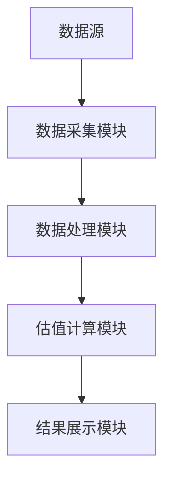
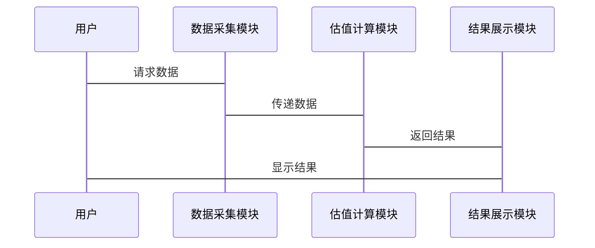
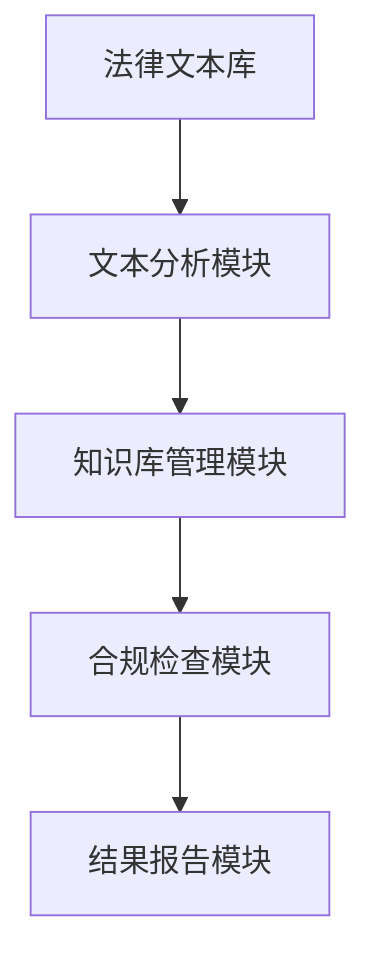

                 


# 全球股市估值与人工智能在法律合规中的应用

> 关键词：全球股市估值、人工智能、法律合规、股票分析、投资策略

> 摘要：本文探讨了全球股市估值的核心方法及其应用，同时分析了人工智能技术在法律合规领域中的创新应用。通过结合金融与AI技术，本文深入阐述了如何利用AI提升法律合规效率，并优化全球股市估值模型。

---

# 第一部分: 全球股市估值的核心方法与应用

## 第1章: 全球股市估值概述

### 1.1 股市估值的基本概念
股市估值是通过对公司财务数据、市场环境和行业趋势等多方面因素的分析，确定股票的合理价格范围。其目的是帮助投资者判断股票是否被高估或低估。

### 1.2 影响股市估值的主要因素
1. **宏观经济因素**：包括GDP增长率、通货膨胀率、利率水平等。
2. **行业因素**：行业的竞争格局、发展周期、政策影响等。
3. **公司基本面**：收入、利润、资产负债表等财务数据。
4. **市场情绪**：投资者的心理预期和市场参与度。

### 1.3 股市估值的主要方法
1. **相对估值法**：通过比较市盈率（P/E）、市净率（P/B）等指标，判断股票价格是否合理。
2. **绝对估值法**：基于现金流折现模型（DCF）计算股票的内在价值。
3. **指数估值法**：通过分析市场整体指数的估值水平，判断市场是否处于高估或低估状态。

---

## 第2章: 全球股市估值的数学模型与算法

### 2.1 常用估值公式
1. **市盈率法**：
   $$ P/E = \frac{\text{股价}}{\text{每股收益}} $$
   如果P/E低于行业平均水平，可能意味着股票被低估。

2. **市净率法**：
   $$ P/B = \frac{\text{股价}}{\text{每股净资产}} $$
   适用于净资产驱动型的行业，如银行、房地产等。

3. **现金流折现法**：
   $$ V = \sum_{t=1}^{n} \frac{\text{自由现金流}}{(1 + r)^t} $$
   通过将未来现金流折现到现值，计算股票的内在价值。

### 2.2 基于机器学习的股市估值模型
#### 2.2.1 数据特征提取
- 财务指标：收入、利润、毛利率等。
- 市场指标：成交量、波动率等。
- 宏观经济指标：GDP、利率等。

#### 2.2.2 算法选择
1. 线性回归：用于预测股票价格。
2. 支持向量机（SVM）：用于分类股票的高估或低估状态。
3. 随机森林：用于特征重要性分析和价格预测。

#### 2.2.3 模型实现
```python
import pandas as pd
from sklearn.ensemble import RandomForestRegressor
from sklearn.metrics import mean_squared_error

# 加载数据
data = pd.read_csv('stock_data.csv')

# 特征与目标分离
X = data[['PE', 'PB', 'ROE']]
y = data['Price']

# 模型训练
model = RandomForestRegressor(n_estimators=100)
model.fit(X, y)

# 预测与评估
y_pred = model.predict(X)
print('均方误差:', mean_squared_error(y, y_pred))
```

---

## 第3章: 全球股市估值的系统设计与实现

### 3.1 系统架构设计


### 3.2 功能模块实现
1. **数据采集模块**：从股票数据库中获取实时数据。
2. **数据处理模块**：清洗数据、特征工程。
3. **估值计算模块**：基于不同方法计算股票估值。
4. **结果展示模块**：可视化估值结果和模型预测。

### 3.3 系统交互流程


---

# 第二部分: 人工智能在法律合规中的应用

## 第4章: 人工智能与法律合规的结合

### 4.1 法律合规的核心挑战
1. **法律文本复杂性**：法律条文冗长，专业性强。
2. **合规成本高**：企业需要投入大量资源进行合规审查。
3. **实时性要求高**：法律环境不断变化，合规审查需要实时更新。

### 4.2 人工智能在法律合规中的优势
1. **自动化处理**：快速分析大量法律文本。
2. **模式识别**：发现法律条文中的模式和规律。
3. **实时更新**：基于最新法律信息进行动态合规检查。

---

## 第5章: 基于AI的法律合规系统设计

### 5.1 系统功能模块
1. **法律文本分析模块**：自动解析法律条文。
2. **合规检查模块**：对比企业行为与法律要求。
3. **知识库管理模块**：维护法律法规知识库。
4. **结果报告模块**：生成合规报告和改进建议。

### 5.2 系统架构设计


### 5.3 系统实现与应用
#### 5.3.1 数据准备
- 法律法规文本：包括合同范本、行业法规等。
- 企业行为数据：企业的业务流程、交易记录等。

#### 5.3.2 算法实现
1. **自然语言处理（NLP）**：使用BERT模型对法律文本进行语义分析。
2. **规则引擎**：根据法律条文建立合规规则。
3. **案例库匹配**：通过历史案例匹配当前情况，提供参考。

#### 5.3.3 代码实现
```python
from transformers import pipeline

# 加载合同范本
contract = "根据合同条款，如发生违约，需支付违约金。"

# 初始化NLP模型
nlp = pipeline("text-classification", model="bert-base-uncased")

# 分析合同内容
result = nlp(contract)
print(result)
```

---

## 第6章: 人工智能在法律合规中的最佳实践

### 6.1 应用场景
1. **合同审查**：自动识别合同中的风险条款。
2. **合规性检查**：实时监控企业行为是否符合法规。
3. **法律咨询**：为用户提供法律问题的智能解答。

### 6.2 项目小结
通过AI技术，法律合规工作可以实现自动化、高效化和精准化。企业可以显著降低合规成本，提高合规效率。

---

# 总结

全球股市估值与人工智能在法律合规中的应用，展现了技术与金融、法律领域的深度融合。通过智能化的估值模型和AI驱动的法律合规系统，我们可以更高效地解决复杂问题，为企业和社会创造更大的价值。

---

作者：AI天才研究院 & 禅与计算机程序设计艺术

