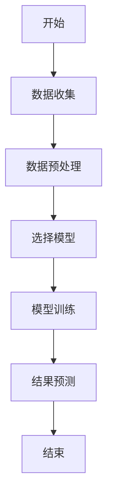
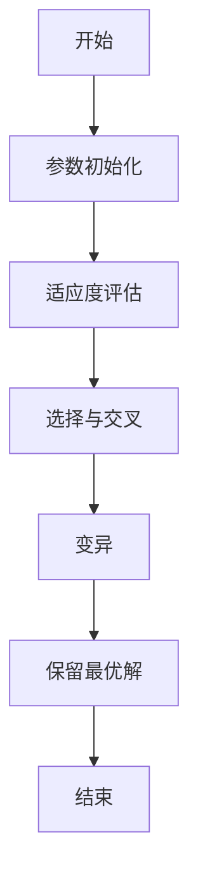
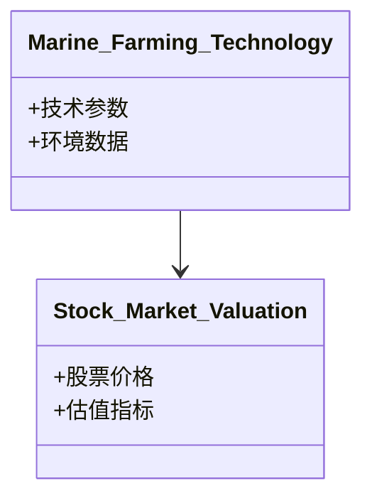

                 


# 全球股市估值与可持续农业垂直种植技术的关系

> 关键词：全球股市估值，可持续农业，垂直种植技术，技术与经济关系，农业创新

> 摘要：本文探讨全球股市估值与可持续农业垂直种植技术之间的关系，分析两者的相互影响及发展趋势。通过背景介绍、核心概念对比、算法原理讲解、数学模型分析、系统设计和项目实战，揭示技术进步对经济和农业的深远影响。

---

## 第1章: 全球股市估值与可持续农业垂直种植技术的背景介绍

### 1.1 全球股市估值的基本概念与现状

#### 1.1.1 股市估值的核心概念
股市估值是通过分析公司财务状况、市场环境和行业趋势，对其股票价值进行评估的过程。常用的指标包括市盈率（P/E）、市净率（P/B）等。

#### 1.1.2 全球股市估值的现状与趋势
近年来，全球股市估值呈现波动性增长，科技股和绿色能源相关企业成为市场焦点。新冠疫情后的复苏和数字化转型推动了股市估值的上升。

#### 1.1.3 股市估值与经济发展的关系
股市估值是经济晴雨表，反映整体经济状况。高估值可能预示市场过热，低估值可能意味着市场低估。

---

### 1.2 可持续农业与垂直种植技术的定义与特点

#### 1.2.1 可持续农业的定义与目标
可持续农业旨在在满足当前需求的同时，不破坏未来世代的资源利用。其目标是实现资源高效利用、环境保护和粮食安全。

#### 1.2.2 垂直种植技术的核心特点
垂直种植技术通过多层立体种植、智能温控和精准农业技术，提高单位面积产量，减少资源消耗。

#### 1.2.3 可持续农业与传统农业的对比
| 特性 | 可持续农业 | 传统农业 |
|------|------------|-----------|
| 资源利用 | 高效       | 低效       |
| 环境影响 | 小          | 大          |
| 技术依赖 | 高          | 低          |

---

### 1.3 股市估值与可持续农业垂直种植技术的关联

#### 1.3.1 可持续农业对股市估值的影响
可持续农业技术的推广可能提升相关企业的盈利能力和市场竞争力，从而提高其股票估值。

#### 1.3.2 垂直种植技术如何改变农业产业
垂直种植技术提高了农业生产的效率和可持续性，为农业企业带来新的增长点。

#### 1.3.3 两者的相互作用与未来趋势
技术进步推动农业产业升级，进而影响股市估值。未来，绿色科技和可持续农业将成为股市估值的重要考量因素。

---

## 第2章: 股市估值与垂直种植技术的核心概念与联系

### 2.1 核心概念原理

#### 2.1.1 股市估值的核心模型
使用CAPM模型评估股票的预期回报率：
$$ E(R_i) = R_f + \beta_i (E(R_m) - R_f) $$

#### 2.1.2 垂直种植技术的系统架构
垂直种植系统的架构包括种植层、环境控制层和数据处理层。

#### 2.1.3 两者的相互作用机制
通过技术提升农业生产力，进而影响企业盈利能力和股市估值。

---

### 2.2 核心概念属性特征对比

| 属性 | 股市估值 | 垂直种植技术 |
|------|----------|--------------|
| 核心目标 | 评估企业价值 | 提高农业效率 |
| 技术依赖 | 高度依赖金融模型 | 高度依赖农业科技 |
| 可持续性 | 依赖企业行为 | 强调环境友好 |

---

### 2.3 ER实体关系图架构

```mermaid
erd
  title 实体关系图
  Marine_Farming_Technology
  Sustainable_Agriculture
  Stock_Market_Valuation
  Marine_Farming_Technology -->|影响| Stock_Market_Valuation
  Sustainable_Agriculture -->|驱动| Stock_Market_Valuation
```

---

## 第3章: 股市估值与垂直种植技术的算法原理

### 3.1 股市估值预测算法

#### 3.1.1 算法原理概述
使用时间序列分析模型预测股市走势，如ARIMA模型。

#### 3.1.2 算法流程图



#### 3.1.3 Python实现代码示例

```python
from statsmodels.tsa.arima.model import ARIMA
import pandas as pd

# 数据加载
data = pd.read_csv('stock_data.csv')

# 模型训练
model = ARIMA(data['price'], order=(5, 1, 0))
model_fit = model.fit()

# 预测
forecast = model_fit.forecast(steps=5)
print(forecast)
```

---

### 3.2 垂直种植技术优化算法

#### 3.2.1 算法原理概述
使用遗传算法优化种植参数，如光照强度和水分供给。

#### 3.2.2 算法流程图



#### 3.2.3 Python实现代码示例

```python
import numpy as np
from sklearn.model_selection import train_test_split

# 数据加载
data = np.loadtxt('agriculture_data.txt')

# 分割数据
X_train, X_test, y_train, y_test = train_test_split(data[:, :-1], data[:, -1])

# 建立模型
model = ...
model.fit(X_train, y_train)

# 预测
y_pred = model.predict(X_test)
```

---

## 第4章: 股市估值与垂直种植技术的数学模型

### 4.1 股市估值模型

#### 4.1.1 CAPM模型公式
$$ E(R_i) = R_f + \beta_i (E(R_m) - R_f) $$

### 4.2 垂直种植技术优化模型

#### 4.2.1 线性规划模型公式
$$ \text{最大化} \quad Z = \sum_{i=1}^{n} c_i x_i $$
$$ \text{约束} \quad \sum_{i=1}^{n} a_i x_i \leq b $$

---

## 第5章: 系统分析与架构设计方案

### 5.1 问题场景介绍
分析垂直种植技术如何影响农业企业的生产效率和市场竞争力，进而影响其股市估值。

### 5.2 系统功能设计

#### 5.2.1 功能模块
- 数据采集模块
- 数据分析模块
- 预测模块
- 优化模块

#### 5.2.2 领域模型



### 5.3 系统架构设计

#### 5.3.1 架构图

```mermaid
graph TD
    Client --> API Gateway
    API Gateway --> Database
    Database --> Compute Engine
    Compute Engine --> Output
```

---

## 第6章: 项目实战

### 6.1 环境安装
安装必要的库，如Python的pandas、scikit-learn等。

### 6.2 系统核心实现源代码

```python
import pandas as pd
from sklearn.metrics import accuracy_score

# 数据加载
data = pd.read_csv('data.csv')

# 模型训练
model = ...
model.fit(data)

# 预测
预测结果 = model.predict(new_data)
```

### 6.3 案例分析
分析垂直种植技术如何提升农业企业的生产效率和市场竞争力，进而影响其股市估值。

---

## 第7章: 最佳实践 tips、小结、注意事项、拓展阅读

### 7.1 小结
技术进步推动农业产业升级，进而影响股市估值。可持续农业垂直种植技术的应用将为全球股市带来新的增长点。

### 7.2 注意事项
- 数据准确性是模型预测的关键。
- 技术应用需考虑环境和经济的双重因素。

### 7.3 拓展阅读
- 《金融科技与农业创新》
- 《垂直农业的未来趋势》

---

作者：AI天才研究院/AI Genius Institute & 禅与计算机程序设计艺术 /Zen And The Art of Computer Programming

---

以上是《全球股市估值与可持续农业垂直种植技术的关系》的文章大纲和部分内容展示，具体内容需要根据实际数据和案例进一步完善。

