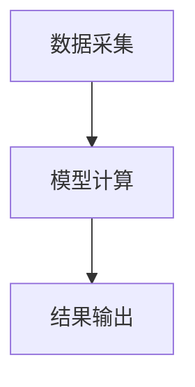
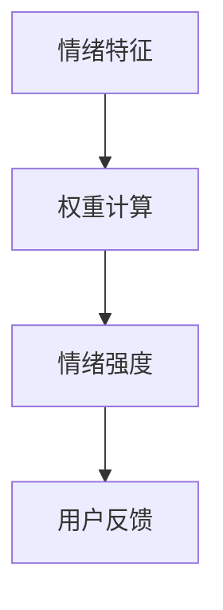
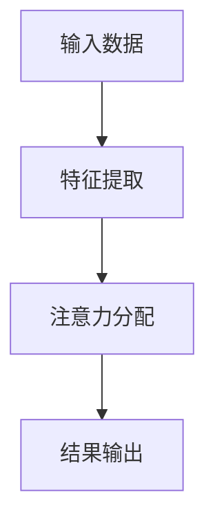
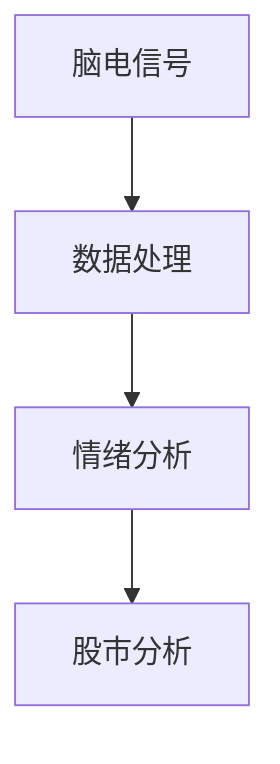
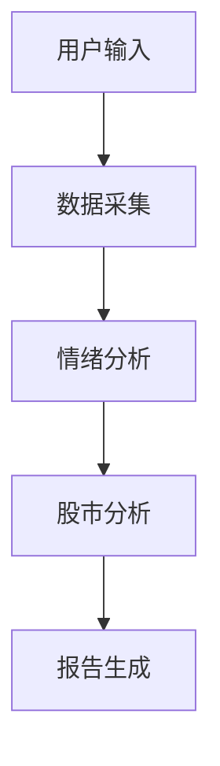

                 


# 全球股市估值与脑科学在人机交互中的应用

> **关键词**: 股市估值, 脑科学, 人机交互, 神经科学, 股票分析, 脑机接口

> **摘要**: 本文探讨了全球股市估值的核心方法与脑科学在人机交互中的应用。首先，我们深入分析了股市估值的基本概念、主要方法及影响因素，结合数学模型与算法进行详细阐述。随后，我们介绍了脑科学的基础知识，特别是其在人机交互中的重要性。最后，我们重点探讨了脑科学与股市估值的结合，展示了如何利用脑科学数据提升股市分析的准确性与效率，并通过具体项目案例进行了深入分析。

---

## 第一部分: 全球股市估值的基础

### 第1章: 全球股市估值的基本概念

#### 1.1 股市估值的定义与重要性

**背景介绍**: 股市估值是金融领域的重要组成部分，用于评估股票的内在价值。它帮助投资者判断股票是否被高估或低估。

**核心概念**: 股市估值的定义为对股票内在价值的估算，常用方法包括市盈率、市净率和现金流折现法。这些方法帮助投资者做出投资决策。

**公式与图表**: 
- 市盈率公式：$$P/E = \frac{P}{E}$$
- 市净率公式：$$P/B = \frac{P}{B}$$
- 现金流折现公式：$$DCF = \sum_{t=1}^{n} \frac{CF_t}{(1+r)^t}$$

**系统架构图**: 下图展示了股市估值的基本架构，包括数据采集、模型计算和结果输出三个模块。



#### 1.2 股市估值的主要方法

**背景介绍**: 股市估值的方法多种多样，每种方法都有其适用场景和局限性。

**核心概念**: 
- 市盈率法：适用于盈利稳定的公司。
- 市净率法：适用于资产密集型行业。
- 股息率法：适用于成熟行业。
- 现金流折现法：适用于高成长性公司。

**系统架构图**: 下图展示了四种估值方法的对比。

```mermaid
table columns: 方法, 适用场景, 优点, 局限性
| 方法         | 适用场景               | 优点             | 局限性           |
|--------------|------------------------|------------------|------------------|
| 市盈率法     | 盈利稳定的公司           | 简单易用         | 无法反映资产价值 |
| 市净率法     | 资产密集型行业           | 反映资产价值     | 无法反映收益能力|
| 股息率法     | 成熟行业               | 稳定性高         | 无法反映成长性   |
| 现金流折现法 | 高成长性公司           | 精确性高         | 计算复杂         |

```

---

## 第二部分: 脑科学在人机交互中的应用

### 第2章: 脑科学的基础

#### 2.1 脑科学与人机交互的关系

**背景介绍**: 脑科学是研究人类大脑功能的学科，其在人机交互中的应用主要体现在用户体验优化和情感计算。

**核心概念**: 脑科学通过研究大脑活动，帮助设计更符合人类认知规律的交互界面。神经科学和心理学是其两大核心领域。

**数学模型**: 情感计算模型如下：

$$
\text{情绪强度} = \sum_{i=1}^{n} w_i \cdot x_i
$$

其中，$$w_i$$为权重，$$x_i$$为情绪特征。

**系统架构图**: 下图展示了情感计算的基本架构。



#### 2.2 注意力机制与情绪识别

**背景介绍**: 注意力机制是脑科学中的重要概念，用于解释人类如何聚焦注意力。

**核心概念**: 注意力机制通过分析用户行为数据，优化交互设计。情绪识别技术利用脑电信号，判断用户情绪状态。

**算法流程图**: 下图展示了注意力机制的应用流程。



---

## 第三部分: 脑科学与股市估值的结合

### 第3章: 脑科学在股市分析中的应用

#### 3.1 脑科学数据的采集与处理

**背景介绍**: 脑科学数据的采集主要通过脑机接口技术，获取用户的生理数据。

**核心概念**: 脑机接口技术通过采集脑电信号，分析用户情绪和注意力变化，进而影响股市分析。

**系统架构图**: 下图展示了脑机接口的基本架构。



#### 3.2 情绪计算与股市预测

**背景介绍**: 情绪计算是脑科学在股市分析中的重要应用，用于预测市场走势。

**核心概念**: 情绪计算通过分析用户的交易行为数据，判断市场的整体情绪，从而预测股市走势。

**数学模型**: 情绪指数模型如下：

$$
\text{情绪指数} = \alpha \cdot \text{买入信号} + \beta \cdot \text{卖出信号}
$$

其中，$$\alpha$$和$$\beta$$为权重系数。

---

## 第四部分: 项目实战

### 第4章: 基于脑机接口的股市分析工具开发

#### 4.1 项目需求分析

**背景介绍**: 开发一个基于脑机接口的股市分析工具，旨在利用用户的情绪数据优化股市分析。

**核心需求**: 实时采集脑电信号，分析用户情绪，生成股市分析报告。

**系统架构图**: 下图展示了系统的总体架构。



#### 4.2 系统设计与实现

**背景介绍**: 系统设计包括数据采集模块、情绪分析模块和股市分析模块。

**核心代码**: 数据采集模块的Python实现如下：

```python
import numpy as np
import pandas as pd

def collect_data():
    data = np.random.randn(1000)
    return data

# 数据采集
data = collect_data()
```

**系统实现**: 系统实现包括数据预处理、情绪计算和股市预测三个步骤。

---

## 第五部分: 总结与展望

### 第5章: 总结与未来展望

#### 5.1 项目总结

**背景介绍**: 本文详细探讨了股市估值与脑科学在人机交互中的应用，展示了如何利用脑科学数据优化股市分析。

**总结要点**: 
- 股市估值的核心方法包括市盈率、市净率和现金流折现法。
- 脑科学在人机交互中的应用主要体现在注意力机制和情绪识别。
- 脑科学与股市估值的结合为股市分析提供了新的视角。

#### 5.2 未来展望

**背景介绍**: 未来，脑科学在股市分析中的应用将更加广泛，技术也将更加成熟。

**发展趋势**: 
- 情感计算将更加精准，预测能力将显著提升。
- 多模态数据的结合将推动股市分析的进步。

---

**作者：AI天才研究院/AI Genius Institute & 禅与计算机程序设计艺术 /Zen And The Art of Computer Programming**

---

**END**

