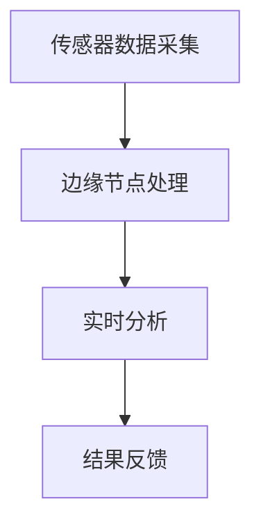
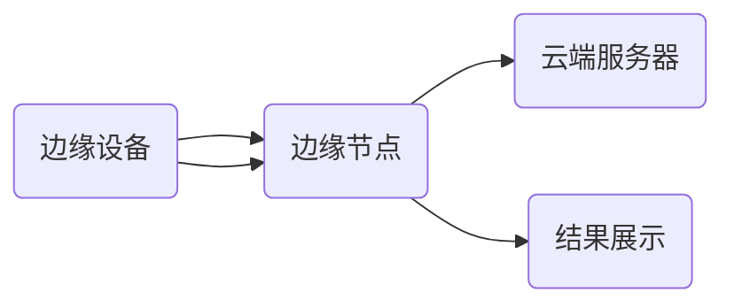
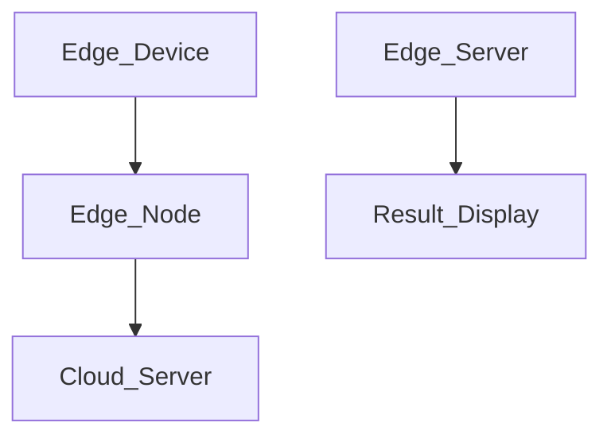
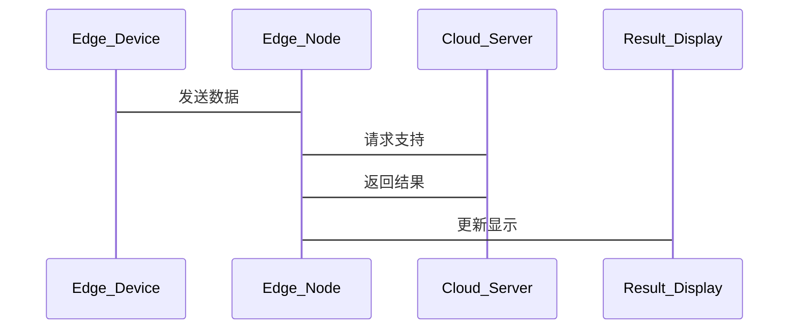
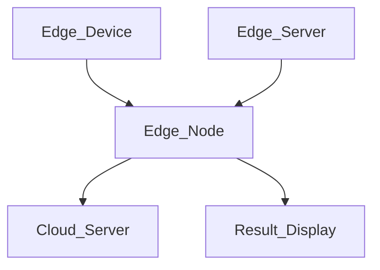

                 


# 全球股市估值与边缘计算在物联网中的应用

> **关键词**：全球股市估值，边缘计算，物联网，实时数据处理，数据隐私保护，系统架构设计
>
> **摘要**：本文探讨了全球股市估值的核心概念与影响因素，分析了边缘计算在物联网中的应用，详细阐述了边缘计算如何优化股市估值模型，并通过具体案例展示了边缘计算在物联网中的系统设计与实现。文章结合理论与实践，为技术从业者提供了深入的指导。

---

## 第一部分: 全球股市估值与边缘计算概述

### 第1章: 全球股市估值的基本概念

#### 1.1 股市估值的定义与重要性

**背景介绍**  
股市估值是指对股票价值的评估，旨在确定其合理的价格区间。它是投资者决策的核心依据，直接影响投资收益和风险控制。股市估值的核心在于分析公司基本面、宏观经济环境和市场情绪等因素。

**核心概念**  
- **股票价值**：反映公司资产、盈利能力和成长性的量化指标。
- **市场价值**：受供需关系和市场情绪影响的价格。
- **估值方法**：包括市盈率（P/E）、市净率（P/B）等。

**问题背景**  
传统估值方法依赖中心化数据处理，存在延迟和隐私泄露风险。边缘计算的引入可提升实时性和数据安全性。

**问题解决**  
通过边缘计算实时处理股市数据，优化估值模型，减少延迟，提升决策效率。

**边界与外延**  
股市估值的核心是公司基本面分析，边缘计算的应用扩展了数据处理的实时性和安全性。

---

#### 1.2 全球股市估值的影响因素

**背景介绍**  
影响股市估值的因素复杂多样，包括宏观经济指标、行业动态和公司基本面等。

**核心概念与联系**  

| 因素类别 | 具体因素 | 影响机制 |
|----------|----------|----------|
| 宏观经济 | 利率、GDP、通货膨胀 | 影响市场整体估值 |
| 行业动态 | 行业政策、竞争格局 | 影响行业估值水平 |
| 公司基本面 | 盈利能力、资产负债率 | 决定个股估值 |

**系统架构**  
股市估值系统包括数据采集、模型计算和结果展示三个模块。

---

### 第2章: 边缘计算在物联网中的应用

#### 2.1 边缘计算的定义与特点

**背景介绍**  
边缘计算将数据处理能力从云端转移至靠近数据源的边缘设备，减少延迟和带宽消耗。

**核心概念**  
- **边缘设备**：包括传感器、智能终端等。
- **边缘节点**：负责数据采集、处理和反馈。

**系统架构**  
- 数据采集：通过传感器获取实时数据。
- 数据处理：在边缘节点进行初步分析。
- 数据传输：将结果传至云端或终端。

**对比分析**  
边缘计算与云计算的区别在于数据处理的位置和实时性。

---

## 第二部分: 全球股市估值的数学模型与算法

### 第3章: 常见的股市估值模型

#### 3.1 市盈率模型

**背景介绍**  
市盈率（P/E）是衡量股票估值的重要指标，反映市场对公司的盈利预期。

**数学模型**  
$$ P/E = \frac{Stock Price}{Earnings Per Share} $$

**案例分析**  
某公司股价为50元，每股收益为5元，市盈率为10倍，表明市场对其未来盈利预期稳定。

---

### 第4章: 边缘计算在股市估值中的应用

#### 4.1 边缘计算在实时数据处理中的应用

**背景介绍**  
实时数据处理是边缘计算的核心优势，能够快速响应市场变化。

**算法原理**  



**代码实现**  
```python
import numpy as np
import pandas as pd

def calculate_pe_ratio(stock_price, earnings_per_share):
    return stock_price / earnings_per_share

# 示例数据
stock_prices = np.array([50, 60, 70])
earnings_per_share = np.array([5, 6, 7])

# 计算市盈率
pe_ratios = calculate_pe_ratio(stock_prices, earnings_per_share)
print("市盈率:", pe_ratios)
```

---

## 第三部分: 边缘计算在物联网中的系统架构与设计

### 第5章: 边缘计算的体系结构

#### 5.1 边缘计算的体系结构

**系统架构设计**  



**数据流程图**  



**接口设计**  
- 数据采集接口：REST API，用于接收传感器数据。
- 数据处理接口：函数接口，用于计算市盈率。

**交互序列图**  



---

### 第6章: 边缘计算在物联网中的数据处理

#### 6.1 边缘计算在数据隐私保护中的应用

**背景介绍**  
数据隐私保护是边缘计算的重要优势，能够防止数据在传输过程中被截获。

**算法原理**  



**数学模型**  
$$ Security = \frac{Data Confidentiality}{Data Exposure} $$

---

## 第四部分: 项目实战

### 第7章: 边缘计算在智能证券交易系统中的应用

#### 7.1 项目介绍

**项目目标**  
开发一个基于边缘计算的智能证券交易系统，实现实时数据处理和隐私保护。

**环境安装**  
- 操作系统：Linux
- 开发工具：PyCharm
- 第三方库：Flask、Pandas、numpy

#### 7.2 核心代码实现

**代码实现**  

```python
from flask import Flask, request, jsonify
import pandas as pd

app = Flask(__name__)

@app.route('/calculate_pe', methods=['POST'])
def calculate_pe():
    data = request.json
    stock_prices = data['stock_prices']
    earnings_per_share = data['earnings_per_share']
    pe_ratios = [stock_price / eps for stock_price, eps in zip(stock_prices, earnings_per_share)]
    return jsonify({'pe_ratios': pe_ratios})

if __name__ == '__main__':
    app.run(debug=True)
```

**代码解读**  
该代码实现了一个简单的API接口，接收股票价格和每股收益，计算市盈率并返回结果。

---

## 第五部分: 总结与展望

### 第8章: 总结与展望

**总结**  
边缘计算在股市估值和物联网中的应用显著提升了实时性和安全性，为投资者提供了更精准的决策支持。

**展望**  
未来，边缘计算将在更广泛的金融场景中发挥作用，如智能投顾和风险管理。

---

## 作者：AI天才研究院 & 禅与计算机程序设计艺术

---

本文通过系统性地分析全球股市估值与边缘计算在物联网中的应用，结合理论与实践，为技术从业者提供了全面的指导。

