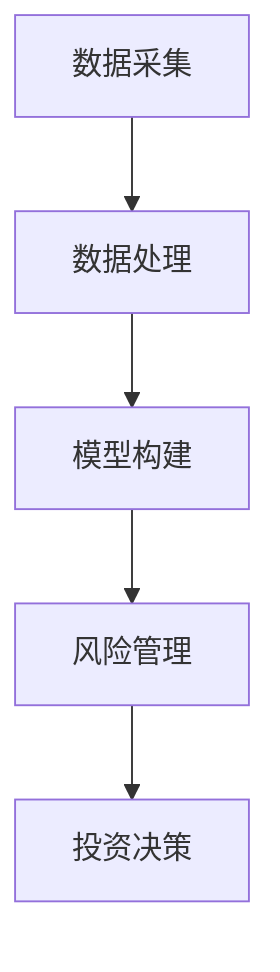

                 


# 如何利用特价股票策略进行逆向投资

## 关键词：逆向投资、特价股票、价值投资、市场分析、风险管理

## 摘要：本文系统地探讨了如何利用特价股票策略进行逆向投资，从基本概念到实战应用，详细分析了特价股票的特性、逆向投资的策略、市场分析的方法、风险管理的重要性，以及实际案例的分析。文章结合理论与实践，为投资者提供了从理论理解到实际操作的完整指导。

---

## 第一部分: 特价股票与逆向投资基础

### 第1章: 逆向投资与特价股票概述

#### 1.1 逆向投资的基本概念

##### 1.1.1 逆向投资的定义与特点
逆向投资是一种投资策略，强调在市场恐慌或低迷时期买入，而在市场繁荣时期卖出。其核心理念是“别人恐惧时我贪婪，别人贪婪时我恐惧”。逆向投资的特点包括：
- **非主流性**：与市场情绪相反操作。
- **长期视角**：注重公司长期价值，而非短期波动。
- **逆周期性**：在市场低谷时寻找机会。

##### 1.1.2 特价股票的定义与分类
特价股票是指市场价格低于其内在价值的股票。分类包括：
- **绝对特价股票**：价格显著低于合理估值。
- **相对特价股票**：价格在特定时间段内低于同类股票。
- **周期性特价股票**：受行业周期影响的特价股票。

##### 1.1.3 逆向投资与特价股票的关系
逆向投资的核心在于利用市场非理性波动，寻找被低估的资产。特价股票是逆向投资的理想标的，因为它们通常在市场低迷时出现，符合逆向投资的逻辑。

#### 1.2 逆向投资的背景与意义

##### 1.2.1 传统投资方式的局限性
传统投资常受市场情绪驱动，容易陷入追涨杀跌的误区。逆向投资通过反向操作，避免了这些局限性。

##### 1.2.2 逆向投资的优势与适用场景
优势：分散风险、捕捉低估机会、长期收益潜力大。适用场景：市场恐慌、经济衰退、行业低谷。

#### 1.3 逆向投资的基本原理

##### 1.3.1 市场情绪与价格波动的关系
市场情绪波动导致股票价格偏离其内在价值，逆向投资利用这一偏差，寻找低估机会。

##### 1.3.2 价值投资与逆向投资的联系
价值投资关注内在价值，逆向投资则在市场低谷时买入，两者强调长期价值。

##### 1.3.3 特价股票的识别与筛选标准
筛选标准包括低市盈率（P/E）、低市净率（P/B）、高股息率、稳定的财务表现等。

---

### 第2章: 特价股票的特性与识别方法

#### 2.1 特价股票的特性分析

##### 2.1.1 股票价格的低估特征
- **市盈率（P/E）**：低于行业平均水平。
- **市净率（P/B）**：低于行业平均水平。
- **股息率**：高于行业平均水平。

##### 2.1.2 公司基本面的稳定性
- **盈利能力**：ROE（净资产收益率）稳定。
- **财务健康**：低负债率，健康的现金流。
- **行业地位**：行业龙头，竞争优势明显。

##### 2.1.3 市场情绪的影响因素
- **市场恐慌**：投资者情绪低落，抛售股票。
- **媒体报道**：负面新闻可能导致股价被低估。

#### 2.2 特价股票的识别方法

##### 2.2.1 市盈率与市净率的分析
- **市盈率公式**：P/E = 价格/每股收益。
- **市净率公式**：P/B = 价格/每股净资产。

##### 2.2.2 财务指标的综合评估
- **ROE**：衡量公司盈利能力。
- **资产负债率**：评估公司财务风险。
- **现金流**：反映公司财务健康状况。

##### 2.2.3 市场周期与行业趋势的判断
- **行业周期**：选择行业低谷期的龙头公司。
- **宏观经济**：关注宏观经济政策对行业的影响。

---

### 第3章: 逆向投资的核心策略

#### 3.1 逆向投资的基本策略

##### 3.1.1 基于价值的选股策略
- **价值发现**：寻找市场价格低于内在价值的股票。
- **估值模型**：使用DCF模型评估内在价值。

##### 3.1.2 市场恐慌时期的买入机会
- **恐慌指数**：利用VIX指数判断市场恐慌程度。
- **市场下跌阶段**：在市场下跌过程中逐步建仓。

##### 3.1.3 特价股票的分阶段投资
- **初步筛选**：通过P/E、P/B等指标筛选候选股票。
- **深入分析**：研究公司基本面，确认低估原因。
- **分批买入**：在市场波动中分批建仓，降低风险。

#### 3.2 特价股票策略的实施步骤

##### 3.2.1 确定投资目标与风险承受能力
- **投资目标**：明确投资期限、收益目标。
- **风险承受能力**：评估个人对风险的容忍度。

##### 3.2.2 构建股票筛选模型
- **筛选指标**：P/E < 行业平均，P/B < 行业平均，ROE > 行业平均。
- **权重分配**：根据公司规模、行业地位调整权重。

##### 3.2.3 制定买入与卖出的时机策略
- **买入时机**：市场恐慌、指数下跌。
- **卖出时机**：市场回暖、股价回归合理估值。

---

## 第二部分: 逆向投资的系统分析与实战

### 第4章: 市场分析与逆向投资机会

#### 4.1 市场周期的分析

##### 4.1.1 牛市、熊市与震荡市的特征
- **牛市**：市场情绪高涨，股价普遍上涨。
- **熊市**：市场情绪低落，股价普遍下跌。
- **震荡市**：市场波动剧烈，方向不明确。

##### 4.1.2 市场情绪的量化指标
- **VIX指数**：反映市场波动性和恐慌程度。
- **资金流向**：监测资金流入流出情况。

##### 4.1.3 市场周期与逆向投资的关系
在熊市和震荡市中寻找特价股票，利用市场恐慌买入。

#### 4.2 特价股票的市场机会

##### 4.2.1 行业周期与公司基本面的结合
- **行业低谷期**：选择行业龙头。
- **公司基本面稳定**：ROE稳定，现金流健康。

##### 4.2.2 经济波动对股票价格的影响
- **经济衰退**：公司盈利下降，股价可能被低估。
- **经济复苏**：股价逐步回升。

##### 4.2.3 特价股票的长期投资价值
- **价值回归**：股价终将回归合理估值。
- **长期收益**：优质公司在经济复苏中表现优异。

---

## 第三部分: 逆向投资的进阶与心理调整

### 第5章: 逆向投资的心理调整与实战技巧

#### 5.1 投资者心理对决策的影响

##### 5.1.1 克服贪婪与恐惧
- **贪婪**：避免高位追涨。
- **恐惧**：利用市场恐慌寻找机会。

##### 5.1.2 坚持长期视角
- **短期波动**：忽略短期股价波动，关注长期价值。
- **耐心持有**：持有特价股票，等待价值回归。

#### 5.2 逆向投资的实战技巧

##### 5.2.1 分批建仓
- **分批买入**：降低建仓成本，分散风险。
- **动态调整**：根据市场变化调整持仓。

##### 5.2.2 结合技术分析
- **趋势线**：识别股价支撑位和阻力位。
- **成交量**：监测成交量变化，判断市场情绪。

---

## 第四部分: 逆向投资的系统架构与实战

### 第6章: 逆向投资的系统架构设计

#### 6.1 逆向投资系统的组成

##### 6.1.1 数据采集模块
- **数据源**：股票价格、财务报表、行业数据。
- **数据清洗**：处理缺失值、异常值。

##### 6.1.2 模型构建模块
- **估值模型**：DCF模型、市盈率模型。
- **筛选策略**：基于P/E、P/B等指标的筛选。

##### 6.1.3 风险管理模块
- **止损设置**：设定止损点，控制单次亏损。
- **仓位管理**：根据市场情况调整持仓比例。

#### 6.2 逆向投资系统的实现

##### 6.2.1 数据采集与处理
- **Python代码示例**：
  ```python
  import pandas as pd
  # 从数据库获取数据
  df = pd.read_sql("SELECT * FROM stock_prices", conn)
  # 数据清洗
  df.dropna(inplace=True)
  ```

##### 6.2.2 模型构建与筛选
- **Python代码示例**：
  ```python
  # 筛选P/E < 行业平均的股票
  def screen_stocks(df, industry_avg):
      return df[df['P/E'] < industry_avg]
  ```

##### 6.2.3 系统架构图


---

## 附录: 逆向投资实战工具与资源

- **工具推荐**：Pyfolio、Backtrader、Zipline。
- **数据源**：Yahoo Finance、Quandl、Polygon。
- **书籍推荐**：《逆向思考》、《投资的真相》。

---

## 作者：AI天才研究院/AI Genius Institute & 禅与计算机程序设计艺术 /Zen And The Art of Computer Programming

---

通过以上结构，本文系统地介绍了如何利用特价股票策略进行逆向投资，从理论到实践，从基础到进阶，为投资者提供了全面的指导。

