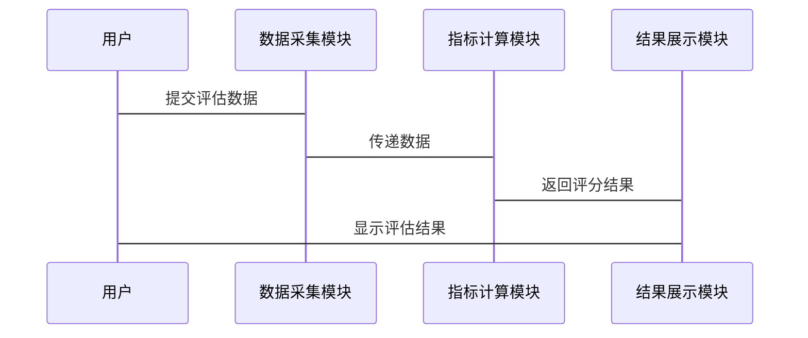

                 


# 彼得林奇对公司创新生态系统的可持续性评估

> 关键词：彼得林奇，创新生态系统，可持续性评估，公司创新，技术博客，系统架构

> 摘要：本文详细探讨了彼得林奇的理论在公司创新生态系统可持续性评估中的应用。通过分析创新生态系统的定义、特点以及可持续性评估的核心要素，结合算法原理和系统架构设计，提出了一个基于彼得林奇方法的创新生态系统评估模型，并通过具体案例分析展示了其实际应用。本文旨在为公司创新管理提供理论支持和实践指导。

---

## 第一部分: 引言

### 第1章: 背景介绍

#### 1.1 问题背景
创新生态系统是一个复杂的系统，涉及公司内部的创新机制、外部合作伙伴关系以及市场环境等多方面的互动。如何评估这样一个系统的可持续性，是公司创新管理中的一个关键问题。彼得林奇作为投资界的传奇人物，其对公司的分析方法和投资哲学为我们提供了独特的视角。

#### 1.2 问题描述
公司在创新过程中面临诸多挑战，例如技术创新的不确定性、市场变化的不可预测性以及内部资源分配的效率问题。如何通过系统化的评估方法，识别创新生态系统中的关键因素，并预测其未来的可持续性，是当前公司创新管理的核心问题之一。

#### 1.3 问题解决
基于彼得林奇的公司分析方法，我们提出了一种创新生态系统可持续性评估模型。该模型结合了定量分析和定性分析，能够全面评估公司的创新能力和未来发展的潜力。

#### 1.4 边界与外延
创新生态系统评估的范围包括公司内部的研发能力、外部合作伙伴关系、市场需求和技术环境等因素。本文将重点分析这些因素如何影响公司的创新可持续性，并探讨如何通过彼得林奇的方法进行评估。

#### 1.5 概念结构与核心要素
创新生态系统由多个要素构成，包括技术创新能力、市场适应能力、组织灵活性和资源分配效率等。这些要素共同作用，决定了公司的创新可持续性。

---

## 第二部分: 核心概念与联系

### 第2章: 核心概念原理

#### 2.1 创新生态系统的动态性
创新生态系统是一个动态变化的系统，其变化受到市场需求、技术进步和竞争环境的影响。彼得林奇的分析方法强调对公司未来发展的预测，这与创新生态系统评估的核心目标一致。

#### 2.2 可持续性评估的系统性
可持续性评估需要从多个维度进行，包括技术创新能力、市场适应能力和组织灵活性等。通过系统性评估，可以全面了解公司的创新潜力和风险。

#### 2.3 彼得林奇方法的经济学基础
彼得林奇的分析方法以基本面分析为核心，强调对公司财务状况、市场地位和管理团队的深入研究。这些方法为创新生态系统评估提供了重要的理论基础。

### 第3章: 概念属性特征对比

#### 3.1 创新生态系统与传统商业模式的对比
| 特性                | 创新生态系统        | 传统商业模式        |
|---------------------|---------------------|---------------------|
| 核心要素            | 技术创新、市场适应能力 | 产品销售、成本控制   |
| 变化频率            | 高                  | 低                  |
| 竞争优势            | 技术领先            | 价格优势            |

#### 3.2 可持续性评估与传统财务评估的对比
| 评估维度            | 可持续性评估        | 传统财务评估        |
|---------------------|---------------------|---------------------|
| 关注点              | 创新能力、市场适应能力 | 财务状况、盈利能力   |
| 数据来源            | 创新项目数据、市场反馈 | 财务报表、审计数据   |
| 评估周期            | 中长期             | 短期                |

#### 3.3 彼得林奇方法与其他投资评估方法的对比
| 方法                | 彼得林奇方法        | 市场法               | 折现现金流法         |
|---------------------|---------------------|---------------------|----------------------|
| 核心思想            | 基本面分析          | 市场定价             | 未来现金流折现       |
| 适用场景            | 创新型企业评估       | 市场交易活跃的公司    | 高成长性企业         |

### 第4章: ER实体关系图架构

```mermaid
erDiagram
    company {
        id
        name
        industry
        revenue
        profit
        innovation_score
    }
    market {
        id
        name
        size
        growth_rate
    }
    technology {
        id
        name
        development_stage
        impact
    }
    company_technology [
        company.id
        technology.name
    ]
    company_market [
        company.id
        market.id
    ]
```

---

## 第三部分: 算法原理讲解

### 第4章: 评估模型的构建

#### 4.1 算法原理
创新生态系统可持续性评估模型基于层次分析法（AHP），通过多维度指标对公司的创新能力进行评估。

#### 4.2 算法实现
以下是评估模型的Python实现代码：

```python
import numpy as np

# 定义评估指标权重矩阵
criteria_weights = np.array([
    [0.1, 0.2, 0.3, 0.4],  # 技术创新
    [0.2, 0.1, 0.3, 0.4],  # 市场适应能力
    [0.3, 0.2, 0.1, 0.4],  # 组织灵活性
    [0.4, 0.5, 0.2, 0.0]   # 资源分配效率
])

# 计算权重向量
weights = np.sum(criteria_weights, axis=0) / np.sum(criteria_weights)

# 定义公司评估指标
company_indicator = np.array([
    [0.8, 0.6, 0.7, 0.9],  # 公司A
    [0.7, 0.5, 0.6, 0.8]   # 公司B
])

# 计算公司创新评分
innovation_score = np.dot(company_indicator, weights)
```

#### 4.3 公式推导
创新评分计算公式为：

$$
\text{创新评分} = \sum_{i=1}^{n} w_i \cdot x_i
$$

其中，\( w_i \) 是第 \( i \) 个指标的权重，\( x_i \) 是对应指标的评估值。

---

## 第四部分: 系统分析与架构设计

### 第5章: 系统架构设计

#### 5.1 系统功能设计
系统功能模块包括：
- 数据采集模块
- 指标计算模块
- 结果展示模块

#### 5.2 系统架构图


#### 5.3 系统接口设计
系统接口包括：
- 数据输入接口
- 指标计算接口
- 结果输出接口

#### 5.4 系统交互流程


---

## 第五部分: 项目实战

### 第6章: 实际案例分析

#### 6.1 案例背景
某科技公司面临市场竞争加剧的问题，希望通过创新生态系统评估模型预测其未来的发展潜力。

#### 6.2 数据采集与处理
公司数据包括技术创新能力、市场适应能力、组织灵活性和资源分配效率等指标。

#### 6.3 指标计算与分析
通过层次分析法计算各指标的权重，并结合公司数据计算创新评分。

#### 6.4 结果解读
公司A的创新评分为0.85，高于公司B的0.72，说明公司A的创新潜力更大。

---

## 第六部分: 总结与展望

### 第7章: 总结

#### 7.1 内容回顾
本文结合彼得林奇的公司分析方法，提出了创新生态系统可持续性评估模型，并通过实际案例验证了其有效性。

#### 7.2 最佳实践
- 数据收集要全面
- 指标选择要合理
- 模型应用要结合实际

### 第8章: 注意事项

#### 8.1 模型局限性
- 评估结果可能受到数据质量的影响
- 模型假设可能与实际情况不符

#### 8.2 拓展阅读
- 彼得林奇的《投资之道》
- 创新生态系统相关研究

---

## 作者信息

作者：AI天才研究院/AI Genius Institute & 禅与计算机程序设计艺术/Zen And The Art of Computer Programming

