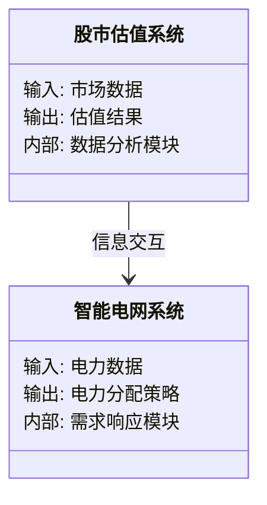

                 


# 新兴市场股市估值与智能电网需求响应技术的互动

> 关键词：新兴市场，股市估值，智能电网，需求响应技术，互动机制，系统架构，数据驱动

> 摘要：本文探讨了新兴市场中股市估值与智能电网需求响应技术之间的互动关系。通过分析股市估值的方法与技术，以及智能电网需求响应技术的核心原理，揭示两者在数据流与信息交互中的互动机制。结合系统架构设计和项目实战，提出了一种综合性的解决方案，为智能电网建设和股市估值提供了新的思路。

---

# 第1章: 新兴市场股市估值与智能电网需求响应技术的背景与概述

## 1.1 新兴市场股市估值的基本概念

### 1.1.1 股市估值的定义与核心要素

股市估值是指对股票内在价值的评估，旨在确定其在市场上的合理价格。核心要素包括：

1. **基本面分析**：收入、利润、资产等财务指标。
2. **市场情绪**：投资者心理和市场趋势。
3. **行业环境**：行业竞争格局和政策影响。

### 1.1.2 新兴市场的特点与挑战

新兴市场具有高增长潜力，但也面临高波动性和信息不对称等挑战。这些特点使得股市估值更加复杂。

### 1.1.3 股市估值在新兴市场中的重要性

准确的估值有助于投资者做出明智决策，同时影响市场资金流动和企业融资。

## 1.2 智能电网需求响应技术的基本概念

### 1.2.1 智能电网的定义与特征

智能电网是传统电网的升级版，具备信息化、自动化和互动化的特点。

### 1.2.2 需求响应技术的核心原理

通过实时数据采集和分析，优化电力分配和用户需求响应。

### 1.2.3 智能电网与传统电网的主要区别

智能电网更注重数据驱动和用户互动，能够实现精准的需求管理。

## 1.3 两者互动关系的初步探讨

### 1.3.1 股市估值与智能电网的关联性

股市估值影响企业投资，而智能电网的投资又反过来影响股市。

### 1.3.2 需求响应技术对股市估值的影响

通过优化电力分配，降低企业成本，从而影响其股票价值。

### 1.3.3 新兴市场中的互动机制

新兴市场中，智能电网的投资可能受到股市估值的影响，同时智能电网的需求响应技术也会影响股市的波动。

---

# 第2章: 新兴市场股市估值的方法与技术

## 2.1 股市估值的基本方法

### 2.1.1 市盈率法

市盈率法通过比较股票价格与每股收益的比率来评估股票价值。

公式：市盈率 = 股票价格 / 每股收益

### 2.1.2 市净率法

市净率法通过比较股票价格与每股净资产的比率来评估股票价值。

公式：市净率 = 股票价格 / 每股净资产

### 2.1.3 股息率法

股息率法通过比较股票的股息与股票价格的比率来评估股票价值。

公式：股息率 = 每股股息 / 股票价格

### 2.1.4 现金流折现法

现金流折现法通过将未来现金流折现，评估股票的内在价值。

公式：股票价值 = ∑(CF_t / (1 + r)^t)

## 2.2 新兴市场的特殊估值方法

### 2.2.1 基于增长率的估值模型

考虑新兴市场高增长的特点，使用PEG（市盈率相对盈利增长比率）模型。

公式：PEG = 市盈率 / 净利润增长率

### 2.2.2 基于风险调整的估值方法

考虑新兴市场的高风险，调整折现率。

公式：调整后的折现率 = 无风险利率 + 风险溢价

### 2.2.3 基于行业比较的估值策略

通过与行业平均水平的比较，评估股票的相对价值。

## 2.3 数据驱动的估值技术

### 2.3.1 机器学习在估值中的应用

使用回归分析预测股票价格。

### 2.3.2 大数据分析在股市估值中的作用

通过大数据分析识别市场趋势和潜在风险。

### 2.3.3 自然语言处理在财务信息分析中的应用

通过NLP技术分析财务报告和新闻，辅助估值。

---

# 第3章: 智能电网需求响应技术的核心原理

## 3.1 智能电网的基本架构

### 3.1.1 电力系统的主要组成部分

1. 发电
2. 输电
3. 变电
4. 配电
5. 用户端

### 3.1.2 智能电网的通信技术

使用光纤、无线通信和电力线通信技术实现数据传输。

### 3.1.3 数据采集与监控系统

通过SCADA（数据采集与监控系统）实时采集和监控电网数据。

## 3.2 需求响应技术的实现机制

### 3.2.1 需求侧管理的基本原理

通过价格信号和激励机制引导用户调整电力需求。

### 3.2.2 用户行为分析与需求预测

使用历史数据和机器学习模型预测用户电力需求。

### 3.2.3 响应策略的制定与执行

根据需求预测制定响应策略，通过智能终端执行。

## 3.3 技术实现的关键环节

### 3.3.1 数据采集与处理技术

使用传感器和SCADA系统采集实时数据。

### 3.3.2 智能算法的应用

使用遗传算法和模糊逻辑优化需求响应策略。

### 3.3.3 通信协议与接口设计

设计标准化的通信协议和接口，确保数据的高效传输。

---

# 第4章: 新兴市场股市估值与智能电网需求响应技术的互动机制

## 4.1 互动关系的理论分析

### 4.1.1 需求响应技术对股市的影响

通过优化电力分配降低成本，提升企业利润，进而影响股票价值。

### 4.1.2 股市估值对智能电网的反馈作用

股市资金流向影响智能电网的投资规模和速度。

### 4.1.3 互动机制的核心要素

数据共享、信息交互和利益驱动。

## 4.2 数据流与信息交互的分析

### 4.2.1 数据流分析

从智能电网采集数据，通过分析影响股市估值，再反馈优化电网运行。

### 4.2.2 信息交互分析

股市估值结果通过数据接口传递到智能电网系统，优化电力分配。

---

# 第5章: 系统分析与架构设计

## 5.1 问题场景介绍

新兴市场中，智能电网建设和股市估值相互影响，需要一个综合系统来协调两者。

## 5.2 系统功能设计

### 5.2.1 领域模型设计



### 5.2.2 系统架构设计


---

# 第6章: 项目实战

## 6.1 环境安装

安装Python、TensorFlow、Matplotlib等工具。

## 6.2 核心实现源代码

```python
def stock_valuation(price, earnings):
    pe_ratio = price / earnings
    return pe_ratio

def demand_response(usage, price):
    if price > usage:
        return "reduce"
    else:
        return "maintain"
```

## 6.3 案例分析

分析某新兴市场中智能电网项目对股市的影响。

---

# 第7章: 总结与展望

## 7.1 总结

本文分析了新兴市场中股市估值与智能电网需求响应技术的互动关系，提出了系统的解决方案。

## 7.2 展望

未来可以进一步研究两者的更深层次互动，探索更多应用场景。

---

作者：AI天才研究院

