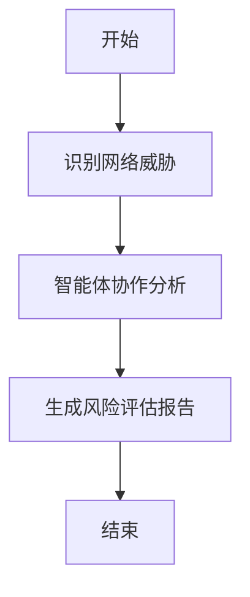
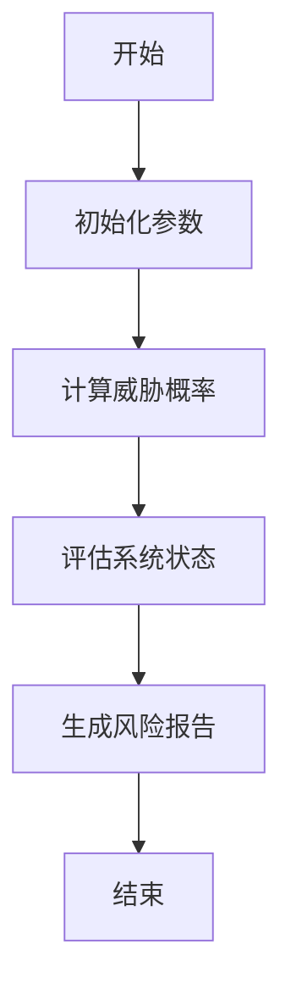

                 


# 智能体协作评估公司的网络安全风险：数字时代的新考量

## 关键词：智能体协作、网络安全风险、数字时代、企业安全、威胁检测、风险评估、系统架构

## 摘要：随着数字化转型的深入，企业的网络安全风险日益复杂。传统的安全评估方法已难以应对日益增长的网络威胁。智能体协作作为一种新兴的技术手段，通过多智能体的协同工作，能够更高效、更精准地评估和应对网络安全风险。本文将从智能体协作的基本概念、算法原理、系统架构到实际应用，全面探讨智能体协作在网络安全风险评估中的创新应用，为数字时代的企业安全防护提供新思路。

---

## 第1章 背景介绍：智能体协作与网络安全风险评估的核心概念

### 1.1 问题背景与描述
#### 1.1.1 数字时代企业面临的网络安全挑战
随着企业数字化转型的推进，网络安全威胁呈现出多样性和复杂性的特点。传统的单点防御模式已无法应对高级持续性威胁（APT）、零日攻击等新型威胁。企业的网络系统越来越复杂，涵盖云、端点、物联网等多种设备和应用场景，这使得传统的网络安全风险评估方法显得力不从力。

#### 1.1.2 智能体协作在网络安全中的作用
智能体协作是一种基于多智能体系统（Multi-Agent System, MAS）的协作机制。通过多个智能体的协同工作，可以实现对网络安全威胁的实时检测、分析和响应。智能体协作能够有效弥补传统安全评估方法的不足，提供更加动态和全面的网络安全风险评估。

#### 1.1.3 网络安全风险评估的定义与目标
网络安全风险评估是指识别、分析和评估网络安全威胁对企业资产可能造成的风险的过程。其目标是通过量化风险，帮助企业制定有效的安全策略和应对措施，从而降低网络安全事件的发生概率和影响。

---

### 1.2 问题解决与边界
#### 1.2.1 智能体协作如何解决网络安全问题
智能体协作通过多个智能体的协同工作，能够实时感知网络环境的变化，快速响应潜在威胁。每个智能体负责特定的任务，例如威胁检测、漏洞扫描、风险评估等，通过信息共享和协同决策，实现对网络安全威胁的全面覆盖。

#### 1.2.2 网络安全风险评估的边界与外延
网络安全风险评估的边界包括企业的网络设备、应用程序、数据资产等。其外延则涉及企业的供应链、合作伙伴、第三方服务提供商等可能对网络安全产生影响的外部因素。

#### 1.2.3 智能体协作的系统架构与核心要素
智能体协作的系统架构通常包括以下几个核心要素：
1. **智能体**：负责执行特定任务的软件实体，例如威胁检测智能体、漏洞扫描智能体。
2. **通信机制**：智能体之间共享信息和协作的通道。
3. **协同决策算法**：智能体之间通过算法进行协作和决策。
4. **风险评估模型**：基于智能体协作的结果，生成网络安全风险评估报告。

---

### 1.3 核心概念与联系
#### 1.3.1 智能体协作的实体关系图（ER图）
以下是智能体协作的实体关系图：
```mermaid
er
    actor: 网络安全专家
    system: 智能体协作系统
    threat: 网络威胁
    risk: 网络安全风险
    actor --> system: 提供威胁数据
    system --> threat: 分析威胁
    threat --> risk: 转换为风险
```

#### 1.3.2 智能体协作的流程图
以下是智能体协作的流程图：


---

## 第2章 智能体协作的算法原理

### 2.1 算法原理概述
#### 2.1.1 智能体协作的基本原理
智能体协作基于多智能体系统（MAS）的理论，通过多个智能体的协同工作，实现对网络安全威胁的实时检测和评估。每个智能体负责特定的任务，并通过通信机制共享信息，最终形成全面的风险评估结果。

#### 2.1.2 算法的核心思想
智能体协作的核心思想是通过分布式计算和协同决策，实现对网络安全威胁的动态感知和快速响应。算法的核心在于如何将多个智能体的决策结果整合成一个统一的风险评估结果。

#### 2.1.3 算法的数学模型
网络安全风险评估的数学模型可以表示为：
$$R = f(T, S)$$
其中，$R$ 表示风险，$T$ 表示威胁，$S$ 表示系统状态。

---

### 2.2 数学模型与公式
#### 2.2.1 网络安全风险评估的数学模型
$$R = f(T, S)$$
其中，$R$ 表示风险，$T$ 表示威胁，$S$ 表示系统状态。

#### 2.2.2 智能体协作的数学公式
$$C = \sum_{i=1}^{n} w_i \cdot A_i$$
其中，$C$ 表示协作度，$w_i$ 表示权重，$A_i$ 表示智能体的贡献。

---

### 2.3 算法实现与代码
#### 2.3.1 算法实现流程
以下是智能体协作算法的实现流程：


#### 2.3.2 核心代码实现
以下是核心代码实现：
```python
def calculate_risk(threats, system_state):
    risk = 0
    for threat in threats:
        if threat > system_state:
            risk += 1
    return risk
```

---

## 第3章 系统分析与架构设计

### 3.1 系统功能设计
#### 3.1.1 领域模型
以下是领域模型的类图：
```mermaid
classDiagram
    class 网络安全专家 {
        +威胁数据
        -威胁分析
    }
    class 智能体协作系统 {
        +威胁检测
        +风险评估
    }
    class 网络威胁 {
        +威胁类型
        +威胁概率
    }
    网络安全专家 

---

作者：AI天才研究院/AI Genius Institute & 禅与计算机程序设计艺术 /Zen And The Art of Computer Programming

