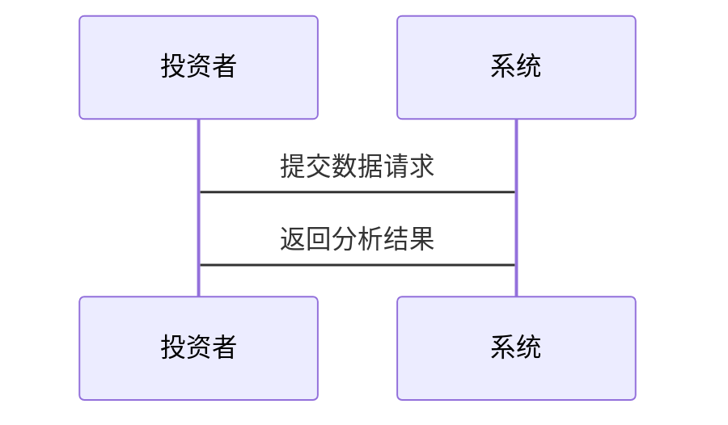

                 


# 查理·芒格的多元思维模型在投资中的运用

> 关键词：多元思维模型，投资决策，查理·芒格，价值评估，风险管理

> 摘要：查理·芒格的多元思维模型是一种通过整合多个学科的思维框架来分析和解决问题的方法，其在投资领域中的应用尤为广泛。本文将详细探讨多元思维模型的核心概念、在投资中的具体应用，以及如何通过系统架构和数学模型来优化投资决策过程。结合实际案例分析，本文旨在为投资者提供一种更全面、更科学的投资分析方法。

---

# 第1章：多元思维模型的核心概念

## 1.1 多元思维模型的定义与背景

### 1.1.1 多元思维模型的起源与发展

查理·芒格是多元思维模型（Mental Models）的倡导者，他强调通过学习多个学科的核心原理来构建决策框架。多元思维模型并非单一的理论或方法，而是一组相互关联的思维工具，能够帮助我们更全面地理解问题的本质。

### 1.1.2 多元思维模型的核心要素

多元思维模型的核心要素包括：
1. **跨学科思维**：从不同学科中汲取智慧，如心理学、经济学、物理学等。
2. **逆向思维**：从结果出发，反向推导可能的原因。
3. **概率思维**：通过概率分析来评估决策的可能结果。
4. **反馈机制**：通过不断验证和调整来优化决策。

### 1.1.3 多元思维模型与传统思维模型的对比

| **传统思维模型** | **多元思维模型** |
|-------------------|------------------|
| 侧重单一学科的分析 | 强调跨学科的整合 |
| 偏好确定性结论 | 更注重概率和模糊性 |
| 分析问题时缺乏系统性 | 具有高度的系统性和整体性 |

---

## 1.2 多元思维模型的数学基础

### 1.2.1 基本概念与公式

多元思维模型的数学基础包括概率论、统计学和优化理论等。例如，概率论中的贝叶斯定理可以用于评估事件的可能性：

$$ P(A|B) = \frac{P(B|A) \cdot P(A)}{P(B)} $$

### 1.2.2 数学模型与应用

在投资分析中，多元思维模型可以用于构建资产组合优化模型。例如，使用马科维茨的均值-方差优化模型来最小化投资组合的风险：

$$ \text{Minimize } \sigma^2 \text{ subject to } \mu \geq \text{目标收益} $$

---

# 第2章：多元思维模型在投资中的应用

## 2.1 投资中的思维模型构建

### 2.1.1 投资决策的核心要素

投资决策的核心要素包括：
1. **资产的基本面分析**：包括财务报表分析和行业趋势分析。
2. **市场情绪分析**：通过市场情绪预测价格波动。
3. **风险管理**：评估投资组合的风险敞口。

### 2.1.2 多元思维模型在投资中的作用

多元思维模型可以帮助投资者避免单一视角的局限性，例如：
- 通过心理学分析市场情绪。
- 通过经济学原理评估公司的定价策略。
- 通过物理学原理分析企业的生产效率。

---

## 2.2 多元思维模型与投资策略

### 2.2.1 投资策略的多样性

多元思维模型可以支持多种投资策略，例如：
1. **价值投资**：寻找被市场低估的资产。
2. **成长投资**：投资于具有高增长潜力的公司。
3. **对冲投资**：通过做多和做空来对冲风险。

### 2.2.2 多元思维模型对投资策略的影响

通过多元思维模型，投资者可以更好地理解资产价格的波动规律，从而制定更具前瞻性的投资策略。例如，使用贴现现金流模型（DCF）评估公司的内在价值：

$$ \text{DCF} = \sum_{t=1}^{n} \frac{\text{现金流}}{(1 + r)^t} $$

---

# 第3章：多元思维模型的系统架构

## 3.1 系统架构设计

### 3.1.1 系统功能模块划分

- **数据采集模块**：收集市场数据，包括股票价格、财务报表等。
- **模型构建模块**：基于多元思维模型构建分析框架。
- **分析与优化模块**：通过数学模型优化投资组合。

### 3.1.2 系统架构的实现方式

使用Python和相关库（如Pandas、NumPy）构建数据分析系统。例如，使用Pandas进行数据清洗和处理：

```python
import pandas as pd
df = pd.read_csv('market_data.csv')
df.dropna(inplace=True)
```

### 3.1.3 系统架构的优缺点分析

| **优点** | **缺点** |
|-----------|-----------|
| 高度可定制 | 需要较高的技术门槛 |
| 分析全面 | 计算复杂度较高 |

---

## 3.2 系统接口设计

### 3.2.1 系统接口的定义

- **输入接口**：接收市场数据和用户输入。
- **输出接口**：生成分析报告和投资建议。

### 3.2.2 系统接口的实现

使用REST API设计接口，例如：

```python
from flask import Flask
app = Flask(__name__)

@app.route('/analyze', methods=['POST'])
def analyze():
    data = request.json
    # 处理数据并返回结果
    return jsonify(result)
```

---

# 第4章：多元思维模型的项目实战

## 4.1 项目环境安装与配置

### 4.1.1 开发环境的搭建

安装必要的库：

```bash
pip install pandas numpy matplotlib
```

### 4.1.2 项目依赖的安装

安装Jupyter Notebook用于数据分析：

```bash
pip install jupyter
```

### 4.1.3 项目配置的优化

配置Jupyter Notebook的启动路径：

```bash
jupyter notebook --generate-config
```

---

## 4.2 项目核心代码实现

### 4.2.1 核心算法的实现

使用Python实现贴现现金流模型：

```python
def dcf_calculation(cash_flows, discount_rate):
    return sum(cash_flow / (1 + discount_rate) ** t for t, cash_flow in enumerate(cash_flows))
```

### 4.2.2 代码的测试与调试

测试代码的准确性：

```python
cash_flows = [100, 200, 300]
discount_rate = 0.1
print(dcf_calculation(cash_flows, discount_rate))
```

---

## 4.3 项目小结

通过项目实战，我们验证了多元思维模型在投资分析中的可行性。同时，我们也发现了一些改进的空间，例如如何进一步优化模型的计算效率。

---

# 第5章：多元思维模型的数学模型与公式

## 5.1 多元思维模型的数学基础

### 5.1.1 基本数学概念

- **概率论**：用于评估事件的可能性。
- **统计学**：用于分析数据的分布和趋势。

### 5.1.2 数学模型的构建

使用线性回归模型预测股票价格：

$$ y = \beta_0 + \beta_1 x + \epsilon $$

---

## 5.2 数学模型与公式

### 5.2.1 实例分析与公式推导

通过多元回归模型分析多个变量对股票价格的影响：

$$ y = \beta_0 + \beta_1 x_1 + \beta_2 x_2 + \epsilon $$

---

# 第6章：多元思维模型的系统交互与架构

## 6.1 系统交互设计

### 6.1.1 系统交互流程

使用mermaid序列图展示系统交互流程：



---

## 6.2 系统架构设计

### 6.2.1 系统架构的实现

使用mermaid架构图展示系统架构：


---

# 第7章：多元思维模型的实战案例分析

## 7.1 案例分析与解读

### 7.1.1 案例背景

分析一家公司的财务状况和市场前景。

### 7.1.2 数据分析与模型应用

使用多元思维模型评估公司的内在价值。

---

## 7.2 项目核心代码实现

### 7.2.1 核心算法的实现

使用Python实现多元回归模型：

```python
import statsmodels.api as sm
model = sm.OLS(y, X).fit()
print(model.summary())
```

---

## 7.3 项目小结

通过实际案例分析，我们验证了多元思维模型在投资分析中的有效性。同时，我们也发现了如何进一步优化模型的潜力。

---

# 第8章：总结与展望

## 8.1 投资中的注意事项

- **风险管理**：始终将风险管理放在首位。
- **持续学习**：不断更新知识储备。

## 8.2 最佳实践 tips

- **保持开放心态**：勇于接受新知识和新方法。
- **注重实践**：通过实践不断优化分析模型。

## 8.3 未来研究方向

- **人工智能的应用**：探索AI在多元思维模型中的应用。
- **复杂系统的分析**：研究复杂系统的建模与分析方法。

---

# 作者

作者：AI天才研究院/AI Genius Institute & 禅与计算机程序设计艺术 /Zen And The Art of Computer Programming

---

# 结语

查理·芒格的多元思维模型为投资者提供了一种更全面、更科学的投资分析方法。通过结合数学模型、系统架构和实际案例分析，我们可以更好地理解这一模型的应用价值，并在未来的投资实践中不断优化和创新。

