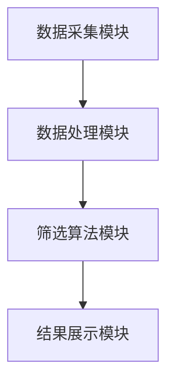

                 


# 《格雷厄姆特价股票理论对公司财务政策的影响》

> 关键词：格雷厄姆投资理论，特价股票，公司财务政策，价值投资，股票筛选算法

> 摘要：本文系统地探讨了格雷厄姆特价股票理论对公司财务政策的影响。首先，从格雷厄姆投资理论的背景、核心概念以及与现代投资理论的对比入手，分析了其对财务政策制定的指导意义。接着，通过数学模型和算法原理，详细阐述了格雷厄姆安全边际计算和内在价值评估的具体方法。最后，结合系统分析和架构设计，提出了基于格雷厄姆理论的股票筛选系统，并通过项目实战验证了该理论在实际财务决策中的应用价值。

---

# 第一部分：格雷厄姆特价股票理论的背景与核心概念

## 第1章：格雷厄姆特价股票理论概述

### 1.1 格雷厄姆投资理论的起源与发展

#### 1.1.1 价值投资的起源
价值投资作为一种投资策略，起源于20世纪初，其核心思想是寻找市场价格低于其内在价值的证券。本杰明·格雷厄姆是这一理论的奠基人，他通过分析市场的非效率性和投资者的心理行为，提出了价值投资的方法。

#### 1.1.2 格雷厄姆的学术贡献
格雷厄姆是哥伦比亚大学的教授，他的学生包括沃伦·巴菲特等著名投资者。格雷厄姆在《证券分析》一书中详细阐述了价值投资的方法，强调了安全边际的重要性。

#### 1.1.3 格雷厄姆理论的现代发展
随着金融市场的复杂化，格雷厄姆的理论不断被补充和发展。现代投资者结合量化分析和大数据技术，将价值投资的策略应用到更广泛的资产类别中。

---

### 1.2 特价股票的核心概念

#### 1.2.1 特价股票的定义
特价股票是指市场价格低于其内在价值的股票。格雷厄姆认为，这种股票具有安全边际，即市场价格与内在价值之间的差额提供了保护，以防止市场价格的波动。

#### 1.2.2 特价股票的特征
- 低市盈率（P/E比率）：市盈率低于行业平均水平。
- 低市净率（P/B比率）：市净率低于行业平均水平。
- 高股息率：相对于市场平均水平，股息收益率较高。

#### 1.2.3 特价股票与市场周期的关系
格雷厄姆认为，特价股票的出现与市场周期密切相关。在市场低迷时期，许多优质股票可能会被低估，从而成为特价股票。

---

### 1.3 格雷厄姆投资策略的基本原则

#### 1.3.1 安全边际的概念
安全边际是指市场价格与内在价值之间的差额。格雷厄姆认为，安全边际越大，投资的风险越小。

#### 1.3.2 内在价值的计算
内在价值是基于公司基本面分析得出的，包括盈利能力、成长性和财务状况等因素。

#### 1.3.3 投资组合的构建策略
格雷厄姆建议投资者构建多元化的投资组合，以分散风险。他强调长期投资，避免频繁交易。

---

## 第2章：格雷厄姆理论与公司财务政策的关联

### 2.1 公司财务政策的基本框架

#### 2.1.1 财务政策的定义与分类
财务政策是指公司管理层在财务管理方面的决策，包括资本结构、股利政策、融资策略等。

#### 2.1.2 财务政策的核心要素
- 资本结构：公司债务与股权的比例。
- 股利政策：公司分配给股东的利润比例。
- 融资策略：公司筹集资金的方式。

#### 2.1.3 财务政策与企业价值的关系
良好的财务政策能够提高企业价值，增强投资者信心。

---

### 2.2 格雷厄姆理论对公司财务政策的影响

#### 2.2.1 特价股票投资与公司估值
格雷厄姆理论强调了公司内在价值的重要性，这使得公司在制定财务政策时更加注重基本面分析。

#### 2.2.2 财务杠杆与资本结构
格雷厄姆认为，过高的财务杠杆会增加公司的财务风险。因此，公司在制定资本结构政策时，应合理控制债务比例。

#### 2.2.3 现金流管理与股东价值
格雷厄姆强调现金流的重要性，认为公司应注重现金流管理，以实现股东价值的最大化。

---

### 2.3 格雷厄姆理论与现代财务政策的结合

#### 2.3.1 现代企业财务政策的演变
随着金融市场的变化，现代财务政策更加注重量化分析和风险控制。

#### 2.3.2 格雷厄姆理论的适用性分析
格雷厄姆理论适用于长期投资和价值投资，但在短期市场波动较大的情况下，可能需要结合其他策略。

#### 2.3.3 财务政策优化的路径
公司应结合格雷厄姆理论，制定符合自身特点的财务政策，注重内在价值和风险控制。

---

# 第二部分：格雷厄姆特价股票理论的数学模型与算法原理

## 第3章：格雷厄姆特价股票筛选的数学模型

### 3.1 格雷厄姆安全边际的计算公式

#### 3.1.1 安全边际的定义
安全边际 = 内在价值 - 市场价格

#### 3.1.2 安全边际的计算公式
$$
\text{安全边际} = \text{内在价值} - \text{市场价格}
$$

#### 3.1.3 安全边际的应用案例
假设某股票的内在价值为50元，市场价格为40元，则安全边际为10元。

---

### 3.2 内在价值的评估模型

#### 3.2.1 内在价值的定义
内在价值是基于公司基本面分析得出的股票真实价值。

#### 3.2.2 内在价值的计算公式
$$
\text{内在价值} = \frac{\text{净利润}}{\text{资本成本} - \text{增长率}}
$$

#### 3.2.3 内在价值评估的步骤
1. 计算公司的净利润。
2. 估计公司的资本成本。
3. 估计公司的增长率。
4. 代入公式计算内在价值。

---

### 3.3 股票估值的多因子模型

#### 3.3.1 多因子模型的定义
多因子模型是基于多个因素对股票进行估值的方法。

#### 3.3.2 格雷厄姆因子的选取
- 市盈率（P/E）
- 市净率（P/B）
- 股息率

#### 3.3.3 多因子模型的优缺点
优点：考虑了多个因素，结果更准确。
缺点：计算复杂，需要大量的数据支持。

---

## 第4章：格雷厄姆理论的算法实现

### 4.1 格雷厄姆股票筛选算法

#### 4.1.1 算法的输入参数
- 市盈率（P/E）
- 市净率（P/B）
- 股息率

#### 4.1.2 算法的实现步骤
1. 收集目标股票的财务数据。
2. 计算股票的内在价值。
3. 比较市场价格与内在价值，计算安全边际。
4. 筛选出安全边际为正的股票。

#### 4.1.3 算法的输出结果
- 符合条件的股票列表
- 股票的安全边际值

---

### 4.2 内在价值计算的算法优化

#### 4.2.1 算法优化的目标
提高计算效率，降低计算误差。

#### 4.2.2 优化的具体方法
- 使用更精确的财务数据。
- 引入市场风险溢价因素。

---

# 第三部分：格雷厄姆特价股票理论的系统分析与架构设计

## 第5章：基于格雷厄姆理论的股票筛选系统

### 5.1 系统功能设计

#### 5.1.1 系统功能模块
- 数据采集模块
- 数据处理模块
- 筛选算法模块
- 结果展示模块

#### 5.1.2 系统功能流程
1. 数据采集模块获取股票的财务数据。
2. 数据处理模块计算内在价值和安全边际。
3. 筛选算法模块筛选出符合格雷厄姆标准的股票。
4. 结果展示模块显示筛选结果。

---

### 5.2 系统架构设计

#### 5.2.1 系统架构图


#### 5.2.2 系统接口设计
- 数据接口：从数据库中获取财务数据。
- 筛选接口：调用筛选算法模块进行计算。
- 展示接口：将结果展示给用户。

#### 5.2.3 系统交互流程
```mermaid
sequenceDiagram
    participant 用户
    participant 系统
    用户 -> 系统: 提交筛选条件
    系统 -> 数据采集模块: 获取数据
    数据采集模块 -> 数据处理模块: 处理数据
    数据处理模块 -> 筛选算法模块: 计算筛选结果
    筛选算法模块 -> 结果展示模块: 显示结果
    用户 <-- 系统: 展示筛选结果
```

---

## 第6章：项目实战与总结

### 6.1 项目环境安装

#### 6.1.1 环境配置
- Python 3.8+
- Pandas库
- NumPy库
- Matplotlib库

### 6.2 核心代码实现

#### 6.2.1 数据采集模块
```python
import pandas as pd

# 从CSV文件中读取数据
data = pd.read_csv('stock_data.csv')
```

#### 6.2.2 数据处理模块
```python
# 计算内在价值
def calculate_intrinsic_value(net_profit, cost_of_capital, growth_rate):
    return net_profit / (cost_of_capital - growth_rate)

# 计算安全边际
def calculate_margin_of_safety(intrinsic_value, market_price):
    return intrinsic_value - market_price
```

#### 6.2.3 筛选算法模块
```python
# 筛选出安全边际为正的股票
def screen_stocks(data):
    data['内在价值'] = data.apply(lambda x: calculate_intrinsic_value(x['净利润'], x['资本成本'], x['增长率']), axis=1)
    data['安全边际'] = data['内在价值'] - data['市场价格']
    return data[data['安全边际'] > 0]
```

### 6.3 项目总结

#### 6.3.1 项目成果
通过本项目，我们成功实现了基于格雷厄姆理论的股票筛选系统，验证了格雷厄姆理论在实际投资中的应用价值。

#### 6.3.2 项目启示
格雷厄姆理论不仅适用于个人投资，也可以为公司的财务政策制定提供重要的参考。

---

# 总结

格雷厄姆特价股票理论作为一种经典的价值投资方法，对公司财务政策的制定具有重要的指导意义。通过本文的分析，我们不仅了解了格雷厄姆理论的核心思想，还将其与现代投资理论相结合，提出了基于格雷厄姆理论的股票筛选系统。未来，随着金融市场的不断发展，格雷厄姆理论将与更多创新方法结合，为投资者提供更强大的工具和策略。

---

作者：AI天才研究院/AI Genius Institute & 禅与计算机程序设计艺术 /Zen And The Art of Computer Programming

