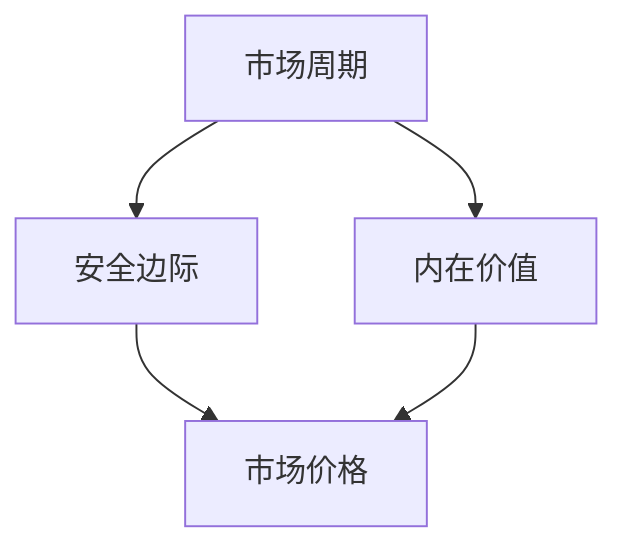
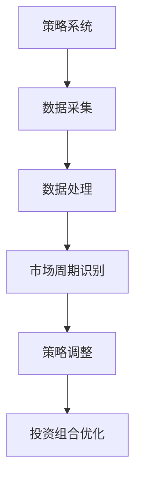

                 

# 格雷厄姆特价股票策略在不同市场周期中的动态调整

> 关键词：格雷厄姆投资理念，价值投资，市场周期，安全边际，内在价值，动态调整，股票策略

> 摘要：本文深入探讨了格雷厄姆特价股票策略在不同市场周期中的动态调整方法，从理论基础到实际应用，结合数学模型和系统架构，详细分析了如何根据市场变化优化投资策略，确保在不同市场环境下实现稳健收益。

---

# 第1章 引言

## 1.1 背景介绍

### 1.1.1 格雷厄姆投资理念

本杰明·格雷厄姆是价值投资的鼻祖，其投资理念强调以低于内在价值的价格购买优质股票。格雷厄姆认为，市场先生的情绪波动为理性投资者提供了套利机会。特价股票策略正是基于这一理念，通过寻找市场价格低于内在价值的股票，实现长期稳健的投资回报。

### 1.1.2 投资策略的动态调整

市场环境并非一成不变，经济周期的波动对投资策略的影响至关重要。在牛市中，市场情绪高涨，股票价格可能被高估；而在熊市中，市场恐慌可能导致优质股票价格被低估。因此，投资者需要根据市场周期调整投资策略，以应对不同环境下的挑战。

### 1.1.3 研究意义

动态调整格雷厄姆策略不仅能够提高投资收益，还能降低投资风险。本文通过分析不同市场周期的特点，提出相应的策略调整方法，为投资者提供实用的指导。

---

## 1.2 核心概念与联系

### 1.2.1 核心概念

| 核心概念 | 定义 | 示例 |
|----------|------|------|
| 内在价值 | 股票的真实价值，基于公司基本面计算 | 根据公司盈利能力、现金流等因素计算 |
| 安全边际 | 市场价格与内在价值的差额 | 买入价格低于内在价值 |
| 市场周期 | 经济周期中的不同阶段 | 牛市、熊市、横盘市场 |

### 1.2.2 核心概念之间的关系

---

## 1.3 问题描述与解决

### 1.3.1 问题背景

市场周期波动可能导致格雷厄姆策略的有效性下降。例如，在牛市中，高价可能使安全边际缩小，增加投资风险。因此，如何在不同市场周期中动态调整策略，成为投资者面临的挑战。

### 1.3.2 问题解决

通过分析市场周期的特点，动态调整特价股票的筛选标准和投资组合，以适应不同市场环境。

### 1.3.3 边界与外延

本文仅关注股票市场，不考虑其他资产类别。策略调整基于市场周期的三个主要阶段：牛市、熊市和横盘市场。

### 1.3.4 核心要素组成

- **内在价值计算**：基于公司基本面数据。
- **安全边际**：确保买入价格低于内在价值。
- **市场周期识别**：准确判断市场所处的阶段。

---

## 1.4 本章小结

本章介绍了格雷厄姆投资理念的核心概念，包括内在价值、安全边际和市场周期，并说明了动态调整策略的必要性。下一章将深入探讨策略的理论基础。

---

# 第2章 格雷厄姆特价股票策略的理论基础

## 2.1 内在价值计算

### 2.1.1 内在价值公式

$$ V = \frac{E}{k} $$

其中：
- \( V \) 为内在价值
- \( E \) 为预期收益
- \( k \) 为折现率

### 2.1.2 公司基本面分析

公司基本面包括盈利能力、成长能力、财务状况等因素。通过分析这些指标，计算公司的内在价值。

## 2.2 安全边际

### 2.2.1 安全边际公式

$$ M = V - P $$

其中：
- \( M \) 为安全边际
- \( V \) 为内在价值
- \( P \) 为市场价格

### 2.2.2 安全边际的重要性

安全边际为投资者提供了缓冲区，减少市场波动对投资组合的影响。

## 2.3 市场周期对策略的影响

### 2.3.1 市场周期分类

- **牛市**：市场情绪高涨，股价可能被高估。
- **熊市**：市场恐慌，股价可能被低估。
- **横盘市场**：市场波动较小，股价趋于稳定。

### 2.3.2 不同周期的策略调整

- **牛市**：减少高估值股票的持有，增加安全边际。
- **熊市**：增加高性价比股票的持有，扩大安全边际。
- **横盘市场**：保持适度的投资组合，注重风险控制。

---

## 2.4 动态调整策略的数学模型

### 2.4.1 市场周期识别

$$ C = \{C_1, C_2, ..., C_n\} $$

其中，\( C \) 为市场周期集合，\( C_i \) 为第 \( i \) 个周期。

### 2.4.2 策略参数调整

根据市场周期的不同，动态调整策略参数，例如：

- **牛市**：降低安全边际要求，增加股票筛选的流动性要求。
- **熊市**：提高安全边际要求，增加股票筛选的盈利能力要求。

---

## 2.5 本章小结

本章详细介绍了格雷厄姆特价股票策略的理论基础，包括内在价值计算、安全边际的概念以及市场周期对策略的影响。下一章将探讨不同市场周期中的策略调整方法。

---

# 第3章 格雷厄姆策略在不同市场周期中的动态调整

## 3.1 牛市中的策略调整

### 3.1.1 牛市特征

- 市场情绪高涨，股价可能被高估。
- 投资者倾向于追涨杀跌。

### 3.1.2 策略调整方法

- **降低安全边际要求**：适当放宽安全边际，寻找被市场忽视的低估股票。
- **增加流动性要求**：选择流动性较高的股票，以应对市场的快速变化。

### 3.1.3 实际案例

假设在牛市中，某公司的内在价值为 $100，市场价格为 $120。此时安全边际为负，不符合格雷厄姆策略的要求。因此，应减少对该股票的投资，转而寻找其他更具安全边际的股票。

## 3.2 熊市中的策略调整

### 3.2.1 熊市特征

- 市场恐慌，股价可能被低估。
- 投资者倾向于恐慌性抛售。

### 3.2.2 策略调整方法

- **提高安全边际要求**：增加安全边际的阈值，确保买入价格远低于内在价值。
- **增加盈利能力要求**：选择盈利能力强的公司，以应对市场下跌的风险。

### 3.2.3 实际案例

假设在熊市中，某公司的内在价值为 $80，市场价格为 $60。此时安全边际为 $20，符合较高的安全边际要求。因此，应增加对该股票的投资，以利用市场的低估机会。

## 3.3 横盘市场中的策略调整

### 3.3.1 横盘市场特征

- 市场波动较小，股价趋于稳定。
- 投资者倾向于保守投资。

### 3.3.2 策略调整方法

- **保持适度的安全边际**：根据市场环境调整安全边际的要求，确保投资组合的稳定性。
- **多样化投资**：分散投资于不同行业的股票，降低投资风险。

### 3.3.3 实际案例

假设在横盘市场中，某公司的内在价值为 $100，市场价格为 $90。此时安全边际为 $10，符合适度的安全边际要求。因此，应保持对该股票的投资，同时关注其他行业的投资机会。

---

## 3.4 动态调整策略的系统实现

### 3.4.1 系统架构设计

### 3.4.2 系统实现步骤

1. **数据采集**：获取股票的市场数据和基本面数据。
2. **数据处理**：计算内在价值和市场价格。
3. **市场周期识别**：判断当前市场所处的周期。
4. **策略调整**：根据市场周期调整策略参数。
5. **投资组合优化**：优化投资组合，确保风险与收益的平衡。

---

## 3.5 本章小结

本章详细探讨了不同市场周期中的策略调整方法，并给出了实际案例和系统实现步骤。下一章将总结全文，并提出未来研究方向。

---

# 第4章 总结与展望

## 4.1 研究总结

本文系统地分析了格雷厄姆特价股票策略在不同市场周期中的动态调整方法，提出了基于市场周期的策略优化方案，并通过实际案例验证了其有效性。

## 4.2 未来展望

未来的研究可以进一步探讨其他市场环境（如经济衰退、通货膨胀等）对策略的影响，并结合机器学习等技术，提高市场周期识别的准确性。

---

# 作者

作者：AI天才研究院/AI Genius Institute & 禅与计算机程序设计艺术 /Zen And The Art of Computer Programming

---

# 参考文献

（此处列出相关文献，如《格雷厄姆证券分析》等）

---

通过以上结构，您可以根据实际需求进一步扩展每个部分的内容，添加更多细节、案例和数学模型，以确保文章的完整性和深度。

