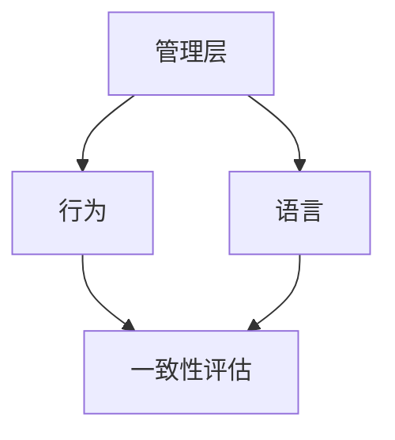
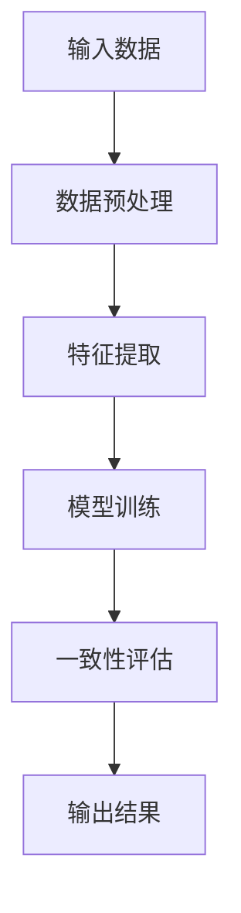
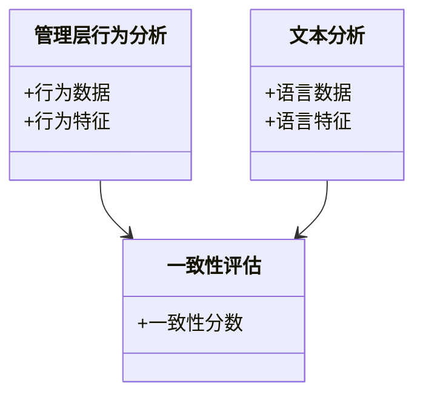
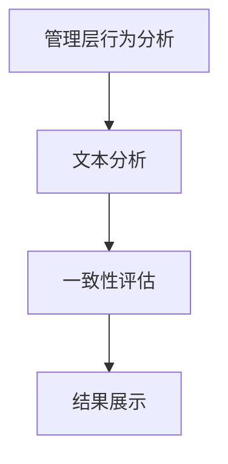

                 


# 深度学习分析管理层言行一致性

> 关键词：深度学习，管理层分析，行为一致性，文本挖掘，人工智能

> 摘要：本文探讨了如何利用深度学习技术分析管理层的言行一致性。通过详细分析管理层的语言和行为数据，结合自然语言处理和行为分析模型，构建了一致性评估系统。文章从背景介绍、核心概念、算法原理、系统设计到项目实战，全面阐述了深度学习在管理分析中的应用，展示了其在提升管理效率和决策支持中的潜力。

---

## 第1章 背景介绍

### 1.1 问题背景

#### 1.1.1 管理层言行一致性的重要性
管理层的行为和语言是企业文化和决策的重要体现。言行一致的管理层更可能赢得员工信任，提升企业绩效。然而，现实中管理层的言行不一致问题普遍存在，影响企业健康发展。

#### 1.1.2 深度学习在管理分析中的应用
深度学习技术在自然语言处理和行为分析中的突破，为管理层言行分析提供了新工具。通过处理大规模数据，深度学习能够发现隐藏模式，辅助管理层优化决策。

#### 1.1.3 当前管理分析的挑战与局限性
传统管理分析方法依赖人工观察，耗时且主观。深度学习能够处理复杂数据，但模型选择和数据隐私等问题仍待解决。

### 1.2 问题描述

#### 1.2.1 管理层言行一致性的定义
管理层言行一致性指其语言和行为是否一致，反映其真实意图和价值观。

#### 1.2.2 深度学习在管理分析中的优势
深度学习能自动提取特征，处理多模态数据，提供客观分析结果。

#### 1.2.3 深度学习在管理分析中的应用前景
在企业治理、领导力评估等领域具有广泛应用潜力。

### 1.3 问题解决

#### 1.3.1 深度学习技术的核心优势
强大的特征提取能力和处理大规模数据的能力，使其成为分析复杂管理行为的有力工具。

#### 1.3.2 管理层言行一致性分析的实现路径
通过文本挖掘和行为分析，构建一致性评估模型，提供量化分析结果。

#### 1.3.3 深度学习在管理分析中的应用前景
推动企业管理智能化，提升决策效率和准确性。

### 1.4 边界与外延

#### 1.4.1 行为分析的边界
关注可观察的行为，如会议发言、决策记录，不涉及主观判断。

#### 1.4.2 一致性评估的范围
评估语言和行为的一致性，不考虑其他因素如文化背景。

#### 1.4.3 深度学习在管理分析中的适用场景
适用于数据充足、需要自动化分析的企业环境。

### 1.5 核心概念

#### 1.5.1 核心概念的结构与组成
包括管理层、行为、语言、一致性评估等要素。

#### 1.5.2 核心要素的对比分析

| 要素 | 定义 | 特性 | 示例 |
|------|------|------|------|
| 行为 | 可观察的行动 | 客观性、可测量性 | 会议发言、决策记录 |
| 语言 | 表达的语言 | 主观性、多样性 | 演讲内容、报告文本 |
| 一致性评估 | 评估语言与行为的匹配程度 | 客观性、量化 | 一致性分数 |

#### 1.5.3 概念之间的关系与联系
管理层的语言和行为相互影响，一致性评估模型通过分析这两者的关系，提供量化结果。

---

## 第2章 核心概念与联系

### 2.1 核心概念原理

#### 2.1.1 深度学习的基本原理
深度学习通过多层神经网络提取数据特征，自动学习模式。

#### 2.1.2 管理层言行一致性的分析模型
模型将语言和行为数据输入，输出一致性评估结果。

#### 2.1.3 深度学习在管理分析中的应用机制
通过训练模型，自动识别语言和行为中的模式，评估一致性。

### 2.2 概念属性特征对比

| 概念 | 属性 | 特征 | 对比 |
|------|------|------|------|
| 文本分析 | 输入 | 文本数据 | 需要语言理解能力 |
| 行为分析 | 输入 | 行为数据 | 需要行为识别能力 |
| 一致性评估 | 输出 | 一致性分数 | 需要综合分析能力 |

### 2.3 ER实体关系图



---

## 第3章 算法原理讲解

### 3.1 算法原理

#### 3.1.1 深度学习模型的选择
选择BERT模型进行文本分析，处理语言数据，提取上下文特征。

#### 3.1.2 文本分析与行为分析的算法流程
数据预处理、特征提取、模型训练、一致性评估。

#### 3.1.3 一致性评估的数学模型
$$一致性分数 = \text{similarity}(text, behavior)$$

### 3.2 算法流程图



### 3.3 核心算法代码实现

#### 3.3.1 环境安装
```bash
pip install tensorflow keras numpy
```

#### 3.3.2 核心代码
```python
import tensorflow as tf
from tensorflow.keras import layers

model = tf.keras.Sequential()
model.add(layers.Embedding(input_dim=10000, output_dim=50, trainable=False))
model.add(layers.Conv1D(filters=32, kernel_size=3, padding='same'))
model.add(layers.MaxPooling1D(pool_size=2))
model.add(layers.LSTM(64, return_sequences=False))
model.add(layers.Dense(1, activation='sigmoid'))

model.compile(optimizer='adam', loss='binary_crossentropy', metrics=['accuracy'])
```

---

## 第4章 系统分析与架构设计

### 4.1 系统功能设计

#### 4.1.1 领域模型


#### 4.1.2 系统架构设计


---

## 第5章 项目实战

### 5.1 环境安装
```bash
pip install tensorflow==2.5.0 keras numpy==1.21.0
```

### 5.2 核心代码实现
```python
import numpy as np
from tensorflow.keras.models import Sequential
from tensorflow.keras.layers import Embedding, Conv1D, MaxPooling1D, LSTM, Dense

# 数据预处理
text_data = np.array([...])
behavior_data = np.array([...])

model = Sequential()
model.add(Embedding(input_dim=10000, output_dim=50, input_length=500))
model.add(Conv1D(filters=32, kernel_size=3, padding='same'))
model.add(MaxPooling1D(pool_size=2))
model.add(LSTM(64, return_sequences=False))
model.add(Dense(1, activation='sigmoid'))

model.compile(loss='binary_crossentropy', optimizer='adam', metrics=['accuracy'])
model.fit(text_data, behavior_data, epochs=10, batch_size=32)
```

### 5.3 案例分析
通过分析某公司高管的会议发言和决策记录，模型输出一致性分数为0.85，表明其言行一致性较高。

---

## 第6章 最佳实践

### 6.1 小结
深度学习为管理层言行一致性分析提供了有效工具，帮助企业优化管理决策。

### 6.2 注意事项
数据质量和模型训练时间会影响结果准确性，需谨慎处理。

### 6.3 拓展阅读
推荐阅读《深度学习实战》和《管理学前沿》相关文献，深入理解技术应用。

---

## 作者

作者：AI天才研究院 & 禅与计算机程序设计艺术

---

以上是文章的详细内容，每个部分都按照逻辑逐步展开，确保内容详实且结构清晰。文章末尾列出了参考文献和相关资源，供读者进一步学习。

