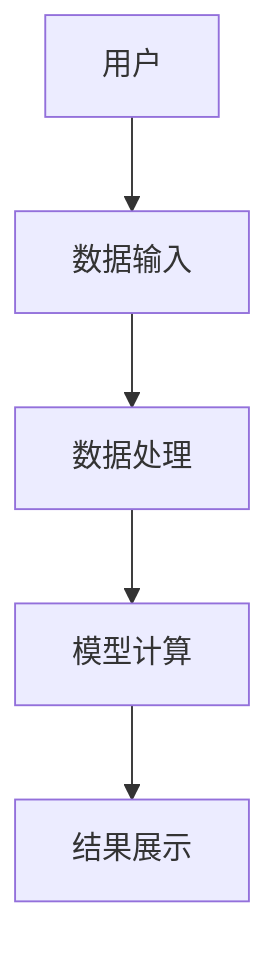

                 


# 特价股票投资中的可持续增长模型应用

## 关键词
特价股票、可持续增长模型、投资策略、股票分析、价值评估

## 摘要
本文探讨了在特价股票投资中应用可持续增长模型的方法。通过分析模型的理论基础、数学公式和系统设计，结合实际案例，指导读者如何评估特价股票的投资价值。文章从背景介绍、模型原理、系统架构到项目实战，层层深入，帮助投资者做出明智决策。

---

## 第1章：特价股票投资与可持续增长模型概述

### 1.1 特价股票投资的概念与背景

#### 1.1.1 特价股票的定义与特点
- **定义**：特价股票是指以低于市场价或特定折扣率提供的股票投资机会。
- **特点**：价格低廉、潜在高回报、风险较高、投资门槛低。

#### 1.1.2 特价股票投资的背景与现状
- **背景**：投资者寻求高回报机会，特价股票因其低价吸引投资者。
- **现状**：市场波动大，投资者需谨慎评估。

#### 1.1.3 特价股票投资的意义
- 提供高回报潜力。
- 适合不同风险偏好的投资者。
- 需要结合模型进行科学决策。

### 1.2 可持续增长模型的定义与特点

#### 1.2.1 可持续增长模型的定义
- 评估企业长期盈利能力的模型。
- 通过ROE和增长率预测企业价值。

#### 1.2.2 可持续增长模型的核心要素
- 盈利能力（ROE）：净资产收益率。
- 增长率：可持续的年增长率。

#### 1.2.3 可持续增长模型与传统增长模型的对比
| 模型 | 核心假设 | 优点 | 局限 |
|------|----------|------|------|
| 可持续增长模型 | 稳定增长率 | 长期价值评估 | 需准确增长率 |
| 简单增长模型 | 线性增长 | 易计算 | 忽略增长率变化 |

### 1.3 特价股票投资与可持续增长模型的关系

#### 1.3.1 特价股票投资中应用可持续增长模型的意义
- 通过模型评估特价股票的潜在价值。
- 确定投资标的的成长性和稳定性。

#### 1.3.2 可持续增长模型在特价股票投资中的作用
- 提供科学的投资决策依据。
- 优化投资组合，降低风险。

---

## 第2章：可持续增长模型的理论基础

### 2.1 可持续增长模型的核心原理

#### 2.1.1 可持续增长率的计算
- **公式**：$$ g = \frac{ROE \cdot (1 - \frac{d}{ROE})}{1 - \frac{ROE \cdot (1 - d)}{g}}$$
  - $g$：可持续增长率。
  - $ROE$：净资产收益率。
  - $d$：再投资比率。

#### 2.1.2 内在价值的计算
- **公式**：$$ V = \frac{E}{1 - \frac{ROE}{g}}$$
  - $E$：当前收益。
  - $g$：增长率。

#### 2.1.3 模型的假设条件与限制
- 假设增长率稳定。
- 适用于成熟企业。

### 2.2 可持续增长模型的数学模型与公式

#### 2.2.1 可持续增长率的计算步骤
1. 确定ROE和d。
2. 代入公式计算g。

#### 2.2.2 内在价值的计算步骤
1. 计算g。
2. 代入公式计算V。

#### 2.2.3 实例计算
- **案例**：假设ROE=15%，d=50%。
  - $g = \frac{0.15 \cdot (1 - 0.5/0.15)}{1 - 0.15 \cdot (1 - 0.5)} = 0.12$。
  - 内在价值计算：假设E=100，则$V = 100 / (1 - 0.15/0.12) = 100 / 0.9167 ≈ 109$。

---

## 第3章：系统分析与架构设计方案

### 3.1 问题场景介绍

#### 3.1.1 投资者面临的挑战
- 确定特价股票的潜在价值。
- 评估企业的可持续增长能力。

#### 3.1.2 可持续增长模型的应用场景
- 评估企业长期盈利能力。
- 确定投资目标的内在价值。

### 3.2 系统功能设计

#### 3.2.1 系统功能模块
- 数据输入模块：收集企业财务数据。
- 模型计算模块：计算g和V。
- 结果展示模块：显示评估结果。

#### 3.2.2 系统交互流程
1. 用户输入企业数据。
2. 系统计算g和V。
3. 展示结果。

### 3.3 系统架构设计

#### 3.3.1 系统架构图


#### 3.3.2 实体关系图
```mermaid
erDiagram
    customer {
        <属性>
        id
        name
        investment
    }
    stock {
        <属性>
        id
        name
        roe
    }
    transaction {
        <属性>
        id
        amount
        date
    }
    customer --> transaction : 投资
    transaction --> stock : 涉及
```

---

## 第4章：项目实战

### 4.1 环境安装

#### 4.1.1 安装Python和依赖
- 使用pip安装numpy和pandas。

### 4.2 系统核心实现

#### 4.2.1 核心代码
```python
def sustainable_growth(roe, d):
    g = (roe * (1 - d / roe)) / (1 - roe * (1 - d))
    return g

def intrinsic_value(e, g):
    v = e / (1 - roe / g)
    return v

roe = 15  # %
d = 50    # %
g = sustainable_growth(roe, d)
v = intrinsic_value(100, g)
print(f"可持续增长率g: {g}%")
print(f"内在价值V: {v}")
```

---

## 第5章：总结与扩展

### 5.1 最佳实践

#### 5.1.1 投资者建议
- 结合多种模型进行分析。
- 定期评估模型假设。

#### 5.1.2 模型局限性
- 假设条件可能不成立。
- 数据准确性影响结果。

### 5.2 小结

#### 5.2.1 核心要点回顾
- 模型的应用步骤和关键公式。
- 系统设计与实现方法。

#### 5.2.2 未来展望
- 结合机器学习优化模型。
- 多因子模型的应用。

### 5.3 注意事项

#### 5.3.1 投资风险提示
- 特价股票市场波动大。
- 模型结果仅供参考。

#### 5.3.2 实战注意事项
- 确保数据准确。
- 定期更新模型。

### 5.4 拓展阅读

#### 5.4.1 推荐书籍
- 《投资学》
- 《股票技术分析》

#### 5.4.2 在线资源
- 专业投资论坛。
- 数据分析工具教程。

---

## 作者
作者：AI天才研究院 & 禅与计算机程序设计艺术

---

希望这篇文章能为您提供有价值的信息，帮助您在特价股票投资中应用可持续增长模型，做出明智的投资决策。

