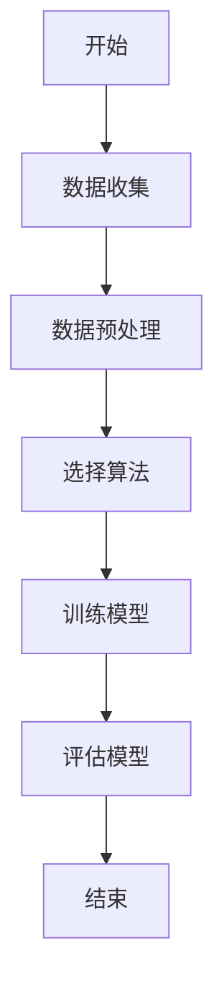

                 


# 股市估值高低对企业AI伦理委员会构成的影响

> 关键词：股市估值，AI伦理委员会，企业治理，算法原理，系统架构

> 摘要：本文探讨了股市估值的高低对企业中AI伦理委员会构成的影响，通过分析核心概念、算法原理和系统架构，深入揭示两者之间的内在联系，并提供实际案例以说明其应用。

---

## 第一部分：背景介绍

### 第1章：股市估值与AI伦理委员会概述

#### 1.1 股市估值的基本概念
股市估值是衡量企业市场价值的重要指标，常用的指标包括市盈率（P/E）、市净率（P/B）和企业价值倍数（EV/EBITDA）。这些指标反映了市场对企业的看法，影响企业的融资能力、投资决策和管理层激励机制。

#### 1.2 AI伦理委员会的构成与功能
AI伦理委员会由跨学科专家组成，负责制定和监督AI技术的伦理规范，确保技术应用符合社会价值观和法律要求。其主要功能包括风险评估、政策制定和监督执行。

#### 1.3 股市估值与AI伦理委员会的关联性
股市估值影响企业的战略决策，而AI伦理委员会在企业治理中的作用日益重要。高估值企业可能面临更大的压力，要求其在AI技术应用中遵循更高的伦理标准，从而影响伦理委员会的构成和运作。

---

## 第二部分：核心概念与联系

### 第2章：股市估值与AI伦理委员会的核心概念

#### 2.1 核心概念的原理分析
股市估值基于市场供需和企业基本面，反映了投资者对企业价值的判断。AI伦理委员会则是企业治理结构的一部分，确保AI技术的伦理合规性。

#### 2.2 概念属性特征对比表格
| 概念       | 属性         | 特征描述                     |
|------------|--------------|------------------------------|
| 股市估值    | 定价机制     | 基于市场供需和企业基本面      |
| AI伦理委员会 | 组织结构     | 由跨学科专家组成的独立机构    |

#### 2.3 ER实体关系图
```mermaid
er
actor 股市: 通过估值影响企业治理
actor AI伦理委员会: 通过治理影响企业决策
```

---

## 第三部分：算法原理讲解

### 第3章：股市估值与AI伦理治理的算法分析

#### 3.1 算法原理
- 股市估值预测算法：使用回归分析模型，基于历史数据预测未来估值。
- AI伦理风险评估算法：采用决策树模型，评估AI技术应用中的伦理风险。

#### 3.2 算法流程图


#### 3.3 Python代码实现
```python
import pandas as pd
from sklearn.linear_model import LinearRegression

# 数据预处理
data = pd.read_csv('stock_data.csv')
X = data[['市盈率', '市净率']]
y = data['未来估值']

# 训练模型
model = LinearRegression()
model.fit(X, y)

# 预测
predictions = model.predict(X)
print('预测结果:', predictions)
```

---

## 第四部分：数学模型与公式

### 第4章：数学模型和公式

#### 4.1 线性回归模型
$$ y = \beta_0 + \beta_1 x + \epsilon $$

其中，$y$ 是预测的未来估值，$x$ 是市盈率，$\beta_0$ 和 $\beta_1$ 是回归系数。

#### 4.2 决策树模型
$$ \text{风险等级} = \text{决策树}(\text{特征向量}) $$

---

## 第五部分：系统分析与架构设计方案

### 第5章：系统分析与架构设计

#### 5.1 问题场景介绍
企业需要根据股市估值调整AI伦理委员会的构成，以确保在高估值情况下遵循更高的伦理标准。

#### 5.2 系统功能设计
- 数据采集模块：收集股市估值数据和AI伦理风险数据。
- 分析模块：使用回归模型预测估值，评估伦理风险。
- 决策支持模块：提供伦理委员会改进建议。

#### 5.3 系统架构图


---

## 第六部分：项目实战

### 第6章：项目实战与案例分析

#### 6.1 环境安装
安装必要的Python库，如pandas、scikit-learn。

#### 6.2 核心代码实现
```python
import pandas as pd
from sklearn.tree import DecisionTreeClassifier

# 数据预处理
data = pd.read_csv('ethics_data.csv')
X = data[['伦理风险因素']]
y = data['风险等级']

# 训练模型
model = DecisionTreeClassifier()
model.fit(X, y)

# 预测
new_data = pd.DataFrame({'伦理风险因素': [0.8]})
predictions = model.predict(new_data)
print('预测结果:', predictions)
```

#### 6.3 案例分析
分析一个高估值企业的AI伦理委员会构成，评估其伦理风险，并提出改进建议。

---

## 第七部分：总结与展望

### 第7章：总结与展望

#### 7.1 最佳实践
- 定期评估股市估值对企业治理的影响。
- 根据估值调整AI伦理委员会的构成和功能。

#### 7.2 小结
股市估值的高低直接影响企业AI伦理委员会的构成，企业应根据市场变化调整治理结构，确保技术应用的伦理合规性。

#### 7.3 注意事项
- 数据质量和模型选择会影响结果。
- 持续监控和评估模型性能。

#### 7.4 拓展阅读
建议阅读相关文献，深入理解股市估值和AI伦理治理的复杂性。

---

## 作者
作者：AI天才研究院/AI Genius Institute  
及 禅与计算机程序设计艺术/Zen And The Art of Computer Programming

