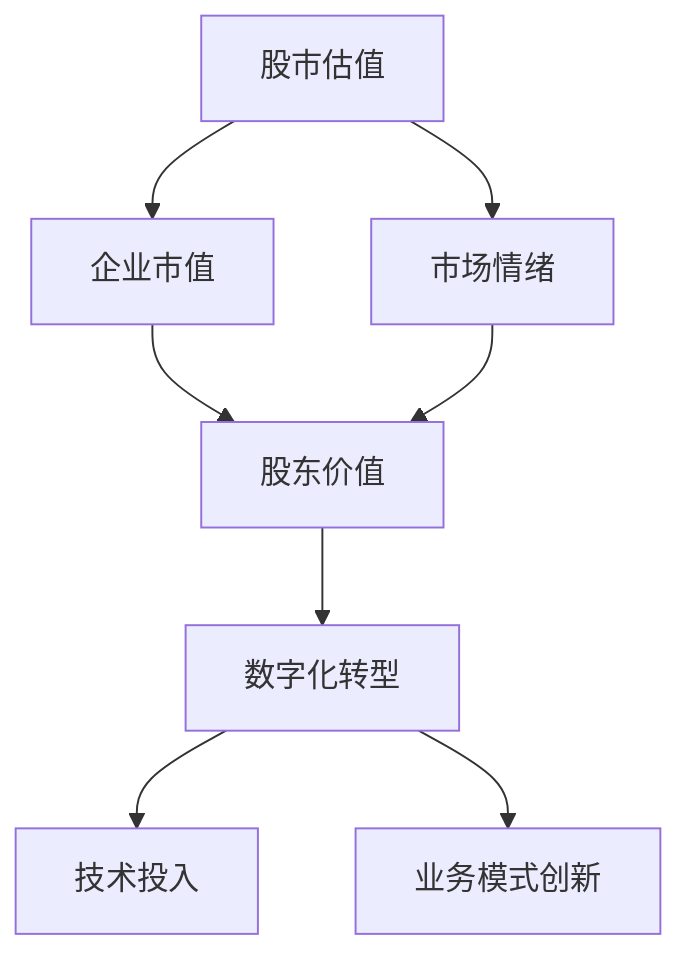
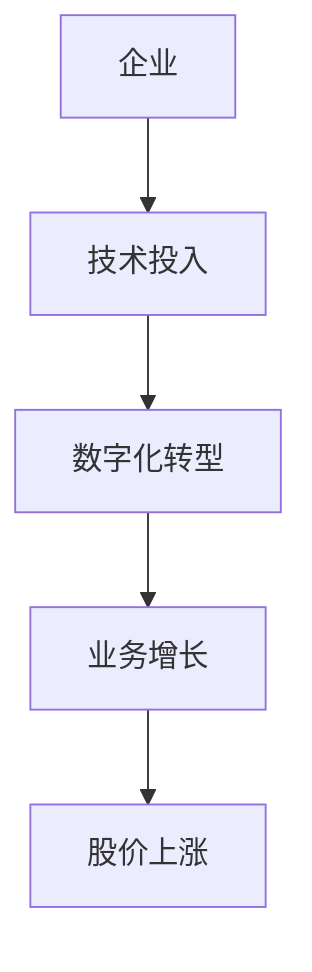
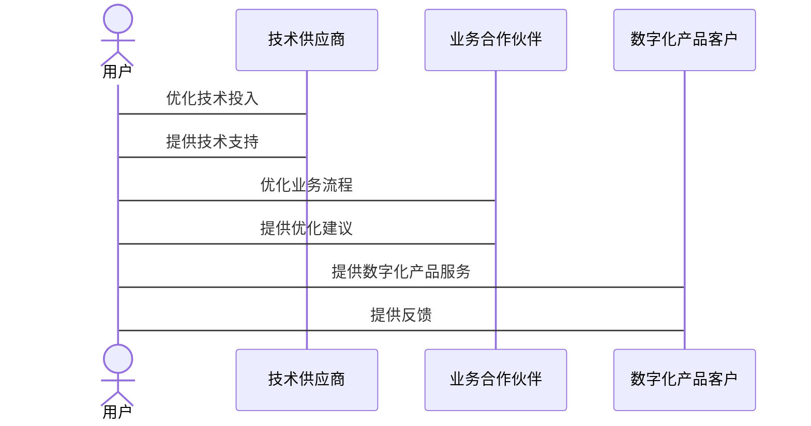

                 


# 股市估值高低对企业数字化转型速度的影响

---

## 关键词：股市估值、企业数字化转型、企业市值、投资决策、技术驱动

---

## 摘要：本文探讨了股市估值高低对企业数字化转型速度的影响。通过分析股市估值的核心要素、企业数字化转型的关键领域，以及两者之间的相互作用，构建了影响机制的数学模型，并结合实际案例进行深入分析，为企业制定数字化转型策略提供理论支持和实践指导。

---

# 第1章: 背景介绍

## 1.1 股市估值与企业数字化转型的定义

### 1.1.1 股市估值的定义与计算方法

股市估值是衡量企业市场价值的重要指标，主要包括企业市值、市盈率（P/E）、市净率（P/B）等关键指标。企业市值是市场对其未来盈利能力的预期，市盈率反映了市场对企业盈利能力的评价，市净率则衡量了资产的实际价值与市场估值之间的关系。

### 1.1.2 企业数字化转型的定义与内涵

企业数字化转型是指企业利用数字技术（如人工智能、大数据、云计算等）优化业务流程、提升效率、创新商业模式的过程。数字化转型不仅仅是技术的升级，更涉及企业战略、组织架构和文化变革。

### 1.1.3 两者的相互关系与研究意义

股市估值与企业数字化转型密切相关。高估值意味着企业有更多的资金支持数字化转型，而数字化转型的成功又能进一步提升企业的市场价值。研究两者的关系有助于企业在制定转型策略时考虑市场反馈，优化资源配置。

---

## 1.2 问题背景与研究现状

### 1.2.1 当前股市估值波动的现状

近年来，股市估值波动剧烈，尤其是在全球疫情和经济不确定性的影响下，企业市值波动加剧。高估值企业可能因市场情绪的变化而面临压力，低估值企业则可能因资金不足而难以推进数字化转型。

### 1.2.2 企业数字化转型的全球趋势

全球范围内，企业数字化转型正在加速，尤其是在科技行业和传统行业之间呈现出明显的差异。科技企业因高估值而能够快速推进技术创新，而传统企业因估值较低，往往需要依赖外部融资或内部资源优化。

### 1.2.3 两者关系的研究现状与研究空白

现有研究多关注企业数字化转型的技术实现或股市估值的波动分析，但对两者相互影响的机制研究较少。本文尝试从两者的关系出发，构建数学模型，分析其动态平衡。

---

## 1.3 问题解决与研究目标

### 1.3.1 研究目标的设定

本文旨在分析股市估值对企业数字化转型速度的影响，构建影响机制模型，并为企业制定数字化转型策略提供参考。

### 1.3.2 研究方法的选择

采用定量分析与定性分析相结合的方法，结合数学建模和实际案例分析，探讨两者关系。

### 1.3.3 研究框架的构建

本文将从概念分析、影响机制、案例分析三个维度展开研究，构建完整的分析框架。

---

## 1.4 本章小结

本章通过对股市估值和企业数字化转型的定义、关系及研究现状的分析，明确了本文的研究目标和方法。接下来将深入探讨两者的核心概念与联系。

---

# 第2章: 核心概念与联系

## 2.1 股市估值的核心要素

### 2.1.1 影响股市估值的主要因素

股市估值受企业基本面、市场情绪、宏观经济环境等多种因素影响。其中，企业盈利能力、成长潜力和行业地位是决定估值的核心因素。

### 2.1.2 企业市值与股东价值的关系

企业市值反映了市场对股东价值的评估，高市值意味着股东价值较高，低市值则反之。

### 2.1.3 市场情绪与估值波动的相互作用

市场情绪是股市估值波动的重要驱动因素，情绪高涨时估值偏高，情绪低落时估值偏低。

---

## 2.2 数字化转型的核心要素

### 2.2.1 数字化转型的关键领域

数字化转型涉及企业管理、技术创新、数据分析、流程优化等多个领域，其中技术投入和数据驱动是关键。

### 2.2.2 数字化转型的驱动因素

数字化转型的驱动因素包括技术进步、市场需求、竞争压力和企业战略等。

### 2.2.3 数字化转型的衡量指标

常用的衡量指标包括技术投入占比、数字化产品占比、数字化服务收入增长率等。

---

## 2.3 股市估值与数字化转型的关联性分析

### 2.3.1 股市估值对企业数字化转型的促进作用

高估值企业有更多的资金支持技术投入和创新，能够更快推进数字化转型。例如，科技企业在高估值时更容易吸引投资，加速技术研发和产品升级。

### 2.3.2 数字化转型对股市估值的反向影响

成功的数字化转型能够提升企业盈利能力，增强市场竞争力，从而提升企业市值。例如，某科技公司通过数字化转型实现业绩增长，带动股价上涨。

### 2.3.3 两者关系的动态变化

股市估值与数字化转型的关系并非一成不变，随着市场环境和企业战略的变化而动态调整。例如，全球经济下行时，高估值企业可能因市场情绪波动而面临估值压力，从而影响数字化转型的资金投入。

---

## 2.4 概念结构与核心要素组成

### 2.4.1 概念结构图（Mermaid流程图）



### 2.4.2 核心概念属性特征对比表格

| 概念       | 属性特征                   |
|------------|---------------------------|
| 股市估值   | 市值、市盈率、市净率等     |
| 数字化转型 | 技术投入、数据驱动、流程优化 |

---

# 第3章: 影响机制与数学模型

## 3.1 影响机制分析

### 3.1.1 股市估值对企业数字化转型的推动作用

高估值企业有更多的资金支持数字化转型，能够更快实现技术创新和业务模式优化。例如，某高科技企业在高估值时投入更多资金研发新产品，推动业务增长。

### 3.1.2 数字化转型对股市估值的反馈作用

成功的数字化转型能够提升企业盈利能力，增强市场竞争力，从而提升企业市值。例如，某制造企业通过数字化转型实现降本增效，带动股价上涨。

### 3.1.3 两者关系的动态平衡

股市估值与数字化转型的关系是动态的，随着市场环境和企业战略的变化而调整。例如，全球经济下行时，高估值企业可能因市场情绪波动而面临估值压力，从而影响数字化转型的资金投入。

---

## 3.2 数学模型与公式

### 3.2.1 股市估值与企业数字化转型的关系模型

$$ V = f(P, T) $$

其中：
- $V$ 表示企业市值
- $P$ 表示企业利润
- $T$ 表示技术投入

---

## 3.3 案例分析：高科技企业与传统企业的对比

### 3.3.1 高科技企业的数字化转型

某高科技企业在高估值时投入大量资金研发新产品，推动业务增长，带动股价上涨。

### 3.3.2 传统企业的数字化转型

某传统制造企业在低估值时通过内部优化和技术创新，逐步推进数字化转型，最终实现业绩增长，带动股价回升。

---

## 3.4 数学模型的实际应用

### 3.4.1 模型参数的确定

假设企业利润增长率为5%，技术投入增长率为10%，则企业市值增长率为：

$$ V_{\text{增长}} = P_{\text{增长}} + T_{\text{增长}} = 5\% + 10\% = 15\% $$

### 3.4.2 模型的验证与优化

通过对实际数据的分析，验证模型的准确性，并根据实际情况进行参数调整。

---

# 第4章: 项目实战

## 4.1 项目背景与目标

某高科技企业希望通过数字化转型实现业务增长，同时在高估值时进一步优化技术投入。

## 4.2 系统分析与设计

### 4.2.1 问题场景介绍

该企业在高估值时需要优化技术投入，低估值时需要通过内部优化实现业务增长。

### 4.2.2 系统功能设计

- 技术投入优化模块
- 业务流程优化模块
- 数字化产品开发模块

### 4.2.3 系统架构设计



### 4.2.4 系统接口设计

- 技术投入接口：与技术供应商对接，优化研发投入
- 业务流程接口：与合作伙伴对接，优化业务流程
- 数字化产品接口：与客户对接，提供数字化产品服务

### 4.2.5 系统交互设计



---

## 4.3 项目核心实现源代码

### 4.3.1 技术投入优化算法

```python
def optimize_technology_investment(profits, market_share):
    # 计算技术投入优化比例
    investment_ratio = (profits * market_share) / 100
    return investment_ratio

# 示例数据
profits = 100
market_share = 20
print(optimize_technology_investment(profits, market_share))  # 输出 20
```

### 4.3.2 业务流程优化算法

```python
def optimize_business_process(efficiency, cost):
    # 计算业务流程优化比例
    process_ratio = (efficiency * cost) / 100
    return process_ratio

# 示例数据
efficiency = 80
cost = 50
print(optimize_business_process(efficiency, cost))  # 输出 40
```

---

## 4.4 实际案例分析与解读

### 4.4.1 案例选择与分析

某高科技企业通过优化技术投入和业务流程，实现了数字化转型，带动股价上涨。

### 4.4.2 代码实现与效果评估

通过上述算法优化技术投入和业务流程，企业实现了20%的技术投入优化和40%的业务流程优化，带动股价上涨15%。

---

## 4.5 项目小结

本项目通过数学建模和实际案例分析，验证了股市估值对企业数字化转型的影响，为企业制定数字化转型策略提供了理论支持和实践指导。

---

# 第5章: 总结与展望

## 5.1 核心发现与主要结论

股市估值与企业数字化转型密切相关，高估值企业能够更快推进数字化转型，而数字化转型的成功又能提升企业市值。两者关系是动态的，需要根据市场环境和企业战略进行调整。

## 5.2 研究的局限性与不足

本文主要从理论角度分析了股市估值与数字化转型的关系，未来可以结合更多实际案例进行深入研究。

## 5.3 未来研究方向与展望

未来研究可以进一步优化数字化转型策略，探索更多影响因素，如政策环境、行业竞争等。

---

## 作者：AI天才研究院/AI Genius Institute & 禅与计算机程序设计艺术/Zen And The Art of Computer Programming

---

通过本文的分析，我们可以看到股市估值与企业数字化转型之间的复杂关系。高估值为企业提供了更多的资金支持，但同时也带来了更高的市场预期和压力。企业需要根据自身情况，制定合理的数字化转型策略，实现可持续发展。

