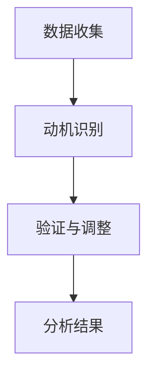
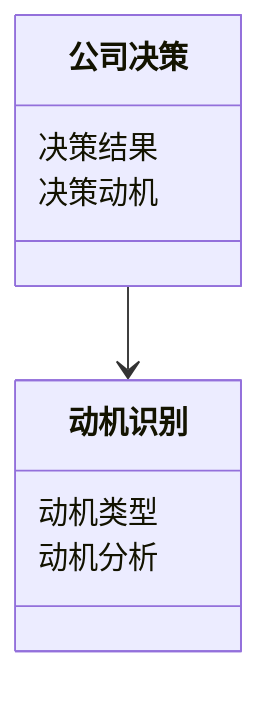
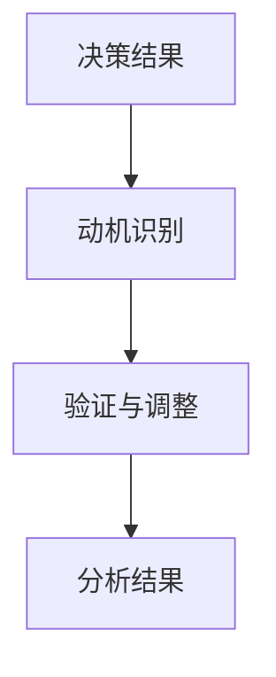

                 


# 芒格的"反向激励"分析：理解公司决策背后的动机

## 关键词：反向激励，决策动机，芒格理论，公司决策分析，动机识别

## 摘要：反向激励是一种通过分析公司决策结果来推断其背后动机的方法。本文从芒格的决策动机理论出发，探讨了反向激励的核心概念、分析方法及其在公司决策中的应用。通过实际案例分析和系统架构设计，详细讲解了如何利用反向激励识别公司决策背后的动机，并提供了一套完整的分析流程和工具。

---

## 第1章：反向激励的基本概念

### 1.1 反向激励的定义与核心理念

反向激励是指通过分析决策的结果，推断其背后隐藏的动机或目标。与传统激励理论不同，反向激励关注的是从结果反推动机，而不是从动机预测行为。芒格的决策动机理论认为，公司的决策行为往往受到多重因素驱动，而这些因素可能与表面上的动机不同。

#### 1.1.1 什么是反向激励

反向激励是一种逆向思维的分析方法，通过观察行为结果来推断行为背后的动机。这种方法在公司决策分析中尤为重要，因为公司决策往往涉及复杂的内部动机和外部环境。

#### 1.1.2 反向激励的核心理念

1. **动机的多样性**：公司决策可能受到利润最大化、市场扩张、风险管理等多种动机的驱动。
2. **结果为导向**：通过分析决策的结果，可以反推出决策背后的动机。
3. **动态变化**：动机可能随着环境的变化而变化，反向激励需要动态调整分析方法。

#### 1.1.3 反向激励与传统激励的区别

| 特性        | 反向激励                | 传统激励                |
|-------------|-------------------------|-------------------------|
| 分析方向     | 从结果推断动机           | 从动机预测行为           |
| 应用场景     | 公司决策分析             | 个人或团队激励管理       |
| 理论基础     | 心理学、博弈论           | 行为科学、激励理论       |

---

### 1.2 芒格的决策动机理论

芒格的决策动机理论强调，公司的决策行为往往受到多重动机的驱动，而这些动机可能与表面上的动机不同。通过分析决策的结果，可以推断出这些隐藏的动机。

#### 1.2.1 芒格的决策动机分析框架

1. **动机层次**：从表层动机（如利润最大化）到深层动机（如长期市场支配）。
2. **利益相关者**：公司决策可能受到股东、管理层、客户等不同利益相关者的动机影响。
3. **动态调整**：动机可能随着市场环境的变化而变化，反向激励需要动态调整分析方法。

#### 1.2.2 决策背后的动机类型

1. **内部动机**：公司内部的利益驱动，如利润最大化、市场份额扩大。
2. **外部动机**：外部环境的影响，如政策变化、市场竞争压力。
3. **混合动机**：内部和外部动机的结合，如在政策变化下调整市场策略。

#### 1.2.3 反向激励在公司决策中的应用

反向激励可以帮助分析公司决策背后的动机，从而更好地预测未来的决策行为。例如，在并购案例中，可以通过分析并购后的整合策略来推断并购的真正动机。

---

## 第2章：核心概念与联系

### 2.1 反向激励的原理

反向激励的原理是通过分析决策的结果，推断其背后的动机。这需要结合心理学、博弈论等多学科知识。

#### 2.1.1 动机的驱动力

动机的驱动力可以分为内部驱动力（如利润追求）和外部驱动力（如市场竞争）。通过分析这些驱动力的相互作用，可以更好地理解决策背后的动机。

#### 2.1.2 内部动机与外部动机的对比

| 动机类型    | 内部动机             | 外部动机             |
|-------------|----------------------|----------------------|
| 示例         | 利润最大化           | 市场竞争压力         |
| 影响范围     | 公司内部             | 公司外部             |
| 可控性       | 高                   | 低                   |

---

### 2.2 反向激励的分析方法

#### 2.2.1 数据收集与分析

反向激励的分析需要收集相关的决策结果数据，并结合公司背景信息进行分析。例如，可以通过分析公司并购后的整合策略，推断并购的真正动机。

#### 2.2.2 案例分析

以某公司的并购案例为例，分析并购后的整合策略，推断并购的动机是利润最大化还是市场扩张。

---

## 第3章：算法原理讲解

### 3.1 反向激励的分析流程

1. **数据收集**：收集公司决策的相关数据。
2. **动机识别**：通过分析数据，识别可能的动机。
3. **验证与调整**：验证动机的合理性，并根据实际情况进行调整。

#### 3.1.1 mermaid流程图



### 3.2 数学模型与公式

反向激励的分析可以通过构建数学模型来进行。例如，可以通过回归分析来验证动机与决策行为之间的关系。

#### 3.2.1 回归分析公式

$$ y = \beta_0 + \beta_1 x_1 + \beta_2 x_2 + \epsilon $$

其中，$y$ 是决策结果，$x_1$ 和 $x_2$ 是可能的动机变量，$\beta$ 是回归系数，$\epsilon$ 是误差项。

---

## 第4章：系统分析与架构设计

### 4.1 系统功能设计

#### 4.1.1 mermaid领域模型



### 4.2 系统架构设计

#### 4.2.1 mermaid架构图



---

## 第5章：项目实战

### 5.1 环境安装

需要安装Python和相关数据分析库（如Pandas、Scikit-learn）。

### 5.2 核心代码实现

```python
import pandas as pd
from sklearn.linear_model import LinearRegression

# 数据准备
data = pd.DataFrame({
    '动机变量1': [1, 2, 3, 4, 5],
    '动机变量2': [2, 3, 4, 5, 6],
    '决策结果': [3, 4, 5, 6, 7]
})

# 回归分析
model = LinearRegression()
model.fit(data[['动机变量1', '动机变量2']], data['决策结果'])
print('回归系数:', model.coef_)
print('截距:', model.intercept_)
```

### 5.3 代码解读与分析

通过回归分析，可以验证动机变量与决策结果之间的关系。回归系数表示动机变量对决策结果的影响程度。

### 5.4 案例分析

以某公司的并购案例为例，分析并购后的整合策略，推断并购的动机是利润最大化还是市场扩张。

### 5.5 项目小结

通过项目实战，可以更好地理解反向激励的分析方法和实际应用。

---

## 第6章：最佳实践与总结

### 6.1 小结

反向激励是一种有效的公司决策分析方法，通过分析决策结果，可以推断出决策背后的动机。

### 6.2 注意事项

1. **数据质量**：数据的准确性和完整性对分析结果有重要影响。
2. **模型选择**：选择合适的数学模型进行分析。
3. **动态调整**：动机可能随着环境变化而变化，需要动态调整分析方法。

### 6.3 拓展阅读

建议进一步阅读芒格的决策动机理论相关书籍和论文，以深入理解反向激励的应用。

---

## 作者：AI天才研究院 & 禅与计算机程序设计艺术

---

通过本文的详细讲解和实际案例分析，读者可以更好地理解芒格的"反向激励"理论，并在实际中应用这一方法来分析公司决策背后的动机。

