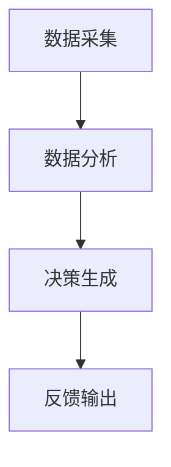

                 


# AI Agent在智能体育训练中的应用

## 关键词：AI Agent, 智能体育, 体育训练, 强化学习, 监督学习, 数据分析

## 摘要：AI Agent在智能体育训练中的应用，结合了人工智能技术与体育训练的深度融合，通过实时数据分析、个性化训练计划、实时反馈和动作优化，显著提升了体育训练的效果和效率。本文将详细探讨AI Agent的核心概念、算法原理、系统架构设计以及实际应用案例，为读者提供全面的技术解析和实践指导。

---

## 第1章: AI Agent与智能体育训练的背景

### 1.1 AI Agent的基本概念

#### 1.1.1 什么是AI Agent
AI Agent（智能体）是指能够感知环境、自主决策并采取行动的智能系统。在体育训练中，AI Agent可以实时分析运动员的动作、体能和环境数据，提供个性化的训练建议和实时反馈。

#### 1.1.2 AI Agent的核心特征
- **自主性**：无需人工干预，自主执行任务。
- **反应性**：能够实时感知并响应环境变化。
- **学习能力**：通过数据和经验不断优化性能。
- **适应性**：能够根据环境和目标动态调整行为。

#### 1.1.3 AI Agent在体育中的潜力
AI Agent可以通过分析海量数据，帮助教练和运动员制定更科学的训练计划，优化动作技术，降低运动损伤风险，并提升训练效率。

---

### 1.2 智能体育训练的现状

#### 1.2.1 传统体育训练的局限性
传统体育训练依赖教练的经验和肉眼观察，存在主观性强、数据采集不全面、反馈滞后等问题，难以满足个性化和科学化的需求。

#### 1.2.2 智能化训练的需求与趋势
随着科技的发展，运动员和教练对数据驱动的个性化训练需求日益增加。智能化训练能够通过实时数据分析提供精准反馈，帮助运动员更快提升表现。

#### 1.2.3 AI Agent在体育训练中的应用场景
- **运动分析**：通过视频和传感器数据，实时分析运动员的动作和技术。
- **个性化训练计划**：基于运动员的数据，制定科学的训练方案。
- **实时反馈**：在训练过程中提供即时反馈，帮助运动员纠正动作。
- **损伤预防**：通过数据分析，识别潜在的运动损伤风险。

---

## 第2章: AI Agent的核心原理

### 2.1 AI Agent的定义与分类

#### 2.1.1 AI Agent的定义
AI Agent是一种能够感知环境、做出决策并采取行动的智能系统。在体育训练中，AI Agent通常用于数据分析、决策支持和实时反馈。

#### 2.1.2 AI Agent的分类
AI Agent可以根据功能和应用场景分为以下几类：
1. **运动分析型AI Agent**：用于分析运动员的动作和技术。
2. **训练计划型AI Agent**：用于制定个性化训练计划。
3. **实时反馈型AI Agent**：用于提供即时训练反馈。

### 2.2 AI Agent的感知与决策机制

#### 2.2.1 感知层：数据采集与处理
AI Agent通过多种传感器和摄像头采集运动员的数据，包括：
- **动作捕捉**：通过摄像头或运动捕捉设备获取运动员的动作数据。
- **生理数据**：心率、体温、肌肉活动等生理指标。
- **环境数据**：如温度、湿度、场地条件等。

#### 2.2.2 决策层：算法与策略选择
AI Agent的核心在于算法的选择和优化。以下是几种常见的算法：
- **强化学习**：通过奖励机制优化决策策略。
- **监督学习**：基于标注数据进行分类和预测。
- **无监督学习**：发现数据中的潜在模式和结构。

#### 2.2.3 执行层：动作输出与反馈
AI Agent根据决策层的指令，通过反馈机制指导运动员调整动作，例如：
- 提供实时语音反馈，指出动作的错误。
- 调整训练计划，优化训练内容。

---

## 第3章: AI Agent的算法原理与数学模型

### 3.1 基于强化学习的AI Agent

#### 3.1.1 强化学习的基本原理
强化学习是一种通过试错机制学习策略的方法。AI Agent通过与环境交互，获得奖励或惩罚，并调整行为以最大化累计奖励。

#### 3.1.2 AI Agent在体育训练中的强化学习应用
例如，在篮球训练中，AI Agent可以通过强化学习帮助运动员优化投篮动作。每次投篮的结果（命中或未命中）作为奖励信号，AI Agent会调整动作参数以提高命中率。

#### 3.1.3 强化学习算法的优缺点
- **优点**：能够适应动态环境，自主优化策略。
- **缺点**：需要大量数据和计算资源，训练时间较长。

### 3.2 基于监督学习的AI Agent

#### 3.2.1 监督学习的基本原理
监督学习是一种基于标注数据的分类或回归方法。AI Agent通过学习大量标注数据，识别模式并进行预测。

#### 3.2.2 AI Agent在体育训练中的监督学习应用
例如，在跑步训练中，AI Agent可以通过监督学习分析运动员的步频、步幅等数据，预测最佳跑步姿势。

#### 3.2.3 监督学习算法的优缺点
- **优点**：训练速度快，易于部署。
- **缺点**：依赖高质量的标注数据，难以处理动态变化的环境。

---

## 第4章: AI Agent的系统架构设计

### 4.1 系统功能设计

#### 4.1.1 功能模块划分
- **数据采集模块**：负责采集运动员的数据。
- **数据分析模块**：对数据进行处理和分析。
- **决策模块**：基于算法生成决策。
- **反馈模块**：将决策转化为反馈输出。

#### 4.1.2 功能模块的交互流程
1. 数据采集模块获取运动员的数据。
2. 数据分析模块对数据进行处理和分析。
3. 决策模块根据分析结果生成决策。
4. 反馈模块将决策转化为反馈，指导运动员调整动作。

---

### 4.2 系统架构设计

#### 4.2.1 系统架构图


---

## 第5章: AI Agent在体育训练中的应用案例

### 5.1 项目实战

#### 5.1.1 环境安装
需要安装以下工具和库：
- Python
- OpenCV
- TensorFlow
- NumPy

#### 5.1.2 核心代码实现
以下是基于强化学习的AI Agent代码示例：

```python
import numpy as np
import gym

env = gym.make('CartPole-v1')
env.seed(42)

# 初始化参数
theta = np.random.randn(4)
alpha = 0.1

# 强化学习算法：Q-learning
def q_learning(state):
    return np.dot(state, theta)

# 训练过程
for episode in range(1000):
    state = env.reset()
    total_reward = 0
    for _ in range(1000):
        action = np.argmax(q_learning(state))
        next_state, reward, done, _ = env.step(action)
        total_reward += reward
        if done:
            break
    print(f"Episode {episode}, Total Reward: {total_reward}")

env.close()
```

#### 5.1.3 代码应用解读与分析
上述代码实现了基于Q-learning算法的AI Agent，用于解决CartPole-v1环境中的平衡杆问题。AI Agent通过与环境交互，逐步优化动作策略，最终实现稳定控制。

---

## 第6章: 最佳实践与小结

### 6.1 最佳实践
- **数据隐私保护**：确保运动员数据的安全性和隐私性。
- **算法优化**：根据具体场景选择合适的算法，并进行参数调优。
- **系统集成**：将AI Agent与现有体育训练系统无缝集成。

### 6.2 小结
AI Agent在智能体育训练中的应用，显著提升了训练的科学性和效率。通过实时数据分析、个性化训练计划和实时反馈，AI Agent帮助运动员更快提升表现，降低运动损伤风险。

---

## 作者：AI天才研究院/AI Genius Institute & 禅与计算机程序设计艺术 /Zen And The Art of Computer Programming

