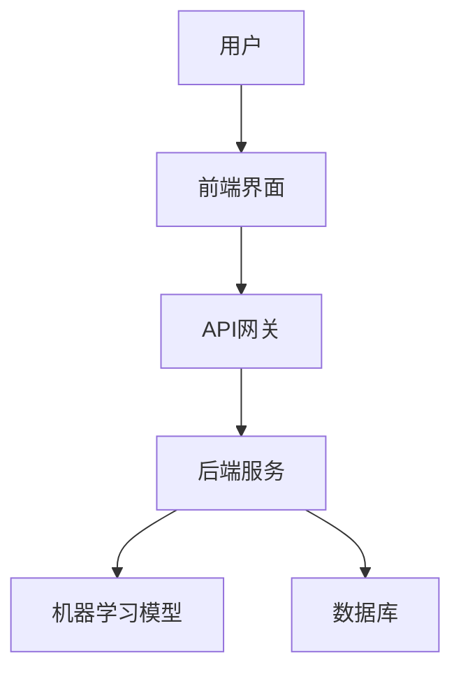

                 


# AI Agent在智能供应链风险管理中的应用

## 关键词：AI Agent, 智能供应链, 供应链风险管理, 人工智能, 机器学习, 自然语言处理, 强化学习

## 摘要：
随着全球供应链的复杂化，风险管理变得至关重要。AI Agent（人工智能代理）通过结合机器学习、自然语言处理和强化学习，能够实时监控和预测供应链中的潜在风险，从而优化供应链的稳定性和效率。本文详细探讨了AI Agent在供应链风险管理中的应用背景、核心技术和实际案例，分析了其在风险识别、评估和应对策略中的优势，并展望了未来的发展方向。

---

# 第1章: 智能供应链风险管理的背景与挑战

## 1.1 供应链管理的基本概念
### 1.1.1 供应链的定义与组成
供应链是指从原材料采购到产品交付给最终用户的整个过程，包括供应商、制造商、分销商和消费者。其组成包括物流、库存管理和信息流。

### 1.1.2 供应链管理的核心目标
供应链管理旨在提高效率、降低成本、增强灵活性和响应速度，同时确保产品和服务的质量。

### 1.1.3 供应链的常见风险类型
供应链面临的风险包括供应中断、需求波动、成本变化、质量控制和合规风险。

---

## 1.2 风险管理在供应链中的重要性
### 1.2.1 供应链风险管理的基本原则
风险管理需要全面性、预防性、动态性和成本效益。

### 1.2.2 风险对供应链效率的影响
风险可能导致延误、成本增加和客户满意度下降，进而影响企业竞争力。

### 1.2.3 风险管理的常见挑战
传统方法依赖人工监控，存在滞后、低效和不准确的问题。

---

## 1.3 AI Agent在供应链风险管理中的应用前景
### 1.3.1 AI Agent的定义与特点
AI Agent是一种智能系统，能够感知环境、自主决策并执行任务，具有学习和适应能力。

### 1.3.2 AI Agent在供应链中的优势
AI Agent能够实时监控、预测风险，并提供优化建议，显著提升供应链的抗风险能力。

### 1.3.3 供应链风险管理的智能化趋势
智能化风险管理通过AI技术实现数据驱动的决策，提高预测精度和应对速度。

---

## 1.4 本章小结
供应链风险管理是企业运营的核心，AI Agent的应用为解决传统方法的局限性提供了新思路。

---

# 第2章: AI Agent的核心概念与技术基础

## 2.1 AI Agent的基本原理
### 2.1.1 AI Agent的定义与分类
AI Agent分为简单反射Agent和基于模型的反射Agent，后者具有更强的推理和学习能力。

### 2.1.2 AI Agent的核心技术
AI Agent依赖于感知、决策和执行技术，包括机器学习、自然语言处理和强化学习。

### 2.1.3 AI Agent与传统自动化系统的区别
AI Agent具备自主性、反应性和学习能力，而传统系统依赖预设规则。

---

## 2.2 机器学习在AI Agent中的应用
### 2.2.1 机器学习的基本概念
机器学习通过数据训练模型，使其能够从经验中学习并做出预测。

### 2.2.2 常见机器学习算法在AI Agent中的应用
- **监督学习**：用于分类和回归问题，如预测供应商违约风险。
- **无监督学习**：用于聚类分析，识别异常交易模式。
- **集成学习**：通过组合多个模型提升预测准确性。

### 2.2.3 机器学习模型的训练与优化
训练数据的质量和特征选择直接影响模型性能，常用优化方法包括梯度下降和正则化。

---

## 2.3 自然语言处理在AI Agent中的应用
### 2.3.1 自然语言处理的基本概念
NLP用于理解和生成人类语言，帮助AI Agent处理非结构化数据，如合同文本和市场报告。

### 2.3.2 NLP在供应链风险管理中的应用
通过分析新闻和社交媒体数据，预测市场趋势和潜在风险。

### 2.3.3 常见NLP算法与工具
- **词嵌入**：如Word2Vec和BERT，用于捕捉语义信息。
- **情感分析**：用于判断市场情绪。

---

## 2.4 强化学习在AI Agent中的应用
### 2.4.1 强化学习的基本概念
强化学习通过试错机制，学习最优策略以最大化累积奖励。

### 2.4.2 强化学习在供应链决策中的应用
用于库存管理和订单优化，通过动态调整策略提升效率。

### 2.4.3 强化学习算法的优缺点
优点：适应性强；缺点：训练时间长，计算资源消耗大。

---

## 2.5 本章小结
AI Agent的核心技术包括机器学习、NLP和强化学习，这些技术共同支持其在供应链风险管理中的应用。

---

# 第3章: 智能供应链风险管理的理论基础

## 3.1 风险管理的基本理论
### 3.1.1 风险的定义与分类
风险分为市场风险、信用风险和操作风险等。

### 3.1.2 风险评估的基本方法
常用方法包括VaR（Value at Risk）和CVaR（Conditional Value at Risk）。

### 3.1.3 风险应对策略
包括风险规避、转移、缓解和接受。

---

## 3.2 供应链风险管理的理论框架
### 3.2.1 供应链风险管理的流程
包括识别、评估、应对和监控四个阶段。

### 3.2.2 供应链风险管理的关键要素
涉及数据收集、分析模型和决策支持系统。

### 3.2.3 供应链风险管理的常见模型
- **线性规划模型**：用于资源分配优化。
- **网络流模型**：用于分析物流路径。

---

## 3.3 AI Agent在供应链风险管理中的理论基础
### 3.3.1 AI Agent与风险管理的结合点
AI Agent能够实时分析数据，提供动态风险管理支持。

### 3.3.2 AI Agent在供应链风险管理中的理论框架
结合机器学习和强化学习，构建动态风险评估模型。

### 3.3.3 理论基础与实际应用的结合
通过理论指导实践，提升风险管理的科学性和可操作性。

---

## 3.4 本章小结
供应链风险管理的理论为AI Agent的应用提供了基础，而AI Agent则推动了风险管理的智能化发展。

---

# 第4章: AI Agent在供应链风险管理中的技术实现

## 4.1 技术实现的总体框架
AI Agent系统包括数据采集、分析、决策和执行四个模块。

---

## 4.2 算法实现
### 4.2.1 机器学习算法
使用随机森林或XGBoost模型预测供应商违约风险。

### 4.2.2 强化学习算法
通过DQN算法优化库存管理策略。

### 4.2.3 数学模型与公式
- 预测模型：$$y = \beta_0 + \beta_1x + \epsilon$$
- 损失函数：$$L = \frac{1}{n}\sum_{i=1}^{n}(y_i - \hat{y_i})^2$$

---

## 4.3 系统架构设计
### 4.3.1 系统功能设计
包括数据采集、风险评估、决策支持和监控报告。

### 4.3.2 系统架构图


---

## 4.4 项目实战
### 4.4.1 环境搭建
安装Python、TensorFlow和Scikit-learn等工具。

### 4.4.2 核心代码实现
```python
import pandas as pd
from sklearn.ensemble import RandomForestClassifier

# 加载数据
data = pd.read_csv('supply_chain.csv')

# 特征选择
features = data[[' supplier_rating', 'delivery_time', 'cost Variance']
target = data['risk_level']

# 模型训练
model = RandomForestClassifier()
model.fit(features, target)

# 预测
new_data = pd.DataFrame({' supplier_rating': [4.5], 'delivery_time': [10], 'cost Variance': [5]})
prediction = model.predict(new_data)
print(prediction)
```

### 4.4.3 案例分析
通过实际案例分析，展示AI Agent如何预测和应对供应链风险。

---

## 4.5 本章小结
技术实现部分详细介绍了AI Agent在供应链风险管理中的具体应用，展示了其强大的预测和优化能力。

---

## 4.6 最佳实践与注意事项
- 数据质量是模型性能的关键。
- 模型需要定期更新以适应新的风险。
- 注意数据隐私和安全问题。

---

## 4.7 拓展阅读
推荐相关书籍和论文，供读者深入学习。

---

# 作者：AI天才研究院 & 禅与计算机程序设计艺术

---

以上是《AI Agent在智能供应链风险管理中的应用》的完整内容，涵盖了从理论到实践的各个方面，结合了技术实现和实际案例，帮助读者全面理解AI Agent在供应链风险管理中的应用。

