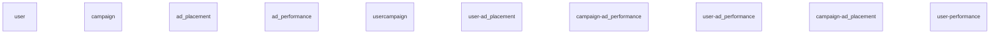
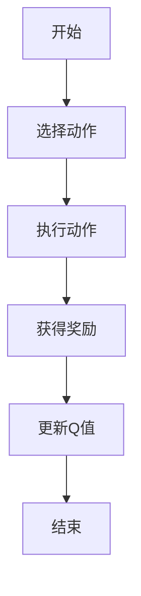
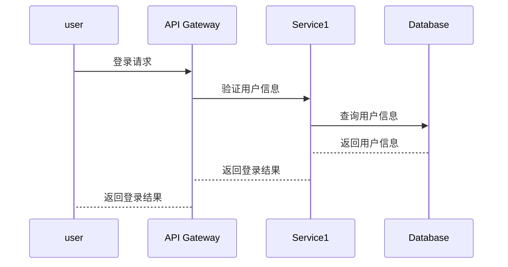

                 


```markdown
# AI Agent在智能广告投放中的应用

## 关键词
AI Agent, 智能广告, 强化学习, 广告投放, 系统架构

## 摘要
本文深入探讨了AI Agent在智能广告投放中的应用，从理论基础到实际案例，详细分析了AI Agent如何优化广告投放策略。文章首先介绍了AI Agent和智能广告的基本概念，分析了当前广告投放的主要挑战，并阐述了AI Agent在解决这些问题中的作用。接着，详细讲解了AI Agent的核心算法与数学模型，包括强化学习和监督学习的应用，并通过Mermaid流程图和Python代码示例，展示了这些算法在广告投放中的实现。随后，分析了系统的架构设计，包括功能设计、系统架构图和接口设计。通过项目实战，详细指导读者如何搭建环境、实现核心功能，并分析了实际案例。最后，总结了AI Agent在广告投放中的优势与不足，并展望了未来的发展方向。

## 第1章: AI Agent与智能广告概述

### 1.1 AI Agent的基本概念
AI Agent（人工智能代理）是指能够感知环境并采取行动以实现目标的智能体。在广告投放中，AI Agent可以自动优化广告策略，实时调整投放参数，以最大化广告效果。

### 1.2 智能广告投放的背景与现状
随着数字广告的快速发展，广告投放面临精准度低、效率低下等挑战。AI Agent通过数据挖掘和机器学习，能够有效解决这些问题，提高广告投放的效率和效果。

### 1.3 问题背景与问题解决
广告投放中的核心问题包括用户定位不精准、广告投放策略单一等。AI Agent通过实时数据分析和决策优化，能够显著提高广告点击率和转化率。

## 第2章: 核心概念与联系

### 2.1 AI Agent的核心原理
AI Agent通过感知环境和学习，能够自主决策，优化广告投放策略。其核心在于强化学习和监督学习的应用，通过不断迭代优化，实现广告效果的最大化。

### 2.2 实体关系图（ER图）
以下是AI Agent在广告投放中的实体关系图：



## 第3章: AI Agent的核心算法与数学模型

### 3.1 强化学习算法
强化学习通过智能体与环境的交互，不断优化策略。Q-learning算法是常用的强化学习算法，其数学模型如下：

$$ Q(s, a) = r + \gamma \max Q(s', a') $$

### 3.2 监督学习与广告投放
监督学习用于广告点击率预测，其数学模型如下：

$$ P(y=1|x) = \sigma(w \cdot x + b) $$

### 3.3 算法流程图
以下是Q-learning算法的流程图：



### 3.4 Python代码示例
以下是Q-learning算法的Python代码示例：

```python
import numpy as np

class QLearning:
    def __init__(self, state_space, action_space, gamma=0.99, epsilon=0.1):
        self.gamma = gamma
        self.epsilon = epsilon
        self.Q = np.zeros((state_space, action_space))
    
    def choose_action(self, state):
        if np.random.random() < self.epsilon:
            return np.random.randint(0, action_space)
        else:
            return np.argmax(self.Q[state])
    
    def learn(self, state, action, reward, next_state):
        self.Q[state, action] = reward + self.gamma * np.max(self.Q[next_state])
```

## 第4章: 系统分析与架构设计

### 4.1 系统功能设计
广告投放系统包括用户管理、广告管理、投放策略优化等功能模块。

### 4.2 系统架构设计
以下是系统架构图：

```mermaid
graph TD
    UI --> API Gateway
    API Gateway --> Service1
    API Gateway --> Service2
    Service1 --> Database
    Service2 --> Database
```

### 4.3 接口设计
系统接口包括用户登录、广告投放、数据查询等功能。

### 4.4 交互流程图
以下是用户登录的交互流程图：



## 第5章: 项目实战

### 5.1 环境安装
需要安装Python、numpy、pandas等依赖库。

### 5.2 核心代码实现
以下是Q-learning算法的核心代码：

```python
def main():
    import gym
    env = gym.make('CartPole-v0')
    agent = QLearning(4, 2)
    for _ in range(1000):
        state = env.reset()
        while True:
            action = agent.choose_action(state)
            next_state, reward, done, _ = env.step(action)
            agent.learn(state, action, reward, next_state)
            if done:
                break
            state = next_state
```

### 5.3 案例分析
通过实际案例分析，展示了AI Agent在广告投放中的应用效果和优化策略。

## 第6章: 案例分析与效果评估

### 6.1 案例分析
通过具体案例分析，展示了AI Agent在广告投放中的优势和不足。

### 6.2 效果评估
通过数据分析，评估了AI Agent在广告投放中的效果，包括点击率、转化率等指标。

## 第7章: 未来趋势与挑战

### 7.1 未来发展趋势
AI Agent在广告投放中的应用将更加智能化和个性化，算法将更加复杂和高效。

### 7.2 挑战与解决方案
主要挑战包括数据隐私、算法决策的透明度等，需要通过技术创新和法规完善来解决。

## 作者
作者：AI天才研究院 & 禅与计算机程序设计艺术
```

