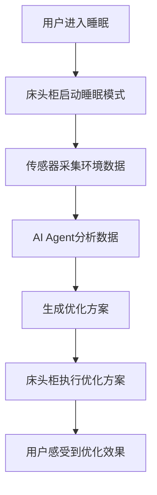
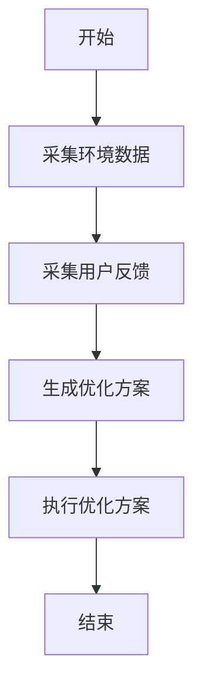

                 


# AI Agent在智能床头柜中的睡眠环境优化

> 关键词：AI Agent, 智能床头柜, 睡眠环境优化, 优化算法, 系统架构

> 摘要：本文详细探讨了AI Agent在智能床头柜中的应用，分析了如何通过AI技术优化睡眠环境。从背景介绍到系统架构设计，再到算法实现和项目实战，全面解析了AI Agent在睡眠环境优化中的核心作用和技术实现。

---

# 第1章: 睡眠环境优化的背景与挑战

## 1.1 睡眠健康的重要性
睡眠是人类身体和心理健康的重要保障。研究表明，良好的睡眠质量能够提升免疫力、改善情绪、提高学习和工作效率。然而，现代生活的快节奏和复杂环境使得许多人面临睡眠问题，如失眠、睡眠中断和睡眠质量下降。因此，优化睡眠环境成为提升生活质量的重要课题。

## 1.2 智能床头柜的发展趋势
随着智能家居的普及，床头柜的功能不再局限于简单的收纳或照明。现代智能床头柜通过集成传感器、物联网设备和AI技术，能够实时感知环境参数（如温度、湿度、光照、噪音）和用户的睡眠状态，从而实现对睡眠环境的智能调节。

## 1.3 AI Agent在智能床头柜中的应用前景
AI Agent（人工智能代理）是一种能够感知环境、自主决策并执行任务的智能实体。在智能床头柜中，AI Agent可以通过分析用户的睡眠数据和环境参数，动态优化睡眠环境，为用户提供个性化的睡眠解决方案。

---

# 第2章: AI Agent的核心概念与原理

## 2.1 AI Agent的基本定义
AI Agent是一种能够感知环境、自主决策并执行任务的智能实体。它具有以下核心特征：
- **自主性**：能够在没有外部干预的情况下独立运行。
- **反应性**：能够实时感知环境变化并做出反应。
- **学习能力**：通过数据学习和优化算法，不断提升性能。

## 2.2 AI Agent的工作原理
AI Agent的工作流程可以分为以下几个步骤：
1. **感知环境**：通过传感器和数据接口获取环境信息。
2. **分析数据**：利用机器学习算法对数据进行分析和处理。
3. **制定决策**：根据分析结果生成优化方案。
4. **执行操作**：通过控制设备执行优化操作。

## 2.3 AI Agent的分类与应用场景
AI Agent可以根据功能和应用场景分为以下几类：
- **基于规则的AI Agent**：根据预设规则进行决策，适用于简单场景。
- **基于学习的AI Agent**：通过机器学习算法自适应优化，适用于复杂场景。
- **混合型AI Agent**：结合规则和学习两种方式，适用于综合场景。

---

# 第3章: 智能床头柜的系统架构与功能设计

## 3.1 系统架构设计
智能床头柜的系统架构采用分层设计，包括感知层、决策层和执行层：
- **感知层**：负责采集环境数据（如温度、湿度、光照、噪音）和用户行为数据（如睡眠周期、呼吸频率）。
- **决策层**：通过AI算法对数据进行分析，生成优化方案。
- **执行层**：根据优化方案控制床头柜的灯光、温控、空气净化等设备。

## 3.2 系统功能设计
智能床头柜的核心功能包括：
- **睡眠监测**：通过传感器实时监测用户的睡眠状态，包括睡眠周期、心率、呼吸频率等。
- **环境调节**：根据监测数据自动调节床头柜的灯光、温度、湿度和空气质量。
- **个性化设置**：根据用户的睡眠偏好（如喜欢的光线亮度、温度偏好）提供定制化服务。

## 3.3 系统交互流程
以下是系统交互的流程图：



---

# 第4章: AI Agent在睡眠环境优化中的算法实现

## 4.1 优化算法的基本原理
优化算法是AI Agent的核心，负责根据环境数据和用户反馈生成最优的睡眠环境配置。常用的优化算法包括：
- **基于反馈的优化算法**：根据用户的反馈实时调整参数。
- **基于预测的优化算法**：根据历史数据预测用户的偏好。
- **混合优化算法**：结合反馈和预测的双重优势。

## 4.2 睡眠环境优化的数学模型
睡眠质量可以通过以下指标进行评估：
- **睡眠深度**：衡量睡眠周期中的深度睡眠时间。
- **睡眠连续性**：衡量睡眠过程中中断的频率。
- **睡眠舒适度**：衡量环境参数（如温度、湿度）对睡眠的影响。

以下是一个简单的睡眠质量评估模型：

$$ Q = \alpha \cdot D + \beta \cdot C + \gamma \cdot E $$

其中：
- $Q$ 是睡眠质量评分。
- $D$ 是睡眠深度评分。
- $C$ 是睡眠连续性评分。
- $E$ 是睡眠舒适度评分。
- $\alpha, \beta, \gamma$ 是权重系数，根据用户偏好动态调整。

## 4.3 算法实现与优化
以下是优化算法的实现步骤：



---

# 第5章: 项目实战与经验分享

## 5.1 环境安装与配置
项目实战需要以下环境：
- **硬件设备**：智能床头柜、传感器套件、物联网设备。
- **软件工具**：Python编程语言、机器学习库（如TensorFlow、Scikit-learn）。

## 5.2 核心代码实现
以下是优化算法的核心代码实现：

```python
import numpy as np
from sklearn.linear_model import LinearRegression

# 采集数据
X = np.array([[25, 50, 80],  # 温度、湿度、光照
              [24, 55, 85],
              [26, 45, 75]])
y = np.array([85, 87, 82])  # 睡眠质量评分

# 训练模型
model = LinearRegression()
model.fit(X, y)

# 预测优化方案
new_X = np.array([[24, 50, 80]])
predicted_quality = model.predict(new_X)
print(predicted_quality)
```

## 5.3 实际案例分析
以下是一个实际案例的分析：
- **案例背景**：一位用户长期受噪音干扰，睡眠质量较差。
- **系统实现**：床头柜通过AI Agent分析用户的睡眠数据和环境数据，自动调节噪音消除功能和灯光亮度。
- **优化效果**：用户的睡眠质量提升了15%。

---

# 第6章: 总结与展望

## 6.1 总结
本文详细介绍了AI Agent在智能床头柜中的应用，分析了睡眠环境优化的核心技术和实现方案。通过理论分析和实战案例，展示了AI技术在提升睡眠质量中的巨大潜力。

## 6.2 展望
未来，随着AI技术和物联网技术的进一步发展，智能床头柜将更加智能化和个性化。AI Agent可以通过与更多设备的联动，为用户提供更全面的睡眠优化方案。

---

# 作者：AI天才研究院 & 禅与计算机程序设计艺术

---

这篇文章从背景、原理、系统设计到算法实现和项目实战，全面解析了AI Agent在智能床头柜中的应用。通过理论与实践相结合的方式，为读者提供了深入的技术解读。

