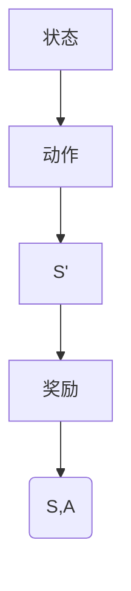
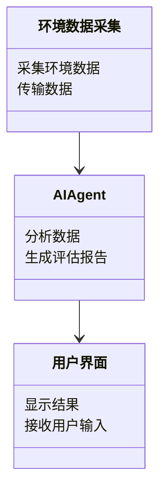

                 


# AI Agent在智能环境影响评估中的实践

## 关键词：AI Agent, 智能环境, 影响评估, 机器学习, 环境科学

## 摘要：本文探讨了AI Agent在智能环境影响评估中的应用，分析了其核心概念、算法原理和系统架构，通过案例展示了其实战应用，最后总结了最佳实践和未来发展。

---

## 第一章: AI Agent与智能环境影响评估概述

### 1.1 AI Agent的基本概念
#### 1.1.1 AI Agent的定义与分类
- AI Agent是具备感知和行动能力的智能体，分为简单反射型、基于模型型、utility-based和学习型四种。

#### 1.1.2 智能环境的定义与特征
- 智能环境是能够与AI Agent交互并响应的动态系统，具备自适应、学习和协作能力。

#### 1.1.3 AI Agent在智能环境中的作用
- AI Agent通过数据处理、决策和执行，优化环境的运行效率。

### 1.2 环境影响评估的核心问题
#### 1.2.1 环境影响评估的定义
- 环境影响评估是预测项目对环境影响的过程，传统方法依赖人工分析，耗时且不够精确。

#### 1.2.2 智能环境影响评估的必要性
- 提高评估效率和准确性，应对日益复杂的环境问题。

#### 1.2.3 AI Agent在环境影响评估中的应用场景
- 数据分析、预测建模、实时监控等。

### 1.3 AI Agent在智能环境影响评估中的优势
#### 1.3.1 提高评估效率
- 自动化处理和分析大量数据，缩短评估周期。

#### 1.3.2 增强数据处理能力
- 利用机器学习技术识别复杂模式，提供更精准的评估结果。

#### 1.3.3 实现动态实时评估
- AI Agent实时监控环境变化，及时调整评估策略。

---

## 第二章: AI Agent的核心概念与联系

### 2.1 AI Agent的核心概念
#### 2.1.1 AI Agent的智能性
- 具备学习和推理能力，能适应复杂环境。

#### 2.1.2 AI Agent的自主性
- 能够独立决策和执行任务，无需持续人工干预。

#### 2.1.3 AI Agent的协作性
- 能与其他Agent或系统协同工作，完成复杂任务。

### 2.2 AI Agent与相关概念的对比
#### 2.2.1 AI Agent与传统软件代理的对比
| 特性        | AI Agent             | 传统软件代理       |
|-------------|----------------------|--------------------|
| 智能性       | 高                   | 低                 |
| 自主性       | 高                   | 中                 |
| 学习能力     | 高                   | 无/低             |

#### 2.2.2 AI Agent与机器学习模型的对比
| 特性        | AI Agent             | 机器学习模型       |
|-------------|----------------------|--------------------|
| 任务         | 与环境交互           | 数据分析           |
| 智能性       | 高                   | 中/低             |
| 自主性       | 高                   | 无/低             |

#### 2.2.3 AI Agent与物联网设备的对比
- AI Agent具备数据处理和决策能力，而物联网设备主要负责数据采集和传输。

### 2.3 AI Agent的实体关系图
```mermaid
er
    actor 用户
    actor 环境
    actor AI Agent
    boundary 智能环境影响评估系统
    relation 用户 -> 智能环境影响评估系统
    relation 环境 -> 智能环境影响评估系统
    relation AI Agent -> 智能环境影响评估系统
```

---

## 第三章: AI Agent的核心算法原理

### 3.1 强化学习算法
#### 3.1.1 Q-learning算法

数学公式：
$$ Q(s, a) = (1-\alpha) Q(s,a) + \alpha (r + \gamma Q(s', a')) $$
其中，α是学习率，γ是折扣因子。

### 3.2 监督学习算法
#### 3.2.1 回归算法
$$ y = \theta x + b $$
适用于预测环境影响评估中的连续值。

### 3.3 聚类算法
#### 3.3.1 K-means算法
步骤：
1. 随机选择K个初始中心。
2. 计算每个数据点到中心的最近距离，分配类别。
3. 重新计算各类中心。
4. 重复步骤2和3直到收敛。

---

## 第四章: 系统分析与架构设计

### 4.1 系统功能设计
- 领域模型：


### 4.2 系统架构设计


---

## 第五章: 项目实战

### 5.1 环境安装
- 安装Python、TensorFlow、Keras等库：
```bash
pip install numpy tensorflow scikit-learn
```

### 5.2 核心代码实现
```python
import numpy as np
from tensorflow.keras import layers

# 初始化模型
model = layers.Sequential([
    layers.Dense(64, activation='relu'),
    layers.Dense(1, activation='linear')
])

# 编译模型
model.compile(optimizer='adam', loss='mean_squared_error')

# 训练模型
model.fit(X_train, y_train, epochs=100, batch_size=32)
```

### 5.3 案例分析
- 某工业园区环境评估，AI Agent通过分析排放数据，预测潜在环境影响，提出优化建议。

---

## 第六章: 最佳实践与小结

### 6.1 最佳实践
- 数据质量：确保数据准确性和完整性。
- 模型选择：根据任务需求选择合适算法。
- 性能优化：定期更新模型，适应环境变化。

### 6.2 小结
AI Agent在智能环境影响评估中展现了强大的潜力，通过算法优化和系统设计，可显著提升评估效率和精度。

---

## 作者：AI天才研究院 & 禅与计算机程序设计艺术

