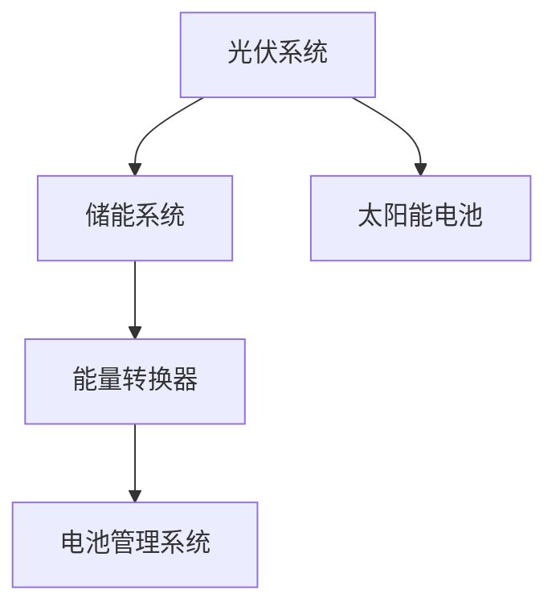
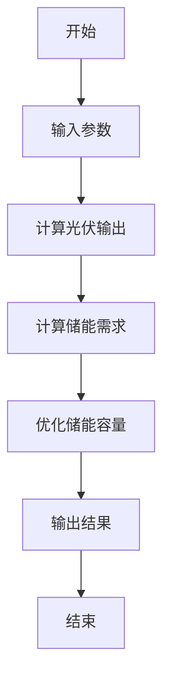

                 


---

# 价值投资中的新型高效光伏-储能一体化技术

> 关键词：光伏技术, 储能技术, 价值投资, 一体化技术, 能源系统优化

> 摘要：本文深入探讨了光伏-储能一体化技术在价值投资中的应用潜力，通过系统分析和案例研究，揭示了该技术在能源效率提升、成本优化和可持续发展中的重要作用。文章从技术背景、核心原理、系统架构到实际应用，全面解析了光伏-储能一体化技术的创新点和投资价值。

---

# 第一部分: 光伏-储能一体化技术的背景与价值投资概述

## 第1章: 光伏-储能一体化技术的背景介绍

### 1.1 什么是光伏-储能一体化技术
#### 1.1.1 光伏技术的基本概念
光伏发电是一种利用半导体材料将太阳辐射能直接转换为电能的技术。其核心部件包括太阳能电池板、逆变器、支架和控制系统。光伏技术因其清洁、可再生的特点，广泛应用于分布式发电和大型电站建设。

#### 1.1.2 储能技术的基本概念
储能技术是通过电池或其他能量存储设备，将电能存储起来，并在需要时释放的技术。常见的储能技术包括铅酸电池、锂离子电池、钠硫电池等。储能技术在电力调峰、备用电源和可再生能源整合中发挥着重要作用。

#### 1.1.3 一体化技术的定义与特点
光伏-储能一体化技术是指将光伏发电系统与储能系统有机结合，形成一个高效、智能的能量转换和存储系统。其特点包括：
- **高效性**：通过协同优化，提高能量转换效率。
- **智能化**：采用先进的控制算法，实现能量的智能分配和管理。
- **灵活性**：适应不同的应用场景，如家庭用户、商业建筑和工业园区。

### 1.2 价值投资中的技术背景
#### 1.2.1 价值投资的基本概念
价值投资是一种以低于内在价值的价格买入优质资产的投资策略。其核心在于识别具有长期增长潜力和竞争优势的企业或技术。

#### 1.2.2 光伏-储能技术在价值投资中的应用
随着全球能源结构转型，可再生能源的需求持续增长。光伏-储能一体化技术作为清洁能源的重要组成部分，具有广阔的市场前景和持续的技术进步潜力。投资者可以通过投资相关企业或技术，获得长期稳定的收益。

#### 1.2.3 一体化技术的经济价值
一体化技术通过提高能源利用效率，降低能源成本，为企业和家庭用户创造更大的经济价值。同时，其在电网调峰、减少碳排放等方面的社会价值也显著提升。

---

## 第2章: 光伏-储能一体化技术的核心概念与联系

### 2.1 核心概念原理
#### 2.1.1 光伏发电的核心原理
光伏发电的核心在于半导体材料的光电效应。当太阳光照射到太阳能电池时，光子能量被半导体材料吸收，产生电子-空穴对。通过PN结的建立，电子和空穴分别流向两侧，形成电流，最终转化为电能。

#### 2.1.2 储能系统的能量转换原理
储能系统通过电池将电能转化为化学能，在需要时再将化学能转换为电能。这一过程包括充电和放电两个阶段，分别涉及能量的吸收和释放。

#### 2.1.3 一体化技术的协同优化原理
一体化技术通过将光伏发电和储能系统有机结合，实现能量的高效利用。在光照充足时，光伏系统将多余的能量存储在电池中；在光照不足时，储能系统释放能量，保证电力供应的稳定性。

### 2.2 核心概念属性特征对比表
| 概念       | 输入 | 输出 | 效率 | 储能容量 |
|------------|------|------|------|-----------|
| 光伏发电   | 太阳能 | 电能 | 转换效率 | -         |
| 储能系统   | 电能 | 电能 | 储存效率 | 储能容量  |

### 2.3 ER实体关系图



---

# 第二部分: 光伏-储能一体化技术的算法原理与数学模型

## 第3章: 光伏-储能系统优化算法

### 3.1 系统优化算法概述
#### 3.1.1 算法的目标与约束条件
系统优化算法的目标是在满足电力需求的前提下，最大化能源利用效率，最小化能源成本。主要约束条件包括电力需求、储能容量、系统安全性和环境因素。

#### 3.1.2 常用优化算法简介
常用的优化算法包括遗传算法、粒子群优化算法和模拟退火算法。这些算法通过迭代搜索，找到最优解。

### 3.2 算法流程图



### 3.3 数学模型与公式
#### 3.3.1 光伏发电输出模型
$$ P_{\text{光伏}} = A \cdot G_{\text{辐射}} - B \cdot T_{\text{温度}} $$

#### 3.3.2 储能系统充放电模型
$$ C_{\text{储能}} = \int_{0}^{t} (P_{\text{充电}} - P_{\text{放电}}) \, dt $$

---

## 第4章: 光伏-储能系统架构与设计

### 4.1 系统架构设计
#### 4.1.1 系统组成
光伏-储能系统主要由光伏组件、逆变器、储能电池、电池管理系统（BMS）和能量管理系统（EMS）组成。

#### 4.1.2 系统架构图

```mermaid
graph TD
A[光伏组件] --> B[逆变器]
B --> C[储能电池]
C --> D[电池管理系统(BMS)]
A --> E[能量管理系统(EMS)]
D --> E
```

### 4.2 系统功能设计
#### 4.2.1 功能模块
- 光伏发电模块：负责能量的收集和转换。
- 储能模块：负责能量的存储和释放。
- 控制模块：负责系统的运行和管理。

#### 4.2.2 功能实现
系统通过EMS实现能量的智能分配和管理，确保光伏系统和储能系统协同工作，优化能源利用效率。

---

## 第5章: 项目实战与案例分析

### 5.1 项目环境配置
#### 5.1.1 硬件配置
- 太阳能电池板：功率为5kW。
- 储能电池：容量为20kWh，采用锂离子电池。
- 逆变器：最大输出功率为10kW。

#### 5.1.2 软件配置
- EMS：能量管理系统，负责系统的运行和控制。
- BMS：电池管理系统，监控电池状态。

### 5.2 系统核心实现

```python
# EMS算法实现
def optimize_storage(demand, generation):
    storage = 0
    for t in range(len(demand)):
        if generation[t] > demand[t]:
            storage += generation[t] - demand[t]
        else:
            storage -= demand[t] - generation[t]
            if storage < 0:
                storage = 0
    return storage
```

### 5.3 案例分析
以某家庭用户为例，假设每天的光伏发电量为5kWh，储能容量为20kWh。在光照充足时，光伏系统发电5kWh，满足家庭需求并存储多余的2kWh；在光照不足时，储能系统释放2kWh，确保电力供应。

---

## 第6章: 总结与展望

### 6.1 总结
光伏-储能一体化技术通过高效的能量转换和存储，显著提升了能源利用效率，降低了能源成本。其在价值投资中的潜力巨大，特别是在可再生能源需求不断增长的背景下。

### 6.2 展望
未来，随着技术的进步和成本的降低，光伏-储能一体化技术将得到更广泛应用。投资者可以通过投资相关技术和企业，获得长期稳定的收益。

---

# 作者：AI天才研究院/AI Genius Institute & 禅与计算机程序设计艺术 /Zen And The Art of Computer Programming

