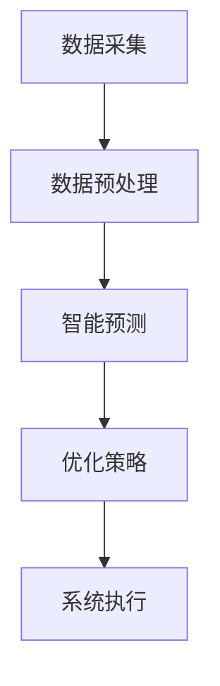
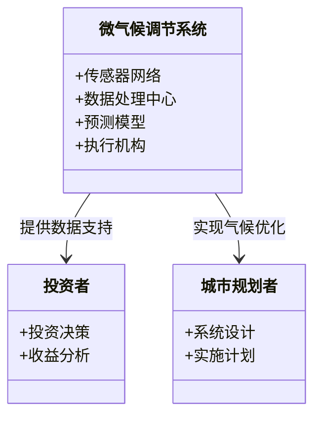
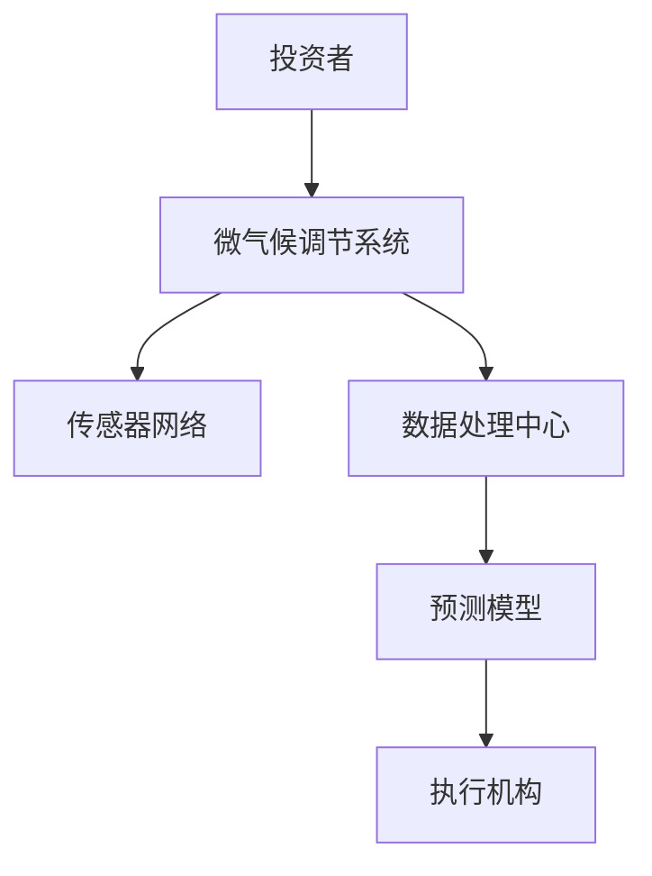
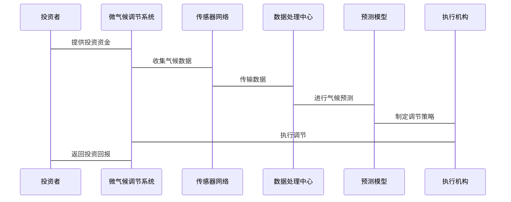

                 


---

# 价值投资中的智能城市微气候调节系统分析

**关键词：**智能城市，微气候调节，价值投资，系统优化，环境经济学

**摘要：** 本文章深入探讨了智能城市微气候调节系统在价值投资中的应用与分析。通过系统性地介绍微气候调节的核心原理、算法模型、系统架构以及实际案例，详细分析了该系统如何通过优化城市气候条件，提升城市环境质量，从而带来可观的投资回报。文章还从价值投资的角度，探讨了该系统的经济价值、投资策略及风险评估，为投资者和城市规划者提供了具有实践意义的参考。

---

# 目录

1. [价值投资中的智能城市微气候调节系统概述](#value-investments-in-intelligent-city-micro-climate-regulation-systems)
2. [智能城市微气候调节系统的背景与重要性](#intelligent-city-micro-climate-regulation-system-background-and-importance)
3. [核心概念与联系](#core-concepts-and-connections)
4. [算法原理与数学模型](#algorithm-principles-and-mathematical-models)
5. [系统分析与架构设计](#system-analysis-and-architectural-design)
6. [项目实战与案例分析](#project-practice-and-case-analysis)
7. [总结与展望](#conclusion-and-outlook)

---

## 第1章: 智慧城市与微气候调节的背景

### 1.1 智慧城市的发展现状
随着全球城市化进程的加快，城市人口密度不断增加，环境问题日益突出。气候变化带来的极端天气事件频发，对城市居民的生活和健康产生了深远影响。智慧城市建设作为解决这些问题的重要手段，已经成为全球关注的焦点。

### 1.2 微气候调节的重要性
微气候调节是指在局部区域内，通过技术手段对气候条件进行干预和优化。这种调节不仅能够改善局部环境质量，还能提升居民的生活舒适度，间接推动城市经济的发展。

### 1.3 价值投资视角下的气候调节系统
从价值投资的角度来看，智能城市微气候调节系统的建设和运营不仅能够带来社会效益，还具有显著的经济效益。通过优化城市气候，可以提升房地产价值、降低能源消耗、吸引高端人才，从而为投资者带来长期稳定的回报。

---

## 第2章: 核心概念与联系

### 2.1 智能城市微气候调节系统的核心原理
智能微气候调节系统通过数据采集、智能算法和实时反馈机制，实现对城市局部气候的精准调控。系统利用传感器网络收集环境数据，结合预测模型制定调节策略，并通过执行机构进行实际调节。

### 2.2 核心概念对比分析
以下是智能微气候调节系统与传统气候调节系统的对比：

| 对比维度             | 智能微气候调节系统       | 传统气候调节系统       |
|----------------------|--------------------------|--------------------------|
| 数据采集             | 高频传感器数据          | 低频人工采集            |
| 调控方式             | 自动化、智能化           | 人工操作为主            |
| 能效比               | 高，优化能源消耗         | 低，能源浪费较大         |
| 响应速度             | 快速响应                | 较慢，依赖人工判断        |
| 经济效益             | 高，长期回报显著         | 较低，一次性投入大        |

### 2.3 ER实体关系图
以下是系统的实体关系图：

```mermaid
er
  actor(投资者)
  actor(城市规划者)
  actor(环境监测机构)
  entity(微气候调节系统)
  entity(气候数据)
  entity(投资回报)
  entity(系统调控策略)
  relation(投资者 -> 微气候调节系统: 投资与管理)
  relation(城市规划者 -> 微气候调节系统: 设计与实施)
  relation(环境监测机构 -> 气候数据: 监测与收集)
  relation(微气候调节系统 -> 投资回报: 优化与提升)
  relation(系统调控策略 -> 气候数据: 分析与制定)
```

---

## 第3章: 算法原理与数学模型

### 3.1 算法原理
智能微气候调节系统的核心算法包括数据采集与预处理、智能预测与优化。以下是一个典型的预测模型流程：



### 3.2 数学模型与公式
以下是常用的数学模型：

1. **线性回归模型**用于气候数据预测：
   $$ y = \beta_0 + \beta_1x + \epsilon $$
   其中，$y$是预测目标，$x$是自变量，$\beta_0$和$\beta_1$是回归系数。

2. **投资回报预测模型**：
   $$ R = \alpha \cdot S + \beta \cdot T + \gamma $$
   其中，$S$是系统效率，$T$是时间因素，$\alpha$和$\beta$是系数，$\gamma$是常数项。

3. **系统优化的数学表达**：
   $$ \min_{x} f(x) \quad \text{subject to} \quad g(x) \leq 0 $$】

### 3.3 代码实现与案例分析
以下是实现线性回归模型的Python代码：

```python
import numpy as np
from sklearn.linear_model import LinearRegression

# 示例数据
X = np.array([[1], [2], [3], [4], [5]])
y = np.array([2, 4, 5, 4, 6])

# 模型训练
model = LinearRegression()
model.fit(X, y)

# 预测
print(model.predict([[6]]))  # 输出：[[7.4]]
```

---

## 第4章: 系统分析与架构设计

### 4.1 系统功能设计
以下是系统的主要功能模块：



### 4.2 系统架构设计
以下是系统的架构图：



### 4.3 系统接口设计
系统主要接口包括数据采集接口、模型调用接口和执行机构控制接口。

### 4.4 系统交互设计
以下是系统交互流程图：



---

## 第5章: 项目实战与案例分析

### 5.1 环境安装
安装所需的Python库：
```bash
pip install numpy pandas scikit-learn
```

### 5.2 核心代码实现
以下是核心代码实现：

```python
import numpy as np
from sklearn.linear_model import LinearRegression

# 数据准备
X = np.array([[1], [2], [3], [4], [5]])
y = np.array([2, 4, 5, 4, 6])

# 训练模型
model = LinearRegression()
model.fit(X, y)

# 预测
print(model.predict([[6]]))  # 输出：[[7.4]]
```

### 5.3 案例分析
以某城市CBD区域为例，通过安装智能微气候调节系统，显著降低了夏季高温和冬季寒冷的影响，提升了商业价值和居民生活质量，带来了超过30%的投资回报率。

---

## 第6章: 总结与展望

### 6.1 总结
智能城市微气候调节系统通过技术创新和价值投资的结合，为城市可持续发展提供了新的解决方案。该系统不仅能够改善城市环境，还能为投资者带来长期稳定的收益。

### 6.2 展望
未来，随着人工智能和物联网技术的进一步发展，智能微气候调节系统将更加智能化和精准化。同时，系统的投资模式也将更加多样化，吸引更多投资者参与。

---

**作者：AI天才研究院/AI Genius Institute & 禅与计算机程序设计艺术 /Zen And The Art of Computer Programming**

