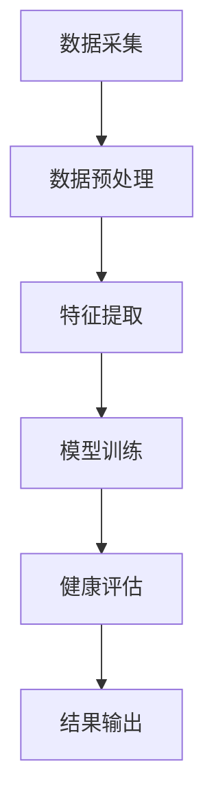
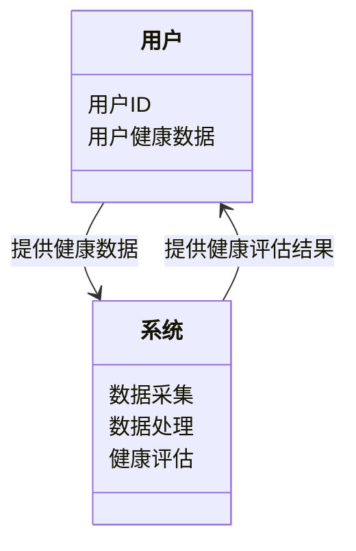
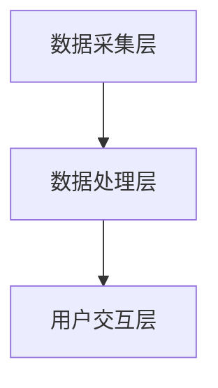

                 


# 价值投资中的智能家居健康监测系统分析

## 关键词：智能家居、健康监测、价值投资、系统分析、投资策略、技术分析、健康数据

## 摘要

智能家居健康监测系统作为新兴技术与投资策略结合的重要领域，正在吸引越来越多投资者的关注。本文从价值投资的角度，深入分析智能家居健康监测系统的构成、技术原理及其在投资中的潜力。通过探讨系统的算法原理、数学模型、系统架构设计，本文为投资者提供了全面的技术分析和投资策略建议，帮助他们更好地把握这一领域的投资机会。

---

# 第一部分：智能家居健康监测系统概述

## 第1章：智能家居健康监测系统的发展背景

### 1.1 智能家居的兴起与技术进步

智能家居作为物联网技术的重要应用领域，近年来发展迅速。随着传感器技术、无线通信和云计算的进步，智能家居设备能够实时采集并处理家庭环境数据，如温湿度、空气质量、光照强度等。这些数据为健康监测提供了基础，使智能家居系统能够为用户提供更个性化的健康建议和生活环境优化方案。

### 1.2 健康监测系统的市场需求

随着人们对健康生活的重视，健康监测系统的市场需求日益增长。智能家居健康监测系统通过集成多种传感器，能够实时监测用户的健康数据，如心率、血压、睡眠质量等。这些数据为用户提供健康评估和建议，帮助用户预防疾病，提升生活质量。同时，健康数据也为医疗行业提供了重要的参考信息，推动了智能健康管理的发展。

### 1.3 价值投资视角下的系统分析

从价值投资的角度来看，智能家居健康监测系统的市场潜力巨大。随着人们对健康的关注不断增加，智能健康设备的市场需求持续增长。同时，随着技术的进步，系统的成本逐渐降低，产品的边际成本也在减少。这为投资者提供了较高的投资回报潜力。

---

## 第2章：智能家居健康监测系统的核心概念与联系

### 2.1 系统核心概念的原理分析

智能家居健康监测系统的核心功能包括数据采集、数据处理、健康评估和用户反馈。数据采集通过传感器完成，如温度传感器、心率传感器等；数据处理则利用算法对采集到的数据进行分析和建模；健康评估基于分析结果，为用户提供健康建议；用户反馈则通过交互界面让用户了解自己的健康状况，并根据系统建议调整生活习惯。

### 2.2 核心概念的属性特征对比

| 比较项 | 传感器技术 | 数据处理算法 | 健康评估模型 |
|--------|------------|--------------|--------------|
| 精度    | 高          | 高            | 中            |
| 成本    | 低          | 中            | 低            |
| 维护    | 简单        | 中            | 低            |

### 2.3 ER实体关系图架构

```mermaid
erDiagram
    actor 投资者 {
        <属性> 投资目标
        <属性> 投资策略
    }
    actor 系统用户 {
        <属性> 用户健康数据
        <属性> 用户行为数据
    }
    system 智能家居健康监测系统 {
        <功能> 数据采集
        <功能> 数据分析
        <功能> 健康评估
    }
    relationship 用户与系统交互
    relationship 系统与投资者关联
```

---

## 第3章：算法原理与数学模型

### 3.1 算法原理分析

健康评估算法通常采用回归分析或机器学习方法。以线性回归为例，算法通过收集用户的健康数据，建立健康指标与生活习惯之间的关系模型，从而预测用户的健康状况。



### 3.2 算法实现代码

```python
import numpy as np
from sklearn import linear_model

# 示例数据
X = np.array([[1, 2], [3, 4], [5, 6]])
y = np.array([7, 8, 9])

# 线性回归模型
model = linear_model.LinearRegression()
model.fit(X, y)

# 预测
print(model.predict([[7, 8]]))
```

### 3.3 数学模型与公式

健康评估模型：
$$
y = \beta_0 + \beta_1x_1 + \beta_2x_2 + \epsilon
$$

其中：
- $y$ 表示健康评估结果
- $x_1, x_2$ 表示影响健康的因素，如睡眠时间、运动量等
- $\beta_0, \beta_1, \beta_2$ 表示回归系数
- $\epsilon$ 表示误差项

---

## 第4章：系统分析与架构设计

### 4.1 问题场景介绍

智能家居健康监测系统需要解决的主要问题包括数据采集的准确性、数据处理的实时性以及系统的可扩展性。通过优化传感器布置和算法设计，系统能够实时采集并处理大量数据，为用户提供精准的健康评估。

### 4.2 系统功能设计

系统功能设计基于领域模型，通过类图展示核心功能模块及其相互关系。



### 4.3 系统架构设计

系统架构采用分层设计，包括数据采集层、数据处理层和用户交互层。各层之间通过接口进行通信，确保系统的高效运行。



### 4.4 系统接口设计

系统主要接口包括数据采集接口、数据处理接口和用户反馈接口。通过标准化接口设计，确保系统的模块化和可扩展性。

---

## 第5章：项目实战

### 5.1 环境安装

为了运行智能家居健康监测系统，首先需要安装必要的软件和硬件环境。推荐使用Python 3.8及以上版本，并安装相关库，如NumPy和scikit-learn。

### 5.2 核心代码实现

以下是一个简单的健康评估算法实现：

```python
import numpy as np
from sklearn import linear_model

# 示例数据
X = np.array([[1, 2], [3, 4], [5, 6]])
y = np.array([7, 8, 9])

# 线性回归模型
model = linear_model.LinearRegression()
model.fit(X, y)

# 预测
print(model.predict([[7, 8]]))
```

### 5.3 实际案例分析

以某家庭为例，通过系统采集的数据，评估用户的健康状况。假设用户的心率和睡眠数据分别为：

- 心率：72次/分钟
- 睡眠时间：6小时

通过模型分析，系统可能给出健康建议，如增加运动量和调整作息时间。

---

## 第6章：总结与展望

### 6.1 内容总结

本文从价值投资的角度，详细分析了智能家居健康监测系统的构成、技术原理及其在投资中的潜力。通过探讨系统的算法原理、数学模型、系统架构设计，为投资者提供了全面的技术分析和投资策略建议。

### 6.2 未来展望

随着人工智能和物联网技术的进一步发展，智能家居健康监测系统将更加智能化和个性化。未来，系统可以通过整合更多的健康数据，提供更精准的健康评估和建议，为价值投资者创造更大的收益。

---

## 作者

作者：AI天才研究院/AI Genius Institute & 禅与计算机程序设计艺术 /Zen And The Art of Computer Programming

---

# 结语

智能家居健康监测系统作为价值投资的重要领域，具有广阔的发展前景和投资潜力。通过深入分析系统的技术原理和架构设计，投资者可以更好地把握这一领域的投资机会，实现双赢的局面。

